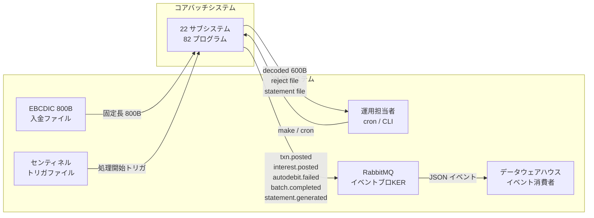
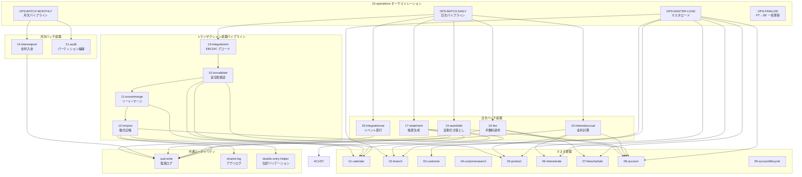
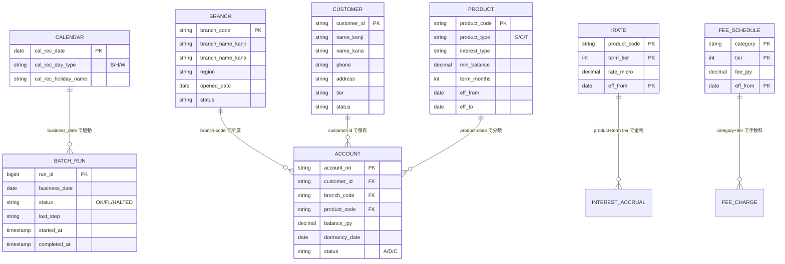
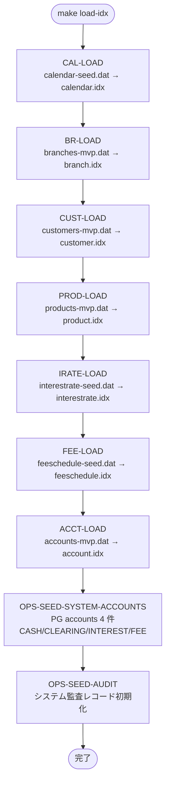
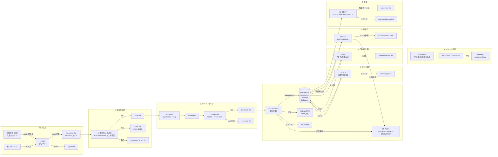
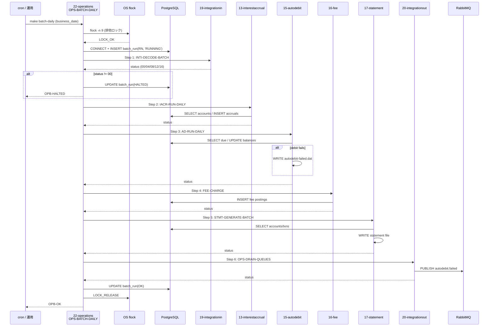
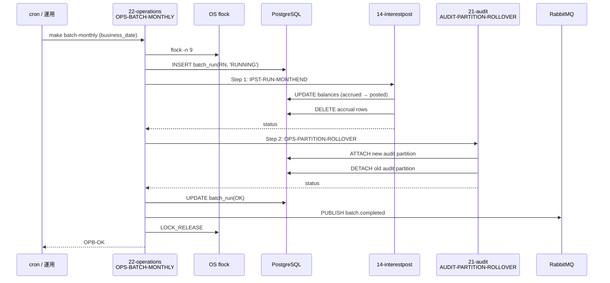

# システム全体設計書 — Legacy COBOL Banking System

> **更新日:** 2026-07-06
> **スコープ:** 22 サブシステム / 82 プログラムの全体像とデータフローを定義する
> **目的:** この設計書を読むことで「システム全体が何を処理し、データがどう流れるか」を一瞥で把握できる

---

## 1. システム概要

本システムは**銀行向けコアバッチ処理システム**である。

- **外部から入ってくる取引データ**（EBCDIC 800B 固定長ファイル）をデコード・妥当性検証・仕訳・記帳する
- **日次パイプライン**で金利計算・自動引き落とし・手数料請求・帳票生成・イベント発行を直列実行する
- **月次パイプライン**で金利入金と監査パーティションの繰り越しを行う
- **マスタデータ**（店舗・顧客・商品・金利・手数料・カレンダー・口座）を ISAM インデックス + PostgreSQL の二重管理で持つ
- **監査証拠**を全処理で `audit_log` テーブルに残し、外部には RabbitMQ 経由でイベントを発行する

---

## 2. システムコンテキスト図 (System Context)

---

## 3. サブシステム構成図

---

## 4. マスタデータモデル

---

## 5. マスタデータロードフロー

**初回セットアップ** (`make load-idx` / `OPS-MASTER-LOAD`) で ISAM インデックスを構築する。

---

## 6. トランザクションデータフロー (End-to-End)

---

## 7. 日次バッチパイプライン — シーケンス図

---

## 8. 月次バッチパイプライン — シーケンス図

---

## 9. 外部システム連携

### 9.1 ファイル連携

| 方向 | ファイル | 形式 | 内容 |
|------|---------|------|------|
| **Inbound** | EBCDIC 入金ファイル | 固定長 800B | 送金/入金データ (H/D/T レコード) |
| **Inbound** | センティネルファイル | トリガ | 処理開始の合図 |
| **Outbound** | txn-detail file | 可変長 600B | デコード済み取引データ |
| **Outbound** | reject file | 固定長 | バリデーション拒否レコード |
| **Outbound** | txn-error file | 可変長 | マージ重複 (E050) |
| **Outbound** | autodebit-failed.dat | 固定長 200B | 自動引き落とし失敗キュー |
| **Outbound** | statement file | 可変長 | 帳票 |
| **Outbound** | recon file | 可変長 | 照合用トレーラレコード |

### 9.2 メッセージ連携 (RabbitMQ)

| イベント | 発行タイミング | ペイロード |
|---------|-------------|----------|
| `txn.posted` | 12-TXNPOST 記帳成功時 | account_no, amount, type |
| `interest.posted` | 13-IACR / 14-IPST 入金時 | account_no, amount_jpy |
| `autodebit.failed` | 15-AD 引き落とし失敗時 | account_no, reason |
| `statement.generated` | 17-STMT 帳票生成時 | account_no, period_from/to |
| `batch.completed` | 22-OPS パイプライン完了時 | run_id, business_date, status |

### 9.3 データベース連携 (PostgreSQL)

| テーブル | 用途 | 主なアクセス元 |
|---------|------|-------------|
| `accounts` | 口座マスタ | 08-account, 12-txnpost, 13-iacr, 15-ad, 16-fee |
| `customers` | 顧客マスタ | 03-customer |
| `transactions` | 取引テーブル | 12-txnpost (INSERT) |
| `postings` | 仕訳テーブル | 12-txnpost (INSERT) |
| `balances` | 残高テーブル | 12-txnpost / 13-iacr / 14-ipst (UPDATE) |
| `audit_log` | 監査証拠 | 全サブシステム (INSERT) |
| `batch_run` | パイプライン実行管理 | 22-operations (INSERT/UPDATE) |

---

## 10. サブシステム一覧

| # | サブシステム | 種別 | プログラム数 | 責務 |
|---|------------|------|:----------:|------|
| 01 | calendar | マスタ | 4 | 営業日カレンダー |
| 02 | branch | マスタ | 4 | 店舗マスタ |
| 03 | customer | マスタ | 6 | 顧客マスタ + 検索 |
| 04 | customersearch | マスタ | 3 | 顧客検索 (AND/住所/ページング) |
| 05 | product | マスタ | 2 | 商品マスタ |
| 06 | interestrate | マスタ | 2 | 金利マスタ |
| 07 | feeschedule | マスタ | 2 | 手数料マスタ |
| 08 | account | マスタ | 5 | 口座マスタ + 存在確認 + 休眠更新 |
| 09 | accountlifecycle | マスタ | 4 | 口座開設 + 状態遷移 + 休眠/再活性 |
| 10 | txnvalidate | トランザクション | 3 | 取引妥当性検証 |
| 11 | txnsortmerge | トランザクション | 3 | 取引ソート + マージ |
| 12 | txnpost | トランザクション | 3 | 複式記帳 |
| 13 | interestaccrual | 日次バッチ | 2 | 金利計算 |
| 14 | interestpost | 月次バッチ | 2 | 金利入金 |
| 15 | autodebit | 日次バッチ | 2 | 自動引き落とし |
| 16 | fee | 日次バッチ | 2 | 手数料請求 |
| 17 | statement | 日次バッチ | 1 | 帳票生成 |
| 18 | inquiry | オンライン | 1 | 照会 CUI |
| 19 | integrationin | 取り込み | 1 | EBCDIC デコード |
| 20 | integrationout | 配信 | 2 | イベント発行 |
| 21 | audit | 監査 | 3 | 監査証拠 + パーティション |
| 22 | operations | オーケストレーション | 13 | パイプライン制御 + マスタロード |

---

## 11. 用語集

| 用語 | 意味 |
|------|------|
| ISAM | Indexed Sequential Access Method — GnuCOBOL のインデックスファイル |
| OCESQL | GnuCOBOL の埋め込み SQL プリプロセッサ (PostgreSQL 接続) |
| EBCDIC | メインフレーム文字コード (本システムの外部取引ファイル形式) |
| センチネル | 外部ファイル到着を知らせるトリガファイル |
| 複式記帳 | 借方/貸方の 2 エントリで 1 取引を表現する会計原則 |
| batch_run | バッチパイプラインの 1 回の実行を管理する DB レコード |
| flock | OS レベルファイルロック (バッチの排他制御) |
| SERIALIZABLE | PostgreSQL の最強分離レベル (悲観ロック) |
| DEH | Double-Entry Helper — 仕訳の借貸一致を検証する共有コピーブック |

---

## 12. 参考

- 各サブシステム設計書: `subsystems/NN-name/design/`
- 各プログラム設計書: `subsystems/NN-name/design/<program>.md`
- テンプレート: `subsystems/01-calendar/design/_template.md`
- 旧詳細設計書 (v1): `subsystems/01-calendar/design/v1-detailed/`
- 仕様: `docs/superpowers/specs/2026-07-06-subsystem-design-docs-design.md`
- プラン: `docs/superpowers/plans/2026-07-06-subsystem-design-docs-phase1.md`
