# システムユースケース設計書 — Legacy COBOL Banking System

> **更新日:** 2026-07-06
> **目的:** このシステムが「業務上で何をできるか」を、技術詳細に立ち戻らず業務視点で説明する
> **読者:** 業務部門 / プロジェクトマネージャ / モダナイズ検討チーム

---

## 1. はじめに

本システムは**銀行のバックオフィスを支えるバッチ処理基盤**である。
外部から届く「送金/入金データ」を受け取り、検証・記帳し、顧客の口座残高を更新する。
また、日次で金利計算・自動引き落とし・手数料請求・帳票生成を行い、月次で金利入金を行う。

本設計書では、システムが提供する **15 の業務ユースケース** を、業務フロー図とユースケース図で説明する。

---

## 2. アクター (誰が使うか)

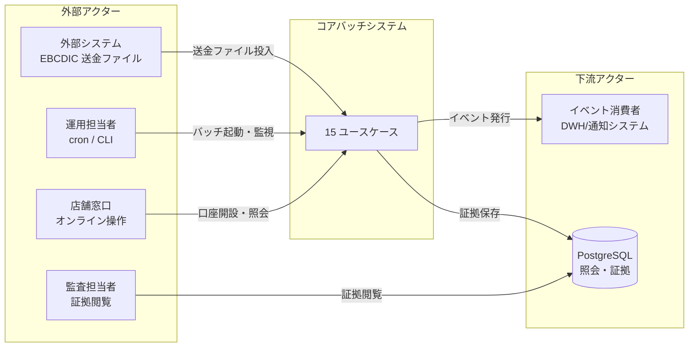

### アクター一覧

| アクター | 役割 | 主な操作 |
|---------|------|---------|
| **外部システム** | 他行/送金ネットワークから EBCDIC 800B ファイルを投入する | ファイル転送 |
| **運用担当者** | 日次/月次バッチを起動・監視する | `make batch-daily`, `make batch-monthly` |
| **店舗窓口** | 顧客対応で口座開設・状態変更・照会を行う | オンライン CUI |
| **監査担当者** | 証拠データを調査する | audit_log 検索 |
| **イベント消費者** | 下流システムがイベントを受信する | MQ 購読 |

---

## 3. ユースケース概要図

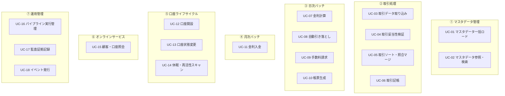

---

## 4. ユースケース詳細

---

### UC-01: マスタデータ一括ロード

**業務目的:** システム稼働に必要な 7 種類のマスタデータを、シードファイルから ISAM インデックスとして構築する。

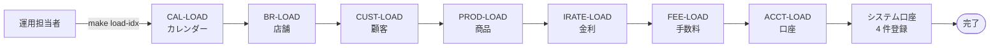

| 項目 | 内容 |
|------|------|
| **アクター** | 運用担当者 |
| **トリガ** | `make load-idx` コマンド実行 |
| **前提** | シードファイル (7 種) が所定パスに存在すること |
| **主フロー** | ① カレンダー → ② 店舗 → ③ 顧客 → ④ 商品 → ⑤ 金利 → ⑥ 手数料 → ⑦ 口座 の順に ISAM インデックスを生成。最後にシステム口座 (CASH/CLEARING/INTEREST/FEE) を DB に登録 |
| **代替フロー** | 主キー重複時は当該レコードをスキップし、WARN ログを出力 |
| **事後条件** | 7 つの `.idx` ファイルが生成され、オンライン処理が可能になる |
| **例外** | ファイル OPEN 失敗時は RETURN-CODE=12 で中断 |

---

### UC-02: マスタデータ参照・検索

**業務目的:** 取引処理やオンライン照会から、マスタデータを参照する。

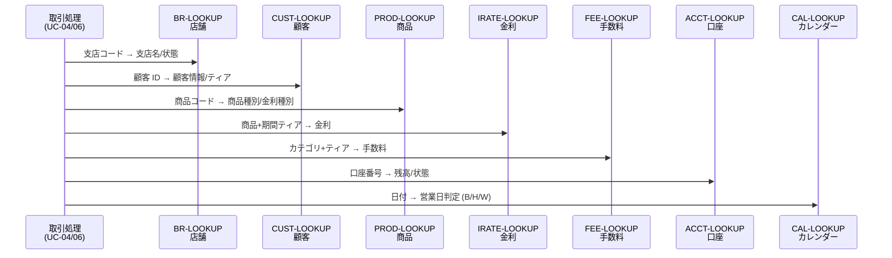

| 項目 | 内容 |
|------|------|
| **アクター** | 取引処理 (UC-04/06)、オンライン照会 (UC-15) |
| **トリガ** | 各処理から `CALL "X-LOOKUP"` |
| **主フロー** | 主キー (コード/ID) を指定して 1 件 RANDOM READ。該当データを返却 |
| **代替フロー** | 該当なし (04=NOT-FOUND)、ファイル未オープン (16=FATAL) |
| **事後条件** | マスタ値が呼出元に返却される |

---

### UC-03: 取引データ取り込み

**業務目的:** 外部から届いた EBCDIC 800B 固定長の送金ファイルをデコードし、取引データ (H/D/T) に変換する。

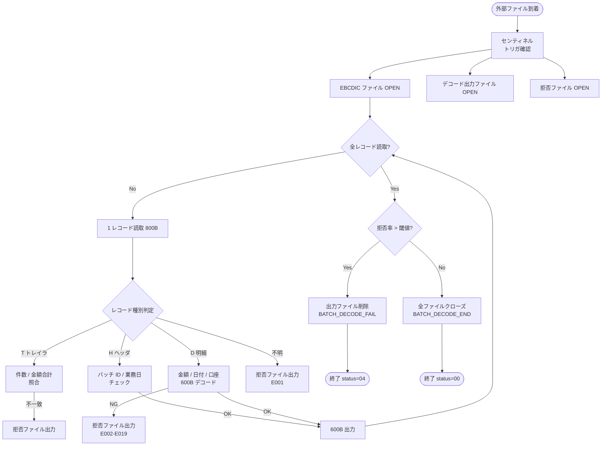

| 項目 | 内容 |
|------|------|
| **アクター** | 外部システム (他行/送金ネットワーク) |
| **トリガ** | センティネルファイルの到着 |
| **主フロー** | EBCDIC 800B → H/D/T 判定 → バリデーション → 600B デコード出力 |
| **代替フロー** | レコード種別不明 → 拒否ファイル (E001)。拒否率が閾値超 → 出力ファイル全削除 |
| **事後条件** | `txn-detail file` (600B) + `reject file` が出力される |
| **例外** | センチネル未存在 → 01=NO-INPUT-READY。ファイル OPEN 失敗 → 12=IO-FAIL |

---

### UC-04: 取引妥当性検証

**業務目的:** デコード済み取引データ (600B) を、マスタと照らし合わせて正しい取引のみを選別する。

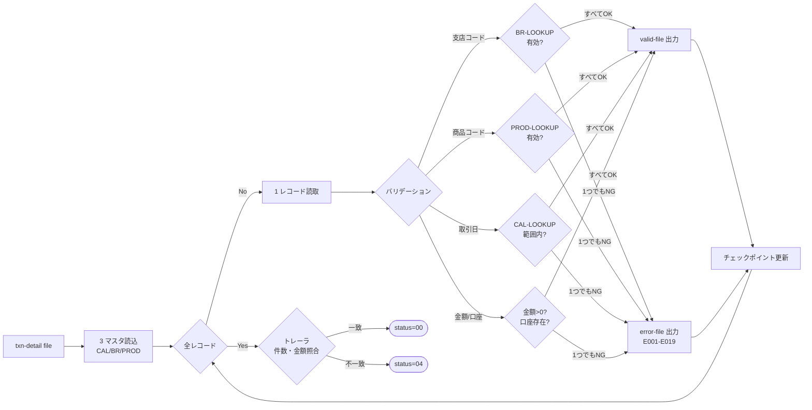

| 項目 | 内容 |
|------|------|
| **アクター** | 日次パイプライン (UC-03 の次段) |
| **トリガ** | `txn-detail file` の到着 |
| **主フロー** | 1 レコードずつマスタ照合 → 有効は `valid-file`、無効は `error-file` (エラーコード E001-E019) |
| **事後条件** | `valid-file` + `error-file` + `checkpoint ファイル` |
| **例外** | トレーラ不一致 → 04=PARTIAL |

---

### UC-05: 取引ソート・照合マージ

**業務目的:** 検証済み取引を「支店番号昇順 + 取引番号昇順」にソートし、前日分の照合ファイルとマージする。

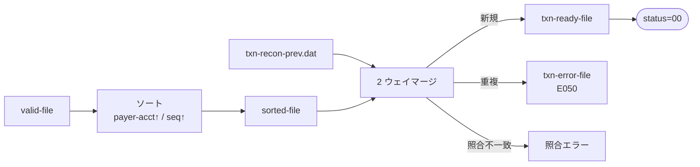

| 項目 | 内容 |
|------|------|
| **アクター** | 日次パイプライン |
| **トリガ** | `valid-file` の到着 |
| **主フロー** | ソート → 前日 recon とマージ → `txn-ready-file` 出力 |
| **代替フロー** | 重複レコード → `txn-error-file` (E050) |
| **事後条件** | `txn-ready-file` (記帳待ち取引) |

---

### UC-06: 取引記帳

**業務目的:** マージ済み取引を PostgreSQL の `transactions` / `postings` / `balances` テーブルに複式記帳する。

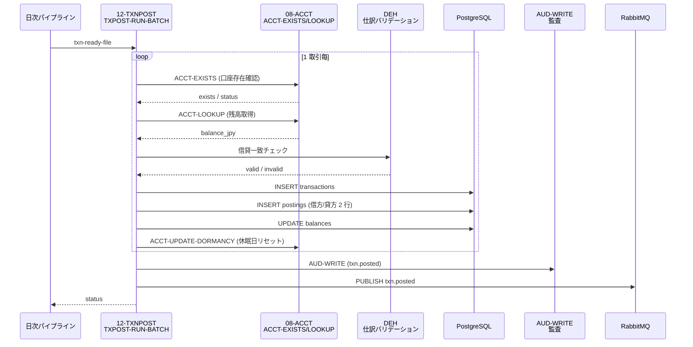

| 項目 | 内容 |
|------|------|
| **アクター** | 日次パイプライン |
| **トリガ** | `txn-ready-file` の到着 |
| **主フロー** | 1 取引ずつ ① 口座存在確認 → ② 残高取得 → ③ DEH 借貸チェック → ④ PG 書込 → ⑤ 休眠日更新 |
| **代替フロー** | 口座不存在 → エラーファイル。残高不足 (NSF) → INDOUBT 取引。リトライ FSM (CONFLICT/NSF/INDOUBT) |
| **事後条件** | `transactions` / `postings` / `balances` 更新。`txn.posted` イベント発行 |
| **例外** | ファイル OPEN 失敗 → 12=IO-FAIL。上限超過 → 16=FATAL |

---

### UC-07: 金利計算

**業務目的:** 日次で全口座の金利を計算し、`interest_accruals` テーブルに AC (Accrued) 行を出力する。

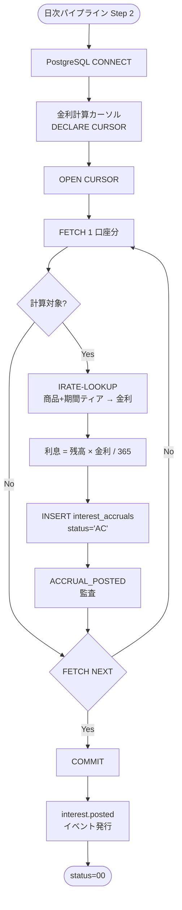

| 項目 | 内容 |
|------|------|
| **アクター** | 日次パイプライン (OPS-BATCH-DAILY Step 2) |
| **トリガ** | 取引記帳 (UC-06) 完了後 |
| **主フロー** | 全口座をカーソルスキャン → 金利マスタ参照 → 日次利息計算 → AC 行 INSERT |
| **事後条件** | `interest_accruals` テーブルに AC 行が追加される |
| **例外** | DB 接続失敗 → 12=IO-FAIL |

---

### UC-08: 自動引き落とし

**業務目的:** 期日が来た口座から自動的に代金を引き落とし、失敗した場合はキューファイルに退避する。

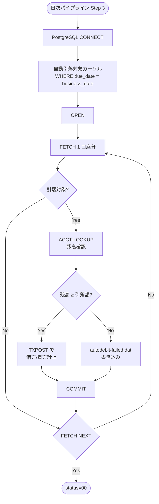

| 項目 | 内容 |
|------|------|
| **アクター** | 日次パイプライン (Step 3) |
| **トリガ** | 金利計算 (UC-07) 完了後 |
| **主フロー** | 期日一致口座をスキャン → 残高確認 → 成功は記帳、失敗はキューファイルへ |
| **代替フロー** | 残高不足 → `autodebit-failed.dat` (200B 固定長)。リトライ FSM で CONFLICT/NSF/INDOUBT をハンドリング |
| **事後条件** | 成功分は残高更新。失敗分は `autodebit-failed.dat` に退避 |
| **例外** | 連続 3 回失敗 → 口座状態を SP (停止) に遷移 |

---

### UC-09: 手数料請求

**業務目的:** 手数料スケジュールに基づき、対象口座に手数料を賦課する。

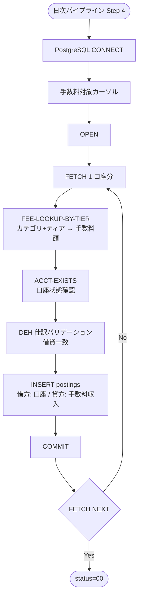

| 項目 | 内容 |
|------|------|
| **アクター** | 日次パイプライン (Step 4) |
| **トリガ** | 自動引き落とし (UC-08) 完了後 |
| **主フロー** | 手数料マスタ参照 → 口座状態確認 → DEH バリデーション → 仕訳計上 |
| **事後条件** | `postings` テーブルに手数料仕訳が追加される |
| **例外** | 口座状態が C (解約) の場合はスキップ |

---

### UC-10: 帳票生成

**業務目的:** 月次で顧客別帳票 (明細書) を生成し、ファイル出力する。

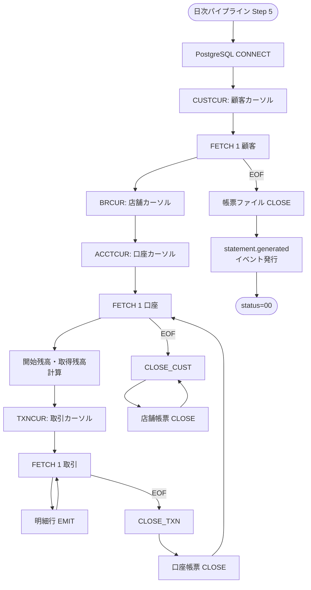

| 項目 | 内容 |
|------|------|
| **アクター** | 日次パイプライン (Step 5) |
| **トリガ** | 手数料請求 (UC-09) 完了後 |
| **主フロー** | 4 重カーソル (顧客 → 店舗 → 口座 → 取引) で帳票を生成 |
| **事後条件** | 帳票ファイル + `statement.generated` イベント |
| **例外** | DB 接続失敗 → 12=IO-FAIL |

---

### UC-11: 金利入金

**業務目的:** 月次で、当月に計算された金利 (AC 行) を顧客口座の残高に反映する。

```mermaid
flowchart TD
    START([月次パイプライン Step 1]) --> CONNECT[PostgreSQL CONNECT]
    DECLARE[AC 行カーソル<br/>WHERE status='AC'] --> OPEN[OPEN]
    OPEN --> FETCH[FETCH 1 金利行]
    FETCH --> UPDATE[UPDATE balances<br/>balance_jpy += accrued_jpy]
    UPDATE --> CLOSE_AC[UPDATE interest_accruals<br/>status='PT' (Posted)]
    CLOSE_AC --> AUDIT[AUDIT-WRITE<br/>interest.posted]
    AUDIT --> NEXT{FETCH NEXT}
    NEXT -->|No| FETCH
    NEXT -->|Yes| COMMIT[COMMIT]
    COMMIT --> DONE([status=00])
```

| 項目 | 内容 |
|------|------|
| **アクター** | 月次パイプライン (OPS-BATCH-MONTHLY Step 1) |
| **トリガ** | 月初の月次バッチ起動 |
| **主フロー** | AC 行を 1 件ずつ FETCH → 残高に加算 → ステータスを PT に更新 |
| **事後条件** | 顧客口座の `balances` が更新される |
| **例外** | 該当 AC 行なし → 04=NOT-FOUND |

---

### UC-12: 口座開設

**業務目的:** 新規顧客に口座を開設し、ISAM インデックスと PostgreSQL の両方に登録する。

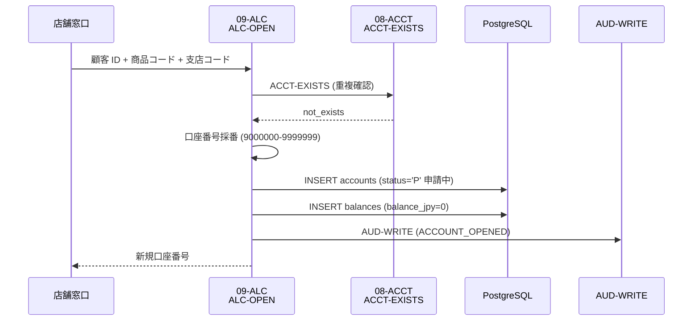

| 項目 | 内容 |
|------|------|
| **アクター** | 店舗窓口 |
| **トリガ** | 新規口座開設申請 |
| **主フロー** | 重複確認 → 口座番号採番 → PG 登録 (status='P') → 監査記録 |
| **代替フロー** | 既存口座あり → 08=INVALID-INPUT |
| **事後条件** | 新規口座が `P` (申請中) 状態で登録される |

---

### UC-13: 口座状態変更

**業務目的:** 口座の状態を遷移させる (開設 → 活性 → 停止 → 解約)。

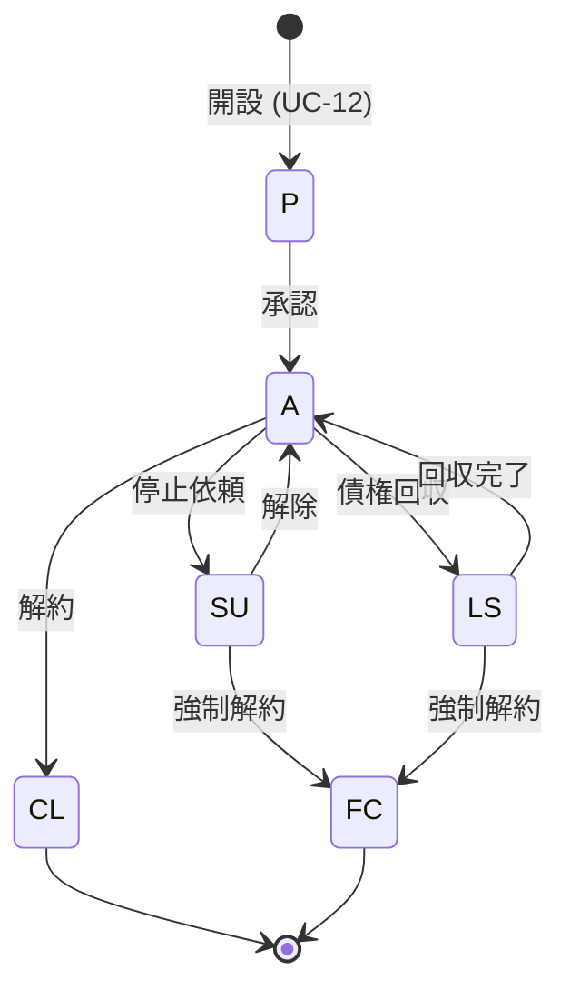

| 項目 | 内容 |
|------|------|
| **アクター** | 店舗窓口 |
| **トリガ** | 状態変更申請 (承認/停止/解除/解約) |
| **主フロー** | 現在の状態から次の状態への FSM 遷移。遷移不可の場合はエラー |
| **代替フロー** | 解約 (CL/FC) → `closed_date` を補完。停止 (SU/FC) → `reason` が必須 |
| **事後条件** | `accounts.status` が更新される |

---

### UC-14: 休眠・再活性スキャン

**業務目的:** 一定期間取引のない口座を休眠状態に遷移し、逆に再活性のあった口座を復元する。

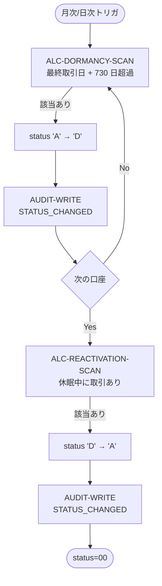

| 項目 | 内容 |
|------|------|
| **アクター** | 運用担当者 (cron) |
| **トリガ** | 日次/月次スケジュール |
| **主フロー** | 最終取引日から 730 日超過 → 休眠 (D) に遷移。逆に休眠中に取引があれば復元 (A) |
| **事後条件** | 口座状態が更新される |

---

### UC-15: 顧客・口座照会

**業務目的:** 店舗窓口が顧客情報・口座残高・取引履歴を照会する。

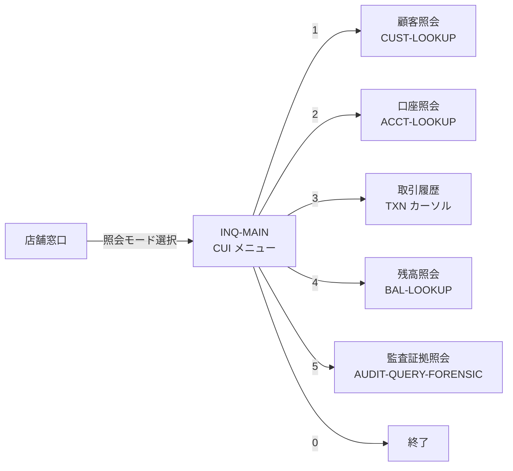

| 項目 | 内容 |
|------|------|
| **アクター** | 店舗窓口 |
| **トリガ** | 顧客対応時の照会操作 |
| **主フロー** | CUI メニューから照会モードを選択 → 該当データを表示 |
| **事後条件** | 照会結果が画面に表示される |

---

### UC-16: パイプライン実行管理

**業務目的:** 日次/月次パイプラインの直列実行を制御し、実行履歴を記録する。

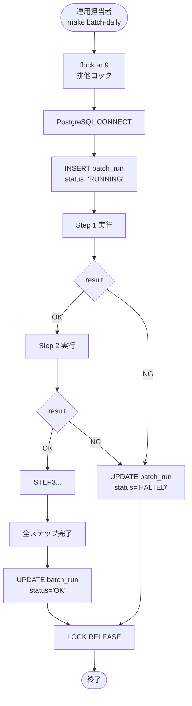

| 項目 | 内容 |
|------|------|
| **アクター** | 運用担当者 |
| **トリガ** | `make batch-daily` / `make batch-monthly` |
| **主フロー** | ロック獲得 → batch_run 作成 → ステップ直列実行 → 結果記録 → ロック解放 |
| **代替フロー** | ステップ失敗 → 即時中断 (HALTED)。次ステップは実行しない |
| **事後条件** | `batch_run` テーブルに実行履歴が残る |

---

### UC-17: 監査証拠記録

**業務目的:** 全操作の証拠を `audit_log` テーブルに記録し、外部監査に備える。

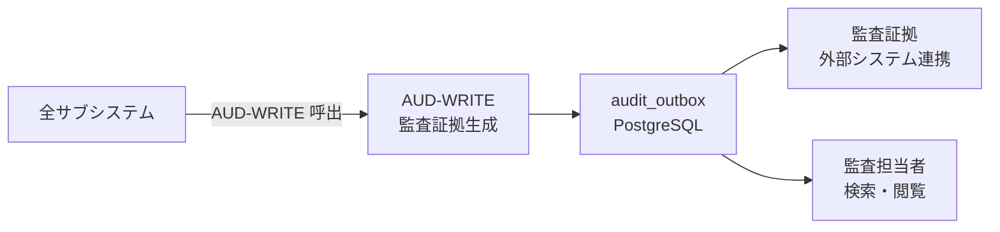

| 項目 | 内容 |
|------|------|
| **アクター** | 全サブシステム (横断関心事) |
| **トリガ** | 取引記帳 / 状態変更 / パイプライン完了など全操作 |
| **主フロー** | 各処理が `CALL "AUD-WRITE"` で証拠を記録。JSON ペイロードを含む |
| **事後条件** | `audit_log` テーブルに証拠が追加される |

---

### UC-18: イベント発行

**業務目的:** システムの状態変化を外部システムに通知する (RabbitMQ)。

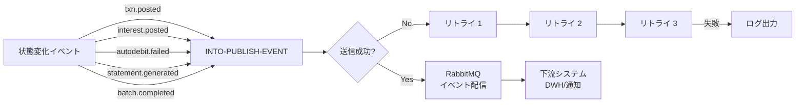

| 項目 | 内容 |
|------|------|
| **アクター** | 日次/月次パイプライン |
| **トリガ** | 記帳 / 金利入金 / 引落失敗 / 帳票生成 / パイプライン完了 |
| **主フロー** | イベント生成 → JSON エンベロープ → RabbitMQ 発行 (最大 3 回リトライ) |
| **事後条件** | 下流システムがイベントを受信する |

---

## 5. ユースケース × サブシステム対応表

| ユースケース | 対応サブシステム |
|------------|----------------|
| UC-01 マスタロード | 01-calendar, 02-branch, 03-customer, 05-product, 06-interestrate, 07-feeschedule, 08-account, 22-operations |
| UC-02 マスタ参照 | 01-calendar, 02-branch, 03-customer, 05-product, 06-interestrate, 07-feeschedule, 08-account |
| UC-03 取引入力 | 19-integrationin |
| UC-04 取引バリデーション | 10-txnvalidate |
| UC-05 取引ソート・マージ | 11-txnsortmerge |
| UC-06 取引記帳 | 12-txnpost |
| UC-07 金利計算 | 13-interestaccrual |
| UC-08 自動引き落とし | 15-autodebit |
| UC-09 手数料請求 | 16-fee |
| UC-10 帳票生成 | 17-statement |
| UC-11 金利入金 | 14-interestpost |
| UC-12 口座開設 | 09-accountlifecycle |
| UC-13 口座状態変更 | 09-accountlifecycle |
| UC-14 休眠・再活性 | 09-accountlifecycle |
| UC-15 顧客・口座照会 | 18-inquiry |
| UC-16 パイプライン管理 | 22-operations |
| UC-17 監査証拠記録 | 21-audit |
| UC-18 イベント発行 | 20-integrationout |

---

## 6. 業務スケジュール一覧

| 頻度 | 時刻 | ユースケース | 所要時間目安 |
|------|------|------------|------------|
| **日次** | 22:00 | UC-03 → UC-04 → UC-05 → UC-06 → UC-07 → UC-08 → UC-09 → UC-10 → UC-18 | 2-4 時間 |
| **月次** | 月末 23:00 | UC-11 → UC-14 → UC-16 (パーティション繰越) | 1-2 時間 |
| **随時** | 窓口営業時間 | UC-12, UC-13, UC-15 | リアルタイム |
| **初回** | セットアップ時 | UC-01 (マスタロード) | 30 分 |

---

## 7. 参考

- システム全体フロー: [00-system-overview.md](./00-system-overview.md)
- 各サブシステム設計書: `subsystems/NN-name/design/`
- 各プログラム設計書: `subsystems/NN-name/design/<program>.md`
- テンプレート: `subsystems/01-calendar/design/_template.md`
