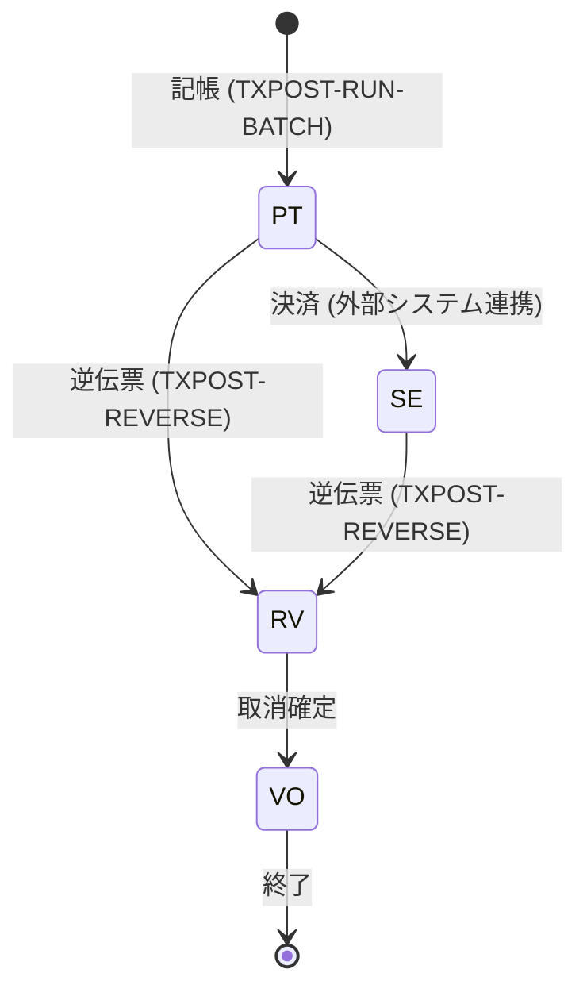
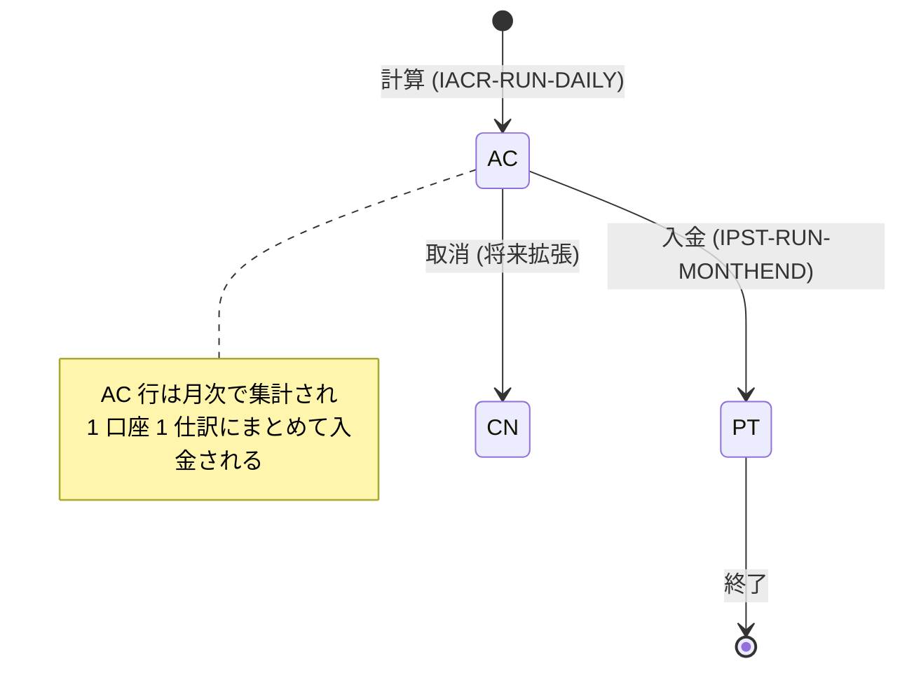
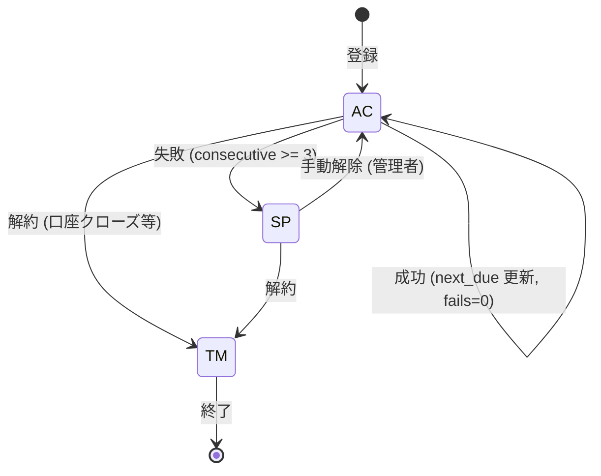
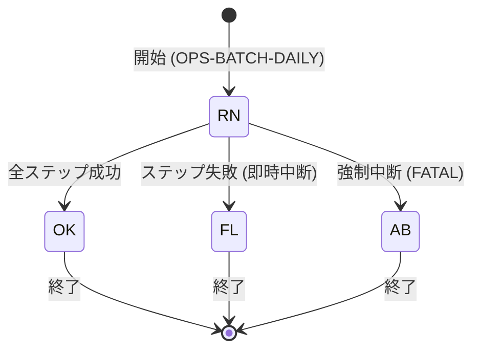
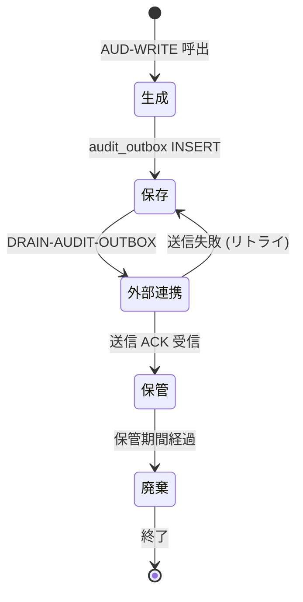
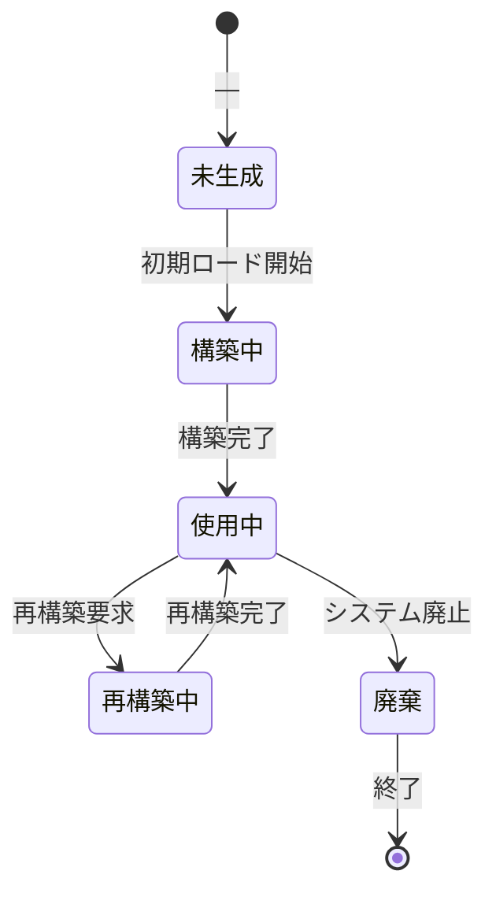

# 状態遷移図 (FSM) 設計書

> **プロジェクト:** レガシー COBOL 銀行システム モダナイゼーション
> **更新日:** 2026-07-06
> **種別:** 基本設計 — 状態遷移 (Finite State Machine) 横断定義
> **参照サブシステム:** 09-accountlifecycle / 12-txnpost / 13-interestaccrual / 14-interestpost / 15-autodebit / 22-operations

---

## 概要

本文書は、レガシー COBOL 銀行サブシステム群に散在するステートマシン (FSM) を集約し、Mermaid `stateDiagram-v2` で可視化する。各 FSM は以下の要素で構成する。

- **状態 (State):** システムが取り得る離散的な状態
- **遷移 (Transition):** イベントによって引き起こされる状態変化
- **ガード条件 (Guard):** 遷移が成立するための前提条件
- **監査証拠 (Audit):** 遷移発生時に `AUD-WRITE` 等で記録するイベント

各遷移は、対応するユースケース・プログラム ID を相互参照する。

---

## 1. 口座状態 FSM (Account Lifecycle)

### 1.1 概要

口座 (`account.idx`) のライフサイクルを管理する FSM。状態は 1 文字コード (`P/A/S/L/C/F/D`) で表現される。

**参照設計書:**
- `subsystems/09-accountlifecycle/design/alc-open.md` — 開設 (P 生成)
- `subsystems/09-accountlifecycle/design/alc-change-state.md` — 状態遷移エンジン
- `subsystems/09-accountlifecycle/design/alc-dormancy-scan.md` — 休眠バッチ
- `subsystems/09-accountlifecycle/design/alc-reactivation-scan.md` — 再活性バッチ (MVP スタブ)

### 1.2 状態定義

| 状態コード | 名称 | 意味 |
|:----------:|------|------|
| `P` | Pending | 開設直後・未承認 |
| `A` | Active | 稼働中 |
| `S` | Suspended | 停止依頼・凍結中 |
| `L` | Lost/Collection | 債権回収中 (将来拡張) |
| `C` | Closed | 解約済 |
| `F` | Force-closed | 強制解約 (内部表現は C) |
| `D` | Dormant | 休眠 (24 ヶ月無取引) |

### 1.3 状態遷移図

```mermaid
stateDiagram-v2
    [*] --> P : 開設 (ALC-OPEN)

    P --> A : 承認 (AC)
    P --> C : 開設拒否 (CN)

    A --> S : 停止依頼 (SU)
    A --> C : 解約 (CL)
    A --> C : 強制解約 (FC)
    A --> D : 休眠スキャン (730 日超過)

    S --> A : 解除 (LS)
    S --> C : 解約 (CL)
    S --> C : 強制解約 (FC)

    D --> A : 再活性 (LS)
    D --> C : 解約 (CL)
    D --> C : 強制解約 (FC)

    C --> [*] : 終了

    note right of L
        将来拡張: 債権回収
        現在は未使用
    end note
```

### 1.4 遷移条件表

| 現在状態 | イベント | ACTION | 次状態 | ガード条件 | 監査イベント | 参照プログラム |
|:--------:|----------|:------:|--------|------------|--------------|----------------|
| `P` | 承認 | `AC` | `A` | — | `STATUS_CHANGED` | `ALC-CHANGE-STATE` |
| `P` | 開設拒否 | `CN` | `C` | — | `STATUS_CHANGED` | `ALC-CHANGE-STATE` |
| `A` | 停止依頼 | `SU` | `S` | `reason` 必須 | `STATUS_CHANGED` | `ALC-CHANGE-STATE` |
| `A` | 解約 | `CL` | `C` | — | `STATUS_CHANGED` | `ALC-CHANGE-STATE` |
| `A` | 強制解約 | `FC` | `C` | `reason` 必須 | `STATUS_CHANGED` | `ALC-CHANGE-STATE` |
| `A` | 休眠基準日超過 | — | `D` | `status=A` AND `dormancy_date < today-730` | `STATUS_CHANGED` | `ALC-DORMANCY-SCAN` |
| `S` | 解除 | `LS` | `A` | — | `STATUS_CHANGED` | `ALC-CHANGE-STATE` |
| `S` | 解約 | `CL` | `C` | — | `STATUS_CHANGED` | `ALC-CHANGE-STATE` |
| `S` | 強制解約 | `FC` | `C` | `reason` 必須 | `STATUS_CHANGED` | `ALC-CHANGE-STATE` |
| `D` | 再活性 | `LS` | `A` | — | `STATUS_CHANGED` | `ALC-REACTIVATION-SCAN` |
| `D` | 解約 | `CL` | `C` | — | `STATUS_CHANGED` | `ALC-CHANGE-STATE` |
| `D` | 強制解約 | `FC` | `C` | `reason` 必須 | `STATUS_CHANGED` | `ALC-CHANGE-STATE` |

### 1.5 制約

- `C` (Closed) への遷移時は `CLOSED-DATE` に業務日付を設定する
- `FC` は `C` 以外の全状態から遷移可能 (内部表現は `C`)
- `SU` / `FC` は `reason` が空白の場合、ガードで拒否 (status=08)
- 禁止遷移 (例: `P` → `SU`) は status=08 で拒否
- `ALC-REACTIVATION-SCAN` は MVP スタブ (常に status=04 を返却)

---

## 2. 取引ステータス FSM (Transaction Lifecycle)

### 2.1 概要

取引 (`transactions` テーブル) のライフサイクルを管理する FSM。記帳・決済・逆伝票・取消の各段階を表現する。

**参照設計書:**
- `subsystems/12-txnpost/design/txpost-run-batch-bd.md` — 取引記帳バッチ
- `subsystems/12-txnpost/design/txpost-reverse-bd.md` — 逆伝票バッチ

### 2.2 状態定義

| 状態コード | 名称 | 意味 |
|:----------:|------|------|
| `PT` | Posted | 記帳済 (dual-entry 記帳完了) |
| `SE` | Settled | 決済済 |
| `RV` | Reversed | 逆伝票済 (取消済) |
| `VO` | Voided | 取消 (論理削除相当) |

### 2.3 状態遷移図



### 2.4 遷移条件表

| 現在状態 | イベント | 次状態 | ガード条件 | 監査イベント | 参照プログラム |
|:--------:|----------|:------:|------------|--------------|----------------|
| `PT` | 記帳 | `PT` | 冪等チェック (I1) 通過、不変量 (I3/I5) 通過 | `TXN_POSTED` | `TXPOST-RUN-BATCH` |
| `PT` | 逆伝票 | `RV` | 元取引が `PT` または `SE`、二重取消なし | `TXN_REVERSED` | `TXPOST-REVERSE` |
| `SE` | 逆伝票 | `RV` | 元取引が `PT` または `SE`、二重取消なし | `TXN_REVERSED` | `TXPOST-REVERSE` |
| `RV` | 取消確定 | `VO` | — | `TXN_VOIDED` | (将来拡張) |

### 2.5 逆伝票ペア制約

逆伝票 (Reversal) は必ず元取引 (Original Transaction) とのペアで生成される。

| 制約 | 説明 |
|------|------|
| 参照整合性 | `RV` 取引の `orig_txn_id` は必ず `PT` または `SE` の取引を参照する |
| 二重取消防止 | 同一 `orig_txn_id` に対する `RV` は 1 件のみ (CHECK-ALREADY-REVERSED) |
| 借贷逆転 | `RV` の postings は元取引の DR/CR を逆転させる |
| 残高整合性 | 逆伝票後の残高 = 逆伝票前の残高 − 元取引額 (C2-REVERSAL-I3 チェック) |

---

## 3. 利息ステータス FSM (Interest Lifecycle)

### 3.1 概要

利息 (`interest_accruals` テーブル) のライフサイクルを管理する FSM。日次計算 → 月入金 → 取消の各段階を表現する。

**参照設計書:**
- `subsystems/13-interestaccrual/design/iacr-run-daily.md` — 日次利息計算バッチ
- `subsystems/14-interestpost/design/ipst-run-monthend-bd.md` — 月次利息入金バッチ

### 3.2 状態定義

| 状態コード | 名称 | 意味 |
|:----------:|------|------|
| `AC` | Accrued | 計算済 (未入金) |
| `PT` | Posting | 入金中 (仕訳生成中) |
| `CN` | Cancelled | 取消 |

### 3.3 状態遷移図



### 3.4 遷移条件表

| 現在状態 | イベント | 次状態 | ガード条件 | 監査イベント | 参照プログラム |
|:--------:|----------|:------:|------------|--------------|----------------|
| — | 日次計算 | `AC` | 口座状態が `A`/`S`、商品が金利対象、残高 > 0、金利取得成功 | `INTEREST_ACCRUED` | `IACR-RUN-DAILY` |
| `AC` | 月入金 | `PT` | product="001"、口座存在、重複なし、DEH 検証通過 | `INTEREST_POSTED` | `IPST-RUN-MONTHEND` |
| `AC` | 取消 | `CN` | — | `INTEREST_CANCELLED` | (将来拡張) |

### 3.5 集計ロジック

`IACR-RUN-DAILY` は日次で `AC` 行を生成し、`IPST-RUN-MONTHEND` が月次で `AC` 行をアカウント単位に集計し、1 件の INTEREST トランザクション (DR/CR ペア) を生成して `PT` に移行させる。

---

## 4. 自動引き落とし FSM (Autodebit Schedule)

### 4.1 概要

自動引き落とし指令 (`autodebit_schedules` テーブル) のライフサイクルを管理する FSM。登録 → 成功/失敗 → 停止/解約の各段階を表現する。

**参照設計書:**
- `subsystems/15-autodebit/design/ad-run-daily-bd.md` — 自動引き落とし日次バッチ

### 4.2 状態定義

| 状態コード | 名称 | 意味 |
|:----------:|------|------|
| `AC` | Active | 稼働中 (次回期日待ち) |
| `SP` | Suspended | 停止 (連続 3 回失敗) |
| `TM` | Terminated | 解約 (口座クローズ等) |

### 4.3 状態遷移図



### 4.4 遷移条件表

| 現在状態 | イベント | 次状態 | ガード条件 | 監査イベント | 参照プログラム |
|:--------:|----------|:------:|------------|--------------|----------------|
| — | 登録 | `AC` | — | `AD_REGISTERED` | (オンライン画面) |
| `AC` | POST 成功 | `AC` | 口座状態 `A`、残高十分、DEH 検証通過 | `AD_POSTED` | `AD-RUN-DAILY` |
| `AC` | POST 失敗 (残高不足) | `AC` | `consecutive_fails < 3` | `AD_FAILED_NF` | `AD-RUN-DAILY` |
| `AC` | POST 失敗 (連続 3 回) | `SP` | `consecutive_fails >= 3` | `AD_AUTO_SUSPENDED` | `AD-RUN-DAILY` |
| `AC` | 口座クローズ | `TM` | `ACCT-EXISTS` が `C` を返す | `AD_AUTO_TERMINATED` | `AD-RUN-DAILY` |
| `SP` | 手動解除 | `AC` | 管理者操作 | `AD_REACTIVATED` | (管理画面) |
| `SP` | 解約 | `TM` | — | `AD_TERMINATED` | (オンライン画面) |

### 4.5 失敗回数カウントロジック

| 失敗事由 | カウント対象 | 備考 |
|----------|:------------:|------|
| 残高不足 (NSF) | `fails++` | `consecutive_fails` をインクリメント |
| 口座異常 (C/D/S) | `fails++` | ただし `CL` 理由の場合は即座に `TM` |
| DEH 検証失敗 | カウント対象外 | `skipped-helper++` のみ |
| 冪等スキップ | カウント対象外 | `skipped-already++` のみ |

---

## 5. バッチ実行 FSM (Batch Run)

### 5.1 概要

日次バッチパイプライン (`batch_run` テーブル) のライフサイクルを管理する FSM。ファイル LOCK 獲得 → ステップ順次実行 → 結果反映の各段階を表現する。

**参照設計書:**
- `subsystems/22-operations/design/ops-batch-daily.md` — 日次バッチオーケストレータ

### 5.2 状態定義

| 状態コード | 名称 | 意味 |
|:----------:|------|------|
| `RN` | Running | 実行中 |
| `OK` | Success | 全ステップ成功 |
| `FL` | Failed | ステップ失敗 |
| `AB` | Aborted | 強制中断 |

### 5.3 状態遷移図



### 5.4 遷移条件表

| 現在状態 | イベント | 次状態 | ガード条件 | 監査イベント | 参照プログラム |
|:--------:|----------|:------:|------------|--------------|----------------|
| — | 開始 | `RN` | flock 獲得成功、DB 接続成功 | `OPS_BATCH_START` | `OPS-BATCH-DAILY` |
| `RN` | 全ステップ成功 | `OK` | 6 ステップ (19→13→15→16→17→20) すべて rc=0 | `OPS_BATCH_OK` | `OPS-BATCH-DAILY` |
| `RN` | ステップ失敗 | `FL` | いずれかのステップが rc≠0 | `OPS_STEP_FAIL` → `OPS_BATCH_FAIL` | `OPS-BATCH-DAILY` |
| `RN` | 強制中断 | `AB` | DB 接続不能、I4 単調性違反等 FATAL | `OPS_BATCH_FAIL` | `OPS-BATCH-DAILY` |

### 5.5 パイプラインステップ定義

| ステップ ID | 名称 | 参照サブシステム | 失敗時動作 |
|:-----------:|------|------------------|------------|
| `19-INTI` | 初期化 | 19-init | 即座に `FL` |
| `13-IACR` | 日次利息計算 | 13-interestaccrual | 即座に `FL` |
| `15-AD` | 自動引き落とし | 15-autodebit | 即座に `FL` |
| `16-FEE` | 手数料 | 16-fee | 即座に `FL` |
| `17-STMT` | 明細書 | 17-statement | 即座に `FL` |
| `20-DRAIN` | 監査フラッシュ | 20-drain | 即座に `FL` |

---

## 6. 監査証拠 FSM (Audit Trail)

### 6.1 概要

監査証拠 (`audit_outbox` → 外部連携) のライフサイクルを管理する FSM。RASIS (Reliability, Availability, Serviceability, Integrity, Security) 原則に基づく証拠保全を表現する。

### 6.2 状態定義

| 状態 | 名称 | 意味 |
|:----:|------|------|
| 生成 | Generated | `AUD-WRITE` により監査イベント生成 |
| 保存 | Stored | `audit_outbox` テーブルに保存 |
| 外部連携 | Delivered | 外部監査システムに送信 |
| 保管 | Retained | 保管期間中 (WORM ストレージ) |
| 廃棄 | Purged | 保管期間経過により廃棄 |

### 6.3 状態遷移図



### 6.4 遷移条件表

| 現在状態 | イベント | 次状態 | ガード条件 | 参照プログラム |
|:--------:|----------|:------:|------------|----------------|
| — | `AUD-WRITE` 呼出 | 生成 | — | 全プログラム |
| 生成 | INSERT 成功 | 保存 | SQLCODE=0 | `AUD-WRITE` |
| 保存 | DRAIN 呼出 | 外部連携 | — | `DRAIN-AUDIT-OUTBOX` |
| 外部連携 | 送信失敗 | 保存 | リトライ上限未満 | `DRAIN-AUDIT-OUTBOX` |
| 外部連携 | ACK 受信 | 保管 | 外部システム応答 OK | `DRAIN-AUDIT-OUTBOX` |
| 保管 | 保管期間経過 | 廃棄 | 法定保管期間 (例: 7 年) | (管理バッチ) |

### 6.5 RASIS 対応

| 原則 | 対応 |
|------|------|
| **R**eliability | `audit_outbox` はトランザクション内に記録 (確実保存) |
| **A**vailability | 外部連携失敗時はリトライキューに退避 |
| **S**erviceability | `DRAIN-AUDIT-OUTBOX` で再送制御 |
| **I**ntegrity | 監査証拠は不変 (IMMUTABLE フラグ) |
| **S**ecurity | 保管中は WORM ストレージで改竄防止 |

---

## 7. ファイルライフサイクル (ISAM files)

### 7.1 概要

ISAM インデックスファイル群のライフサイクルを管理する FSM。未生成 → 構築中 → 使用中 → 再構築 → 廃棄の各段階を表現する。

### 7.2 状態定義

| 状態 | 名称 | 意味 |
|:----:|------|------|
| 未生成 | Not Created | ファイルが存在しない |
| 構築中 | Building | 初期データロード中 |
| 使用中 | Active | 通常運用中 |
| 再構築中 | Rebuilding | 再編・最適化中 |
| 廃棄 | Obsolete | 使用終了・削除済 |

### 7.3 状態遷移図



### 7.4 ファイル別状態

| ファイル名 | 用途 | 初期状態 | 備考 |
|------------|------|:--------:|------|
| `calendar.idx` | 営業日カレンダー | 未生成 | `19-INTI` で構築 |
| `branch.idx` | 支店マスタ | 未生成 | `19-INTI` で構築 |
| `customer.idx` | 顧客マスタ | 未生成 | `19-INTI` で構築 |
| `product.idx` | 商品マスタ | 未生成 | `19-INTI` で構築 |
| `interestrate.idx` | 金利マスタ | 未生成 | `19-INTI` で構築 |
| `feeschedule.idx` | 手数料体系 | 未生成 | `19-INTI` で構築 |
| `account.idx` | 口座マスタ | 未生成 | `ALC-OPEN` で初期レコード生成 |

### 7.5 遷移条件表

| 現在状態 | イベント | 次状態 | ガード条件 | 参照プログラム |
|:--------:|----------|:------:|------------|----------------|
| 未生成 | 初期ロード開始 | 構築中 | — | `19-INTI` |
| 構築中 | 構築完了 | 使用中 | 全マスタ正常ロード | `19-INTI` |
| 使用中 | 再構築要求 | 再構築中 | 排他ロック獲得 | (管理バッチ) |
| 再構築中 | 再構築完了 | 使用中 | — | (管理バッチ) |
| 使用中 | システム廃止 | 廃棄 | データ移行完了 | (廃止バッチ) |

---

## 付録 A: FSM 相互参照表

| FSM | トリガー元 | トリガー先 | 連携方式 |
|-----|-----------|-----------|----------|
| 口座状態 | `ALC-OPEN` | 取引ステータス | 開設時に口座 `P` 生成 |
| 口座状態 | `ALC-CHANGE-STATE` | 取引ステータス | `I5` 禁止操作チェック |
| 口座状態 | `ALC-DORMANCY-SCAN` | 取引ステータス | 休眠口座は出金禁止 |
| 取引ステータス | `TXPOST-RUN-BATCH` | 口座状態 | `ACCT-UPDATE-DORMANCY-DATE` |
| 取引ステータス | `TXPOST-REVERSE` | 口座状態 | `ACCT-EXISTS` で状態確認 |
| 利息ステータス | `IACR-RUN-DAILY` | 口座状態 | `ACCT-EXISTS` で状態確認 |
| 利息ステータス | `IPST-RUN-MONTHEND` | 取引ステータス | 仕訳 (transactions) 生成 |
| 自動引き落とし | `AD-RUN-DAILY` | 取引ステータス | 仕訳 (transactions) 生成 |
| 自動引き落とし | `AD-RUN-DAILY` | 口座状態 | `ACCT-EXISTS` で状態確認 |
| バッチ実行 | `OPS-BATCH-DAILY` | 全 FSM | パイプラインオーケストレーション |
| 監査証拠 | 全プログラム | 外部監査システム | `DRAIN-AUDIT-OUTBOX` |

---

## 付録 B: 状態コード一覧

### 口座状態 (ACCT-REC-STATUS)

| コード | 名称 | 許容される ACTION |
|:------:|------|-------------------|
| `P` | Pending | `AC`, `CN` |
| `A` | Active | `SU`, `CL`, `FC`, 休眠スキャン |
| `S` | Suspended | `LS`, `CL`, `FC` |
| `L` | Lost/Collection | (将来拡張) |
| `C` | Closed | なし (終状態) |
| `D` | Dormant | `LS`, `CL`, `FC` |

### ACTION コード (ALC-CHANGE-ACTION-CODE)

| コード | 意味 | 許容元状態 | 備考 |
|:------:|------|:----------:|------|
| `AC` | Activate | `P` | 承認 |
| `CN` | Close (No-approve) | `P` | 開設拒否 |
| `SU` | Suspend | `A`, `D` | `reason` 必須 |
| `LS` | Lift/Suspend解除 | `S`, `D` | — |
| `CL` | Close | `A`, `S`, `D` | — |
| `FC` | Force Close | `not C` | `reason` 必須 |

---

## 付録 C: 用語集

| 用語 | 意味 |
|------|------|
| FSM | Finite State Machine (有限状態機械) |
| ISAM | Indexed Sequential Access Method (インデックス順次アクセス方式) |
| dual-entry | 複式簿記 (借方/貸方 2 行記帳) |
| dormancy | 休眠 (24 ヶ月以上無取引) |
| reversal | 逆伝票 (取消仕訳) |
| accrual | 発生主義 (未収/未払の認識) |
| posting | 記帳 (残高への反映) |
| guard | ガード条件 (遷移の前提条件) |
| RASIS | Reliability / Availability / Serviceability / Integrity / Security |
| WORM | Write Once Read Many (書き込み一回・読み取り専用) |

---

## 改訂履歴

| 日付 | 版 | 内容 |
|------|:--:|------|
| 2026-07-06 | 1.0 | 初版作成 |