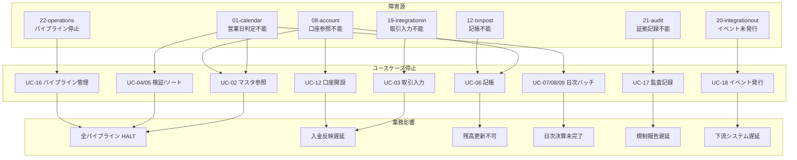

# 障害影響マップ (Failure Impact Map)

> **更新日:** 2026-07-06
> **スコープ:** 22 サブシステム × 18 ユースケースの障害影響を可視化する
> **目的:** 本設計書を読むことで「どのサブシステムが止まると、どの業務がどの程度止まるか」を一瞥で把握できる

---

## 1. はじめに

### 1.1 目的

本ドキュメントは、レガシー COBOL バッチ処理システムの**各サブシステム停止時の業務影響を可視化**し、以下の判断材料を提供する。

- 復旧優先度の決定 (トリアージ)
- 事業継続計画 (BCP) の根拠
- 監視・アラート設計の入力
- モダナイゼーション再構成時のリスク評価

### 1.2 評価基準

障害の**重大度 (Severity)** と**影響範囲 (Scope)** の 2 軸で評価する。

#### 重大度 (Severity)

| 等級 | 記号 | 定義 | 業務への影響 |
|------|------|------|------------|
| **S** | S | 致命的 — 全行の基幹業務が停止 | 顧客取引不可、規制違反のリスク |
| **A** | A | 重大 — 一部業務が停止、代替手段あり | 窓口業務・日次バッチに遅延 |
| **B** | B | 中程度 — 限定された業務への影響 | 個別帳票・検索・イベント遅延 |
| **C** | C | 軽微 — 運用効率低下のみ | ログ・集計・将来拡張機能の遅延 |

#### 影響範囲 (Scope)

| 範囲 | 定義 |
|------|------|
| **全行 (Enterprise)** | 本店・全店舗・全顧客に影響 |
| **店舗 (Branch)** | 特定店舗または特定取引ルートに限定 |
| **個別 (Individual)** | 個別口座・個別帳票・個別イベントに限定 |

### 1.3 返却コードと障害分類の対応

各 COBOL プログラムは 2 桁の RETURN-CODE で障害レベルを通知する。

| RETURN-CODE | 意味 | 障害分類 |
|-------------|------|---------|
| 00 | 正常 | — |
| 01 | NO-INPUT-READY | 外部トリガ未着 (軽微) |
| 02 | FLOCK-CONFLICT | 排他ロック競合 (軽微) |
| 04 | PARTIAL | 一部処理失敗 (中程度) |
| 08 | INVALID-INPUT | 入力不正 (軽微〜中程度) |
| 12 | IO-FAIL | ファイル入出力障害 (重大) |
| 16 | FATAL | 致命的 — データ不整合・DB 停止 (致命的) |

---

## 2. 障害分類

本システムの障害を 4 つのカテゴリに分類する。

### 2.1 サブシステム停止 (Program Crash / Hang)

| パターン | 原因 | 検知方法 |
|---------|------|---------|
| 異常終了 (abend) | 未ハンドル例外、ファイル OPEN 失敗 | RETURN-CODE 12/16 |
| 無限ループ (hang) | カーソル FETCH の EOF 未到達 | タイムアウト監視 |
| デッドロック | SERIALIZABLE 競合の連鎖 | DB ロック待ち超過 |

### 2.2 データストア障害

| パターン | 原因 | 検知方法 |
|---------|------|---------|
| PostgreSQL 全停止 | DB サーバダウン、ネットワーク断 | CONNECT 失敗 (SQLCODE) |
| ISAM ファイル破損 | ディスク障害、同時書き込み競合 | FILE STATUS 30/39 |
| 一時ファイル領域フル | /tmp またはバッチ領域の容量枯渇 | WRITE 失敗 (FILE STATUS 27) |

### 2.3 外部システム障害

| パターン | 原因 | 検知方法 |
|---------|------|---------|
| MQ (RabbitMQ) 停止 | ブローカー障害、ネットワーク断 | 接続タイムアウト |
| ファイル取込先障害 | 他行/送金ネットワークのファイル未到着 | センチネル未存在 (01) |
| 下流システム (DWH) 障害 | イベント消費者の処理遅延 | MQ キュー滞留 |

### 2.4 パイプライン全体停止

| パターン | 原因 | 検知方法 |
|---------|------|---------|
| OPS-BATCH-DAILY HALTED | いずれかのステップが RETURN-CODE != 00 | batch_run.status = FL |
| OPS-BATCH-MONTHLY HALTED | 月次パイプラインの中断 | batch_run.status = FL |
| 排他ロック獲得失敗 | 他バッチが実行中 | RETURN-CODE 02 |

---

## 3. サブシステム障害影響マトリクス

22 サブシステムそれぞれの停止時の影響を以下に示す。

| # | サブシステム | 停止時の影響 | 代替手段 | 復旧優先度 | 最大許容停止時間 |
|---|------------|------------|---------|----------|----------------|
| 01 | **calendar** | 営業日判定不能。全パイプラインが稼働不可 | 手動で営業日ファイルを差し替え | **S / 全行** | 0 時間 (即座) |
| 02 | **branch** | 支店マスタ参照不能。取引検証・帳票生成が停止 | 前日キャッシュで代替 (限定) | **S / 全行** | 0 時間 (即座) |
| 03 | **customer** | 顧客マスタ参照不能。口座開設・照会が停止 | 前日キャッシュで代替 (限定) | **S / 全行** | 0 時間 (即座) |
| 04 | **customersearch** | 顧客検索 (AND/住所/ページング) が利用不可 | 全件スキャンで代替 (低速) | **B / 店舗** | 24 時間 |
| 05 | **product** | 商品マスタ参照不能。取引検証・金利計算が停止 | 前日キャッシュで代替 (限定) | **S / 全行** | 0 時間 (即座) |
| 06 | **interestrate** | 金利マスタ参照不能。金利計算・金利入金が停止 | 前回金利で代替 (規制リスクあり) | **S / 全行** | 0 時間 (即座) |
| 07 | **feeschedule** | 手数料マスタ参照不能。手数料請求が停止 | 固定手数料で代替 (精度低下) | **A / 全行** | 24 時間 |
| 08 | **account** | 口座存在確認・残高参照不能。全取引・全バッチが停止 | 代替不可 | **S / 全行** | 0 時間 (即座) |
| 09 | **accountlifecycle** | 口座開設・状態変更・休眠スキャン不能 | 手動 SQL で代替 (監査証拠欠落) | **A / 店舗** | 4 時間 |
| 10 | **txnvalidate** | 取引妥当性検証不能。日次パイプライン Step 1 で HALTED | 前日検証済みファイルで代替 (限定) | **S / 全行** | 0 時間 (即座) |
| 11 | **txnsortmerge** | 取引ソート・マージ不能。記帳待ちファイルが未生成 | 代替不可 | **S / 全行** | 0 時間 (即座) |
| 12 | **txnpost** | 複式記帳不能。取引データが DB に反映されない | 代替不可 | **S / 全行** | 0 時間 (即座) |
| 13 | **interestaccrual** | 金利計算不能。AC 行が未生成 | 代替不可 (規制リスク) | **S / 全行** | 0 時間 (即座) |
| 14 | **interestpost** | 金利入金不能。顧客口座に利息が反映されない | 代替不可 (規制リスク) | **S / 全行** | 0 時間 (即座) |
| 15 | **autodebit** | 自動引き落とし不能。代金回収が滞る | 手動で個別引落しを実施 | **A / 全行** | 24 時間 |
| 16 | **fee** | 手数料請求不能。収益機会の損失 | 翌日日次で再実行 | **A / 全行** | 24 時間 |
| 17 | **statement** | 帳票生成不能。顧客への明細書送付が遅延 | 月次再生成で対応 | **B / 個別** | 72 時間 |
| 18 | **inquiry** | 照会 CUI 不能。店舗窓口が顧客対応不可 | 直接 SQL 照会で代替 (非推奨) | **A / 店舗** | 4 時間 |
| 19 | **integrationin** | EBCDIC デコード不能。取引入力が停止 | 代替不可 | **S / 全行** | 0 時間 (即座) |
| 20 | **integrationout** | イベント発行不能。下流システム (DWH) が更新遅延 | リトライキューで再送 (最大 3 回) | **B / 全行** | 24 時間 |
| 21 | **audit** | 監査証拠記録不能。規制報告に支障 | 代替不可 (規制違反リスク) | **S / 全行** | 0 時間 (即座) |
| 22 | **operations** | パイプライン制御不能。日次/月次バッチが起動不可 | 手動ステップ順次実行 (非推奨) | **S / 全行** | 0 時間 (即座) |

### 3.1 マスタ系サブシステムの依存関係

マスタ系サブシステム (01-09) は、参照系 (`*LOOKUP`) と更新系 (`*LOAD` / `ACCT-UPDATE-*`) に分かれる。参照系は**全サブシステムの前提**であり、停止時は即座に上位パイプラインが HALT する。

### 3.2 トランザクション系サブシステムの直列依存

取引パイプライン (19 → 10 → 11 → 12) は**直列依存**であり、前段が停止すると後段の処理対象がゼロになる。

---

## 4. ユースケース影響マップ

18 ユースケースそれぞれが依存するサブシステムと、障害時の影響を以下に示す。

| ユースケース | 停止サブシステム | 業務影響 | 顧客影響 | 規制影響 |
|------------|----------------|---------|---------|---------|
| **UC-01 マスタロード** | 01/02/03/05/06/07/08/22 | システム初期化不能 | 新規口座開設不可 | 監査証拠未初期化 |
| **UC-02 マスタ参照** | 01/02/03/05/06/07/08 | 全照会・全検証が停止 | 窓口業務不可 | — |
| **UC-03 取引入力** | 19 | 外部取引ファイル未処理 | 入金反映遅延 | — |
| **UC-04 取引バリデーション** | 10/01/02/05 | 取引検証不能 | 不正取引の検知漏れ | — |
| **UC-05 取引ソート・マージ** | 11/01 | 記帳待ちファイル未生成 | — | — |
| **UC-06 取引記帳** | 12/08/21 | 複式記帳不能 | 残高更新不可 | 会計基準違反 |
| **UC-07 金利計算** | 13/08/05/06/21 | AC 行未生成 | 利息計算遅延 | 金利開示違反のリスク |
| **UC-08 自動引き落とし** | 15/08/01 | 代金回収不能 | — | — |
| **UC-09 手数料請求** | 16/07/08/21 | 手数料未計上 | — | 収益認識遅延 |
| **UC-10 帳票生成** | 17/03/02/08 | 帳票未出力 | 明細書送付遅延 | — |
| **UC-11 金利入金** | 14/08/21 | 顧客口座へ利息未反映 | 利息入金遅延 | 金利支払義務違反 |
| **UC-12 口座開設** | 09/08/21 | 新規口座開設不可 | 新規顧客獲得不可 | — |
| **UC-13 口座状態変更** | 09/08/21 | 状態遷移不可 | 停止・解約手続き遅延 | — |
| **UC-14 休眠・再活性** | 09/08/21 | 休眠判定遅延 | — | 休眠口座管理基準違反 |
| **UC-15 顧客・口座照会** | 18/03/08 | 照会不能 | 窓口顧客対応不可 | — |
| **UC-16 パイプライン管理** | 22 | 日次/月次バッチ未実行 | 全業務遅延 | 日次決算未完了 |
| **UC-17 監査証拠記録** | 21 | 証拠未記録 | — | 監査報告義務違反 |
| **UC-18 イベント発行** | 20 | 下流システム更新遅延 | — | — |

### 4.1 障害伝播図 (Failure Propagation)

以下の Mermaid 図は、サブシステム障害がユースケースを経て業務影響に伝播する経路を示す。



---

## 5. データストア障害影響

### 5.1 PostgreSQL 全停止

PostgreSQL はシステムの**単一障害点 (SPOF)** であり、全サブシステムが DB 接続に依存する。

| 影響項目 | 詳細 |
|---------|------|
| **停止サブシステム** | 08/09/12/13/14/15/16/17/20/21/22 (11 / 22) |
| **停止ユースケース** | UC-06/07/08/09/10/11/12/13/14/16/17/18 (12 / 18) |
| **業務影響** | 全オンライン・全バッチ処理が停止 |
| **顧客影響** | 全取引不可 (入金・出金・照会) |
| **規制影響** | 日次決算未完了、監査証拠未記録 |
| **復旧優先度** | **S / 全行** |
| **最大許容停止時間** | 0 時間 (即座) |

### 5.2 ISAM ファイル破損 (Per File)

ISAM インデックスファイル (`.idx`) はマスタデータの検索に使用される。

| ファイル | 影響サブシステム | 影響範囲 | 復旧手段 |
|---------|----------------|---------|---------|
| `calendar.idx` | 01-calendar | 全行 | `make load-idx` で再構築 |
| `branch.idx` | 02-branch | 全行 | `make load-idx` で再構築 |
| `customer.idx` | 03-customer | 全行 | `make load-idx` で再構築 |
| `product.idx` | 05-product | 全行 | `make load-idx` で再構築 |
| `interestrate.idx` | 06-interestrate | 全行 | `make load-idx` で再構築 |
| `feeschedule.idx` | 07-feeschedule | 全行 | `make load-idx` で再構築 |
| `account.idx` | 08-account, 09-accountlifecycle | 全行 | `make load-idx` で再構築 (要バックアップ) |

### 5.3 一時ファイル領域フル

バッチ処理中の一時ファイル (`txn-detail`, `valid-file`, `sorted-file`, `txn-ready` など) が書き出せない場合の影響。

| 影響項目 | 詳細 |
|---------|------|
| **停止サブシステム** | 10/11/12/19 (パイプライン前半) |
| **業務影響** | 日次パイプライン Step 1 で HALTED |
| **復旧手段** | 一時ファイル領域の容量確保、古いファイル削除 |
| **復旧優先度** | **A / 全行** |
| **最大許容停止時間** | 4 時間 |

---

## 6. 障害シナリオと復旧手順

### 6.1 Top 5 障害シナリオ

#### シナリオ 1: 日次パイプライン中断 (OPS-BATCH-DAILY HALTED)

| 項目 | 内容 |
|------|------|
| **トリガ** | いずれかのステップが RETURN-CODE != 00 |
| **検知** | `batch_run.status = FL`、監視システムが OPB-HALTED を検知 |
| **影響** | 日次決算未完了、翌営業日の取引データ未処理 |
| **復旧手順** | ① 障害ステップ特定 (`OPB-OUT-LAST-STEP`) → ② 根本原因除去 → ③ 該ステップから再開 (手動) または ④ パイプライン最初から再実行 |
| **復旧目標** | RTO: 2 時間 / RPO: 0 (再実行で完全復旧) |

#### シナリオ 2: 取引記帳失敗 (TXPOST-RUN-BATCH 16=FATAL)

| 項目 | 内容 |
|------|------|
| **トリガ** | DB 不整合 (システム口座不在、I4 単調性違反) |
| **検知** | RETURN-CODE 16、`batch_run.status = FL` |
| **影響** | 取引データが DB に未反映、残高が不正確 |
| **復旧手順** | ① DB 整合性確認 → ② システム口座再登録 → ③ 単調性違反の場合は業務日を正しく設定 → ④ パイプライン再実行 |
| **復旧目標** | RTO: 1 時間 / RPO: 0 |

#### シナリオ 3: 外部取引入力失敗 (INTI-DECODE-BATCH 12=IO-FAIL)

| 項目 | 内容 |
|------|------|
| **トリガ** | EBCDIC ファイル OPEN 失敗、センチネル不在 |
| **検知** | RETURN-CODE 12 (IO-FAIL) または 01 (NO-INPUT-READY) |
| **影響** | 取引入力が未処理、後段パイプラインが全て停止 |
| **復旧手順** | ① ファイル存在確認 → ② ファイル権限確認 → ③ センチネルファイル配置 → ④ Step 1 から再実行 |
| **復旧目標** | RTO: 30 分 / RPO: 0 |

#### シナリオ 4: データベース停止 (PostgreSQL Down)

| 項目 | 内容 |
|------|------|
| **トリガ** | DB サーバダウン、ネットワーク断、接続数超過 |
| **検知** | 全プログラムが RETURN-CODE 12 (CONNECT 失敗) |
| **影響** | 全オンライン・全バッチ処理が停止 |
| **復旧手順** | ① PostgreSQL プロセス確認 → ② 再起動 → ③ 接続確認 → ④ パイプライン再実行 |
| **復旧目標** | RTO: 30 分 / RPO: 0 (WAL で復旧) |

#### シナリオ 5: メッセージキュー停止 (RabbitMQ Down)

| 項目 | 内容 |
|------|------|
| **トリガ** | ブローカー障害、ネットワーク断、ディスクフル |
| **検知** | イベント発行プログラムがリトライ 3 回失敗、DEAD ログ出力 |
| **影響** | 下流システム (DWH) の更新遅延、`autodebit.failed` イベント未配信 |
| **復旧手順** | ① RabbitMQ プロセス確認 → ② 再起動 → ③ キュー再開 → ④ イベント再送 (OPS-DRAIN-QUEUES 再実行) |
| **復旧目標** | RTO: 1 時間 / RPO: 0 (キューにメッセージ保持) |

### 6.2 シナリオ別復旧優先度

| 優先度 | シナリオ | 復旧目標 (RTO) |
|--------|---------|---------------|
| **P0** | DB 全停止 | 30 分 |
| **P0** | パイプライン HALTED (Step 1-2) | 1 時間 |
| **P1** | パイプライン HALTED (Step 3-5) | 2 時間 |
| **P1** | ISAM ファイル破損 | 1 時間 |
| **P2** | RabbitMQ 停止 | 1 時間 |
| **P2** | 一時ファイル領域フル | 30 分 |
| **P3** | 帳票生成失敗 | 24 時間 |

---

## 7. 障害検知と通知

### 7.1 監視ポイント (Per Subsystem)

| サブシステム | 監視項目 | 監視方法 | アラート閾値 |
|------------|---------|---------|------------|
| 01-calendar | `calendar.idx` 存在・READ 成功 | ファイル存在チェック + テスト READ | FILE STATUS != 00 |
| 02-branch | `branch.idx` 存在・READ 成功 | ファイル存在チェック + テスト READ | FILE STATUS != 00 |
| 03-customer | `customer.idx` 存在・READ 成功 | ファイル存在チェック + テスト READ | FILE STATUS != 00 |
| 04-customersearch | 検索応答時間 | レスポンスタイム計測 | > 5 秒 |
| 05-product | `product.idx` 存在・READ 成功 | ファイル存在チェック + テスト READ | FILE STATUS != 00 |
| 06-interestrate | `interestrate.idx` 存在・READ 成功 | ファイル存在チェック + テスト READ | FILE STATUS != 00 |
| 07-feeschedule | `feeschedule.idx` 存在・READ 成功 | ファイル存在チェック + テスト READ | FILE STATUS != 00 |
| 08-account | `account.idx` 存在・READ 成功 | ファイル存在チェック + テスト READ | FILE STATUS != 00 |
| 09-accountlifecycle | 口座開設レスポンス | トランザクション監視 | rc=12 持続 |
| 10-txnvalidate | 検証スループット | 処理件数/分 計測 | 0 件/分 持続 5 分 |
| 11-txnsortmerge | ソート完了時間 | 処理時間計測 | > 閾値 (30 分) |
| 12-txnpost | 記帳スループット、FATAL 検知 | 処理件数/分 + rc 監視 | rc=16 即座 |
| 13-interestaccrual | 金利計算完了時間 | 処理時間計測 | > 閾値 (1 時間) |
| 14-interestpost | 金利入金完了時間 | 処理時間計測 | > 閾値 (30 分) |
| 15-autodebit | 引落し失敗率 | 失敗件数/総件数 | > 10% |
| 16-fee | 手数料計上件数 | 処理件数計測 | 0 件 (スキップ) |
| 17-statement | 帳票生成件数 | 出力ファイル行数 | 0 行 |
| 18-inquiry | 照会レスポンスタイム | レスポンスタイム計測 | > 3 秒 |
| 19-integrationin | デコード完了件数、rc | 処理件数 + rc 監視 | rc=12 即座 |
| 20-integrationout | イベント発行失敗率 | DEAD ログ件数 | > 0 件 |
| 21-audit | 監査証拠 INSERT 失敗 | SQLCODE 監視 | SQLCODE != 0 |
| 22-operations | `batch_run.status` | DB ポーリング | status = FL |

### 7.2 アラート閾値

| アラートレベル | 条件 | 通知方法 |
|--------------|------|---------|
| **Critical (P0)** | DB 全停止、パイプライン HALTED (Step 1-2)、ISAM 破損 | 電話 + SMS + メール |
| **Major (P1)** | パイプライン HALTED (Step 3-5)、外部取引入力失敗 | SMS + メール |
| **Minor (P2)** | RabbitMQ 停止、一時ファイル領域警告 | メール + チャット |
| **Info (P3)** | 帳票生成遅延、照会レスポンス低下 | チャット |

### 7.3 通知先

| 障害レベル | 通知先 | エスカレーション |
|-----------|--------|---------------|
| **S / 全行** | 運用担当者 → システム管理者 → 部門長 | 15 分以内にエスカレーション |
| **A / 店舗** | 運用担当者 → システム管理者 | 30 分以内にエスカレーション |
| **B / 個別** | 運用担当者 | 次の営業日までに対応 |
| **C / 軽微** | 運用担当者 (次回定期対応) | 次回スプリントで対応 |

---

## 8. 事業継続計画 (BCP)

### 8.1 フェイルオーバー戦略

| 障害種別 | フェイルオーバー戦略 | 目標復旧時間 |
|---------|-------------------|------------|
| **PostgreSQL プライマリ障害** | スタンバイへの自動フェイルオーバー (Patroni/pg_auto_failover) | 30 秒 |
| **ISAM ファイル破損** | `make load-idx` で再構築 (バックアップから) | 30 分 |
| **アプリケーション障害** | プロセス再起動、パイプライン再実行 | 5 分 |
| **RabbitMQ 障害** | クラスター化ブローカーの自動フェイルオーバー | 1 分 |
| **ホスト障害** | スタンバイホストへの手動切り替え | 30 分 |

### 8.2 データバックアップ/リストア

| データ種別 | バックアップ方法 | 頻度 | リストア目標 (RPO) |
|-----------|---------------|------|------------------|
| **PostgreSQL (accounts, transactions, postings, balances)** | pg_basebackup + WAL アーカイブ | 日次フル + リアルタイム WAL | 0 (ゼロデータ損失) |
| **ISAM インデックスファイル** | ファイルコピー (バックアップ専用領域) | 日次 | 24 時間 |
| **マスタシードファイル** | Git 管理 + バックアップ | 変更時 | 0 (Git で復元) |
| **バッチ実行履歴 (batch_run)** | PostgreSQL バックアップに含まれる | 日次 | 0 |
| **監査証拠 (audit_log)** | PostgreSQL パーティション + 外部アーカイブ | 月次パーティション切り替え | 0 |

### 8.3 バッチ再実行手順

#### 8.3.1 パイプライン全体の再実行

```bash
# 1. 障害原因の除去
# 2. パイプライン再実行
make batch-daily BUSINESS_DATE=YYYYMMDD

# 3. 結果確認
psql -c "SELECT status, last_step FROM batch_run WHERE business_date = 'YYYYMMDD' ORDER BY run_id DESC LIMIT 1;"
```

#### 8.3.2 特定ステップからの再運用

```bash
# 1. 最後に成功したステップを特定
# 2. 該ステップから手動で順次実行
bash src/ops-step-13-iacr.sh YYYYMMDD
bash src/ops-step-15-ad.sh YYYYMMDD
# ... 後続ステップを順次実行
```

#### 8.3.3 冪等性を利用した再実行

本システムの各プログラムは**冪等性**を保証する設計となっている。

- **I1 (Idempotency Check):** TXPOST-RUN-BATCH は同一取引の再実行をスキップ
- **Idempotent INSERT:** IACR-RUN-DAILY は同一 business_date + account の重複 INSERT を防止
- **冪等スキップ:** AD-RUN-DAILY は同一 batch + description の重複をスキップ

したがって、パイプライン全体を再実行しても**二重計上は発生しない**。

### 8.4 BCP テスト

| テスト種別 | 頻度 | 内容 |
|-----------|------|------|
| **バックアップリストアテスト** | 月次 | PostgreSQL バックアップからのリストア検証 |
| **ISAM 再構築テスト** | 四半期 | `make load-idx` による再構築時間計測 |
| **パイプライン再実行テスト** | 日次 (ドライラン) | `make batch-daily DRY_RUN=Y` で検証 |
| **障害切り替え訓練** | 年次 | PostgreSQL フェイルオーバー訓練 |

---

## 9. 参考

- ユースケース設計書: [00-system-usecases.md](./00-system-usecases.md)
- システム全体設計書: [00-system-overview.md](./00-system-overview.md)
- 各サブシステム設計書: `subsystems/NN-name/design/`
- 各プログラム設計書: `subsystems/NN-name/design/<program>.md`