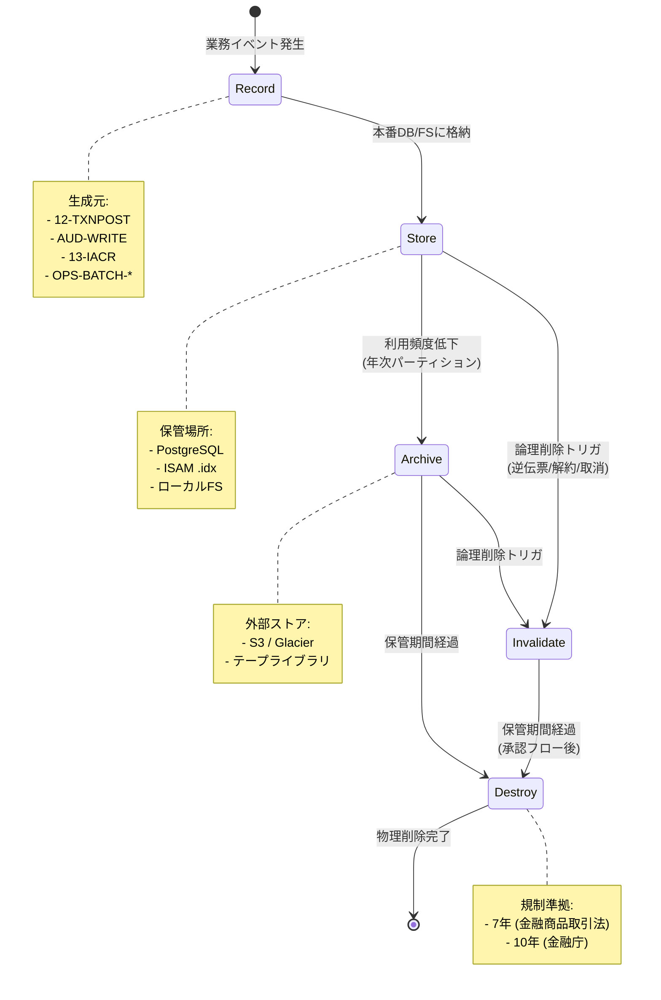
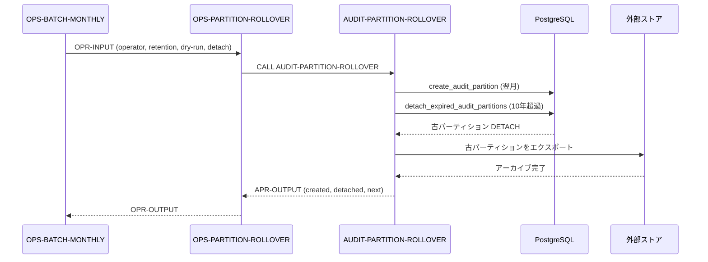
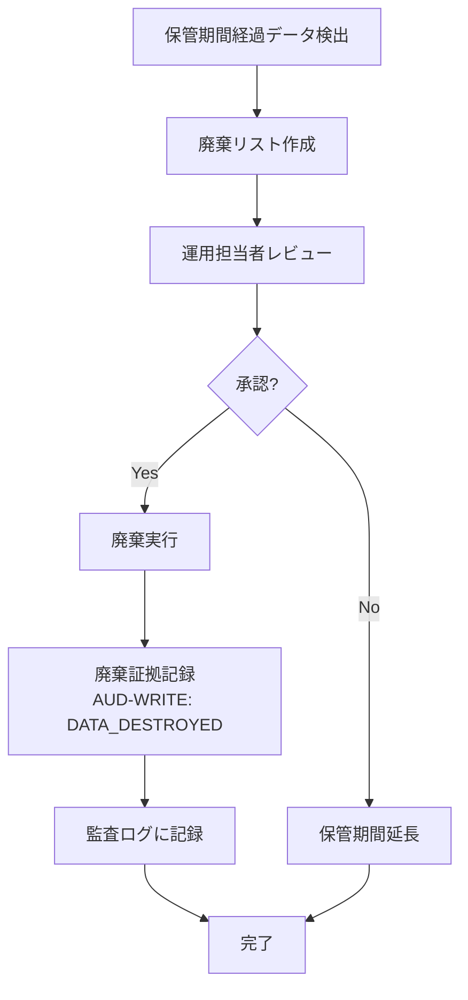

# RASIS 情報ライフサイクル設計書

> **更新日:** 2026-07-06
> **スコープ:** 22 サブシステム / 82 プログラムが生成する全データ種別を対象とする
> **目的:** RASIS (Record / Archive / Store / Invalidate / Destroy) モデルに基づき、銀行システムの情報資産を統一的に管理する

---

## 1. はじめに

### 1.1 RASIS モデル概要

RASIS は情報ライフサイクル管理 (ILM: Information Lifecycle Management) の 5 ステージモデルである。

| ステージ | 英語名 | 意味 | 本システムにおける対応 |
|---------|--------|------|---------------------|
| **R** | Record | 生成 | サブシステムが業務イベントによりデータを生成・記録する |
| **S** | Store | 保管 | 本番 DB / ISAM / ファイルシステムに格納し、業務で利用する |
| **A** | Archive | アーカイブ | 利用頻度が低下したデータを低コストの外部ストアへ移行する |
| **I** | Invalidate | 無効化 | 論理削除・ステータス変更により参照不能にする |
| **D** | Destroy | 廃棄 | 保管期間経過後に物理的に削除する |

### 1.2 銀行システムにおける適用範囲

本設計書は以下のデータ種別を対象とする。

- 取引データ (transactions / postings / balances)
- 口座データ (accounts / customers)
- 監査証拠 (audit_log)
- 一時ファイル (txn-ready, valid-file, error-file, reject-file)
- マスタファイル (7 ISAM .idx)
- 利息データ (interest_accruals)
- 自動引き落とし (autodebit_schedules)
- バッチ実行履歴 (batch_run)

### 1.3 規制要件

本システムは以下の法規制を遵守する。

| 規制 | 概要 | 保管期間要件 |
|------|------|-------------|
| **金融商品取引法** | 取引記録の保存義務 | 7 年 |
| **個人情報保護法** | 個人データの適正管理 | 5-7 年 |
| **e-文書法** | 電子記録の長期保存を認める | 電子証拠として 7-10 年 |
| **金融庁監督指針** | 監査証拠の完全性・機密性確保 | 10 年 |
| **会社法** | 帳簿類の保存義務 | 10 年 |

---

## 2. 情報分類体系

### 2.1 データ種別分類

| 分類 | データ種別 | 生成元 | 主保管場所 |
|------|----------|--------|----------|
| トランザクション | transactions, postings, balances | 12-TXNPOST | PostgreSQL |
| マスタ | accounts, customers, products, branches | 01-09 マスタサブシステム | PostgreSQL + ISAM |
| 監査証拠 | audit_log | 全サブシステム (AUD-WRITE) | PostgreSQL (パーティション) |
| 一時ファイル | txn-ready, valid-file, error-file, reject-file | パイプライン各ステップ | ローカル FS |
| 利息 | interest_accruals | 13-IACR / 14-IPST | PostgreSQL |
| 自動引き落とし | autodebit_schedules | 15-AD / 店舗登録 | PostgreSQL |
| バッチ実行履歴 | batch_run | 22-OPS | PostgreSQL |
| マスタファイル | 7 ISAM .idx | OPS-MASTER-LOAD | ISAM ファイル |

### 2.2 機密レベル

| レベル | 定義 | 該当データ |
|--------|------|----------|
| **極秘 (Top Secret)** | 漏洩により重大な被害を及ぼす | 顧客個人情報 (name_kanji, address, phone) |
| **秘 (Secret)** | 漏洩により業務支障を及ぼす | 取引明細、残高、金利情報 |
| **社外秘 (Confidential)** | 外部公開を避けるべき | マスタ設定、手数料体系、監査証拠 |
| **公開 (Public)** | 外部公開が可能 | 店舗名称、営業日カレンダー |

### 2.3 保管期間

| 期間 | 該当データ種別 | 規制根拠 |
|------|--------------|---------|
| **3 年** | バッチ実行履歴、一時ファイル | 内部管理 |
| **5 年** | 自動引き落とし履歴 (解約後) | 個人情報保護法 |
| **7 年** | 取引データ、口座データ (解約後)、利息データ | 金融商品取引法 |
| **10 年** | 監査証拠 | 金融庁監督指針 |
| **永続** | マスタファイル、アクティブ口座 | 業務継続要件 |

---

## 3. データ種別別ライフサイクル

### 3.1 取引データ (transactions / postings / balances)

| ステージ | 処理 | 実装 |
|---------|------|------|
| **Record** | 12-TXNPOST が複式記帳を実行し、transactions / postings / balances に INSERT/UPDATE | `TXPOST-RUN-BATCH` |
| **Store** | PostgreSQL 本番テーブルに格納。SERIALIZABLE 分離レベルで一貫性を保証 | `transactions`, `postings`, `balances` テーブル |
| **Archive** | 年次パーティション detach → 外部ストア (S3 / Glacier) へ移行 | `OPS-PARTITION-ROLLOVER` (年次) |
| **Invalidate** | 逆伝票時に `status = 'RV'` を設定 (論理削除)。`reversal_of` 列で元取引を参照 | `txn_status_enum CHECK (status IN ('PT','SE','RV'))` |
| **Destroy** | 7 年経過したパーティションを物理削除 | `DROP TABLE audit_log_YYYYMM` と同方式 |

**補足:**
- `transactions` テーブルの `reversal_of` 列と `uq_txn_reversal_of_when_rv` 一意インデックスにより、逆伝票の 1:1 関係を保証する。
- `postings` テーブルの `pst_dr_xor_cr` 制約により、借貸の排他性を保証する。

### 3.2 口座データ (accounts / customers)

| ステージ | 処理 | 実装 |
|---------|------|------|
| **Record** | ALC-OPEN (口座開設) / CUST-LOAD (顧客登録) で生成 | `ALC-OPEN`, `CUST-LOAD` |
| **Store** | PostgreSQL テーブル + ISAM インデックスの二重管理 | `accounts`, `customers` テーブル + `.idx` ファイル |
| **Archive** | 解約後 7 年間、外部ストアに保管 | 年次パーティション detach |
| **Invalidate** | ステータス遷移: `A` → `D` (休眠) → `C` (解約) / `FC` (強制解約) | `accounts.status` 列 |
| **Destroy** | 解約から 7 年経過後に物理削除 | バッチクリーンアップジョブ |

**補足:**
- 口座状態遷移は FSM (有限状態機械) で管理される: `P → A → {SU, LS, CL, FC}`。
- 休眠判定: 最終取引日から 730 日超過で `A → D` 自動遷移 (UC-14)。

### 3.3 監査証拠 (audit_log)

| ステージ | 処理 | 実装 |
|---------|------|------|
| **Record** | 全サブシステムが `CALL "AUD-WRITE"` で証拠を記録 | `AUD-WRITE` 共有モジュール |
| **Store** | PostgreSQL パーティションテーブル (月次 RANGE パーティション) | `audit_log` PARTITION BY RANGE (business_date) |
| **Archive** | 年次パーティションロールオーバー: 古パーティションを DETACH → 外部ストア | `AUDIT-PARTITION-ROLLOVER` |
| **Invalidate** | なし (不変 — immutability 保証) | アプリケーション層で UPDATE/DELETE を禁止 |
| **Destroy** | 10 年経過したパーティションを物理削除 | `detach_expired_audit_partitions()` |

**補足:**
- `audit_log` は `business_date` と `audit_id` の複合主キーを持つ (V3 マイグレーション)。
- パーティション名規則: `audit_log_YYYYMM` (例: `audit_log_202607`)。
- ロールオーバーは月次バッチ (`OPS-BATCH-MONTHLY`) の最終工程で実行される。
- `AUDIT-SUMMARY-REPORT` により、日付範囲・サブシステム別の集計レポートを出力可能。

### 3.4 一時ファイル (txn-ready, valid-file, error-file, reject-file)

| ステージ | 処理 | 実装 |
|---------|------|------|
| **Record** | パイプライン各ステップが処理中間データをファイル出力 | 19-INTI, 10-VALIDATE, 11-SORT, 12-POST |
| **Store** | ローカルファイルシステム (日次) | `/data/work/` 配下 |
| **Archive** | 日次バックアップ (tar + gzip) | `make backup-daily` |
| **Invalidate** | 次ステップ開始時に前ステップのファイルを上書きまたは削除 | パイプライン制御 |
| **Destroy** | 日次クリーンアップジョブで 7 日以前のファイルを削除 | `make cleanup-work` |

**補足:**
- ファイル種別: `txn-detail file` (600B), `valid-file`, `error-file` (E001-E019), `reject-file`, `txn-ready-file`, `txn-error-file` (E050), `autodebit-failed.dat` (200B)。
- 拒否率が閾値を超えた場合、出力ファイルは全削除される (BATCH_DECODE_FAIL)。

### 3.5 マスタファイル (7 ISAM .idx)

| ステージ | 処理 | 実装 |
|---------|------|------|
| **Record** | 初回ロード (`make load-idx`) / マスタ更新時に ISAM インデックスを再構築 | `OPS-MASTER-LOAD` |
| **Store** | ISAM インデックスファイル (`.idx`) + PostgreSQL テーブル | `calendar.idx`, `branch.idx`, `customer.idx`, `product.idx`, `interestrate.idx`, `feeschedule.idx`, `account.idx` |
| **Archive** | 日次バックアップ (スナップショット) | `make backup-masters` |
| **Invalidate** | マスタ更新時に該当レコードを上書き | `X-LOOKUP` / `X-UPDATE` |
| **Destroy** | システム廃止時に全ファイルを消去 | 運用手順書に従う |

**補足:**
- 7 つの ISAM ファイルは GnuCOBOL のインデックスファイル形式で管理される。
- 初回ロード順序: CAL → BR → CUST → PRD → IRATE → FEESCH → ACCT → システム口座 4 件 (CASH/CLEARING/INTEREST/FEE)。

### 3.6 利息データ (interest_accruals)

| ステージ | 処理 | 実装 |
|---------|------|------|
| **Record** | IACR-RUN-DAILY が全口座の日次利息を計算し、`status = 'AC'` 行を INSERT | `13-IACR` |
| **Store** | PostgreSQL `interest_accruals` テーブル | `interest_accruals` |
| **Archive** | IPST-RUN-MONTHEND で `AC → PT` 遷移後、3 年間保管 | `14-IPST` |
| **Invalidate** | 取消時に `status = 'CN'` を設定 | `iac_status_enum CHECK (status IN ('AC','PT','CN'))` |
| **Destroy** | 7 年経過した AC 行を物理削除 | バッチクリーンアップジョブ |

**補足:**
- 計算式: `accrued_jpy = principal_jpy × rate / 365 × days`。
- `uq_iac_bd_acct` 一意インデックスにより、1 口座につき 1 日 1 件に制限。

### 3.7 自動引き落とし (autodebit_schedules)

| ステージ | 処理 | 実装 |
|---------|------|------|
| **Record** | 店舗登録 (オンライン) で instruction_id を採番して INSERT | `15-AD` |
| **Store** | PostgreSQL `autodebit_schedules` テーブル | `autodebit_schedules` |
| **Archive** | 解約後 5 年間保管 | 年次パーティション detach |
| **Invalidate** | ステータス `TM` (解約) に遷移 | `ad_status_enum CHECK (status IN ('AC','SP','TM'))` |
| **Destroy** | 5 年経過した TM レコードを物理削除 | バッチクリーンアップジョブ |

**補足:**
- 連続 3 回失敗時に口座状態を `SP` (停止) に遷移。
- 失敗データは `autodebit-failed.dat` (200B 固定長) に退避され、RabbitMQ で `autodebit.failed` イベントが発行される。

### 3.8 バッチ実行履歴 (batch_run)

| ステージ | 処理 | 実装 |
|---------|------|------|
| **Record** | OPS-BATCH-DAILY/MONTHLY がパイプライン開始時に INSERT、完了時に UPDATE | `22-OPS` |
| **Store** | PostgreSQL `batch_run` テーブル | `batch_run` |
| **Archive** | 3 年間保管 | 年次パーティション detach |
| **Invalidate** | なし (不変 — 実行履歴は改変不可) | `br_status_enum CHECK (status IN ('RN','OK','FL','AB'))` |
| **Destroy** | 3 年経過したレコードを物理削除 | バッチクリーンアップジョブ |

**補足:**
- `batch_id` は `CHAR(14)` 形式 (例: `20260706000001`)。
- ステップ失敗時は `status = 'HALTED'` となり、次ステップは実行されない。

---

## 4. RASIS 状態遷移図



---

## 5. 保管期間一覧表

| データ種別 | 生成元 | 保管期間 | 保管場所 | 廃棄方法 | 規制根拠 |
|----------|--------|---------|---------|---------|---------|
| 取引データ (transactions) | 12-TXNPOST | 7 年 | PostgreSQL 本番テーブル | パーティション DROP | 金融商品取引法 |
| 仕訳データ (postings) | 12-TXNPOST | 7 年 | PostgreSQL 本番テーブル | パーティション DROP | 金融商品取引法 |
| 残高データ (balances) | 12-TXNPOST / 13-IACR / 14-IPST | 永続 (アクティブ) | PostgreSQL 本番テーブル | 解約後 7 年で削除 | 金融商品取引法 |
| 口座データ (accounts) | 09-ALC / 08-ACCT | 永続 (アクティブ) / 解約後 7 年 | PostgreSQL + ISAM | 物理削除 | 金融商品取引法 |
| 顧客データ (customers) | 03-CUST | 永続 (アクティブ) / 解約後 7 年 | PostgreSQL + ISAM | 物理削除 | 個人情報保護法 |
| 監査証拠 (audit_log) | 全サブシステム (AUD-WRITE) | 10 年 | PostgreSQL パーティション | パーティション DROP | 金融庁監督指針 |
| 一時ファイル | パイプライン各ステップ | 7 日 | ローカル FS | 日次クリーンアップ | 内部管理 |
| マスタファイル (7 ISAM) | OPS-MASTER-LOAD | 永続 | ISAM .idx | システム廃止時 | 業務継続 |
| 利息データ (interest_accruals) | 13-IACR / 14-IPST | 7 年 | PostgreSQL テーブル | 物理削除 | 金融商品取引法 |
| 自動引き落とし (autodebit_schedules) | 15-AD / 店舗登録 | 5 年 (解約後) | PostgreSQL テーブル | 物理削除 | 個人情報保護法 |
| バッチ実行履歴 (batch_run) | 22-OPS | 3 年 | PostgreSQL テーブル | 物理削除 | 内部管理 |

---

## 6. アーカイブ戦略

### 6.1 月次パーティション (audit_log)

`audit_log` テーブルは RANGE パーティション (business_date) で月次分割される。

```sql
CREATE TABLE audit_log_202607 PARTITION OF audit_log
    FOR VALUES FROM ('2026-07-01') TO ('2026-08-01');
```

- 翌月パーティションは `create_audit_partition()` 関数で事前作成される。
- パーティション名規則: `audit_log_YYYYMM`。

### 6.2 年次パーティションロールオーバー

月次バッチ (`OPS-BATCH-MONTHLY`) の最終工程で `AUDIT-PARTITION-ROLLOVER` が実行される。



### 6.3 バックアップ戦略

| 頻度 | 対象 | 方法 | 保管期間 |
|------|------|------|---------|
| **日次** | 一時ファイル、マスタ ISAM | tar + gzip | 7 日 |
| **週次** | PostgreSQL 全テーブル (pg_dump) | フルバックアップ | 4 週 |
| **月次** | audit_log パーティション | pg_dump (パーティション単位) | 12 月 |
| **年次** | 全データ (フルスナップショット) | S3 / Glacier へアップロード | 10 年 |

---

## 7. 廃棄手順

### 7.1 物理削除 vs 論理削除

| 削除方式 | 該当データ | 実装 |
|---------|----------|------|
| **論理削除** | transactions (RV), accounts (C/D), interest_accruals (CN), autodebit_schedules (TM) | ステータス列の更新 |
| **物理削除** | 保管期間経過データ、一時ファイル | DELETE / DROP TABLE / rm |

### 7.2 廃棄承認フロー



### 7.3 廃棄証拠の保管

廃棄実行時は以下の証拠を `audit_log` に記録する。

| 項目 | 値 |
|------|-----|
| action | `DATA_DESTROYED` |
| target_type | `TABLE_PARTITION` / `FILE` / `RECORD` |
| target_id | パーティション名 / ファイルパス |
| payload_json | `{ "retention_years": 7, "destruction_date": "2033-07-06", "operator": "ops" }` |
| severity | `I` (Informational) |

---

## 8. 規制対応

### 8.1 金融商品取引法

- **要件:** 取引記録の 7 年間保存
- **対応:** `transactions`, `postings`, `balances` テーブルを 7 年間保管。年次パーティション detach により外部ストアで長期保存。

### 8.2 個人情報保護法

- **要件:** 個人データの適正管理、目的達成後の削除
- **対応:** 顧客データ (customers) は解約後 7 年間保管し、期間経過後に物理削除。機密レベル「極秘」のデータはアクセス制御を強化。

### 8.3 監査証拠 (金融庁監督指針)

- **要件:** 監査証拠の完全性・機密性確保、10 年間保存
- **対応:** `audit_log` テーブルは不変 (immutability) を保証。UPDATE/DELETE をアプリケーション層で禁止。10 年経過後に物理削除。

### 8.4 e-文書法

- **要件:** 電子記録の長期保存を認める
- **対応:** 電子証拠として 7-10 年間保管。監査証拠の完全性はハッシュチェーン (後続開発予定) で保証。

### 8.5 規制対応マトリクス

| 規制 | 対象データ | 保管期間 | 保管場所 | 廃棄方法 |
|------|----------|---------|---------|---------|
| 金融商品取引法 | transactions, postings | 7 年 | PG → 外部ストア | パーティション DROP |
| 個人情報保護法 | customers, accounts | 5-7 年 | PG + ISAM | 物理削除 |
| 金融庁監督指針 | audit_log | 10 年 | PG パーティション | パーティション DROP |
| e-文書法 | 全電子記録 | 7-10 年 | PG / ファイル | 物理削除 |
| 会社法 | batch_run, マスタ | 10 年 | PG / ISAM | 物理削除 |

---

## 9. 参考

- システム全体設計書: [00-system-overview.md](./00-system-overview.md)
- ユースケース設計書: [00-system-usecases.md](./00-system-usecases.md)
- 初期スキーマ DDL: `db/migration/V1__initial_schema.sql`
- 監査パーティション DDL: `db/migration/V3__audit_log_partitioning.sql`
- 監査パーティションロールオーバー設計書: `subsystems/21-audit/design/audit-partition-rollover-bd.md`
- 監査集計レポート設計書: `subsystems/21-audit/design/audit-summary-report-bd.md`
- 運用パーティションロールオーバー設計書: `subsystems/22-operations/design/ops-partition-rollover.md`
- 各サブシステム設計書: `subsystems/NN-name/design/`