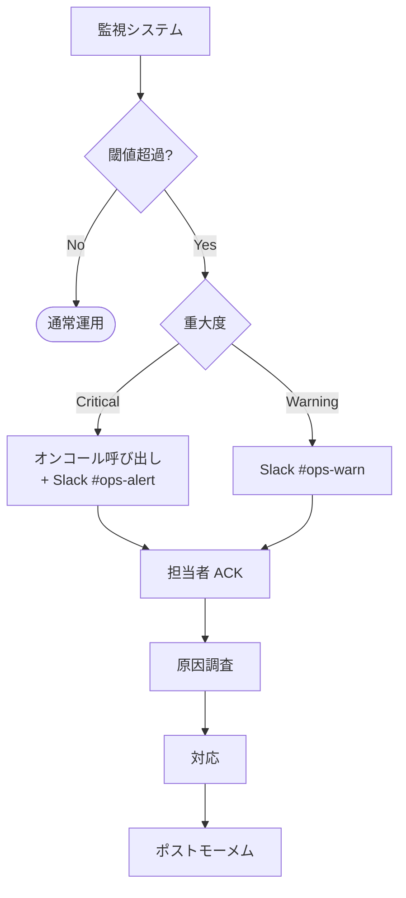
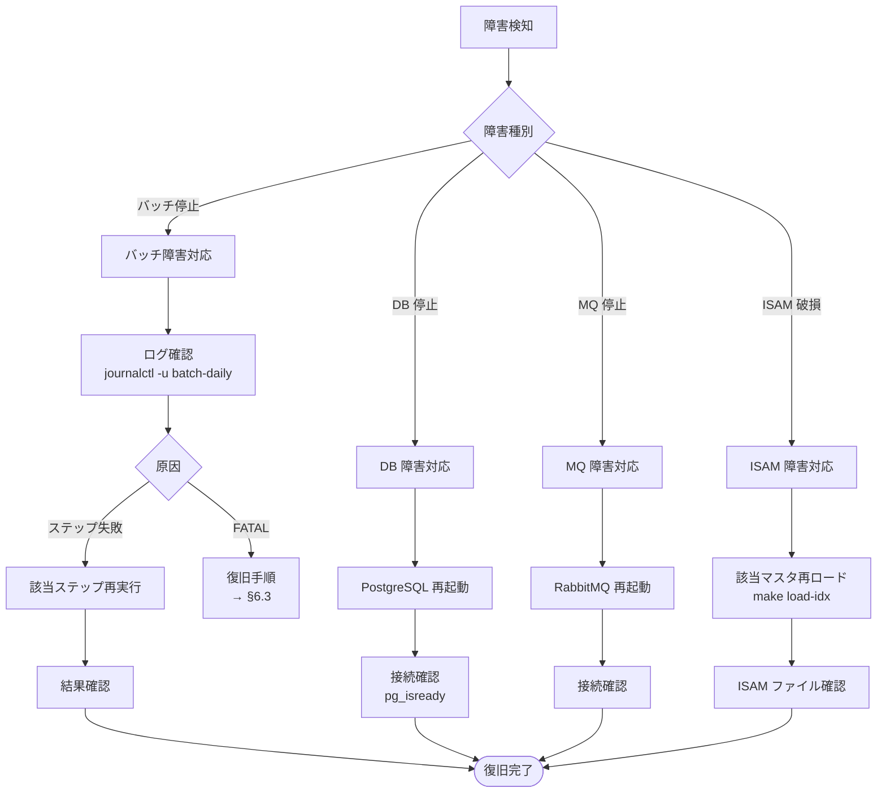

# システム運用マニュアル — Legacy COBOL Banking System

> **更新日:** 2026-07-06
> **読者:** 運用担当者 / システム管理者
> **目的:** 日次・月次バッチの起動手順、監視、障害対応、バックアップ/復旧を手順化する

---

## 1. はじめに

### 1.1 本書の目的
本マニュアルは、本システムの**日常運用**に必要な手順をまとめたものである。
起動手順、監視、障害対応、バックアップ/復旧、メンテナンスの 5 つの運用業務をカバーする。

### 1.2 前提知識
| 知識 | 必要レベル |
|------|----------|
| Linux コマンドライン (bash) | 中級 |
| PostgreSQL 基本操作 (psql) | 初級 |
| systemd timer / service | 初級 |
| COBOL の基本概念 | 初級 (読む程度) |

### 1.3 システム構成概要

```
外部システム ── EBCDIC 800B ──▶ [19-integrationin] ──▶ txn-detail file
                                                         │
日次バッチ (23:00) ──▶ [22-operations] ──┬──▶ [10-txnvalidate] → valid-file
                                          ├──▶ [11-txnsortmerge] → txn-ready-file
                                          ├──▶ [12-txnpost] → PostgreSQL
                                          ├──▶ [13-interestaccrual] → AC 行
                                          ├──▶ [15-autodebit] → 引落 / 失敗キュー
                                          ├──▶ [16-fee] → 手数料仕訳
                                          ├──▶ [17-statement] → 帳票
                                          └──▶ [20-integrationout] → RabbitMQ

月次バッチ (月初 02:00) ──▶ [22-operations] ──┬──▶ [14-interestpost] → PT 入金
                                              └──▶ [21-audit] → パーティション繰越

マスタロード (初回/再構築時) ──▶ 7 マスタをシードから ISAM 構築
```

---

## 2. 環境セットアップ

### 2.1 初回セットアップ (One-shot)

```bash
# 1. リポジトリをクローン
git clone <repo-url> /opt/practice-bank
cd /opt/practice-bank

# 2. 環境変数ファイルを作成
cat > /opt/practice-bank/etc/practice-bank.env << 'EOF'
PGHOST=postgres
PGPORT=5432
PGUSER=cobol
PGPASSWORD=cobol
PGDATABASE=banking
PB_BUSINESS_DATE=$(date +%Y%m%d)
PB_BATCH_ID=BATCH$(date +%Y%m%d)-01
EOF

# 3. ワンセットアップ (Flyway → ビルド → マスタロード → システム口座投入)
make setup
```

### 2.2 環境変数一覧

| 変数 | 意味 | デフォルト | 必須 |
|------|------|----------|:----:|
| `PGHOST` | PostgreSQL ホスト | `postgres` | ✅ |
| `PGPORT` | PostgreSQL ポート | `5432` | ✅ |
| `PGUSER` | DB ユーザー | `cobol` | ✅ |
| `PGPASSWORD` | DB パスワード | `cobol` | ✅ |
| `PGDATABASE` | DB 名 | `banking` | ✅ |
| `PB_BUSINESS_DATE` | 業務日付 (YYYYMMDD) | 当日 | ✅ |
| `PB_BATCH_ID` | バッチ実行 ID | `BATCH<date>-01` | ✅ |
| `PB_DRY_RUN` | ドライランモード | `N` | ❌ |

### 2.3 ディレクトリ構成

```
/opt/practice-bank/
├── subsystems/           # 22 サブシステム
│   ├── 01-calendar/
│   │   ├── bin/          # コンパイル済みバイナリ
│   │   ├── data/         # ISAM インデックス (.idx)
│   │   ├── src/          # COBOL ソース
│   │   ├── copy/         # コピーブック (api/, private/)
│   │   └── tests/        # ユニットテスト
│   └── ...
├── shared/
│   ├── copy/             # 共有コピーブック
│   └── util/             # 共有ユーティリティ (aud-write, shared-log, mq-publish)
├── db/migration/         # Flyway マイグレーション
├── tests/e2e/            # E2E テスト
├── systemd/              # systemd ユニット
├── scripts/gen-seed/     # シードデータ生成
└── docs/design/          # 設計書
```

---

## 3. 起動手順

### 3.1 全サブシステムビルド

```bash
# 共有ユーティリティ + 全サブシステムをビルド
make build-all

# 単一サブシステムのみ
cd subsystems/12-txnpost && make build && cd ../..
```

### 3.2 マスタデータロード (ISAM インデックス構築)

```bash
# 7 マスタ一括ロード
make load-all-idx

# 個別ロード
cd subsystems/01-calendar && make load-idx && cd ../..
cd subsystems/02-branch   && make load-idx && cd ../..
# ... (03-customer, 05-product, 06-interestrate, 07-feeschedule, 08-account)
```

### 3.3 システム口座投入

```bash
make seed-system
```

### 3.4 データベースマイグレーション

```bash
# マイグレーション適用
make migrate

# 状態確認
make migrate-info
```

### 3.5 起動前チェックリスト

```bash
#!/bin/bash
# 起動前チェックリスト (pre-flight check)

echo "=== 起動前チェック ==="

# 1. PostgreSQL 接続確認
pg_isready -h $PGHOST -p $PGPORT -U $PGUSER -d $PGDATABASE
[ $? -eq 0 ] && echo "✅ PostgreSQL: OK" || echo "❌ PostgreSQL: FAIL"

# 2. RabbitMQ 接続確認 (mq-publish 経由)
curl -s -u guest:guest http://localhost:15672/api/overview > /dev/null
[ $? -eq 0 ] && echo "✅ RabbitMQ: OK" || echo "⚠️  RabbitMQ: SKIP (モード確認)"

# 3. ISAM ファイル存在確認
for idx in calendar.idx branch.idx customer.idx product.idx interestrate.idx feeschedule.idx account.idx; do
  found=$(find subsystems -name "$idx" 2>/dev/null | head -1)
  [ -n "$found" ] && echo "✅ $idx: $found" || echo "❌ $idx: MISSING"
done

# 4. バイナリ存在確認
for bin in subsystems/22-operations/bin/OPS-BATCH-DAILY.so; do
  [ -f "$bin" ] && echo "✅ $bin" || echo "❌ $bin: MISSING"
done

# 5. 環境変数確認
for var in PGHOST PGUSER PGPASSWORD PGDATABASE PB_BUSINESS_DATE PB_BATCH_ID; do
  val=$(printenv $var)
  [ -n "$val" ] && echo "✅ $var=${val:0:20}..." || echo "❌ $var: NOT SET"
done

# 6. ディスク容量確認
df -h /opt/practice-bank | tail -1 | awk '{print "📁 ディスク空き: "$4" ("$5" used)"}'

echo "=== チェック完了 ==="
```

---

## 4. 日常運用

### 4.1 日次バッチ運用

#### 4.1.1 自動実行 (systemd timer)

```bash
# タイマー状態確認
systemctl list-timers practice-bank-*

# 手動トリガー (日次)
systemctl start practice-bank-batch-daily.service

# ログ確認
journalctl -u practice-bank-batch-daily.service -f
```

#### 4.1.2 手動実行

```bash
# 業務日付を指定して実行
export PB_BUSINESS_DATE=20260706
export PB_BATCH_ID=BATCH20260706-01

cd subsystems/22-operations
make batch-daily

# ドライラン (実際の書き込みをスキップ)
PB_DRY_RUN=Y make batch-daily
```

#### 4.1.3 日次パイプライン ステップ一覧

| Step | サブシステム | プログラム | 出力 | 最大時間 |
|:----:|------------|-----------|------|:-------:|
| 1 | 19-integrationin | INTI-DECODE-BATCH | txn-detail file + reject | 30 min |
| 2 | 13-interestaccrual | IACR-RUN-DAILY | interest_accruals (AC) | 1 h |
| 3 | 15-autodebit | AD-RUN-DAILY | balances 更新 + failed.dat | 30 min |
| 4 | 16-fee | FEE-CHARGE | postings 追加 | 20 min |
| 5 | 17-statement | STMT-GENERATE-BATCH | statement file | 30 min |
| 6 | 20-integrationout | OPS-DRAIN-QUEUES → INTO-PUBLISH-EVENT | MQ イベント | 10 min |

**合計最大時間: 約 3 時間** (systemd TimeoutStartSec=4h)

#### 4.1.4 日次運用チェックリスト

```markdown
## 日次バッチ運用チェックリスト (業務日 D 日)

### バッチ起動前 (D 日 22:00 頃)
- [ ] 前日バッチが正常終了 (batch_run.status = 'OK')
- [ ] EBCDIC 入金ファイルが到着 (ファイルサイズ > 0)
- [ ] センティネルファイルが存在
- [ ] PostgreSQL 接続確認 (pg_isready)
- [ ] RabbitMQ 接続確認
- [ ] ディスク空き容量 > 1GB
- [ ] 業務日付 (PB_BUSINESS_DATE) が正しいか確認

### バッチ監視 (23:00 〜 完了まで)
- [ ] Step 1 (19-INTI) 正常終了 (status=00)
- [ ] Step 2 (13-IACR) 正常終了
- [ ] Step 3 (15-AD) 正常終了 (failed.dat 件数確認)
- [ ] Step 4 (16-FEE) 正常終了
- [ ] Step 5 (17-STMT) 正常終了 (帳票ファイル生成)
- [ ] Step 6 (20-DRAIN) 正常終了 (MQ 発行)

### バッチ完了後 (D+1 日 00:30 頃)
- [ ] batch_run テーブル status='OK' 確認
- [ ] 各ステップの処理件数が妥当か
- [ ] 拒否ファイル (reject) の内容確認
- [ ] エラーファイル (txn-error) の内容確認
- [ ] 監査ログ (audit_log) の件数確認
- [ ] イベント発行ログの確認
- [ ] 帳票ファイルの出力サイズ確認
```

### 4.2 月次バッチ運用

#### 4.2.1 自動実行

```bash
# 月次バッチ (毎月 1 日 02:00)
systemctl start practice-bank-batch-monthly.service

# パーティションロールオーバー (毎月 25 日 02:00)
systemctl start practice-bank-partition-rollover.service
```

#### 4.2.2 手動実行

```bash
cd subsystems/22-operations
make batch-monthly
make partition-rollover
```

#### 4.2.3 月次パイプライン ステップ一覧

| Step | サブシステム | プログラム | 出力 |
|:----:|------------|-----------|------|
| 1 | 14-interestpost | IPST-RUN-MONTHEND | AC → PT 更新, balances 加算 |
| 2 | 21-audit | AUDIT-PARTITION-ROLLOVER | 新パーティション ATTACH, 旧 DETACH |

### 4.3 週次運用

```bash
# 休眠スキャン (毎週月曜 03:00)
systemctl start practice-bank-dormancy-scan.service

# 自動引き落としリトライ (毎月 15 日 04:00)
systemctl start practice-bank-autodebit-retry.service
```

### 4.4 systemd タイマー一覧

| タイマー | 時刻 | サービス | タイムアウト |
|---------|------|---------|:----------:|
| `practice-bank-batch-daily.timer` | 毎日 23:00 | batch-daily.service | 4 h |
| `practice-bank-batch-monthly.timer` | 毎月 1 日 02:00 | batch-monthly.service | 2 h |
| `practice-bank-dormancy-scan.timer` | 毎週月曜 03:00 | dormancy-scan.service | 1 h |
| `practice-bank-partition-rollover.timer` | 毎月 25 日 02:00 | partition-rollover.service | 30 min |
| `practice-bank-autodebit-retry.timer` | 毎月 15 日 04:00 | autodebit-retry.service | 2 h |

---

## 5. 監視

### 5.1 監視ポイント

| 監視項目 | コマンド/方法 | 閾値 | 重大度 |
|---------|-------------|:----:|:-----:|
| **PostgreSQL 稼働** | `pg_isready` | 接続不可 > 1 min | 🔴 Critical |
| **RabbitMQ 稼働** | `curl localhost:15672` | 接続不可 > 5 min | 🟡 Warning |
| **ディスク使用率** | `df -h` | > 85% | 🔴 Critical |
| **日次バッチ完了** | `batch_run` テーブル | 02:00 までに未完了 | 🔴 Critical |
| **バッチステップ失敗** | `batch_run.status = 'FL'` | 即座 | 🔴 Critical |
| **ISAM ファイル破損** | サブシステム RETURN-CODE=12 | 即座 | 🔴 Critical |
| **MQ イベント未発行** | `audit_log` 対 `mq-publish` ログ | 30 min 遅延 | 🟡 Warning |
| **拒否率** | reject file / 全レコード | > 20% | 🟡 Warning |

### 5.2 バッチ実行状況の確認

```bash
# 最新のバッチ実行状況確認
psql -h $PGHOST -U $PGUSER -d $PGDATABASE -c "
  SELECT batch_id, business_date, status, current_step,
         txns_posted, interest_accounts, errors_count,
         started_at, completed_ts
  FROM batch_run
  ORDER BY started_at DESC
  LIMIT 5;
"

# ステップ失敗の詳細確認
psql -h $PGHOST -U $PGUSER -d $PGDATABASE -c "
  SELECT batch_id, last_failed_step, errors_count, notes
  FROM batch_run
  WHERE status = 'FL'
  ORDER BY started_at DESC
  LIMIT 3;
"
```

### 5.3 アラート通知フロー



---

## 6. 障害対応

### 6.1 障害対応フローチャート



### 6.2 障害対応手順書

#### 6.2.1 日次バッチステップ失敗

```bash
# 1. ログ確認
journalctl -u practice-bank-batch-daily.service --since "1 hour ago" | tail -100

# 2. 失敗ステップ特定
psql -h $PGHOST -U $PGUSER -d $PGDATABASE -c "
  SELECT batch_id, last_failed_step, errors_count
  FROM batch_run
  WHERE status = 'FL'
  ORDER BY started_at DESC LIMIT 1;
"

# 3. 該当ステップのログを詳細確認
# (例: Step 3 自動引き落とし失敗時)
cd subsystems/15-autodebit
cat tests/unit/ad-test.log 2>/dev/null | tail -50

# 4. 原因に応じて対応
# - 一時的な DB 接続エラー → リトライ
# - データエラー → 該当レコードを特定し、修正 or スキップ
# - プログラムバグ → 修正パッチを適用

# 5. 該当ステップのみ再実行 (フル再実行でない場合)
# (例: Step 3 のみ再実行)
cd subsystems/15-autodebit
make test-unit  # ユニットテストで確認後
# 個別再実行スクリプトがあれば実行

# 6. フル再実行が必要な場合
cd subsystems/22-operations
PB_BUSINESS_DATE=<date> PB_BATCH_ID=<id>-RETRY make batch-daily

# 7. 結果確認
psql -h $PGHOST -U $PGUSER -d $PGDATABASE -c "
  SELECT batch_id, status FROM batch_run ORDER BY started_at DESC LIMIT 1;
"
```

#### 6.2.2 バッチ FATAL (RETURN-CODE=16)

```bash
# 1. 該当サブシステムのログを確認
# (例: 12-txnpost が FATAL を返した場合)
cd subsystems/12-txnpost
cat bin/txpost-run-batch.log 2>/dev/null | tail -100

# 2. トランザクション整合性確認
psql -h $PGHOST -U $PGUSER -d $PGDATABASE -c "
  SELECT COUNT(*) AS orphan_postings
  FROM postings p
  LEFT JOIN transactions t ON p.txn_id = t.txn_id
  WHERE t.txn_id IS NULL;
"

# 3. 必要ならロールバック (未コミットのトランザクション)
psql -h $PGHOST -U $PGUSER -d $PGDATABASE -c "
  ROLLBACK;
"

# 4. 該当サブシステムを再実行
cd subsystems/22-operations
PB_BUSINESS_DATE=<date> PB_BATCH_ID=<id>-RETRY make batch-daily
```

#### 6.2.3 PostgreSQL 停止

```bash
# 1. PostgreSQL 状態確認
systemctl status postgresql

# 2. 再起動
sudo systemctl restart postgresql

# 3. 接続確認 (最大 5 分待機)
for i in $(seq 1 30); do
  pg_isready -h $PGHOST -p $PGPORT && echo "✅ PostgreSQL is ready" && break
  echo "Waiting... ($i/30)"
  sleep 10
done

# 4. バッチ再開 (失敗したステップから)
cd subsystems/22-operations
PB_BUSINESS_DATE=<date> PB_BATCH_ID=<id>-RETRY make batch-daily
```

#### 6.2.4 RabbitMQ 停止

```bash
# 1. RabbitMQ 状態確認
sudo systemctl status rabbitmq-server

# 2. 再起動
sudo systemctl restart rabbitmq-server

# 3. 接続確認
for i in $(seq 1 12); do
  curl -s -u guest:guest http://localhost:15672/api/overview > /dev/null && echo "✅ RabbitMQ is ready" && break
  echo "Waiting... ($i/12)"
  sleep 5
done

# 4. 未配信イベントの再送信 (audit_outbox テーブルから)
psql -h $PGHOST -U $PGUSER -d $PGDATABASE -c "
  SELECT COUNT(*) AS pending_events
  FROM audit_outbox
  WHERE delivered = false;
"
# 未配信があれば、該当イベントを再送信する仕組みがあれば実行
```

#### 6.2.5 ISAM ファイル破損

```bash
# 1. 破損した ISAM ファイルを特定
# (RETURN-CODE=12 を返したサブシステムのログから)

# 2. 該当マスタを再ロード
# (例: account.idx 破損時)
cd subsystems/08-account
make load-idx

# 3. 再ロード結果確認
ls -la data/account.idx
# ファイルサイズ > 0 であることを確認

# 4. 依存する後続バッチを再実行
cd ../22-operations
PB_BUSINESS_DATE=<date> PB_BATCH_ID=<id>-RETRY make batch-daily
```

### 6.3 障害対応チェックリスト

```markdown
## 障害対応チェックリスト

### 初動 (5 分以内)
- [ ] 障害検知 (アラート / 監視ダッシュボード)
- [ ] 重大度判定 (Critical / Warning)
- [ ] オンコール担当者に通知 (Critical の場合)
- [ ] 影響範囲の特定 (全システム / 特定バッチ / 特定マスタ)

### 原因調査 (30 分以内)
- [ ] 該当サブシステムのログ確認
- [ ] DB / MQ / ディスクの状態確認
- [ ] 前回正常時との差分特定
- [ ] 原因の仮説立案

### 対応 (状況に応じて)
- [ ] 該当ステップのリトライ
- [ ] フルバッチ再実行
- [ ] マスタ再ロード
- [ ] インフラ (PG/MQ) 再起動
- [ ] プログラム修正パッチ適用

### 復旧確認
- [ ] batch_run.status = 'OK' 確認
- [ ] 各ステップ処理件数が妥当
- [ ] 拒否ファイル / エラーファイルの内容確認
- [ ] 監査ログ (audit_log) の件数確認
- [ ] イベント発行の遅延がないこと
- [ ] ディスク容量に余裕があること

### ポストモーメム
- [ ] 障害レポート作成 (発見時刻 / 原因 / 対応 / 復旧時刻)
- [ ] 再発防止策の立案
- [ ] ナレッジベース更新
```

---

## 7. バックアップとリストア

### 7.1 バックアップ対象

| 対象 | 頻度 | 方法 | 保管期間 |
|------|:----:|------|:--------:|
| PostgreSQL 全 DB (pg_dump) | 日次 01:00 | `pg_dump -Fc banking > backup_$(date +%Y%m%d).dump` | 30 日 |
| ISAM ファイル (.idx 7 種) | 日次 01:10 | `tar czf isam_$(date +%Y%m%d).tar.gz subsystems/*/data/*.idx` | 30 日 |
| 取引ファイル (txn-detail, valid, ready) | 日次 01:20 | `tar czf txn_$(date +%Y%m%d).tar.gz subsystems/*/data/*.dat subsystems/*/bin/*.dat` | 7 日 |
| 拒否ファイル (reject, error) | 即時 | バッチ完了後に移動 `mv reject_*.dat archive/$(date +%Y%m)/` | 1 年 |
| 帳票ファイル (statement) | 即時 | `mv statement_*.rpt archive/$(date +%Y%m)/` | 7 年 |
| Flyway マイグレーション | 変更時 | Git で管理 | 永続 |
| ソースコード | 変更時 | Git で管理 | 永続 |

### 7.2 バックアップスクリプト例 (日次)

```bash
#!/bin/bash
# /opt/practice-bank/scripts/backup-daily.sh
set -euo pipefail

source /opt/practice-bank/etc/practice-bank.env
BACKUP_DIR="/backup/practice-bank/$(date +%Y%m%d)"
mkdir -p $BACKUP_DIR/{isam,txn,audit}

echo "[$(date)] バックアップ開始: $BACKUP_DIR"

# 1. PostgreSQL バックアップ
pg_dump -h $PGHOST -U $PGUSER -d $PGDATABASE -Fc > $BACKUP_DIR/banking.dump
echo "✅ PG dump: $(ls -lh $BACKUP_DIR/banking.dump | awk '{print $5}')"

# 2. ISAM ファイル
tar czf $BACKUP_DIR/isam.tar.gz subsystems/*/data/*.idx
echo "✅ ISAM: $(ls -lh $BACKUP_DIR/isam.tar.gz | awk '{print $5}')"

# 3. 取引ファイル
tar czf $BACKUP_DIR/txn.tar.gz subsystems/*/data/*.dat subsystems/19-integrationin/data/*
echo "✅ TXN: $(ls -lh $BACKUP_DIR/txn.tar.gz | awk '{print $5}')"

# 4. 古いバックアップ削除 (30 日前)
find /backup/practice-bank -maxdepth 1 -type d -mtime +30 -exec rm -rf {} \; 2>/dev/null || true

echo "[$(date)] バックアップ完了"
```

### 7.3 リストア手順

#### 7.3.1 PostgreSQL リストア

```bash
# 1. バックアップファイルの確認
ls -lh /backup/practice-bank/<date>/banking.dump

# 2. リストア (既存 DB は drop して再作成が必要)
psql -h $PGHOST -U $PGUSER -d postgres -c "DROP DATABASE IF EXISTS banking;"
psql -h $PGHOST -U $PGUSER -d postgres -c "CREATE DATABASE banking;"
pg_restore -h $PGHOST -U $PGUSER -d $PGDATABASE /backup/practice-bank/<date>/banking.dump

# 3. リストア後のマイグレーション確認
make migrate-info

# 4. データ整合性確認
psql -h $PGHOST -U $PGUSER -d $PGDATABASE -c "
  SELECT 'transactions' AS tbl, COUNT(*) FROM transactions
  UNION ALL SELECT 'postings', COUNT(*) FROM postings
  UNION ALL SELECT 'balances', COUNT(*) FROM balances
  UNION ALL SELECT 'audit_log', COUNT(*) FROM audit_log;
"
```

#### 7.3.2 ISAM ファイルリストア

```bash
# 1. 既存 ISAM ファイルを退避
mkdir -p /tmp/isam-backup-$(date +%Y%m%d)
find subsystems -name "*.idx" -exec mv {} /tmp/isam-backup-$(date +%Y%m%d)/ \;

# 2. バックアップから復元
tar xzf /backup/practice-bank/<date>/isam.tar.gz

# 3. ファイル確認
for idx in calendar.idx branch.idx customer.idx product.idx interestrate.idx feeschedule.idx account.idx; do
  found=$(find subsystems -name "$idx" 2>/dev/null | head -1)
  [ -n "$found" ] && echo "✅ $idx: $found" || echo "❌ $idx: MISSING"
done

# 4. 依存バッチの再実行が必要な場合は実施
```

---

## 8. メンテナンス

### 8.1 定期メンテナンス

| 頻度 | 作業 | コマンド/手順 |
|------|------|-------------|
| 日次 | バックアップ | `scripts/backup-daily.sh` |
| 日次 | 古い一時ファイル削除 | `find subsystems -name "*.dat" -mtime +7 -delete` |
| 週次 | ディスク容量確認 | `df -h /opt/practice-bank` |
| 月次 | Flyway マイグレーション状態確認 | `make migrate-info` |
| 月次 | 古いバックアップ削除 | `find /backup -mtime +30 -delete` |
| 月次 | 監査パーティションロールオーバー | `make partition-rollover` (自動) |
| 四半期 | 復旧訓練 (リストアテスト) | §7.3 の手順でテスト環境で実施 |
| 年次 | 帳票アーカイブ | `mv archive/YYYY archive/YYYY.bak` |

### 8.2 バージョンアップ手順

```bash
# 1. 全バッチ停止
systemctl stop practice-bank-batch-daily.timer
systemctl stop practice-bank-batch-monthly.timer

# 2. バックアップ取得
scripts/backup-daily.sh

# 3. ソースコード更新
git pull origin main

# 4. 依存ライブラリ更新 (必要な場合)
# (例: COBOL コンパイラ、OCESQL バージョン変更時)

# 5. 再ビルド
make clean-all && make build-all

# 6. マイグレーション適用 (必要な場合)
make migrate

# 7. テスト実行
make test-all

# 8. E2E テスト実行
cd tests/e2e && make smoke && cd ../..

# 9. バッチ再開
systemctl start practice-bank-batch-daily.timer
systemctl start practice-bank-batch-monthly.timer

# 10. 稼働確認 (翌日)
psql -c "SELECT status FROM batch_run ORDER BY started_at DESC LIMIT 1;"
```

### 8.3 ロールバック手順

```bash
# 1. バッチ停止
systemctl stop practice-bank-batch-daily.timer
systemctl stop practice-bank-batch-monthly.timer

# 2. 前のバージョンに切り戻し
git checkout <previous-commit>

# 3. 再ビルド
make clean-all && make build-all

# 4. DB ロールバック (マイグレーションDownが必要な場合)
# Flyway はDOWN マイグレーション非対応のため、§7.3.1 のリストアで対応

# 5. ISAM ファイルも前の状態に戻す必要がある場合は §7.3.2 でリストア

# 6. テスト実行
make test-all

# 7. バッチ再開
systemctl start practice-bank-batch-daily.timer
```

---

## 9. セキュリティ

### 9.1 アクセス制御

| リソース | 認証 | 認可 |
|---------|------|------|
| PostgreSQL | パスワード (環境変数) | `cobol` ユーザー = full access |
| ISAM ファイル | OS ファイル権限 | `batch` ユーザー所有 |
| RabbitMQ | パスワード (default guest/guest) | `cobol` vhost |
| systemd サービス | sudo | 運用担当者のみ実行権限 |

### 9.2 機密データの扱い

- `PGPASSWORD` は環境変数ファイルに格納 (ファイル権限 600)
- バックアップファイルは暗号化してオフサイト保管を推奨
- `audit_log.payload_json` に個人情報が含まれる場合がある — アクセス制限を設定
- `customers` テーブルの `phone`, `address` は個人情報保護法の対象

### 9.3 ログ保持

| ログ | 保持期間 | 保存場所 |
|------|:------:|---------|
| journalctl (systemd) | 30 日 | `/var/log/journal/` |
| SHARED-LOG 出力 | 90 日 | `shared/util/shared-log/bin/` |
| audit_log (DB) | 10 年 | `audit_log` パーティション |
| バッチ実行ログ | 1 年 | `batch_run.notes` |

---

## 10. 付録

### 10.1 よくある質問 (FAQ)

**Q: 日次バッチが途中で止まった場合、最初からやり直す必要がありますか？**
A: いいえ。エラーの原因によります。一時的な DB 接続エラーの場合は、該当ステップから再実行可能です。データエラーの場合は、該当レコードを修正した上で、該当ステップから再実行できます。ただし、12-TXNPOST (記帳) の場合は整合性のためフル再実行を推奨します。

**Q: マスタデータを更新したくなった場合はどうしますか？**
A: 該当サブシステムの `make load-idx` を実行して ISAM インデックスを再構築します。ただし、営業時間中は実施しないでください (オンライン照会に影響します)。

**Q: バックアップから復旧する際の所要時間は？**
A: PostgreSQL のリストアに 30 分、ISAM 再構築に 10 分、バッチ再実行に 2-4 時間 (データ量依存)。合計で 3-5 時間を見込んでください。

**Q: 新しいサブシステムを追加する際の手順は？**
A: `subsystems/NN-name/` ディレクトリを作成し、`01-calendar` をテンプレートに `src/`, `copy/`, `data/`, `tests/`, `Makefile` を配置。トップレベル `Makefile` の `SUBSYSTEMS` に追加。

### 10.2 連絡先

| 役割 | 連絡先 | 対応時間 |
|------|--------|:-------:|
| オンコール (一次) | Slack #ops-oncall | 24/7 |
| オンコール (二次) | Slack #ops-escalation | 24/7 |
| DBA | Slack #dba-support | 平日 9-18 |
| インフラ | Slack #infra-support | 平日 9-18 |
| アプリ開発 | Slack #dev-banking | 平日 9-18 |

### 10.3 関連ドキュメント

| ドキュメント | パス | 用途 |
|------------|------|------|
| システム全体設計書 | `docs/design/00-system-overview.md` | アーキテクチャ理解 |
| ユースケース設計書 | `docs/design/00-system-usecases.md` | 業務機能一覧 |
| 状態遷移設計書 | `docs/design/01-state-transitions.md` | 状態遷移仕様 |
| データ辞書 | `docs/design/02-data-dictionary.md` | データ定義 |
| 障害影響マップ | `docs/design/03-failure-impact-map.md` | 障害影響範囲 |
| RASIS ライフサイクル | `docs/design/04-rais-lifecycle.md` | 情報ライフサイクル |
| 各サブシステム設計書 | `subsystems/NN-name/design/` | 詳細仕様 |
| 仕様 | `docs/superpowers/specs/` | 要件定義 |
| 実装計画 | `docs/superpowers/plans/` | 開発計画 |

---

## 改訂履歴

| 日付 | 版 | 変更内容 | 作成者 |
|------|:--:|---------|-------|
| 2026-07-06 | 1.0 | 初版作成 | Claude Code |
 