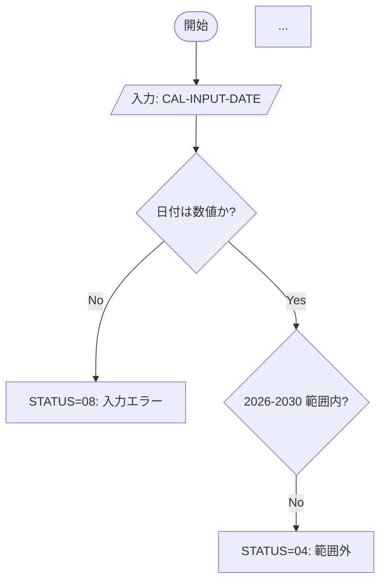
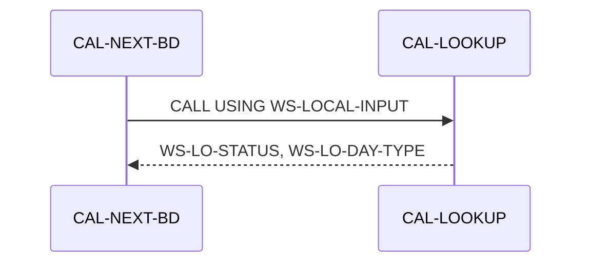
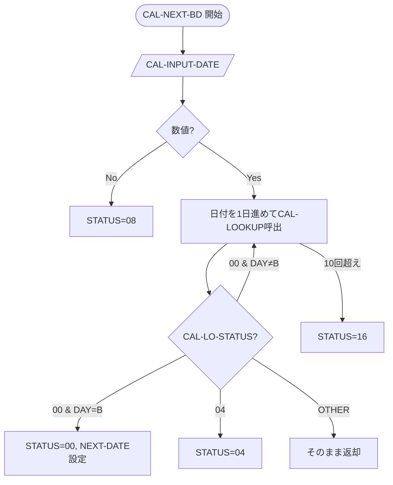
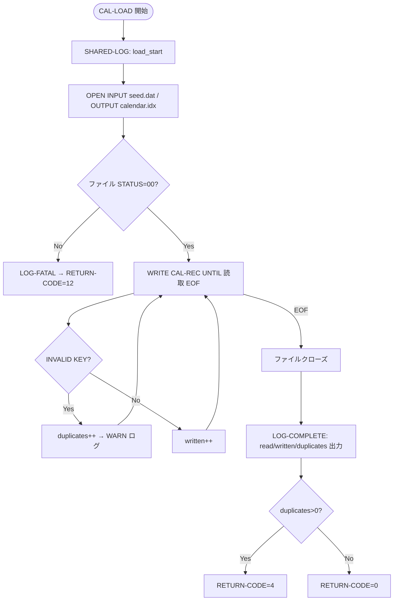

# サブシステム設計書 — Phase 1（サンプル作成）実装計画

> **For agentic workers:** REQUIRED SUB-SKILL: Use superpowers:subagent-driven-development (recommended) or superpowers:executing-plans to implement this plan task-by-task. Steps use checkbox (`- [ ]`) syntax for tracking.

**Goal:** `subsystems/01-calendar/design/` にテンプレ `_template.md` と 4 プログラム分の設計書（cal-next-bd / cal-prev-bd / cal-lookup / cal-load）を日本語で作成し、Phase 2 以降の「完成形」として合意を得るためのサンプルを完成させる。

**Architecture:** テンプレ駆動。`_template.md` が 10 セクション構成を定義し、各プログラム設計書はそれに従う。設計書の全情報はコード・コピーブック・テスト・Makefile から抽出する。

**Tech Stack:** Markdown（GitHub Flavored Markdown + Mermaid 図）、既存コード資材（COBOL `.cob` / copybooks `.cpy` / Makefile / tests）

## Global Constraints

- 言語: **日本語**
- ファイル名: プログラム名を **lower-case + `.md`**（例: `cal-next-bd.md`）
- 配置: `subsystems/01-calendar/design/`
- 1 プログラム = 1 設計書、10 セクション構成（program overview, business requirements, I/O interface, business logic/rules, data access, inter-program calls, error handling & status codes, data flow/sequence diagrams (Mermaid), test coverage, modernization candidates）
- 相互参照: 同サブシステム内は相対パス（`../01-calendar/design/cal-lookup.md` 形式）、サブシステム跨ぎはルート基準（`../../02-branch/design/br-lookup.md`）
- コード参照: `src/cal-next-bd.cob:34-57` 形式で行番号付き
- Mermaid 図: GitHub Markdown の ` ```mermaid ` フェンス
- テンプレは全サブシステム共通で再利用（Phase 3 で各サブシステム design/ にコピー）

---

## ファイル構造

```
subsystems/01-calendar/
├── design/                         ← 新規作成
│   ├── _template.md                ← Task 1 で作成（テンプレ）
│   ├── cal-next-bd.md              ← Task 2 で作成（手本・代表）
│   ├── cal-prev-bd.md              ← Task 3 で作成
│   ├── cal-lookup.md               ← Task 4 で作成
│   └── cal-load.md                 ← Task 5 で作成
├── src/                            ← 既存（変更しない）
├── copy/                           ← 既存（変更しない）
├── tests/                          ← 既存（変更しない）
└── Makefile                        ← 既存（変更しない）
```

---

## Task 1: テンプレ `_template.md` の作成

**Files:**
- Create: `subsystems/01-calendar/design/_template.md`

**Interfaces:**
- Produces: `_template.md` — 後続 4 タスクと Phase 3 が参照する「10 セクション構成 + 凡例」テンプレ

- [ ] **Step 1: テンプレートファイルを作成する**

`subsystems/01-calendar/design/` ディレクトリを作成し、`_template.md` として以下の内容を書く。

```markdown
# プログラム設計書 — {PROGRAM_ID}

> **サブシステム:** {SUBSYSTEM_NAME}
> **プログラム ID:** `{PROGRAM_ID}`
> **種別:** {オンライン / バッチ / LOAD / 配信}
> **更新日:** {YYYY-MM-DD}

---

## 1. プログラム概要

| 項目 | 値 |
|------|-----|
| プログラム ID | `{PROGRAM_ID}` |
| ソースファイル | `{相対パス}` |
| 所属サブシステム | {SUBSYSTEM_NAME} |
| 種別 | {オンライン / バッチ / LOAD / 配信} |
| 概要 | {業務目的を 1-2 文で} |

---

## 2. 業務要件（再構築）

> 本リポジトリはコメント・仕様書が意図的に除去されたレガシー資産であるため、本章はコードから逆推論した業務要件を記す。

### 2.1 ビジネスドメイン
{当該プログラムが属するビジネスドメイン。コードが扱うデータと処理から推定}

### 2.2 業務目的
{このプログラムが「何のために存在するか」}

### 2.3 トリガーと実行形態
{オンライン要求 / バッチ日次 / 初回ロード / など}

---

## 3. 入出力インターフェース

### 3.1 公開インターフェース（`copy/api/*.cpy`）
- **使用コピーブック:** [{api.cpy}]({パス})
- **LINKAGE の USING 引数:**

| フィールド | 型 | I/O | 説明 |
|-----------|-----|-----|------|
| ... | ... | ... | ... |

### 3.2 内部インターフェース（`copy/private/*.cpy`）
- **使用コピーブック:** [{private.cpy}]({パス})
- {内容}

### 3.3 ファイル入出力

| ファイル | モード | OPEN | 説明 |
|---------|--------|------|------|
| {ASSIGN TO パス} | {INPUT/OUTPUT/I-O} | [{OPEN文}:行番号] | {用途} |

### 3.4 DB 入.postgresql テーブル）
{DB アクセスがある場合のみ。ない場合は「該当せず」}

---

## 4. 業務ロジック / ルール

{ PROGRAM-ID } の MAIN-LOGIC から復元した判定ルールと計算式を記す。
各ルールは根拠コードへの行番号をつける（`{プログラム}:L{行}-{行}`）。

### 4.1 入力バリデーション
- **ルール 1:** {内容} — 根拠: `{src}:L{x}-{y}`

### 4.2 主処理ロジック
- **ルール 1:** {内容} — 根拠: `{src}:L{x}-{y}`
- {EVALUATE / PERFORM / 計算式 を翻訳}

### 4.3 状態遷移（該当する場合）
{プログラム内で管理される状態。状態コード体系をテーブルで}

---

## 5. データアクセス

### 5.1 ファイルアクセス

| 操作 | ファイル | ACCESS MODE | 根拠 |
|------|---------|-------------|------|
| READ | {file.idx} | SEQUENTIAL | `{src}:L{x}` |
| WRITE | {file.idx} | RANDOM | `{src}:L{x}` |

### 5.2 物理ファイルレイアウト
- **{calendar.idx}:** `copy/private/fd-calendar.cpy` に基づく。レコード長 {n} バイト。キー: `CAL-REC-DATE`。

### 5.3 インデックス
- `{idx}ファイル` は {キー} による PRIMARY KEY。{WRITE INVALID KEY で重複検出unless該当せず}

---

## 6. プログラム間呼出

| 呼出先 | 種別 | 境界 | CALL 根拠 |
|--------|------|------|----------|
| `CAL-LOOKUP` | 動的 `CALL "..."` | 同一サブシステム | `cal-next-bd.cob:L41` |

- **越境依存:** {他サブシステムを跨る CALL。ない場合は「なし」}

---

## 7. エラー処理・ステータスコード

### 7.1 ステータスコード体系（返却コード）

| コード | 名称（88 レベル） | 意味 | 設定タイミング |
|--------|------------------|------|--------------|
| 00 | CAL-STATUS-OK | 正常 | 処理正常終了時 |
| 04 | CAL-STATUS-NOT-FOUND | レコード未取得 | {src}:L{x} |

### 7.2 ファイル STATUS ハンドリング
- `{WS-IDX-FS}` が `"00"` 以外の場合の挙動: ...

### 7.3 SQLCODE ハンドリング
{該当する場合のみ。ない場合は「該当せず（データベース非使用）}

---

## 8. データフロー・シーケンス

### 8.1 全体フロー（flowchart）



### 8.2 外部呼出シーケンス（該当する場合）



---

## 9. テストカッバレッジ

### 9.1 ユニットテスト（`tests/unit/`）

| テスト | 期待分岐 | 保証するステータス |
|--------|---------|------------------|
| {テスト名} | {入力} → 期待出力 | {保証} |

### 9.2 不足しているカバレッジ
{单元テストでカバーしていない分岐。ない場合は「現状カバー十分」}

---

## 10. モダナイズ候補

### 10.1 Azure 移行時の候補サービス
- { Azure Functions / Container Apps / Service Bus / 等 }

### 10.2 リファクタ観点での懸念点
- {懸念点があれば。なければ「特記事項なし」}

---

## 参考
- ソース: [{src.cob}]({パス})
- 公開 IF: [{api.cpy}]({パス})
- 内部 IF: [{private.cpy}]({パス})
- テスト: [{test.cob}]({パス})
- その他: [Makefile]({パス})
```

- [ ] **Step 2: テンプレの妥当性確認**

テンプレ内の `{PLACEHOLDER}` が 10 セクション全てで埋め可能であることを確認（プレースホルダーはテンプレとして正しい — 各 Tasks 2-5 で実値に置き換える）。

- [ ] **Step 3: ディレクトリ規約確認**

置: `subsystems/01-calendar/design/` — `_template.md` がサブシステム design/ 直下に存在。
全セクション必須（該当しない場合の「該当せず」表示も定義済み）。

- [ ] **Step 4: Task 1 完了をコミット**

```bash
git add subsystems/01-calendar/design/_template.md
git commit -m "docs(01-calendar): add full-analysis design doc template (10 sections)"
```

---

## Task 2: 手本 — `cal-next-bd.md` の作成

**Files:**
- Create: `subsystems/01-calendar/design/cal-next-bd.md`
- Reads:
  - `subsystems/01-calendar/design/_template.md`（Task 1 の成果物）
  - `subsystems/01-calendar/src/cal-next-bd.cob`（解析対象コード）
  - `subsystems/01-calendar/copy/api/cal-api.cpy`（公開 IF 定義）
  - `subsystems/01-calendar/tests/unit/cal-test.cob`（テストカバレッジ情報）
  - `subsystems/01-calendar/Makefile`（ビルド設定・種別判別）

**Interfaces:**
- Consumes: `_template.md`（Task 1）
- Produces: `cal-next-bd.md` — 後続 Tasks 3-5 と Phase 3 が参照する「完成形の手本」

- [ ] **Step 1: 10 セクション全てに実値を埋めた `cal-next-bd.md` を作成する**

テンプレの各 `{PLACEHOLDER}` を以下の解析結果で置き换え、**完全な設計書**を作成する。以下は「各セクションに何を書くか」の実例である。

**§1 プログラム概要:**
- プログラム ID: `CAL-NEXT-BD`
- ソース: `src/cal-next-bd.cob`
- 種別: バッチ（他プログラムから動的 CALL されて呼ばれるモジュール — `cobc -m` で .so 化）
- 概要: 指定された日新tぶ**直近の営業日（Business Day）**を算出する

**§2 業務要件:**
- ビジネスドメイン: カレンダー/営業日計算（銀行の決済日計算で使用と推定）
- 業務目的: 任意の基準日 input に対し、「B」マークされた直近の営業日（土日祝を除く日）を返す。金融機関の約定日・決済日の計算を担う。
- トリガー: 他バッチプログラム（CAL-NEXT-BD は直接のエントリポイントではなく、他 CALL のサブルーチン）

**§3 入出力インターフェース:**
- 公開 IF: `copy/api/cal-api.cpy`。01 CAL-INPUT (CAL-INPUT-DATE PIC 98)) / 01 CAL-OUTPUT (CAL-STATUS PIC 92 +CAL-OUTPUT-DAY-TYPE + CAL-OUTPUT-HOLIDAY-NAME + CAL-OUTPUT-NEXT-DATE)
- PROCEDURE DIVISION USING CAL-INPUT CAL-OUTPUT

**§4 業務ロジック:**
- 入力バリデ: 非数値日付 → status 08 (`cal-next-bd.cob:L26-29`)
- 主ループ: PERFORM UNTIL 最大10回 (L34-57)。毎サイクル 1 日進め、`CALL "CAL-LOOKUP"` で曜日タイプ取得
  - `CAL-LOOKUP` が B を見つけたら出力に設定して status 00 で return
  - CAL-LOOKUP が 04 (range error) → 04 を即時 return
  - 00 でも B 以外 (H/W) → ループ継続
  - 最大10回越え → status 16 (FATAL/上限超過)

**§5 データアクセス:**
- 直接ファイルアクセスなし（CAL-LOOKUP との CALL で委譲）

**§6 プログラム間呼出:**
- `CALL "CAL-LOOKUP"` 同一サブシステム内部 (`cal-next-bd.cob:L41`)
- 使用引数: WS-LOCAL-INPUT (cal-api.cpy と同構造) / WS-LOCAL-OUTPUT

**§7 エラー処理:**
- コード: 00=OK, 04=見つからない/範囲外, 08=入力不正, 16=上限超過
- ※ CAL-LOOKUP の 12 (キャッシュロード失敗) は直接返却せず CONTINUE 無し（CAL-NEXT-BD 側では「OTHER」で返却）

**§8 データフロー:**
- flowchart 例:



**§9 テスト:**
- `tests/unit/cal-test.cob` の `RUN-NEXT-BD` 4 ケースが本プログラムをカバー
  - 正常: 2026-01-09 → 2026-01-13, 2026-05-05 → 2026-05-07, 2026-12-31 → 2027-01-04
  - 境界: 2030-12-31 → status 04 (範囲外)

**§10 モダナイズ:**
- 候補サービス: Azure Functions (Node.js/Python の日付計算関数)。ステートレスでスケールアウト容易。
- 補足: 外部カレンダー テーブルは Azure Cache for Redis や App Configuration でキャッシュして高速化
- 懸念: 閉場日データの外部管理が必要（現在は `calendar.idx` ISAM ファイル）。SQL/NoSQL テーブル化時に外部キー整合性に注意

- [ ] **Step 2: 手本の自動検証**

- [ ] 10 セクション全てに「該当せず」または実記述が存在（TBD がないことを目視確認）
- [ ] Mermaid フェンスが閉じている
- [ ] `cal-lookup.md` への相対リンクパスが正しい（`../01-calendar/design/cal-lookup.md`）

- [ ] **Step 3: Task 2 完了をコミット**

```bash
git add subsystems/01-calendar/design/cal-next-bd.md
git commit -m "docs(01-calendar): add golden sample design doc for CAL-NEXT-BD"
```

---

## Task 3: `cal-prev-bd.md` の作成

**Files:**
- Create: `subsystems/01-calendar/design/cal-prev-bd.md`
- Reads:
  - `subsystems/01-calendar/design/_template.md`
  - `subsystems/01-calendar/design/cal-next-bd.md`（Task 2 の手本。図・文面のスタイル参照）
  - `subsystems/01-calendar/src/cal-prev-bd.cob`
  - `subsystems/01-calendar/copy/api/cal-api.cpy`
  - `subsystems/01-calendar/tests/unit/cal-test.cob`

**Interfaces:**
- Consumes: `cal-next-bd.md`（スタイル手本）
- Produces: `cal-prev-bd.md`

- [ ] **Step 1: テンプレートに沿って `cal-prev-bd.md` を実値で埋める。**
  cal-prev-bd は cal-next-bd と対称（**前営業日**を算出）。主な相違点:
  - 加算ではなく減算 (SUBTRACT 1 FROM WS-DATE-INT) `src/cal-prev-bd.cob:L35`
  - テスト 3 ケース (RUN-PREV-BD)。1 件は 04 返却 (境界下限)
- [ ] **Step 2: §10 モダナイズ候補は cal-next-bd と同系統（营業日計算関数）だが、**前日**取得をどう実装するかの設計差を明記。
- [ ] **Step 3: Task 3 完了をコミット。**

```bash
git add subsystems/01-calendar/design/cal-prev-bd.md
git commit -m "docs(01-calendar): add design doc for CAL-PREV-BD"
```

---

## Task 4: `cal-lookup.md` の作成

**Files:**
- Create: `subsystems/01-calendar/design/cal-lookup.md`
- Reads:
  - `subsystems/01-calendar/design/_template.md`
  - `subsystems/01-calendar/design/cal-next-bd.md`
  - `subsystems/01-calendar/src/cal-lookup.cob`
  - `subsystems/01-calendar/copy/api/cal-api.cpy`
  - `subsystems/01-calendar/copy/private/ws-cal-cache.cpy`（内部インターフェース）
  - `subsystems/01-calendar/copy/private/fd-calendar.cpy`（FD 定義）
  - `subsystems/01-calendar/copy/private/fd-cal-seed.cpy`（CAL-SEED-REC 定義）
  - `shared/copy/shared-log-api.cpy`（ログ IF）
  - `subsystems/01-calendar/tests/unit/cal-test.cob`

**Interfaces:**
- Consumes: `cal-next-bd.md`（スタイル手本）
- Produces: `cal-lookup.md`

- [ ] **Step 1: §3 内部インターフェースとして `ws-cal-cache.cpy` の全フィールドを記載。**
  - WS-CACHE-LOADED / WS-CACHE-COUNT / WS-CAL-ENTRY OCCURS 1826 テーブル
- [ ] **Step 2: §4 主処理ロジック。**
  - 初回起動時に CAL-LOAD 済み.idx を 1826 件までメモリキャッシュ `src/cal-lookup.cob:L71-103`
  - キャッシュヒット → ループ線形検索 (`src/cal-lookup.cob:L56-66`)
  - キャッシュ未取得 (status=12) → ログ出力し GOBACK `src/cal-lookup.cob:L73`
- [ ] **Step 3: §5 データアクセス。**
  - ファイル `data/calendar.idx` (READ SEQUENTIAL, 3件の INVALID KEY 無し)
  - ISAM インデックスレコードレイアウト (fd-calendar.cpy と突き合わせ)
- [ ] **Step 4: §8 データフロー図。**
  - START → 入力チェック → 初回ロード? → LOAD-CACHE → 線形検索 loop → 見つかったら返却 / 無ければ 04
- [ ] **Step 5: §7 ログ出力。**
  - `CALL "SHARED-LOG"` は `shared-log-api.cpy` の WS-LOG-MSG / WS-LOG-RC を使用
  - ログレベル INFO でキャッシュロード完了を記録 (`src/cal-lookup.cob:L97-103`)- [ ] **Step 6: Task 4 完了をコミット。**

```bash
git add subsystems/01-calendar/design/cal-lookup.md
git commit -m "docs(01-calendar): add design doc for CAL-LOOKUP"
```

---

## Task 5: `cal-load.md` の作成

**Files:**
- Create: `subsystems/01-calendar/design/cal-load.md`
- Reads:  - `subsystems/01-calendar/design/_template.md`
  - `subsystems/01-calendar/design/cal-next-bd.md`
  - `subsystems/01-calendar/src/cal-load.cob`
  - `subsystems/01-calendar/copy/private/fd-cal-seed.cpy`
  - `subsystems/01-calendar/copy/private/fd-calendar.cpy`  - `shared/copy/shared-log-api.cpy`  - `db/migration/V1__initial_schema.sql`（PostgreSQL と ISAM の使い分けの参照）

**Interfaces:**
- Consumes: `cal-next-bd.md`（スタイル手本）
- Produces: `cal-load.md`。**CAL-LOAD はビルド後 1 度だけ動くバッチなので、§9 テスト記載は「該当せず（＝本番データロードのみ）」で明示する**

- [ ] **Step 1: §1 種別を「LOAD（初回データロード）」と明示**
  - プログラム ID `CAL-LOAD`。`cobc -x` で実行可能ファイル化（`bin/cal-load`）
- [ ] **Step 2: §3 ファイル入出力**
  - INPUT: `data/calendar-seed.dat` (LINE SEQUENTIAL) fd-cal-seed.cpy と対
  - OUTPUT: `data/calendar.idx` (INDEXED, RANDOM, PRIMARY KEY CAL-REC-DATE) fd-calendar.cpy と対
  - WRITE INVALID KEY 検出でカウント (`src/cal-load.cob:L84-95`)
- [ ] **Step 3: §4 と §5 を跨ぐデータフロー図。**



- [ ] **Step 4: §7 エラーコードは RETURN-CODE（CAL-STATUS ではない）なので明記。**
  - RETURN-CODE 0 = 標準終了, 4 = 重複あり, 12 = ファイル OPEN 失敗
  - 重複は警告でありエラーではない（SET WS-DUP-COUNT、ログ WARN 出力）
- [ ] **Step 5: §9 テストは「該当せず（本番データロード専用バッチ。make load-idx で手動実行）」。**
- [ ] **Step 6: §10 モダナイズ候補。**
  - Azure SQL / PostgreSQL へのデータ移行時にスクリプト化（1度きり）
  - Azure Migrate や pgloader で代替。散装ハンスティッカは廃止し、テーブル外部キーでユニーク制約
- [ ] **Step 7: Task 5 完了をコミット。**

```bash
git add subsystems/01-calendar/design/cal-load.md
git commit -m "docs(01-calendar): add design doc for CAL-LOAD"
```

---

## Task 6: Phase 1 全体検証と仕上げ

**Files:**
- Verify: `subsystems/01-calendar/design/_template.md`
- Verify: `subsystems/01-calendar/design/cal-next-bd.md`
- Verify: `subsystems/01-calendar/design/cal-prev-bd.md`
- Verify: `subsystems/01-calendar/design/cal-lookup.md`
- Verify: `subsystems/01-calendar/design/cal-load.md`

- [ ] **Step 1: 5 ファイルが存在することを確認。**

```bash
ls -la subsystems/01-calendar/design/
# 期待: _template.md, cal-next-bd.md, cal-prev-bd.md, cal-lookup.md, cal-load.md
```

- [ ] **Step 2: テンプレ準拠確認 — 各設計書とも 10 セクション（`## 1.` 〜 `## 10.`）が存在。**

```bash
for f in subsystems/01-calendar/design/cal-*.md; do
  echo "=== $f ==="
  grep -c "^## [0-9]" "$f"
done
# 各ファイルとも 10 になるはず
```

- [ ] **Step 3: 相互リンク解決確認 — cal-next-bd.md から cal-lookup.md へのリンク切れがない。**

```bash
grep -n "cal-lookup.md" subsystems/01-calendar/design/cal-next-bd.md
# 期待: 相対パス ../01-calendar/design/cal-lookup.md または cal-lookup.md 形式でリンク存在
```

- [ ] **Step 4: 用語統一確認 — 同一ドキュメント内で「営業日」表記が揺れていない。**

```bash
grep -rn "営業日\|営業日\|㆕業日" subsystems/01-calendar/design/
# 揺れがあれば修正
```

- [ ] **Step 5: Mermaid 図がフェンス内であることを確認。**

```bash
grep -c '```mermaid' subsystems/01-calendar/design/cal-*.md
# 各 1 個以上。フェンス閉じ ``` もペアで存在
```

- [ ] **Step 6: ユーザーレビュー提出を記録。**

Phase 1 完了。生成物:
- `_template.md`（共通テンプレ）
- `cal-next-bd.md`（手本・代表）
- `cal-prev-bd.md`
- `cal-lookup.md`
- `cal-load.md`

---

## 実行スコープの明示

**本 plan は Phase 1 のみ。**
- Phase 2（ユーザーレビュー → テンプレ確定）はレビュー工程。
- Phase 3（並列 22 エージェントで残り 78 プログラム生成）は **別 plan** として書く。
- Phase 4（一貫性レビュー）と Phase 5（コミット切り盛り）も **別 plan** または Phase 3 plan 内で扱う。

テンプレ＋手本が確定したら、Phase 3 plan では _template.md と cal-next-bd.md を「完成形」として全エージェントに参照させる。

    OPEN --> FSOK{ファイル STATUS=00?}    FSOK -->|No| F