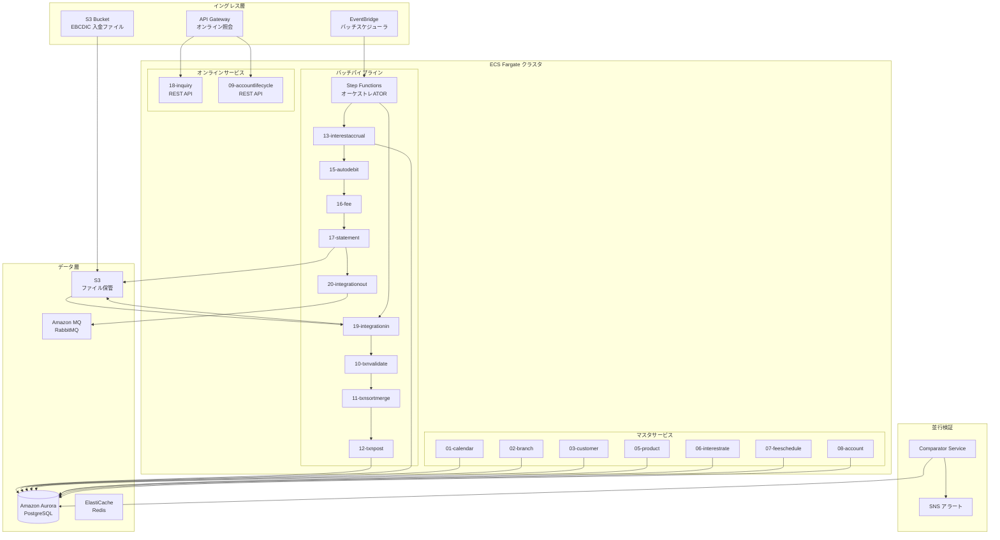
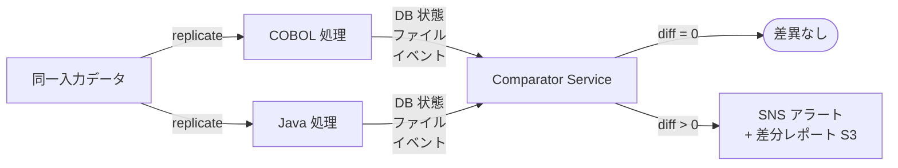
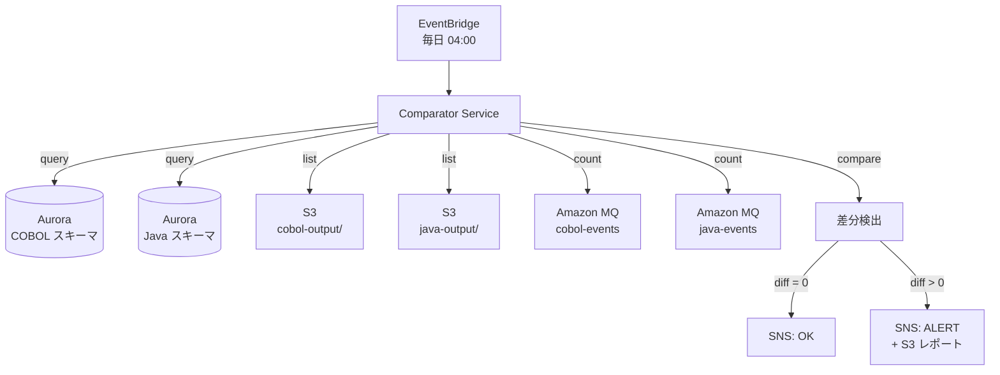

# COBOL → Java + AWS モダナイズ設計仕様

> **Created:** 2026-07-06
> **Status:** Approved
> **Scope:** 82 COBOL プログラム / 22 サブシステムを Java (Spring Boot + Spring Batch) に移植し、AWS (ECS Fargate + Aurora + ElastiCache + Amazon MQ) 上で稼働させる
> **Strategy:** ストレートリライト (1:1 移植) + 並行稼働比較による等価性検証

---

## 1. 背景と目的

### 1.1 背景
本リポジトリは GnuCOBOL で実装された銀行コアバッチシステムである。22 サブシステム / 82 プログラムで構成され、日次/月次バッチパイプラインにより取引処理・金利計算・自動引き落とし・手数料請求・帳票生成を行っている。

COBOL 人材の確保が年々困難になっており、クラウドネイティブな運用基盤への移行が求められている。

### 1.2 目的
- **全機能を Java に移植** し、COBOL 依存を解消する
- **AWS 上で稼働** させ、スケーラビリティ・可用性・運用効率を向上する
- **機能等価性を保証** し、ストレートリライトで仕様変更を最小化する
- **並行稼働比較** で差異を自動検出し、金融システムに必須な信頼性を確保する

### 1.3 設計書との関係
本プロジェクトではすでに以下の設計書が整備されており、これらを移植仕様の起点とする:
- 全 82 プログラムの基本設計書 (`subsystems/*/design/`)
- システム全体設計書 (`docs/design/00-system-overview.md`)
- ユースケース設計書 (`docs/design/00-system-usecases.md`)
- データ辞書 (`docs/design/02-data-dictionary.md`)
- 状態遷移設計書 (`docs/design/01-state-transitions.md`)

---

## 2. 全体アーキテクチャ

### 2.1 AWS 構成概要



### 2.2 マッピング方針

| COBOL 概念 | Java 対応 | 備考 |
|-----------|----------|------|
| `PROGRAM-ID` | Spring Boot `@Service` クラス | 1:1 対応 |
| `COPY "api.cpy"` | Java Record / DTO | copybook → Java クラス自動生成 |
| `CALL "X" USING` | Spring Bean メソッド呼び出し | DI コンテナでワイヤリング |
| `FD ... INDEXED` | MyBatis Mapper + テーブル | ISAM → Aurora テーブル |
| `READ/WRITE/REWRITE` | MyBatis `select/insert/update` | マスタサービス経由 (SQL 明示制御) |
| `PERFORM UNTIL` | Spring Batch `ChunkOrientedTasklet` | ループ処理 |
| `EVALUATE` | Java `switch` 式 | パターンマッチング |
| `EXEC SQL` | Spring Data JPA | 既存 SQL をそのまま流用 |
| `RETURN-CODE` | ジョブ終了コード (ExitStatus) | Spring Batch の ExitCode に |
| `GOBACK` | `return` / 例外スロー | エラーハンドリングは Spring Batch に委譲 |
| `22-OPS` パイプライン | Step Functions ステートマシン | 直列ステップ制御 |
| systemd タイマー | EventBridge ルール | cron 式でスケジュール |

### 2.3 ISAM → Aurora テーブル変換

| ISAM ファイル | Aurora テーブル | 主キー | 代替キー |
|-------------|----------------|-------|---------|
| `calendar.idx` | `calendar` | `cal_date` | `day_type` |
| `branch.idx` | `branches` | `branch_code` | `region` |
| `customer.idx` | `customers` | `cust_id` | `cust_name_kana`, `phone` |
| `product.idx` | `products` | `product_code` | — |
| `interestrate.idx` | `interest_rates` | `(product_code, effective_date)` | — |
| `feeschedule.idx` | `fee_schedules` | `(category, tier, effective_date)` | — |
| `account.idx` | `accounts` | `acct_number` | `cust_id`, `branch_code` |

---

## 3. 技術スタック

| 層 | 技術 | バージョン | 用途 |
|----|------|:--------:|------|
| **言語** | Java | 21 (LTS) | 最新 LTS、record/switch 式活用 |
| **フレームワーク** | Spring Boot | 3.3.x | アプリ基盤 |
| **バッチ** | Spring Batch | 5.x | バッチ処理フレームワーク |
| **ORM** | MyBatis | 3.x | データアクセス (SQL ファースト、COBOL のファイル操作を SQL で明示的に制御) |
| **マイグレーション** | Flyway | 10.x | DB スキーマ管理 |
| **ビルド** | Gradle | 8.x | ビルドツール |
| **コンテナ** | Docker | 25+ | コンテナ化 |
| **AWS コンテナ** | ECS Fargate | — | サーバーレスコンテナ |
| **AWS バッチ制御** | Step Functions | — | パイプラインオーケストレーション |
| **AWS DB** | Aurora PostgreSQL | 16.x | 本番 DB |
| **AWS キャッシュ** | ElastiCache Redis | 7.x | マスタキャッシュ |
| **AWS MQ** | Amazon MQ (RabbitMQ) | 3.13 | イベント配信 |
| **AWS ファイル** | S3 | — | ファイル保管 |
| **AWS スケジューラ** | EventBridge | — | バッチ起動トリガー |
| **CI/CD** | GitHub Actions | — | ビルド・テスト・デプロイ |
| **IaC** | Terraform | 1.x | インフラ定義 (HCL、AWS Provider) |
| **テスト** | JUnit 5 + Testcontainers | — | ユニット/統合テスト |
| **監視** | CloudWatch + SNS | — | メトリクス/アラート |

---

## 4. 移行フェーズ

### 4.1 Phase 1: 基盤構築 (Month 1-2)

**目的:** Java プロジェクト基盤、DB 移行、CI/CD パイプラインを構築する。

| タスク | 成果物 | 検証基準 |
|--------|-------|---------|
| Spring Boot テンプレート作成 | `java-practice-bank/` ルートプロジェクト | ビルド・テストが通る |
| Gradle マルチモジュール構成 | 22 サブモジュール + 1 バッチモジュール/サブシステム | `gradle build` 成功 |
| Flyway マイグレーション移植 | `db/migration/` → Java 版 | Aurora に適用後、スキーマ一致 |
| ISAM → Aurora 変換ジョブ | `isam-to-rds` Spring Batch ジョブ | 全 7 テーブルにデータ移行完了 |
| CI/CD パイプライン | GitHub Actions ワークフロー | PR で自動テスト、main で ECR プッシュ |
| Terraform インフラ定義 | `infra/` ディレクトリ | `terraform apply` で AWS 環境構築 |
| マスタサービス (7 本) | MyBatis Mapper インターフェース | API でマスタ参照可能 |

**検証基準:**
- Aurora テーブルに全マスタデータが移行され、ISAM の内容と完全一致
- CI/CD パイプラインが green
- ECS Fargate でマスタサービスが稼働

### 4.2 Phase 2: プログラム移植 + 並行稼働 (Month 3-8)

**目的:** 82 プログラムを Java に移植し、COBOL と並行稼働して等価性を検証する。

| サブシステム | プログラム数 | 優先度 | 移植順序 |
|------------|:----------:|:-----:|:-------:|
| 19-integrationin | 1 | P1 | 1 |
| 10-txnvalidate | 3 | P1 | 2 |
| 11-txnsortmerge | 3 | P1 | 3 |
| 12-txnpost | 3 | P1 | 4 |
| 13-interestaccrual | 2 | P1 | 5 |
| 15-autodebit | 2 | P1 | 6 |
| 16-fee | 2 | P1 | 7 |
| 17-statement | 1 | P1 | 8 |
| 20-integrationout | 2 | P1 | 9 |
| 14-interestpost | 2 | P2 | 10 |
| 09-accountlifecycle | 4 | P2 | 11 |
| 18-inquiry | 1 | P2 | 12 |
| 01-calendar | 4 | P3 | 13 |
| 02-branch | 4 | P3 | 14 |
| 03-customer | 6 | P3 | 15 |
| 04-customersearch | 3 | P3 | 16 |
| 05-product | 2 | P3 | 17 |
| 06-interestrate | 2 | P3 | 18 |
| 07-feeschedule | 2 | P3 | 19 |
| 08-account | 5 | P3 | 20 |
| 21-audit | 3 | P3 | 21 |
| 22-operations | 13 | P3 | 22 |

**並行検証の仕組み:**



**Comparator Service 検証項目:**
- Aurora テーブル行数・内容 (transactions, postings, balances, interest_accruals)
- S3 出力ファイル (decoded, statement, reject)
- Amazon MQ イベント (txn.posted, interest.posted, autodebit.failed)
- audit_log 件数

**検証基準:**
- COBOL vs Java 出力差異 0 件 (30 日間連続)
- 日次バッチが 4 時間以内に完了
- イベント欠損率 < 0.01%

### 4.3 Phase 3: カットオーバー + クリーンアップ (Month 9-10)

| タスク | 成果物 | 検証基準 |
|--------|-------|---------|
| COBOL バッチ停止 | systemd タイマー無効化 | COBOL バッチが起動しない |
| AWS 側で全バッチ稼働 | EventBridge → Step Functions | 全バッチ正常終了 |
| 30 日間モニタリング | CloudWatch ダッシュボード | 成功率 ≥ 99.5% |
| COBOL コード削除 | Git ブランチ削除 | リポジトリから COBOL 除去 |
| ISAM ファイル削除 | `data/*.idx` 削除 | ディスク解放 |
| ドキュメント更新 | 運用マニュアル AWS 版 | 運用手順が AWS 対応 |

---

## 5. 成功基準

| # | 基準 | 測定方法 | 合格ライン |
|---|------|---------|:--------:|
| 1 | **機能等価性** | Comparator Service 自動比較 | 差異 0 件 (30 日間連続) |
| 2 | **バッチ性能** | Step Functions 実行時間 | 日次 ≤ 4h / 月次 ≤ 2h |
| 3 | **可用性** | CloudWatch メトリクス | バッチ成功率 ≥ 99.5% (30 日間) |
| 4 | **データ整合性** | DB 制約 + アプリチェック | 不整合 0 件 |
| 5 | **イベント配信** | MQ 欠損カウント | 欠損率 < 0.01% |
| 6 | **復旧時間** | RTO 測定 | RTO ≤ 4h / RPO ≤ 1h |

---

## 6. リスクと対策

| # | リスク | 影響 | 確率 | 対策 |
|---|--------|------|:----:|------|
| 1 | COBOL 暗黙仕様の見落とし | 出力差異 | 中 | Comparator Service 自動検出 + 30 日間並行稼働 |
| 2 | ISAM → テーブル性能劣化 | バッチ遅延 | 中 | ElastiCache マスタキャッシュ + Aurora スケールアップ |
| 3 | AWS コスト超過 | 予算超過 | 低 | Fargate Spot + Reserved Instances + 予算アラート |
| 4 | 移植工数超過 | スケジュール遅延 | 中 | 設計書が揃っているので見積もり精度高い; バッファ 20% |
| 5 | 並行稼働の二重運用 | 運用負荷 | 高 | Phase 2 期間を 6 ヶ月に上限化; 自動化で運用負荷最小化 |
| 6 | 外部ファイル (EBCDIC) 仕様変更 | 取引入力失敗 | 低 | 外部 I/F は変更しない; S3 にファイル置くだけ |
| 7 | ライブラリ互換性 (OCESQL → JDBC) | SQL 挙動差異 | 中 | 統合テストで全 SQL 網羅 |

---

## 7. スコープ外

以下の項目は本プロジェクトのスコープ外とする (別プロジェクトで対応):

- ❌ UI/画面の再構築 (18-INQ は API のみ提供)
- ❌ データモデル再設計 (ISAM → リレーションの最小変換のみ)
- ❌ 機能追加・仕様変更 (ストレートリライト厳守)
- ❌ レガシーシステム (EBCDIC 送金ファイル発信元) の変更
- ❌ 他システム連携 I/F の変更
- ❌ レポート/帳票のフォーマット変更
- ❌ 監査証拠の保存期間変更

---

## 8. ディレクトリ構成 (Java 版)

```
java-practice-bank/
├── build.gradle.kts              # ルートビルド
├── settings.gradle.kts           # 22 サブモジュール宣言
├── gradle.properties             # バージョン管理
│
├── common/                       # 共通ライブラリ
│   ├── common-domain/            # 共通ドメイン (Status, Money, etc.)
│   ├── common-batch/             # Spring Batch 共通設定
│   ├── common-mybatis/           # MyBatis 共通設定 (SqlSessionFactory, TypeHandler)
│   ├── common-aws/               # AWS SDK ラッパー
│   └── common-test/              # テストユーティリティ
│
├── masters/                      # マスタサービス (7 本)
│   ├── calendar-service/
│   ├── branch-service/
│   ├── customer-service/
│   ├── product-service/
│   ├── interestrate-service/
│   ├── feeschedule-service/
│   └── account-service/
│
├── batch/                        # バッチパイプライン (15 サブシステム)
│   ├── integrationin-job/        # 19
│   ├── txnvalidate-job/          # 10
│   ├── txnsortmerge-job/         # 11
│   ├── txnpost-job/              # 12
│   ├── interestaccrual-job/      # 13
│   ├── interestpost-job/         # 14
│   ├── autodebit-job/            # 15
│   ├── fee-job/                  # 16
│   ├── statement-job/            # 17
│   ├── inquiry-job/              # 18
│   ├── accountlifecycle-job/     # 09
│   ├── integrationout-job/       # 20
│   ├── audit-job/                # 21
│   └── operations-job/           # 22 (Step Functions定義)
│
├── online/                       # オンラインサービス
│   ├── inquiry-api/              # 18
│   └── accountlifecycle-api/     # 09
│
├── verify/                       # 並行検証
│   └── comparator-service/       # COBOL vs Java 比較
│
├── infra/                        # Terraform
│   ├── modules/
│   │   ├── network/              # VPC, Subnet, SG
│   │   ├── database/             # Aurora, ElastiCache, Amazon MQ
│   │   ├── ecs/                  # ECS Cluster, Fargate Services, ALB
│   │   ├── step-functions/       # Step Functions, EventBridge
│   │   ├── storage/              # S3 Buckets
│   │   └── monitoring/           # CloudWatch, SNS
│   ├── environments/
│   │   ├── dev/
│   │   ├── staging/
│   │   └── prod/
│   └── backend.tf                # Terraform Cloud / S3 backend
│
└── docs/
    ├── design/                   # 既存設計書 (参照)
    └── runbooks/                 # 運用ランブック (AWS 版)
```

---

## 9. 並行検証の詳細設計

### 9.1 Comparator Service アーキテクチャ



### 9.2 スキーマ分離方針

並行稼働期間中、COBOL と Java のデータを論理分離するため **スキーマ分割** を採用する:

| スキーマ | 用途 | 書き込み元 |
|---------|------|----------|
| `cobol` | COBOL 処理結果 | COBOL プログラム (既存) |
| `java` | Java 処理結果 | Spring Batch ジョブ (新規) |
| `shared` | マスタデータ (読み取り専用) | Phase 1 で移行後は変更不可 |

同一 Aurora クラスター内に 3 スキーマを配置し、Comparator Service が跨スキーマで集計比較する。
カットオーバー後は `cobol` スキーマを DROP する。

### 9.3 検証クエリ例

```sql
-- 1. 取引件数比較
SELECT 'COBOL' AS source, COUNT(*) AS cnt FROM cobol.transactions WHERE business_date = :d
UNION ALL
SELECT 'JAVA', COUNT(*) FROM java.transactions WHERE business_date = :d;

-- 2. 残高合計比較
SELECT 'COBOL' AS source, SUM(balance_jpy) AS total FROM cobol.balances
UNION ALL
SELECT 'JAVA', SUM(balance_jpy) FROM java.balances;

-- 3. イベント発行数比較
SELECT 'COBOL' AS source, COUNT(*) AS cnt FROM cobol.audit_log
WHERE action = 'txn.posted' AND business_date = :d
UNION ALL
SELECT 'JAVA', COUNT(*) FROM java.audit_log
WHERE action = 'txn.posted' AND business_date = :d;
```

### 9.4 検証レポート仕様

Comparator Service は日次で差分レポートを S3 に出力する:

```
s3://practice-bank-verify/diffs/{business_date}/
├── summary.json           # 検証サマリー (差異件数、合格/不合格)
├── transactions.diff      # 取引データ差分 (行番号 + 差分内容)
├── balances.diff          # 残高データ差分
├── events.diff            # イベント発行差分
└── files.diff             # 出力ファイル差分 (S3 メタデータ比較)
```

`summary.json`:
```json
{
  "business_date": "2026-07-06",
  "overall_result": "PASS",
  "checks": [
    {"name": "transactions_count", "cobol": 12345, "java": 12345, "diff": 0, "result": "PASS"},
    {"name": "balances_total_jpy", "cobol": 9999999999, "java": 9999999999, "diff": 0, "result": "PASS"},
    {"name": "events_posted", "cobol": 12345, "java": 12345, "diff": 0, "result": "PASS"}
  ],
  "generated_at": "2026-07-06T04:30:00Z"
}
```

---

## 10. インフラストラクチャ (Terraform)

### 10.1 モジュール構成

| モジュール | リソース | 用途 |
|-----------|---------|------|
| `network` | VPC, Subnet, SG, VPC Endpoints | ネットワーク基盤 |
| `database` | Aurora PostgreSQL, ElastiCache, Amazon MQ | データ層 |
| `storage` | S3 Bucket (3つ: input, output, archive) | ファイル保管 |
| `ecs` | ECS Cluster, Fargate Services, ALB | コンテナ基盤 |
| `batch` | Step Functions, EventBridge Rules | バッチ制御 |
| `monitoring` | CloudWatch Dashboards, Alarms, SNS | 監視 |
| `iam` | IAM Roles, Policies | アクセス制御 |

### 10.2 環境構成

| 環境 | AWS アカウント | 用途 | 稼働時間 |
|------|-------------|------|---------|
| `dev` | 開発用 | 開発者検証 | 営業時間のみ |
| `staging` | ステージング | 並行検働 | 24h (検証期間中) |
| `prod` | 本番 | 本番運用 | 24h/7d |

---

## 11. テスト戦略

| テスト種別 | ツール | 網羅基準 | タイミング |
|-----------|-------|---------|----------|
| **ユニット** | JUnit 5 + Mockito | ラインカバレッジ ≥ 80% | PR 時 |
| **統合** | Testcontainers (PG + Redis) | 全 MyBatis Mapper + バッチジョブ | PR 時 |
| **E2E** | Step Functions Local + テストデータ | 日次パイプライン全ステップ | main マージ時 |
| **並行比較** | Comparator Service | 全バッチ出力 | Phase 2 全日 |
| **性能** | JMeter / k6 | バッチ 4h 以内 | Phase 2 完了時 |
| **チャオス** | AWS Fault Injection Simulator | AZ 停止 / DB フェイルオーバー | Phase 3 直前 |

---

## 12. 参考

- 既存 COBOL 設計書: `subsystems/*/design/`
- システム全体設計書: `docs/design/00-system-overview.md`
- ユースケース設計書: `docs/design/00-system-usecases.md`
- データ辞書: `docs/design/02-data-dictionary.md`
- 状態遷移設計書: `docs/design/01-state-transitions.md`
- 障害影響マップ: `docs/design/03-failure-impact-map.md`
- 運用マニュアル: `docs/design/05-operations-manual.md`
