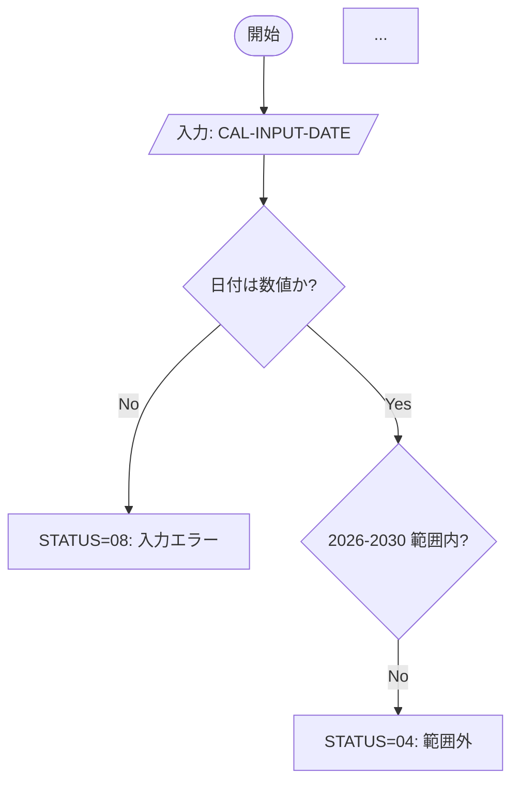
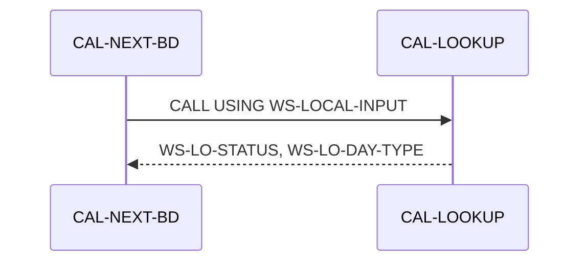

# プログラム設計書 — {PROGRAM_ID}

> **サブシステム:** {SUBSYSTEM_NAME}
> **プログラム ID:** `{PROGRAM_ID}`
> **種別:** {オンライン / バッチ / LOAD / 配信}
> **更新日:** {YYYY-MM-DD}

---

## 凡例

本テンプレートは全 22 サブシステムのプログラム設計書に共通の 10 セクション構成を定義する。
各プレースホルダー `{...}` は対象プログラムごとに実値で置き換える。

- **プレースホルダー:** `{PROGRAM_ID}` などの波括弧記号はテンプレートマーカー。実値に置き換えること。
- **コード参照:** `src/xxx.cob:34-57` 形式（ファイルの相対パス + 行番号範囲）。
- **セクション必須:** 全 10 セクションは必須。該当しない場合は `該当せず` と記す。
- **Mermaid 図:** GitHub Flavored Markdown の ```mermaid フェンスで記述。
- **プログラム間リンク:**
  - 同一サブシステム: `../01-calendar/design/cal-lookup.md`
  - 越境（他サブシステム）: `../../02-branch/design/br-lookup.md`
- **種別値:** `オンライン` / `バッチ` / `LOAD` / `配信` のいずれか。

---

## 1. プログラム概要

| 項目 | 値 |
|------|-----|
| プログラム ID | `{PROGRAM_ID}` |
| ソースファイル | `{相対パス}` |
| 所属サブシステム | {SUBSYSTEM_NAME} |
| 種別 | {オンライン / バッチ / LOAD / 配信} |
| 概要 | {業務目的を 1-2 文で} |

---

## 2. 業務要件（再構築）

> 本リポジトリはコメント・仕様書が意図的に除去されたレガシー資産であるため、本章はコードから逆推論した業務要件を記す。

### 2.1 ビジネスドメイン
{当該プログラムが属するビジネスドメイン。コードが扱うデータと処理から推定}

### 2.2 業務目的
{このプログラムが「何のために存在するか」}

### 2.3 トリガーと実行形態
{オンライン要求 / バッチ日次 / 初回ロード / など}

---

## 3. 入出力インターフェース

### 3.1 公開インターフェース（`copy/api/*.cpy`）
- **使用コピーブック:** [{api.cpy}]({パス})
- **LINKAGE の USING 引数:**

| フィールド | 型 | I/O | 説明 |
|-----------|-----|-----|------|
| ... | ... | ... | ... |

### 3.2 内部インターフェース（`copy/private/*.cpy`）
- **使用コピーブック:** [{private.cpy}]({パス})
- {内容}

### 3.3 ファイル入出力

| ファイル | モード | OPEN | 説明 |
|---------|--------|------|------|
| {ASSIGN TO パス} | {INPUT/OUTPUT/I-O} | [{OPEN文}:行番号] | {用途} |

### 3.4 DB 入出力（PostgreSQL テーブル）
{DB アクセスがある場合のみ。ない場合は「該当せず」}

---

## 4. 業務ロジック / ルール

{ PROGRAM-ID } の MAIN-LOGIC から復元した判定ルールと計算式を記す。
各ルールは根拠コードへの行番号をつける（`{プログラム}:L{行}-{行}`）。

### 4.1 入力バリデーション
- **ルール 1:** {内容} — 根拠: `{src}:L{x}-{y}`

### 4.2 主処理ロジック
- **ルール 1:** {内容} — 根拠: `{src}:L{x}-{y}`
- {EVALUATE / PERFORM / 計算式 を翻訳}

### 4.3 状態遷移（該当する場合）
{プログラム内で管理される状態。状態コード体系をテーブルで}

---

## 5. データアクセス

### 5.1 ファイルアクセス

| 操作 | ファイル | ACCESS MODE | 根拠 |
|------|---------|-------------|------|
| READ | {file.idx} | SEQUENTIAL | `{src}:L{x}` |
| WRITE | {file.idx} | RANDOM | `{src}:L{x}` |

### 5.2 物理ファイルレイアウト
- **{calendar.idx}:** `copy/private/fd-calendar.cpy` に基づく。レコード長 {n} バイト。キー: `CAL-REC-DATE`。

### 5.3 インデックス
- `{idx}ファイル` は {キー} による PRIMARY KEY。{WRITE INVALID KEY で重複検出 unless 該当せず}

---

## 6. プログラム間呼出

| 呼出先 | 種別 | 境界 | CALL 根拠 |
|--------|------|------|----------|
| `CAL-LOOKUP` | 動的 `CALL "..."` | 同一サブシステム | `cal-next-bd.cob:L41` |

- **越境依存:** {他サブシステムを跨る CALL。ない場合は「なし」}

---

## 7. エラー処理・ステータスコード

### 7.1 ステータスコード体系（返却コード）

| コード | 名称（88 レベル） | 意味 | 設定タイミング |
|--------|------------------|------|--------------|
| 00 | CAL-STATUS-OK | 正常 | 処理正常終了時 |
| 04 | CAL-STATUS-NOT-FOUND | レコード未取得 | {src}:L{x} |

### 7.2 ファイル STATUS ハンドリング
- `{WS-IDX-FS}` が `"00"` 以外の場合の挙動: ...

### 7.3 SQLCODE ハンドリング
{該当する場合のみ。ない場合は「該当せず（データベース非使用）」}

---

## 8. データフロー・シーケンス

### 8.1 全体フロー（flowchart）



### 8.2 外部呼出シーケンス（該当する場合）



---

## 9. テストカバレッジ

### 9.1 ユニットテスト（`tests/unit/`）

| テスト | 期待分岐 | 保証するステータス |
|--------|---------|------------------|
| {テスト名} | {入力} → 期待出力 | {保証} |

### 9.2 不足しているカバレッジ
{単体テストでカバーしていない分岐。ない場合は「現状カバー十分」}

---

## 10. モダナイズ候補

### 10.1 Azure 移行時の候補サービス
- { Azure Functions / Container Apps / Service Bus / 等 }

### 10.2 リファクタ観点での懸念点
- {懸念点があれば。なければ「特記事項なし」}

---

## 参考
- ソース: [{src.cob}]({パス})
- 公開 IF: [{api.cpy}]({パス})
- 内部 IF: [{private.cpy}]({パス})
- テスト: [{test.cob}]({パス})
- その他: [Makefile]({パス})
