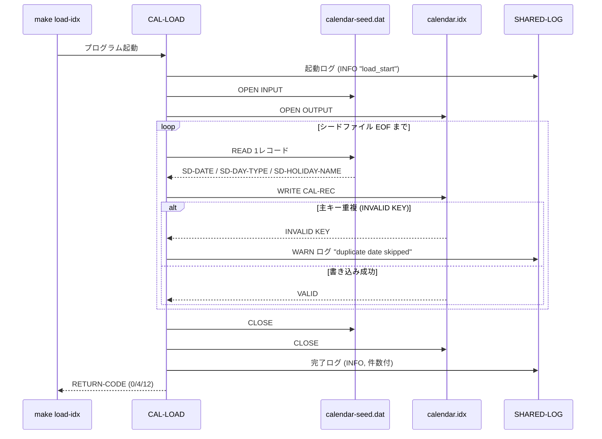
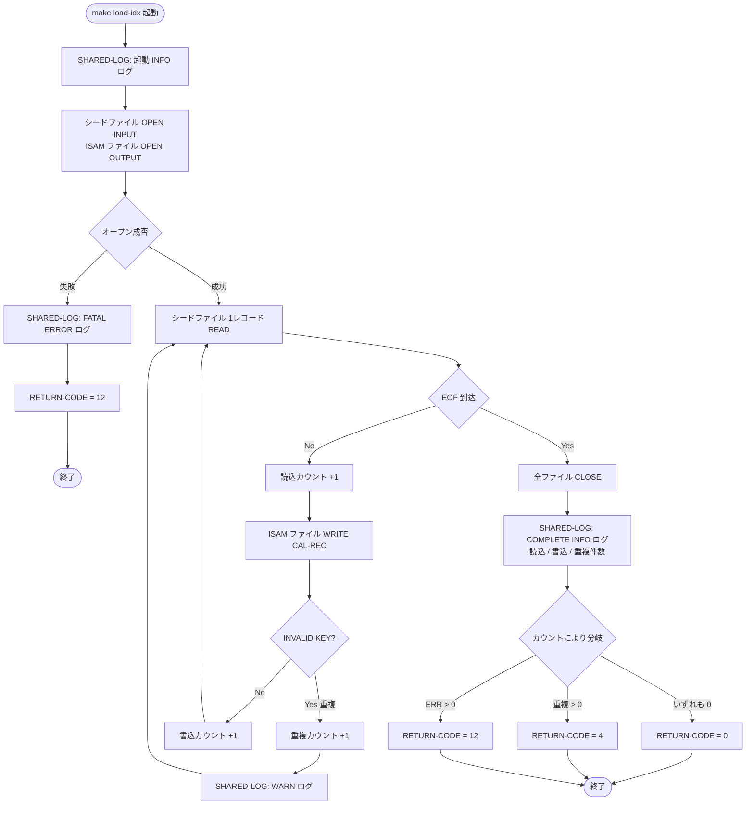

# 基本設計書 — CAL-LOAD

> **サブシステム:** 01-calendar
> **プログラム ID:** `CAL-LOAD`
> **種別:** LOAD（初回データロード）
> **更新日:** 2026-07-06

---

## 1. プログラム概要

| 項目 | 値 |
|------|-----|
| プログラム ID | `CAL-LOAD` |
| ソースファイル | `src/cal-load.cob` |
| 所属サブシステム | 01-calendar |
| 種別 | LOAD（初回データロード） |
| 概要 | カレンダーの種別データを CSV 形式のシードファイルから読み込み、CAL-LOOKUP が検索対象とする ISAM インデックスファイルを生成する一回限定のデータロード処理。`make load-idx` により実行され、オンライン検索モジュール使用前に ISAM ファイルを初期化する責務を持つ。 |

---

## 2. 機能概要

### 2.1 このプログラムが「すること」
シードファイル（`data/calendar-seed.dat`：LINE SEQUENTIAL）から 1 レコードずつ日付・曜日種別・休日名を読み取り、ISAM インデックスファイル（`data/calendar.idx`：INDEXED, RANDOM, 主キー＝日付）へ書き込む。レコード書き込み時に主キー重複を検知した場合は当該レコードをスキップし、WARN ログを出力する。処理終了時に読み書き件数と重複件数を集計し、正常終了コードを呼び出し元に返す。

### 2.2 呼出元と呼出し先
- **呼出元:** `make load-idx` ターゲット。同ターゲットは `bin/cal-load` を実行する。
- **呼出先:** `CALL "SHARED-LOG"`（サブシステム横断の共有ログユーティリティ）。処理開始・完了・致命的エラーの 3 点を INFO / WARN / ERROR レベルで記録する。

### 2.3 シーケンス図

---

## 3. 処理フロー

### 3.1 全体フロー（flowchart）

---

## 4. 入出力仕様

### 4.1 入力

| 項目 | 型 | 必須 | 説明 |
|------|-----|:----:|------|
| SD-DATE | PIC 9(8) | ✅ | 日付（YYYYMMDD）。ISAM ファイルの主キーに対応する |
| SD-DAY-TYPE | PIC X(1) | ✅ | 曜日種別（平日 / 休日等の識別子） |
| SD-HOLIDAY-NAME | PIC X(40) | | 休日名称。空欄あり |
| SD-FILLER | PIC X(11) | | 予備領域 |

ファイル仕様：`data/calendar-seed.dat`（LINE SEQUENTIAL、CSV 形式）。

### 4.2 出力

| 項目 | 型 | 説明 |
|------|-----|------|
| CAL-REC-DATE | PIC 9(8) | 日付（ISAM 主キー） |
| CAL-REC-DAY-TYPE | PIC X(1) | 曜日種別 |
| CAL-REC-HOLIDAY-NAME | PIC X(40) | 休日名称 |
| CAL-REC-FILLER | PIC X(11) | 予備領域 |

ファイル仕様：`data/calendar.idx`（INDEXED, RANDOM, 主キー = CAL-REC-DATE）。
生成後は `make test-unit` の前提となる検索対象ファイルでもある。

### 4.3 返却コード（概要）

補足：CAL-LOOKUP / CAL-NEXT-BD / CAL-PREV-BD のモジュールが公開する `CAL-STATUS` とは別に、本バッチプログラムはプロセス終了を示す **RETURN-CODE** で結果を伝達する。

| コード | 意味 |
|--------|------|
| 0 | 正常（レコードEOF到達, 読込=書込, 重複0件） |
| 4 | 正常（一部重複検知, 重複レコードはスキップ, 非重複レコードは書込済） |
| 12 | 異常（ファイルオープン失敗 または 入出力エラーあり） |

---

## 5. 正常系テストケース

※ CAL-LOAD は一回限定のデータローダであり、`tests/unit/` 下の自動単体テストの対象外である。ここでは「`make load-idx` 実行」自体の正常終了シナリオを記述する。

| # | テスト名 | 入力 | 期待出力 | 確認ポイント |
|---|---------|------|---------|------------|
| 1 | シード全レコード書込成功 | `data/calendar-seed.dat` に N 件（重複なし）の有効レコードが存在 | ISAM ファイル `data/calendar.idx` に N レコード生成。SHARED-LOG へ `load_complete read=N written=N duplicates=0` 出力。**RETURN-CODE = 0** | ISAM 件数がシード件数と一致。ログが "load_complete" で "duplicates=0" を含む。生成ファイルが CAL-LOOKUP から読込可能 |
| 2 | シード内に重複日付あり（許容完了） | シード内に同一日付が 2 回登場。重複レコードは 1 件目のみ書き込まれ 2 件目スキップ | ISAM ファイルに (N - 重複数) レコード生成。SHARED-LOG へ duplicates>0 の COMPLETE ログと重複レコード件の WARN ログ出力。**RETURN-CODE = 4** | WARN ログに該当日付が記載。重複レコードは ISAM に存在しない（先勝ち） |

---

## 6. 異常系テストケース

| # | テスト名 | 入力 | 期待される異常 | 確認ポイント |
|---|---------|------|--------------|------------|
| 1 | シードファイルが存在しない | `data/calendar-seed.dat` を削除 or リネームしてから起動 | INPUT オープン失敗。SHARED-LOG へ ERROR レベル `FATAL: seed-fs=..` ログ。**RETURN-CODE = 12**（処理中断） | FATAL ログが出力され、ISAM ファイルに異常データの中途書き込みが行われない（OPEN OUTPUT 先行だが最終的に中途ファイルの有無を手動確認）。プロセスが即時終了する |
| 2 | 出力先ディレクトリが存在しない | ISAM ファイル出力先ディレクトリ権限なし or マウント外 | OUTPUT オープン失敗。FATAL ログとともに **RETURN-CODE = 12** | FATAL ログのみ出力、重複ログなし |
| 3 | 書き込み中のディスクフル / デバイスエラー | ISAM ファイル書き込み中に I/O エラー発生 | WRITE 時の FCSError > "00"。エラーカウントが加算され、末尾で **RETURN-CODE = 12** | isam ファイルが中途生成になっても後続で rm * にて削除できる形。エラー内容は OS / COBOL ランタイムの FCSError に依存するため、原因特定はログと OS メッセージの突合が前提 |

---

## 参考
- ソース: [src/cal-load.cob](../src/cal-load.cob)
- ファイル定義（入力）: [copy/private/fd-cal-seed.cpy](../copy/private/fd-cal-seed.cpy)
- ファイル定義（出力）: [copy/private/fd-calendar.cpy](../copy/private/fd-calendar.cpy)
- 共有ログ IF: [shared-log-api.cpy](/workspace/shared/copy/shared-log-api.cpy)
- ビルド/実行定義: [Makefile](../Makefile)
