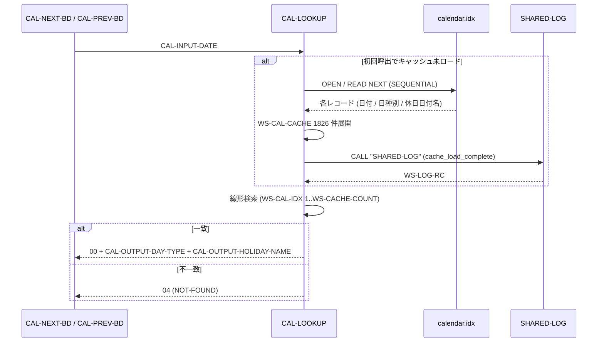
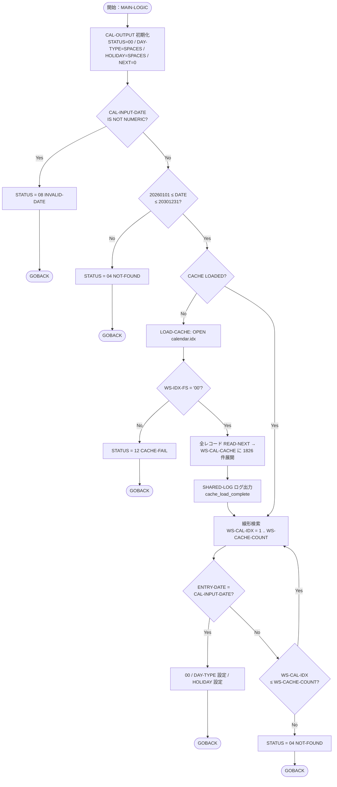

# 基本設計書 — CAL-LOOKUP

> **サブシステム:** 01-calendar
> **プログラム ID:** `CAL-LOOKUP`
> **種別:** バッチ
> **更新日:** 2026-07-06

---

## 1. プログラム概要

| 項目 | 値 |
|------|-----|
| プログラム ID | `CAL-LOOKUP` |
| ソースファイル | `src/cal-lookup.cob` |
| 所属サブシステム | 01-calendar |
| 種別 | バッチ |
| 概要 | 入力された日付に基づき、インメモリのカレンダーキャッシュから日種別（営業日 / 休日 / 週末）および休日日付名称を検索して返す。最初の呼出時に ISAM インデックスファイルを読み込み、1826 件のエントリをワーク領域に展開する。 |

---

## 2. 機能概要

### 2.1 このプログラムが「すること」
日付 (PIC 9(8)) を入力として受け取り、2026-01-01 から 2030-12-31 の範囲に含まれる日付について、インメモリ上のカレンダーキャッシュを線形検索し、該当日の日種別 (B/H/W) と休日日付名称を出力に設定して返す。初回起動時に `data/calendar.idx` をメモリへロードし、ロード完了の記録を `SHARED-LOG` で共有サブシステムへ出力する。

### 2.2 呼出元と呼出し先
- **呼出元:** バッチプログラム `CAL-NEXT-BD`, `CAL-PREV-BD`（次営業日 / 前営業日検索モジュール）
- **呼出先:** `CALL "SHARED-LOG"`（shared サブシステム、キャッシュロード完了ログ記録用）

### 2.3 シーケンス図

---

## 3. 処理フロー

### 3.1 全体フロー（flowchart）

---

## 4. 入出力仕様

### 4.1 入力

| 項目 | 型 | 必須 | 説明 |
|------|-----|:----:|------|
| CAL-INPUT-DATE | PIC 9(8) | ✅ | 検索対象年月日 (YYYYMMDD)。数値のみ有効 (範囲: 20260101〜20301231) |

### 4.2 出力

| 項目 | 型 | 説明 |
|------|-----|------|
| CAL-STATUS | PIC 9(2) | 返却コード |
| CAL-OUTPUT-DAY-TYPE | PIC X(1) | B:営業日 / H:休日 / W:週末 |
| CAL-OUTPUT-HOLIDAY-NAME | PIC X(40) | 休日日付名称（営業日・週末は SPACES） |
| CAL-OUTPUT-NEXT-DATE | PIC 9(8) | 予備項目（本プログラムでは 0 クリア） |

### 4.3 返却コード（概要）

| コード | 意味 |
|--------|------|
| 00 | 正常（該当日付発見、DAY-TYPE / HOLIDAY-NAME 返却） |
| 04 | NOT-FOUND（範囲外、または検索ヒットせず） |
| 08 | INVALID-DATE（数値以外入力） |
| 12 | CACHE-FAIL（calendar.idx オープン失敗） |

---

## 5. 正常系テストケース

| # | テスト名 | 入力 | 期待出力 | 確認ポイント |
|---|---------|------|---------|------------|
| 1 | 休日種別（H:元日） | CAL-INPUT-DATE = 20260101 | STATUS=00, DAY-TYPE="H", HOLIDAY-NAME ≠ SPACES | 休日日付として正しく判定・休日日付名称が設定されること |
| 2 | 営業日種別（B） | CAL-INPUT-DATE = 20260105 | STATUS=00, DAY-TYPE="B", HOLIDAY-NAME=SPACES | 通常営業日として判定され、休日日付名称が空欄であること |
| 3 | 週末種別（W:土曜） | CAL-INPUT-DATE = 20260103 | STATUS=00, DAY-TYPE="W", HOLIDAY-NAME=SPACES | 土曜日が週末として判定されること |
| 4 | 週末種別（W:日曜） | CAL-INPUT-DATE = 20260104 | STATUS=00, DAY-TYPE="W", HOLIDAY-NAME=SPACES | 日曜日が週末として判定されること |
| 5 | 範囲最遠日（2030年末） | CAL-INPUT-DATE = 20301231 | STATUS=00, DAY-TYPE="B" | キャッシュ末尾エントリがヒットして返却されること |
| 6 | 2 回目呼出（キャッシュ再利用） | 1 回目の成功後、別日付で再呼出 | STATUS=00 / 04 が入力に応じて返却 | 2 回目はキャッシュ再ロード不要で検索できること |

---

## 6. 異常系テストケース

| # | テスト名 | 入力 | 期待される異常 | 確認ポイント |
|---|---------|------|--------------|------------|
| 1 | 範囲下限未満 | CAL-INPUT-DATE = 20251231 | STATUS = 04 (NOT-FOUND) | 2026-01-01 より前の日付が拒否されること |
| 2 | 範囲上限超過 | CAL-INPUT-DATE = 20310101 | STATUS = 04 (NOT-FOUND) | 2030-12-31 より後の日付が拒否されること |
| 3 | 非数値入力 | CAL-INPUT-DATE = "AAAAAAAA" | STATUS = 08 (INVALID-DATE) | 数値チェックが先に機能し 08 が返ること |
| 4 | キャッシュロード失敗 | calendar.idx 不在 / OPEN 失敗状態 | STATUS = 12 (CACHE-FAIL) | ファイル OPEN 失敗を検知し即座に 12 で返ること |
| 5 | 範囲内未該当 | 定義にない日付（例: キャッシュ生成後に欠番がある場合） | STATUS = 04 (NOT-FOUND) | 全件走査しても該当なしの場合に 04 で返ること |

---

## 参考
- ソース: [cal-lookup.cob](../src/cal-lookup.cob)
- 公開 IF: [cal-api.cpy](../copy/api/cal-api.cpy)
- その他: [Makefile](../Makefile)
