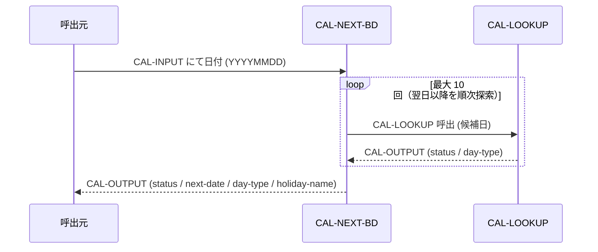
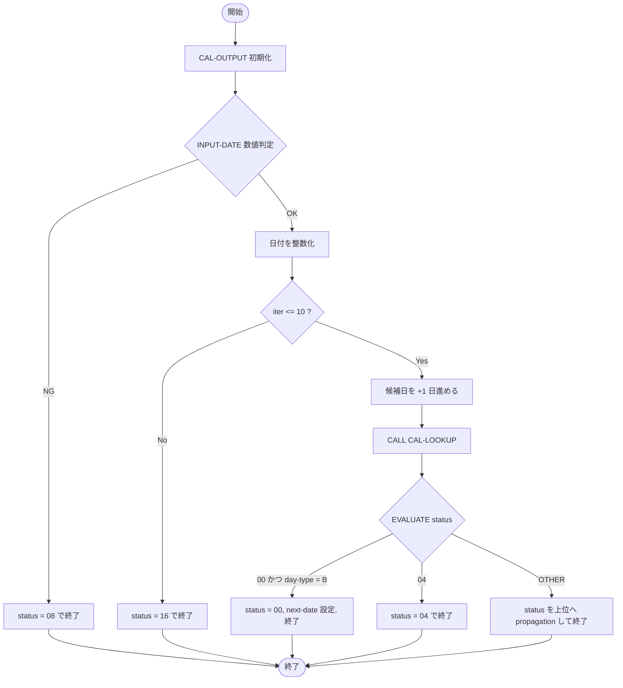

# 基本設計書 — CAL-NEXT-BD

> **サブシステム:** 01-calendar
> **プログラム ID:** `CAL-NEXT-BD`
> **種別:** バッチ
> **更新日:** 2026-07-06

---

## 1. プログラム概要

| 項目 | 値 |
|------|-----|
| プログラム ID | `CAL-NEXT-BD` |
| ソースファイル | `src/cal-next-bd.cob` |
| 所属サブシステム | 01-calendar |
| 種別 | バッチ |
| 概要 | 入力日付に対して翌営業日（day-type = "B"）を探索する。最大 10 回まで日付を進めながら CAL-LOOKUP を呼出して営業日が見つかった時点で返却し、上限超過時は FATAL を返す。 |

---

## 2. 機能概要

### 2.1 このプログラムが「すること」
入力された日付（YYYYMMDD）から翌営業日を探索し、営業日の日付・種別・休日名を出力する。
妥当でない入力に対してはエラーコード 08 を、日付範囲外など探索不能な場合は 04 / 12 等のエラーコードを返す。

### 2.2 呼出元と呼出し先
- **呼出元:** テストドライバ `CALTEST`。他のバッチ／オンライン処理からの `CALL "CAL-NEXT-BD"` 呼出しを想定。
- **呼出先:** `CAL-LOOKUP`（同一サブシステム内の .so モジュール）。日付の営業日／休日判定を委譲する。

### 2.3 シーケンス図

---

## 3. 処理フロー

### 3.1 全体フロー（flowchart）

---

## 4. 入出力仕様

### 4.1 入力

| 項目 | 型 | 必須 | 説明 |
|------|-----|:----:|------|
| CAL-INPUT-DATE | PIC 9(8) | ✅ | 探索元の日付（YYYYMMDD）。数値のみを許容する。 |

### 4.2 出力

| 項目 | 型 | 説明 |
|------|-----|------|
| CAL-STATUS | PIC 9(2) | 処理結果コード（下記返却コード参照） |
| CAL-OUTPUT-DAY-TYPE | PIC X(1) | 営業日判定種別（"B"=営業日）。異常時はスペース |
| CAL-OUTPUT-HOLIDAY-NAME | PIC X(40) | 休日名称。異常時はスペース |
| CAL-OUTPUT-NEXT-DATE | PIC 9(8) | 発見した翌営業日（YYYYMMDD）。異常時は 0 |

### 4.3 返却コード（概要）

| コード | 意味 |
|--------|------|
| 00 | 正常（翌営業日を取得） |
| 04 | NOT-FOUND（日付範囲外等により探索不能） |
| 08 | INVALID-DATE（入力日付が数値でない） |
| 12 | CACHE-LOOKUP（キャッシュ取得失敗を上位から伝播） |
| 16 | FATAL（規定の最大探索回数 10 回を超過） |

---

## 5. 正常系テストケース

| # | テスト名 | 入力 | 期待出力 | 確認ポイント |
|---|---------|------|---------|------------|
| 1 | 金曜日→翌営業日（土日スキップ） | 20260109 | next=20260113, status=00 | 土日を飛ばして営業日（火曜）が返ること |
| 2 | 祝日挟在の探索 | 20260505 | next=20260507, status=00 | 憲法記念日等の祝日を越えて翌営業日（木曜）が返ること |
| 3 | 年末→翌年初の越境探索 | 20261231 | next=20270104, status=00 | 年境を越えて探索し、2027 年初の営業日が返ること |

---

## 6. 異常系テストケース

| # | テスト名 | 入力 | 期待される異常 | 確認ポイント |
|---|---------|------|--------------|------------|
| 1 | 探索範囲外の日付 | 20301231 | status = 04 | 日付範囲外を CAL-LOOKUP が返し、上位へ伝播すること |
| 2 | 数値でない入力 | (初期値／数値以外) | status = 08 | 数値チェック INVALD-DATE が優先されること |
| 3 | 探索上限超過 | (長期連続休日の想定日付) | status = 16 | 最大 10 回の探索でも "B" が見つからない場合の上限動作 |

---

## 参考
- ソース: [cal-next-bd.cob](../src/cal-next-bd.cob)
- 公開 IF: [cal-api.cpy](../copy/api/cal-api.cpy)
- その他: [Makefile](../Makefile)
