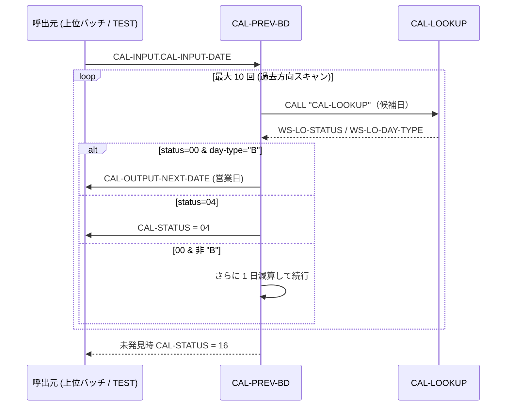

# 基本設計書 — CAL-PREV-BD

> **サブシステム:** 01-calendar（祝休日管理サブシステム）
> **プログラム ID:** `CAL-PREV-BD`
> **種別:** バッチモジュール（動的ロード）
> **更新日:** 2026-07-06

---

## 1. プログラム概要

| 項目 | 値 |
|------|-----|
| プログラム ID | `CAL-PREV-BD` |
| ソースファイル | `src/cal-prev-bd.cob` |
| 所属サブシステム | 01-calendar（祝休日管理サブシステム） |
| 種別 | バッチモジュール（動的ロード、`.so`） |
| 概要 | 与えられた日付から直近の前の営業日（day-type="B"）を探索する。基準日を含め最大 10 日前方向へスキャンし、`CAL-LOOKUP` を繰り返し呼出して最初に見つかった営業日を返す。 |

---

## 2. 機能概要

### 2.1 このプログラムが「すること」
入力として YYYYMMDD 形式の日付を受け取り、基準日より前方向（過去）へ最大 10 回「1 日減算 → `CAL-LOOKUP`」を繰り返す。最初に day-type="B"（営業日）が見つかったらその日付を `CAL-OUTPUT-NEXT-DATE` に設定して正常終了する。営業日が見つからず範囲外（NOT-FATAL）に到達した場合はステータス 04 で終了し、ループ上限を超えた場合は 16 で終了する。

**設計上の特性（CAL-NEXT-BD との違い）**
- **方向が逆:** CAL-NEXT-BD は `ADD 1` で未来方向へスキャンするが、CAL-PREV-BD は `SUBTRACT 1` で過去方向へスキャンする。同一の `CAL-LOOKUP` 呼び出し先と判定ロジックを共有し、方向だけが対称的に反転している。
- **キャッシュ未使用:** CAL-NEXT-BD がインデックスキャッシュを検査してキャッシュミス時に `CACHE-FAIL(12)` を返しうるのに対し、CAL-PREV-BD はキャッシュを操作しないため返却コード 12 は起こらない（00 / 04 / 08 / 16 のみ）。

### 2.2 呼出元と呼出し先
- **呼出元:** バッチドライバ（`CALTEST` の `RUN-PREV-BD` 等）·上位バッチプログラム
- **呼出先:** 同一サブシステム内のモジュール `CALL "CAL-LOOKUP"` を動的呼出

### 2.3 シーケンス図



---

## 3. 処理フロー

### 3.1 全体フロー（flowchart）

```mermaid
flowchart TD
    START([開始]) --> INIT[出力初期化: STATUS=00, NEXT-DATE=0, DAY-TYPE=SPACE]
    INIT --> CHECK_NUM{CAL-INPUT-DATE<br/>は数値か？}
    CHECK_NUM -->|NG| ST08[STATUS = 08]
    ST08 --> GOBACK1([GOBACK])
    CHECK_NUM -->|OK| TO_INT[INTEGER-OF-DATE → WS-DATE-INT]
    TO_INT --> LOOP{WS-ITER-COUNT > 10?}
    LOOP -->|YES - 上限超過| ST16[STATUS = 16]
    ST16 --> GOBACK2([GOBACK])
    LOOP -->|NO| SUB[WS-DATE-INT から 1 日減算]
    SUB --> TO_DATE[DATE-OF-INTEGER → WS-LI-DATE]
    TO_DATE --> INC[WS-ITER-COUNT + 1]
    INC --> CALL[CALL "CAL-LOOKUP" USING WS-LOCAL-INPUT]
    CALL --> EVAL{WS-LO-STATUS?}
    EVAL -->|00 &<br/>DAY-TYPE="B"| FOUND[営業日検出:<br/>NEXT-DATE=候補日 / STATUS=00]
    FOUND --> GOBACK3([GOBACK])
    EVAL -->|04| ST04[STATUS = 04]
    ST04 --> GOBACK4([GOBACK])
    EVAL -->|OTHER| STPROP[STATUS = WS-LO-STATUS]
    STPROP --> GOBACK5([GOBACK])
    EVAL -->|00 &<br/>DAY-TYPE≠"B"| LOOP
```

---

## 4. 入出力仕様

### 4.1 入力

| 項目 | 型 | 必須 | 説明 |
|------|-----|:----:|------|
| CAL-INPUT-DATE | PIC 9(8) | ✅ | 基準日（YYYYMMDD）。この日より前の営業日を探索する起点。未検証日（非数値）はステータス 08 で即時 GOBACK。 |

### 4.2 出力

| 項目 | 型 | 説明 |
|------|-----|------|
| CAL-STATUS | PIC 9(2) | 返却コード（00=正常 / 04=範囲外 / 08=入力不正 / 16=FATAL）。IF 文の 88 レベルは cal-api.cpy で定義。 |
| CAL-OUTPUT-DAY-TYPE | PIC X(1) | 検出した日付の種別。正常時は固定で "B"（営業日）。 |
| CAL-OUTPUT-HOLIDAY-NAME | PIC X(40) | 検出した日付の祝日名。本プログラムでは CAL-LOOKUP の戻りを転写しないため未設定。 |
| CAL-OUTPUT-NEXT-DATE | PIC 9(8) | 検出した直近の前の営業日（YYYYMMDD）。未検出時は 0。 |

### 4.3 返却コード（概要）

| コード | 意味 |
|--------|------|
| 00 | 正常。直近の前の営業日を `CAL-OUTPUT-NEXT-DATE` に返却 |
| 04 | 範囲外（NOT-FOUND）。探索範囲内で CAL-LOOKUP が "B" より先に範囲外を検知 |
| 08 | 入力不正（INVALID-DATE）。`CAL-INPUT-DATE` が数値以外 |
| 16 | 致命的異常（FATAL）。最大反復回数（10 回）超過で営業日が検出できず |

> 注: `CAL-STATUS-CACHE-FAIL (VALUE 12)` は cal-api.cpy で定義されるが、CAL-PREV-BD はキャッシュを扱わないため本プログラムからは返却しない。

---

## 5. 正常系テストケース

| # | テスト名 | 入力 | 期待出力 | 確認ポイント |
|---|---------|------|---------|------------|
| 1 | 週末またぎ前方向探索 | CAL-INPUT-DATE = 20260112（月） | CAL-OUTPUT-NEXT-DATE = 20260109（金）, CAL-STATUS = 00, CAL-OUTPUT-DAY-TYPE = "B" | 基準日が月曜の直近前の営業日が金曜（土日スキップ）であること |
| 2 | 年境界前方向探索 | CAL-INPUT-DATE = 20270104（月） | CAL-OUTPUT-NEXT-DATE = 20261231（木）, CAL-STATUS = 00, CAL-OUTPUT-DAY-TYPE = "B" | 年を跨いだ前方向スキャンが正しく機能すること |

---

## 6. 異常系テストケース

| # | テスト名 | 入力 | 期待される異常 | 確認ポイント |
|---|---------|------|--------------|------------|
| 1 | インデックス下限超過 | CAL-INPUT-DATE = 20260101 | CAL-STATUS = 04 | カバー範囲下限を下回り、CAL-LOOKUP が NOT-FOUND を返す。即座に GOBACK。（cal-test.cob では `20260101 → 04` を用意済み） |
| 2 | 非数値入力 | CAL-INPUT-DATE = "XXXXXXXX"（数値以外） | CAL-STATUS = 08 | 入力検知（NOT NUMERIC）で即時 GOBACK すること |
| 3 | 反復上限超過 | CAL-INPUT-DATE = カバー範囲直近の日付で 10 日前まで非 "B" が連続する場合 | CAL-STATUS = 16 | 最大 10 回スキャンしても "B" に到達しなかった場合、FATAL (16) で終了する。本実装では実在カレンダー上は 10 営業日連続非営業日は存在しないが、条件成立時の逃げ道として定義を確認 |

---

## 参考
- ソース: [cal-prev-bd.cob](../src/cal-prev-bd.cob)
- 公開 IF: [cal-api.cpy](../copy/api/cal-api.cpy)
- その他: [Makefile](../Makefile)
