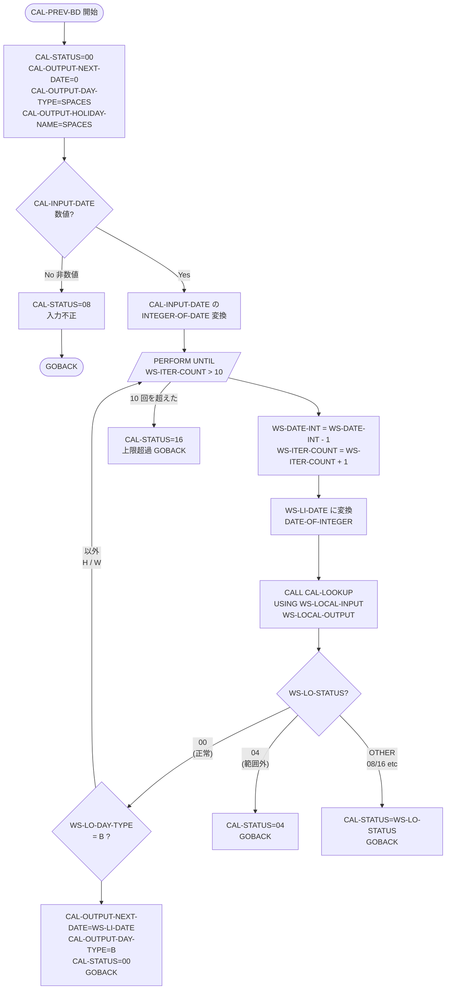
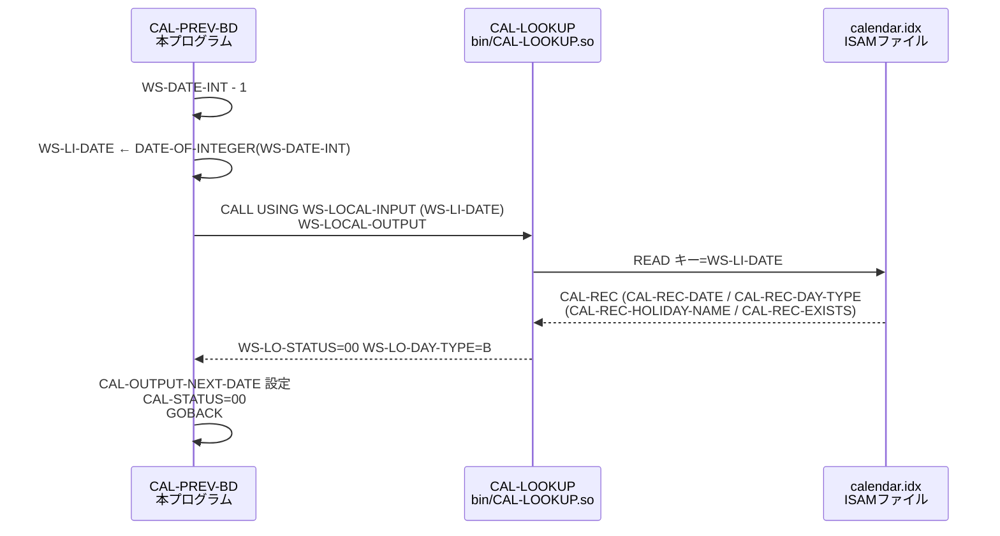

# プログラム設計書 — CAL-PREV-BD

> **サブシステム:** 01-calendar
> **プログラム ID:** `CAL-PREV-BD`
> **種別:** バッチ（他プログラムから動的 CALL されて呼ばれるモジュール — `cobc -m` で .so 化）
> **更新日:** 2026-07-06

---

## 凡例

本設計書は `CAL-PREV-BD` のプログラム設計書である。全 22 サブシステムの設計書に共通する 10 セクション構成（`_template.md`）に従う。

- **コード参照:** `src/cal-prev-bd.cob:L34-57` 形式（ファイルの相対パス + 行番号範囲）。
- **セクション必須:** 全 10 セクションに実値を記した。該当しないサブセクションは `該当せず` と記す。
- **Mermaid 図:** GitHub Flavored Markdown の ```mermaid フェンスで記述。
- **プログラム間リンク:** 同一サブシステム: `cal-lookup.md`
- **種別値:** `バッチ`（`-m` により共有オブジェクト .so としてコンパイル、他プログラムから動的 CALL される）

---

## 1. プログラム概要

| 項目 | 値 |
|------|-----|
| プログラム ID | `CAL-PREV-BD` |
| ソースファイル | `src/cal-prev-bd.cob` |
| 所属サブシステム | 01-calendar |
| 種別 | バッチ（動的 CALL によるサブルーチン モジュール — `cobc -m` で `bin/CAL-PREV-BD.so` を生成） |
| 概要 | 指定された基準日の**直近の前営業日（Previous Business Day）**を算出する。炭サブシステムである `[CAL-LOOKUP](cal-lookup.md)` を 1 日戻しながら繰返し呼び出し、`"B"` (営業日) に該当する最初の日付を返す。最大 10 回までくり返し、見つからない場合は `16` (FATAL/上限超過) を返す。 |

- **呼び出し元:** 後続タスクでドキュメント化する他バッチプログラム群（CAL-CALC 等）
- **Makefile 連動:** `Prevbd_Mod` ターゲット — `$(COBC) -m $(COBCFLAGS) -o $@ $<`
- **コンパイル依存:** `cal-api.cpy`（`-I copy/api`）

---

## 2. 業務要件（再構築）

> 本リポジトリはコメント・仕様書が意図的に除去されたレガシー資産であるため、本章はコードから逆推論した業務要件を記す。

### 2.1 ビジネスドメイン
銀行の**営業日カレンダー計算**ドメイン。コアバンキング約定日・決済日の算出に使用される。祝日・週末・臨時休業日をスキップして過去の有効な営業日を決定するロジック。

### 2.2 業務目的
任意の基準日（`CAL-INPUT-DATE`）に対し、`[CAL-LOOKUP](cal-lookup.md)` が保持するカレンダーマスタを参照し、`"B"`（営業日）と判定される**最も近い過去の日付**を返す。金融機関の「T-2 遡及日計算」等、過去日付の営業判定が必要なユースースの基底モジュールとして位置づけられる。

### 2.3 トリガーと実行形態
**他プログラムからの動的 CALL によるサブルーチン**。`src/cal-prev-bd.cob:L41` で `"CAL-LOOKUP"` を CALL し、内部ループで判定。直接的なエントリポイントではなく、オーケストレーション層（CAL-CALC 等）から利用される。直接 `test-unit` ターゲット経由テスト（`tests/unit/cal-test.cob:L74-86`）のみスタンドアロン実行可能。

---

## 3. 入出力インターフェース

### 3.1 公開インターフェース（`copy/api/cal-api.cpy`）
- **使用コピーブック:** [`cal-api.cpy`](../../../copy/api/cal-api.cpy)
-ソース定義:`copy/api/cal-api.cpy:L1-16`
- **LINKAGE の USING 引数:** `src/cal-prev-bd.cob:L19` — `PROCEDURE DIVISION USING CAL-INPUT CAL-OUTPUT`

| フィールド | 型 | I/O | 説明 |
|-----------|-----|-----|------|
| `CAL-INPUT` | グループ | — | INPUT 構造体 |
| `CAL-INPUT-DATE` | `PIC 9(8)` | I | 基準日 `YYYYMMDD` |
| `CAL-OUTPUT` | グループ | — | OUTPUT 構造体 |
| `CAL-STATUS` | `PIC 9(2)` | O | ステータスコード（`L6-10` に 88 レベル定義） |
| `CAL-OUTPUT-DAY-TYPE` | `PIC X(1)` | O | `"B"`/`"H"`/`"W"`（`L12-14`） |
| `CAL-OUTPUT-HOLIDAY-NAME` | `PIC X(40)` | O | 祝日名（該当日の場合、calendar.idx から取得） |
| `CAL-OUTPUT-NEXT-DATE` | `PIC 9(8)` | O | 今回算出した直近の前営業日 |

### 3.2 内部インターフェース（`copy/private/*.cpy`）
該当せず（内部インターフェース用コピーブックを使用しているない）。ローカルな WORKING-STORAGE のみ `src/cal-prev-bd.cob:L5-14` で定義。

| フィールド | 型 | 説明 |
|-----------|-----|------|
| `WS-DATE-INT` | `PIC 9(8)` | INTEGER-OF-DATE 変換値 |
| `WS-LOCAL-INPUT` (`.WS-LI-DATE`) | グループ (`PIC 9(8)`) | `[CAL-LOOKUP](cal-lookup.md)` 呼出用 INPUT |
| `WS-LOCAL-OUTPUT` (`.WS-LO-STATUS`、`.WS-LO-DAY-TYPE`、`.WS-LO-HOLIDAY-NAME`、`.WS-LO-NEXT-DATE`) | グループ | `[CAL-LOOKUP](cal-lookup.md)` 呼出用 OUTPUT（cal-api.cpy と同構造） |
| `WS-ITER-COUNT` | `PIC 9(2) VALUE 0` | ループ反復カウンタ |
| `WS-MAX-ITER` | `PIC 9(2) VALUE 10` | 上限反復回数 |

### 3.3 ファイル入出力
該当せず（直接のファイル入出力は存在しない。`[CAL-LOOKUP](cal-lookup.md)` 内の ISAM READ に委譲）。

### 3.4 DB 入出力
該当せず（データベース非使用）

---

## 4. 業務ロジック / ルール

`CAL-PREV-BD` の `MAIN-LOGIC` から復元した判定ルールと計算式を記す。

### 4.1 入力バリデーション
- **ルール 1:** 入力日付 CAL-INPUT-DATE が数値でない場合、`CAL-STATUS=08`（入力不正）を返して即座に GOBACKする — 根拠: `src/cal-prev-bd.cob:L26-29`

### 4.2 主処理ロジック
- **初期化:**
  - `CAL-STATUS=00` を設定 — `src/cal-prev-bd.cob:L21`
  - `CAL-OUTPUT-NEXT-DATE=0`、`CAL-OUTPUT-DAY-TYPE` / `CAL-OUTPUT-HOLIDAY-NAME` を空白にクリア — `src/cal-prev-bd.cob:L22-24`
- **整数変換:** `CAL-INPUT-DATE` を `FUNCTION INTEGER-OF-DATE` で整数のシリアル日付に変換 — `src/cal-prev-bd.cob:L31-32`
- **ループ**（`PERFORM UNTIL WS-ITER-COUNT > WS-MAX-ITER`、`src/cal-prev-bd.cob:L34-57`）:
  1. 日付を 1 日戻す: `SUBTRACT 1 FROM WS-DATE-INT` — `src/cal-prev-bd.cob:L35`
  2. 整数 → 日付に戻す: `FUNCTION DATE-OF-INTEGER(WS-DATE-INT)` → `WS-LI-DATE` — `src/cal-prev-bd.cob:L36-37`
  3. 反復カウンタ +1 (`src/cal-prev-bd.cob:L38`)
  4. `WS-LI-DATE` → `WS-LOCAL-INPUT` にMOVE — `src/cal-prev-bd.cob:L40`
  5. **`CALL "CAL-LOOKUP" USING WS-LOCAL-INPUT WS-LOCAL-OUTPUT`** — `src/cal-prev-bd.cob:L41`（本プログラムの外部呼出の核）
  6. `EVALUATE WS-LO-STATUS` — `src/cal-prev-bd.cob:L42-56`:
     - `WHEN 00`（正常応答）:
       - `WS-LO-DAY-TYPE = "B"` なら: 結果を出力へ設定し `CAL-STATUS=00` で GOBACK — `src/cal-prev-bd.cob:L44-48`
       - 上記以外（`"H"`/`"W"` 等）なら: ループ継続（日付をさらに戻す）
     - `WHEN 04`（レコード未取得/範囲外）: `CAL-STATUS=04` で即 GOBACK — `src/cal-prev-bd.cob:L50-52`
     - `WHEN OTHER`（08/16 等他のエラー）: `CAL-STATUS = WS-LO-STATUS` で即 GOBACK — `src/cal-prev-bd.cob:L53-55`
- **上限超過:** 10 回のループを超えた場合、`CAL-STATUS=16`（上限超過 FATAL）を設定して GOBACK — `src/cal-prev-bd.cob:L59-60`

### 4.3 状態遷移
| 現在 | イベント | 次の状態 | 根拠 |
|------|---------|---------|------|
| 初期 | プログラム開始 | `CAL-STATUS=00` | `src/cal-prev-bd.cob:L21` |
| バリデーション | `CAL-INPUT-DATE` が非数値 | `CAL-STATUS=08`（GOBACK） | `src/cal-prev-bd.cob:L26-29` |
| ループ | `[CAL-LOOKUP](cal-lookup.md)` 返却 00 + DAY-TYPE=`B` | `CAL-STATUS=00` + `CAL-OUTPUT-NEXT-DATE` 設定（GOBACK） | `src/cal-prev-bd.cob:L44-48` |
| ループ | `[CAL-LOOKUP](cal-lookup.md)` 返却 00 + DAY-TYPE≠`B` | ループ継続（日付 -1） | `src/cal-prev-bd.cob:L49` |
| ループ | `[CAL-LOOKUP](cal-lookup.md)` 返却 04 | `CAL-STATUS=04`（GOBACK） | `src/cal-prev-bd.cob:L50-52` |
| ループ | `[CAL-LOOKUP](cal-lookup.md)` 返却 08/16 等 | `CAL-STATUS=WS-LO-STATUS`（GOBACK） | `src/cal-prev-bd.cob:L53-55` |
| 上限超過 | 反復回数 > 10 | `CAL-STATUS=16`（GOBACK） | `src/cal-prev-bd.cob:L59-60` |

---

## 5. データアクセス

### 5.1 ファイルアクセス
該当せず（直接ファイルアクセスなし）。`CAL-PREV-BD` は `[CAL-LOOKUP](cal-lookup.md)` を CALL して処理を委譲し、ファイル入出力は `CAL-LOOKUP` が `calendar.idx` に行う。

### 5.2 物理ファイルレイアウト
該当せず（ファイルレイアウトは `[CAL-LOOKUP](cal-lookup.md)` 参照）

### 5.3 インデックス
該当せず（本プログラムでは直接インデックスにアクセスしない）

---

## 6. プログラム間呼出

| 呼出先 | 種別 | 境界 | CALL 根拠 |
|--------|------|------|----------|
| `CAL-LOOKUP` | 動的 `CALL "..."`（同一サブシステム） | 01-calendar 内 | `src/cal-prev-bd.cob:L41` |

- **パラメータ:** `WS-LOCAL-INPUT`（`WS-LI-DATE PIC 9(8)`）、`WS-LOCAL-OUTPUT`（`WS-LO-STATUS`、`WS-LO-DAY-TYPE`、`WS-LO-HOLIDAY-NAME`、`WS-LO-NEXT-DATE`）
- **越境依存:** なし（同サブシステム内に閉じている）
- **動的ロード:** Makefile で `cobc -m` により `bin/CAL-PREV-BD.so` としてビルドされるため、`CAL-LOOKUP` も同様に `bin/CAL-LOOKUP.so` として同一 BIN_DIR に存在している必要がある。

---

## 7. エラー処理・ステータスコード

### 7.1 ステータスコード体系（返却コード）

| コード | 名称（88 レベル） | 意味 | 設定タイミング |
|--------|------------------|------|--------------|
| `00` | `CAL-STATUS-OK` | 正常（営業日を発見） | `CAL-INPUT-DATE` が数値かつ `[CAL-LOOKUP](cal-lookup.md)` が `B` を返却、`src/cal-prev-bd.cob:L47` |
| `04` | `CAL-STATUS-NOT-FOUND` | レコード未取得/範囲外 | `[CAL-LOOKUP](cal-lookup.md)` が `04` で応答した場合、`src/cal-prev-bd.cob:L51` |
| `08` | `CAL-STATUS-INVALID-DATE` | 入力不正（非数値日付） | `CAL-INPUT-DATE NOT NUMERIC` 時、`src/cal-prev-bd.cob:L27` |
| `16` | `CAL-STATUS-FATAL` | 上限超過（営業日を 10 日以内に発見できず） | `WS-ITER-COUNT > WS-MAX-ITER (10)` の場合、`src/cal-prev-bd.cob:L59` |

> ※ 88 レベル条件の正式定義は `copy/api/cal-api.cpy:L6-10` を参照。

### 7.2 ファイル STATUS ハンドリング
該当せず（本プログラムには FILE-CONTROL / FILE SECTION がなく、VSAM/QSAM/STATUS によるファイル入出力は存在しない）。

### 7.3 SQLCODE ハンドリング
該当せず（データベース非使用）

---

## 8. データフロー・シーケンス

### 8.1 全体フロー（flowchart）



- 根拠パス: `src/cal-prev-bd.cob:L20-60`（全 MAIN-LOGIC）
- 初期化: `L21-24`
- バリデーション: `L26-29`
- 整数変換: `L31-32`
- ループ構造: `L34-57`
- 上限判定・クリア: `L59-60`

### 8.2 外部呼出シーケンス（`CAL-LOOKUP` 呼出）



- 呼出パラメータ根拠: `src/cal-prev-bd.cob:L40`（MOVE WS-LI-DATE → WS-LOCAL-INPUT）
- CALL 文: `src/cal-prev-bd.cob:L41`
- 解釈元: `[CAL-LOOKUP](cal-lookup.md)` の `WORKING-STORAGE` 定義が cal-api.cpy と同一であることに依存

---

## 9. テストカバレッジ

### 9.1 ユニットテスト（`tests/unit/`）

テストドライバ [`cal-test.cob`](../../../tests/unit/cal-test.cob) の `RUN-PREV-BD` パーサグラフ（`L139-158`）で 3 ケースを実行。

| # | テスト | 入力 | 期待出力 | 保証するステータス | 分岐カバー |
|---|--------|------|---------|------------------|-----------|
| 1 | 正常系 — 月曜 → 前金曜（週末跨ぎ） | `2026-01-12` (月) | `CAL-OUTPUT-NEXT-DATE=2026-01-09`、`CAL-STATUS=00` | ループ + `B` 検出 | 土日スキップを経て前の `B` を検出 |
| 2 | 正常系 — 年初 → 昨年末（年跨ぎ） | `2027-01-04` (火) | `CAL-OUTPUT-NEXT-DATE=2026-12-31`、`CAL-STATUS=00` | 日付跨ぎ + 休日跨ぎ | 昨年末の `B` 検出 |
| 3 | 異常系 — 範囲外日付（下限境界） | `2026-01-01` | `CAL-STATUS=04`、`CAL-OUTPUT-NEXT-DATE=0` | `WHEN 04` の分岐 | `[CAL-LOOKUP](cal-lookup.md)` が `04` を返却したら即時 GOBACK |

- テスト起動導線: `Makefile` — `test-unit` ターゲットで `build + load-idx` 後に `cal-test` を実行
- 内部カウンタ: `WS-TEST-NUM`、`WS-PASS`、`WS-FAIL`（`cal-test.cob:L8`）+ 最終集計（`cal-test.cob:L89-91`）
- バリデーション判定: `cal-test.cob:L142-144`（STATUS 比較、STATUS≠00 の場合は DATE をスキップ）

### 9.2 不足しているカバレッジ
- **上限超過分岐（`CAL-STATUS=16`）:** いずれのテストケースも 10 日以内に範囲外または `B` に到達するため、10 回超えケースは未カバー
- **入力不正分岐（`CAL-STATUS=08`）:** 非数値日付の入力はカバーされていない
- **推奨追加:** `WS-MAX-ITER=3` に小さくした境界テスト or `CAL-INPUT-DATE` を非数値にする分岐単位テストを追加検討事項とする

---

## 10. モダナイズ候補

### 10.1 Azure 移行時の候補サービス
- **候補 1:** Azure Functions（Node.js / Python / .NET）— ステートレスでスケールアウト容易。HTTP-trigger 化すれば既存バッチ呼出し元の最小限の変更で移行可能。営業日計算自体は純粋関数化が容易。
- **候補 2:** Azure Container Apps — バッチ オーケストレーション全体をコンテナ化する場合に適合。外部イベント パイプライン（Event Grid / Service Bus）で他ジョブから呼出し可能。
- **候補 3:** Azure Durable Functions — オーケストレーション元（CAL-CALC 等）が複数ステップの営業日計算をチェーンする場合に適合。
- **外部カレンダー データ:** Azure Cache for Redis または Azure App Configuration でキャッシュし、`calendar.idx` の ISAM ファイルを置き換え。祝日一覧は外部管理（CSV/JSON 設定ファイル or Azure SQL / Cosmos DB）に移行し、年次更新パイプラインを別途構築する。

### 10.2 リファクタ観点での懸念点
- **外部キー整合性:** 現在は `calendar.idx` の ISAM ファイルに日付キーで直接アクセスしている。SQL/NoSQL テーブル化時に外部キー整合性（日付のユニーク性・範囲バリデーション）をアプリ層で担保する必要がある。
- **上限反復回数（10 回）の妥当性:** 10 回（10 日以内）に営業日がないケース（大型連休）をカバーできない。祝日データの外部管理化に合わせて上限値の再検討が必要。
- **動的 CALL の置き換え:** 現在は `CALL "CAL-LOOKUP"` の動的ロードに依存。Azure Functions 化時は HTTP クライアント呼び出し or DI による差し替えが必要。
- **エラーコード体系の継承:** `00/04/08/16` のステータスコード体系は他プログラムと共有しているため、モダナイズ時に OpenAPI エラーコード体系へマッピングする変換層が必要。
- **日付計算のタイムゾーン:** 現在はローカル日付のみを扱っているが、グローバル展開時はタイムゾーン考慮が必要になる可能性がある。
- **前日取得の設計差:** `CAL-NEXT-BD` が「少しずつ進めて探索」するのに対し、`CAL-PREV-BD` は「少しずつ戻って探索」する対称構造。モダナイズ時は基準日からの日オフセットで一括取得する API（例: `[CAL-LOOKUP](cal-lookup.md)` に範囲検索機能を追加）へ統合することで、反復呼び出しを削減できる。

---

## 参考
- ソース: [`src/cal-prev-bd.cob`](../../../src/cal-prev-bd.cob)
- 公開 IF: [`copy/api/cal-api.cpy`](../../../copy/api/cal-api.cpy)
- 内部 IF: 該当せず
- テスト: [`tests/unit/cal-test.cob`](../../../tests/unit/cal-test.cob)
- ビルド: [`Makefile`](../../../Makefile)
- 同一サブシステム設計書: [`cal-lookup.md`](cal-lookup.md)（CAL-LOOKUP — 本プログラムが CALL する外部モジュール）
- 対称プログラム設計書: [`cal-next-bd.md`](cal-next-bd.md)（CAL-NEXT-BD — 次営業日計算モジュール）