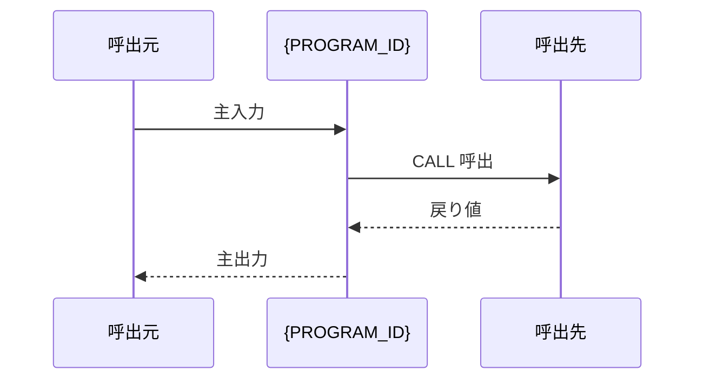
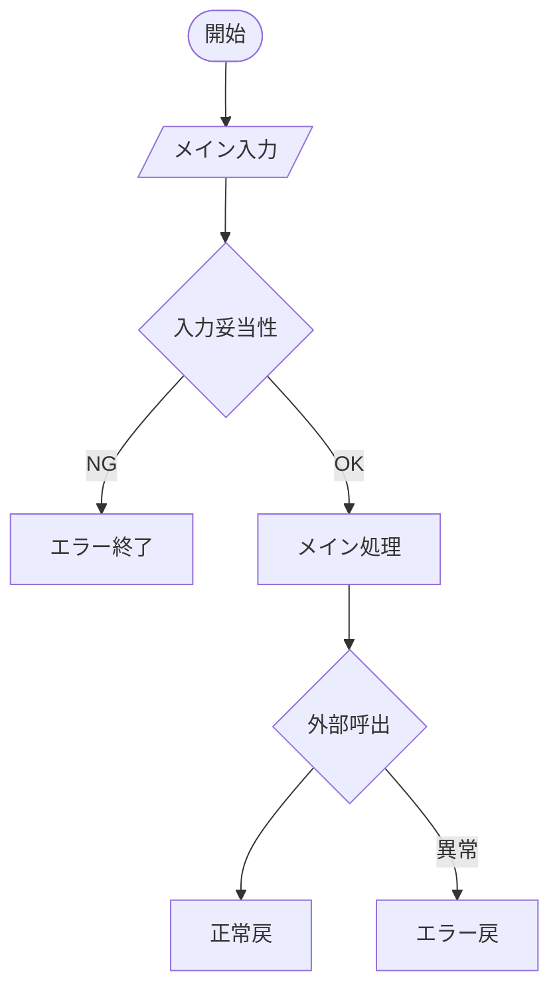

# 基本設計書 — {PROGRAM_ID}

> **サブシステム:** {SUBSYSTEM_NAME}
> **プログラム ID:** `{PROGRAM_ID}`
> **種別:** {オンライン / バッチ / LOAD / 配信}
> **更新日:** {YYYY-MM-DD}

---

## 1. プログラム概要

| 項目 | 値 |
|------|-----|
| プログラム ID | `{PROGRAM_ID}` |
| ソースファイル | `{相対パス}` |
| 所属サブシステム | {SUBSYSTEM_NAME} |
| 種別 | {オンライン / バッチ / LOAD / 配信} |
| 概要 | {業務目的を 1-2 文で} |

---

## 2. 機能概要

### 2.1 このプログラムが「すること」
{基本設計の観点で、このプログラムの責務を 1-3 文で記述。
「何を入力として受け取り、何を出力するか」を中心に。詳細な判定条件・計算式はここに書かない。}

### 2.2 呼出元と呼出し先
- **呼出元:** {このプログラムを呼ぶプログラム or 処理。例:他バッチプログラム、オンライントランザクション}
- **呼出先:** {このプログラムがCALL するプログラム。例: `CALL "BR-LOOKUP"`}

### 2.3 シーケンス図

---

## 3. 処理フロー

### 3.1 全体フロー（flowchart）

---

## 4. 入出力仕様

### 4.1 入力

| 項目 | 型 | 必須 | 説明 |
|------|-----|:----:|------|
| {入力項目名} | {PIC 型} | ✅ | {意味} |

### 4.2 出力

| 項目 | 型 | 説明 |
|------|-----|------|
| {出力項目名} | {PIC 型} | {意味} |

### 4.3 返却コード（概要）

| コード | 意味 |
|--------|------|
| 00 | 正常 |
| {xx} | {意味} |

---

## 5. 正常系テストケース

| # | テスト名 | 入力 | 期待出力 | 確認ポイント |
|---|---------|------|---------|------------|
| 1 | {正常系シナリオ名} | {入力値} | {期待値} | {確認すべき観点} |

---

## 6. 異常系テストケース

| # | テスト名 | 入力 | 期待される異常 | 確認ポイント |
|---|---------|------|--------------|------------|
| 1 | {異常系シナリオ名} | {入力値} | {エラー返却コード等} | {エラー処理の確認} |

---

## 参考
- ソース: [{src.cob}]({src 相対パス})
- 公開 IF: [{api.cpy}]({api.cpy 相対パス})
- その他: [Makefile]({Makefile 相対パス})
