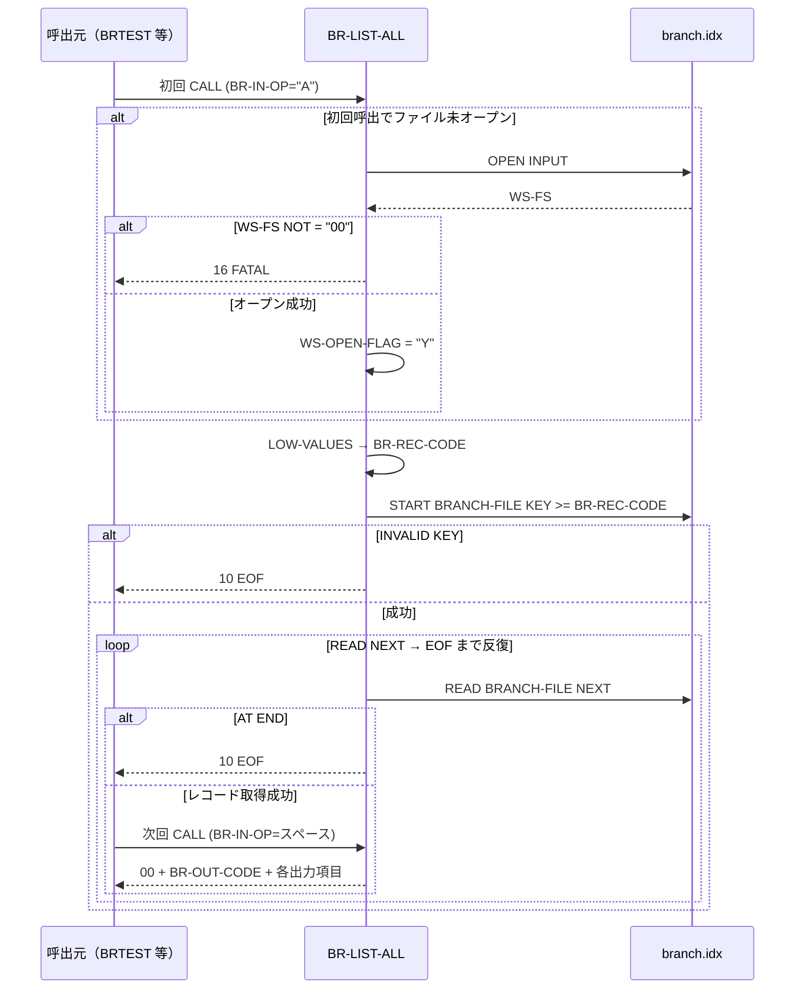

# 基本設計書 — BR-LIST-ALL

> **サブシステム:** 02-branch
> **プログラム ID:** `BR-LIST-ALL`
> **種別:** オンライン（反復 CALL 呼出モジュール）
> **更新日:** 2026-07-06

---

## 1. プログラム概要

| 項目 | 値 |
|------|-----|
| プログラム ID | `BR-LIST-ALL` |
| ソースファイル | `src/br-list-all.cob` |
| 所属サブシステム | 02-branch |
| 種別 | オンライン（反復 CALL 呼出モジュール） |
| 概要 | ISAM インデックスファイル (branch.idx) を全件シーケンシャルにスキャンし、1 件ずつ支店情報を呼び出し元へ返す反復呼出モジュール。初回 CALL 時に ISAM ファイルをオープンして START LOW-VALUES で先頭位置を確定し、以降の CALL で READ NEXT により末尾までフェッチする。末尾到達時は EOF を返す。 |

---

## 2. 機能概要

### 2.1 このプログラムが「すること」
支店マスタファイル (branch.idx) の先頭から末尾までを主キー昇順にスキャンし、1 レコードずつ BR-OUTPUT へ支店コード・支店名（漢字/カナ）・地域コード・支店状態コードを転記して戻す。初回 CALL でブランチファイルをオープンし、START で先頭レコード位置を確定する。以降 READ NEXT を CALL 単位で 1 件ずつ実行し、EOF 到達で反復終了を呼出元に通知する。

### 2.2 呼出元と呼出し先
- **呼出元:** テストドライバ `BRTEST` の PERFORM ループ。オンライントランザクション、または帳票バッチを想定。
- **呼出先:** なし（独立モジュール。他プログラムを CALL しない）。

### 2.3 シーケンス図



---

## 3. 処理フロー

### 3.1 全体フロー（flowchart）

```mermaid
flowchart TD
    START([開始：MAIN-LOGIC]) --> INIT[BR-OUT-STATUS = 00]
    INIT --> OPENCHK{WS-OPEN-FLAG = "N"?}
    OPENCHK -->|Yes| OPEN[BRANCH-FILE OPEN INPUT]
    OPEN --> FSCHK{WS-FS = "00"?}
    FSCHK -->|No| FATAL[16 FATAL]
    FSCHK -->|Yes| FLAG[WS-OPEN-FLAG = "Y"]
    FLAG --> OPCHK
    OPENCHK -->|No| OPCHK{BR-IN-OP = "A"?}
    OPCHK -->|Yes| LOW[LOW-VALUES → BR-REC-CODE]
    LOW --> START[START BRANCH-FILE KEY >= BR-REC-CODE]
    START --> STARTFAIL{INVALID KEY?}
    STARTFAIL -->|Yes| EOF1[10 EOF]
    STARTFAIL -->|No| READ
    OPCHK -->|No| READ[BRANCH-FILE READ NEXT]
    READ --> ATEND{AT END?}
    ATEND -->|Yes| EOF2[10 EOF]
    ATEND -->|No| OUT[BR-REC → BR-OUT 転記 / STATUS = 00]
    FATAL --> END([GOBACK])
    EOF1 --> END
    EOF2 --> END
    OUT --> END
```

---

## 4. 入出力仕様

### 4.1 入力

| 項目 | 型 | 必須 | 説明 |
|------|-----|:----:|------|
| BR-IN-CODE | PIC X(3) | | 支店コード（本モジュールでは不使用） |
| BR-IN-REGION | PIC X(20) | | 地域コード（本モジュールでは不使用） |
| BR-IN-OP | PIC X(1) | ✅ | 操作コード。"A" を指定した CALL 時に START を行う。2 回目以降は " " を指定する。 |

※ ファイル仕様: `data/branch.idx`（INDEXED, DYNAMIC, 主キー=BR-REC-CODE, 代替キー=BR-REC-REGION WITH DUPLICATES）。

### 4.2 出力

| 項目 | 型 | 説明 |
|------|-----|------|
| BR-OUT-STATUS | PIC 9(2) | 返却コード（00/10/16 等） |
| BR-OUT-CODE | PIC X(3) | 支店コード |
| BR-OUT-NAME-KANJI | PIC X(40) | 支店名（漢字） |
| BR-OUT-NAME-KANA | PIC X(40) | 支店名（カナ） |
| BR-OUT-REGION | PIC X(20) | 地域コード |
| BR-OUT-STATUS-CODE | PIC X(1) | 支店状態コード |

### 4.3 返却コード（概要）

| コード | 意味 |
|--------|------|
| 00 | 正常（支店 1 件を返却） |
| 10 | EOF（全件スキャン完了） |
| 16 | FATAL（branch.idx オープン失敗） |

---

## 5. 正常系テストケース

| # | テスト名 | 入力 | 期待出力 | 確認ポイント |
|---|---------|------|---------|------------|
| 1 | 全件スキャン（10 件） | BR-IN-OP="A" で開始し、その後 BR-IN-OP=" " で反復 | 10 回の STATUS=00、11 回目で STATUS=10 | START LOW-VALUES → READ NEXT の反復で全件が主キー昇順に返ること |
| 2 | "A" を毎回指定した場合 | 毎回 BR-IN-OP="A" で CALL | いずれも先頭から順に返却 | "A" は毎呼ごとに再 START を実行し、カーソルが先頭に戻る仕様であること（副作用として二重開始） |
| 3 | 途中から再開 | 5 件取得後に BR-IN-OP="A" で再 CALL | 再び先頭から 10 件取得 | 再 START でカーソルが先頭に戻る仕様を確認 |

---

## 6. 異常系テストケース

| # | テスト名 | 入力 | 期待される異常 | 確認ポイント |
|---|---------|------|--------------|------------|
| 1 | 空ファイルの全件スキャン | branch.idx が 0 件で "A" 呼出 | STATUS=10 (EOF) | START INVALID KEY を検知し、即座に EOF を返すこと |
| 2 | ファイル未生成の branch.idx | branch.idx 不在で "A" 呼出 | STATUS=16 (FATAL) | 初回 OPEN 失敗を検知して即座に FATAL で返ること |
| 3 | AT END（EOF 後の再 READ） | STATUS=10 を返した直後に再度 CALL | STATUS=10 | ISAM の末尾に到達した READ NEXT は EOF を返すこと |

---

## 参考
- ソース: [br-list-all.cob](../src/br-list-all.cob)
- 公開 IF: [br-api.cpy](../copy/api/br-api.cpy)
- ファイル定義: [fd-branch.cpy](../copy/private/fd-branch.cpy)
- ビルド/テスト定義: [Makefile](../Makefile)
