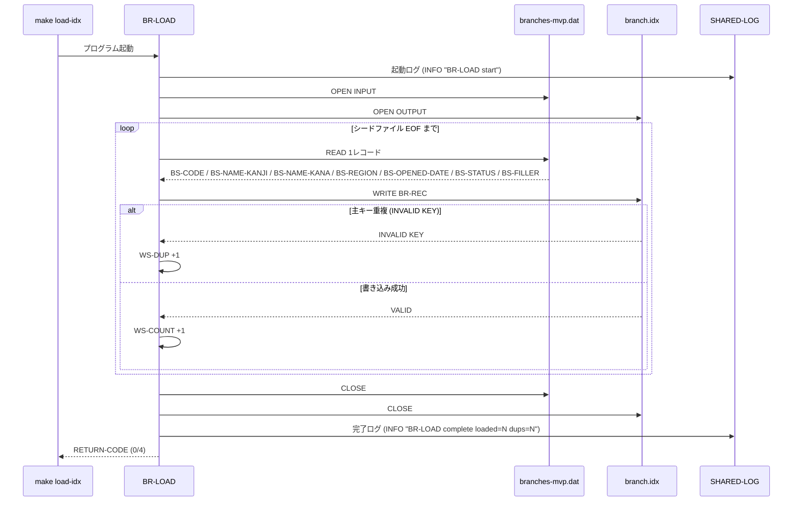
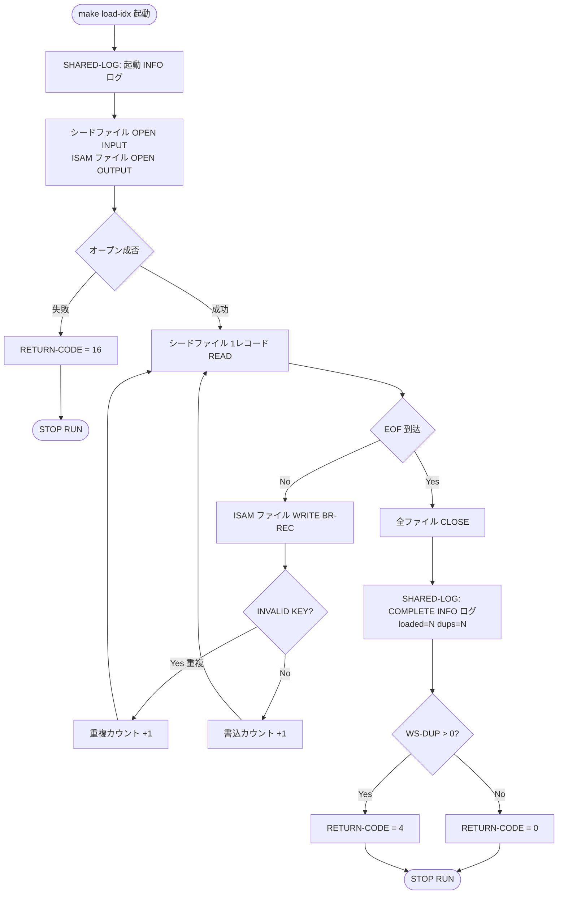

# 基本設計書 — BR-LOAD

> **サブシステム:** 02-branch
> **プログラム ID:** `BR-LOAD`
> **種別:** LOAD（初回データロード）
> **更新日:** 2026-07-06

---

## 1. プログラム概要

| 項目 | 値 |
|------|-----|
| プログラム ID | `BR-LOAD` |
| ソースファイル | `src/br-load.cob` |
| 所属サブシステム | 02-branch |
| 種別 | LOAD（初回データロード） |
| 概要 | 支店マスタのシードファイル (branches-mvp.dat) を LINE SEQUENTIAL で読み取り、BR-LOOKUP / BR-LIST-ALL / BR-LIST-BY-REGION が検索対象とする ISAM インデックスファイル (branch.idx) を生成する一回限定のデータロード処理。`make load-idx` により実行され、オンライン検索モジュール使用前に ISAM ファイルを初期化する責務を持つ。 |

---

## 2. 機能概要

### 2.1 このプログラムが「すること」
シードファイル（`data/branches-mvp.dat`：LINE SEQUENTIAL）から 1 レコードずつ支店コード・支店名（漢字/カナ）・地域コード・開設日・支店状態を読み取り、ISAM インデックスファイル（`data/branch.idx`：INDEXED, RANDOM, 主キー=BR-REC-CODE, 代替キー=BR-REC-REGION WITH DUPLICATES）へ書き込む。レコード書き込み時に主キー重複を検知した場合は当該レコードをスキップし、重複件数を加算する。処理終了時に読み書き件数と重複件数を集計し、正常終了コードを呼び出し元に返す。

### 2.2 呼出元と呼出し先
- **呼出元:** `make load-idx` ターゲット。同ターゲットは `bin/br-load` を実行する。
- **呼出先:** `CALL "SHARED-LOG"`（shared サブシステム、処理開始・完了ログ記録用）。

### 2.3 シーケンス図

---

## 3. 処理フロー

### 3.1 全体フロー（flowchart）

---

## 4. 入出力仕様

### 4.1 入力

| 項目 | 型 | 必須 | 説明 |
|------|-----|:----:|------|
| BS-CODE | PIC X(3) | ✅ | 支店コード（ISAM ファイルの主キーに対応） |
| BS-NAME-KANJI | PIC X(40) | ✅ | 支店名（漢字） |
| BS-NAME-KANA | PIC X(40) | ✅ | 支店名（カナ） |
| BS-REGION | PIC X(20) | ✅ | 地域コード（ISAM 代替キー） |
| BS-OPENED-DATE | PIC 9(8) | ✅ | 開設日（YYYYMMDD） |
| BS-STATUS | PIC X(1) | ✅ | 支店状態コード |
| BS-FILLER | PIC X(20) | | 予備領域 |

ファイル仕様：`data/branches-mvp.dat`（LINE SEQUENTIAL）。

### 4.2 出力

| 項目 | 型 | 説明 |
|------|-----|------|
| BR-REC-CODE | PIC X(3) | 支店コード（ISAM 主キー） |
| BR-REC-NAME-KANJI | PIC X(40) | 支店名（漢字） |
| BR-REC-NAME-KANA | PIC X(40) | 支店名（カナ） |
| BR-REC-REGION | PIC X(20) | 地域コード（ISAM 代替キー） |
| BR-REC-OPENED-DATE | PIC 9(8) | 開設日 |
| BR-REC-STATUS | PIC X(1) | 支店状態コード |
| BR-REC-FILLER | PIC X(20) | 予備領域 |

ファイル仕様：`data/branch.idx`（INDEXED, RANDOM, 主キー=BR-REC-CODE, 代替キー=BR-REC-REGION WITH DUPLICATES）。
生成後は `make test-unit` の前提となる検索対象ファイルでもある。

### 4.3 返却コード（概要）

補足：BR-LOOKUP / BR-LIST-ALL / BR-LIST-BY-REGION のモジュールが公開する `BR-OUT-STATUS` とは別に、本バッチプログラムはプロセス終了を示す **RETURN-CODE** で結果を伝達する。

| コード | 意味 |
|--------|------|
| 0 | 正常（EOF 到達, 読込=書込, 重複 0 件） |
| 4 | 正常（一部重複検知, 重複レコードはスキップ, 非重複レコードは書込済） |
| 16 | 異常（ファイルオープン失敗） |

---

## 5. 正常系テストケース

| # | テスト名 | 入力 | 期待出力 | 確認ポイント |
|---|---------|------|---------|------------|
| 1 | シード全レコード書込成功 | `data/branches-mvp.dat` に N 件（重複なし）の有効レコードが存在 | ISAM ファイル `data/branch.idx` に N レコード生成。SHARED-LOG へ `BR-LOAD complete loaded=N dups=0` 出力。**RETURN-CODE = 0** | ISAM 件数がシード件数と一致。ログが "BR-LOAD complete" で "dups=0" を含む。生成ファイルが BR-LOOKUP から読込可能 |
| 2 | シード内に重複コードあり（許容完了） | シード内に同一支店コードが 2 回登場。重複レコードは 1 件目のみ書き込まれ 2 件目スキップ | ISAM ファイルに (N - 重複数) レコード生成。SHARED-LOG へ dups>0 の COMPLETE ログ出力。**RETURN-CODE = 4** | 重複レコードは ISAM に存在しない（先勝ち） |

---

## 6. 異常系テストケース

| # | テスト名 | 入力 | 期待される異常 | 確認ポイント |
|---|---------|------|--------------|------------|
| 1 | シードファイルが存在しない | `data/branches-mvp.dat` を削除 or リネームしてから起動 | INPUT オープン失敗。**RETURN-CODE = 16**（処理中断） | ISAM ファイルに異常データの中途書き込みが行われない。プロセスが即時終了する |
| 2 | 出力先ディレクトリが存在しない | ISAM ファイル出力先ディレクトリ権限なし or マウント外 | OUTPUT オープン失敗。**RETURN-CODE = 16** | FATAL ログのみ出力、重複ログなし |
| 3 | 書き込み中のディスクフル / デバイスエラー | ISAM ファイル書き込み中に I/O エラー発生 | WRITE 時の FCSError > "00"。**RETURN-CODE = 16** | ISAM ファイルが中途生成になっても後続で rm * にて削除できる形。エラー内容は OS / COBOL ランタイムの FCSError に依存するため、原因特定はログと OS メッセージの突合が前提 |

---

## 参考
- ソース: [br-load.cob](../src/br-load.cob)
- ファイル定義（入力）: [fd-br-seed.cpy](../copy/private/fd-br-seed.cpy)
- ファイル定義（出力）: [fd-branch.cpy](../copy/private/fd-branch.cpy)
- 共有ログ IF: [shared-log-api.cpy](/workspace/shared/copy/shared-log-api.cpy)
- ビルド/実行定義: [Makefile](../Makefile)
