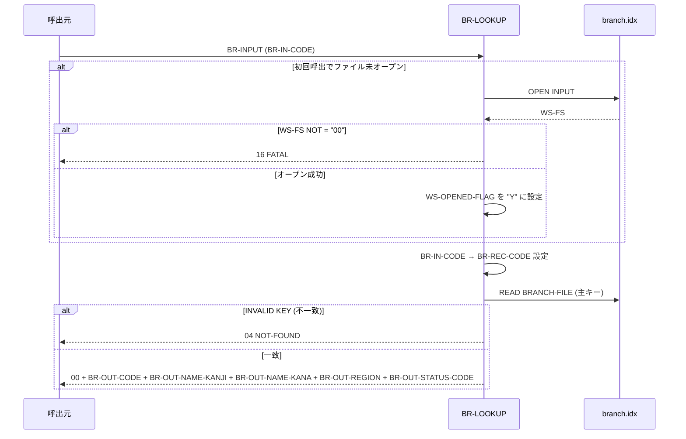

# 基本設計書 — BR-LOOKUP

> **サブシステム:** 02-branch
> **プログラム ID:** `BR-LOOKUP`
> **種別:** オンライン（CALL 呼出モジュール）
> **更新日:** 2026-07-06

---

## 1. プログラム概要

| 項目 | 値 |
|------|-----|
| プログラム ID | `BR-LOOKUP` |
| ソースファイル | `src/br-lookup.cob` |
| 所属サブシステム | 02-branch |
| 種別 | オンライン（CALL 呼出モジュール） |
| 概要 | 支店コード (PIC X(3)) を入力とし、ISAM インデックスファイル (branch.idx) を直接検索して支店情報（支店名・地域・状態コード等）を返す。初回呼出時にファイルをオープンし、オープン中にファイルアクセスエラーを検知した場合は FATAL を返す。 |

---

## 2. 機能概要

### 2.1 このプログラムが「すること」
支店コード (BR-IN-CODE) による主キー検索で 1 件の支店レコードを取得し、出力領域 (BR-OUTPUT) へ支店名（漢字/カナ）、地域コード、支店状態コードを設定して返却する。該当レコードが存在しない場合は 04 (NOT-FOUND)、ファイルオープン失敗時は 16 (FATAL) を返す。その他の入力として地域コード・操作コードを受付けるが、本モジュールでは主キー検索のみを実施する。

### 2.2 呼出元と呼出し先
- **呼出元:** テストドライバ `BRTEST`。オンライントランザクション、または他バッチプログラムからの `CALL "BR-LOOKUP"` 呼出しを想定。
- **呼出先:** なし（独立モジュール。他プログラムを CALL しない）。

### 2.3 シーケンス図



---

## 3. 処理フロー

### 3.1 全体フロー（flowchart）

```mermaid
flowchart TD
    START([開始：MAIN-LOGIC]) --> INIT[BR-OUT-STATUS = 00 /</>BR-OUT 各項目 SPACES クリア]
    INIT --> OPENCHK{WS-OPENED-FLAG<br/>= "N"?}
    OPENCHK -->|Yes| OPEN[BRANCH-FILE OPEN INPUT]
    OPEN --> FSCHK{WS-FS = "00"?}
    FSCHK -->|No| FATAL[16 FATAL で GOBACK]
    FSCHK -->|Yes| FLAG[WS-OPENED-FLAG = "Y"]
    FLAG --> SETKEY
    OPENCHK -->|No| SETKEY[BR-IN-CODE → BR-REC-CODE]
    SETKEY --> READ[BRANCH-FILE READ]
    READ --> KEYCHK{INVALID KEY?}
    KEYCHK -->|Yes| NF[04 NOT-FOUND]
    KEYCHK -->|No| OUT[BR-REC → BR-OUT に転記 / STATUS = 00]
    NF --> END([GOBACK])
    OUT --> END
    FATAL --> END
```

---

## 4. 入出力仕様

### 4.1 入力

| 項目 | 型 | 必須 | 説明 |
|------|-----|:----:|------|
| BR-IN-CODE | PIC X(3) | ✅ | 検索対象の支店コード（ISAM 主キー） |
| BR-IN-REGION | PIC X(20) | | 地域コード（本モジュールでは不使用） |
| BR-IN-OP | PIC X(1) | | 操作コード（L:単一検索 / R:地域一括 / A:全件）。本モジュールでは BR-IN-OP に依らず 1 コード検索 |

※ ファイル仕様: `data/branch.idx`（INDEXED, RANDOM, 主キー=BR-REC-CODE, 代替キー=BR-REC-REGION WITH DUPLICATES）。

### 4.2 出力

| 項目 | 型 | 説明 |
|------|-----|------|
| BR-OUT-STATUS | PIC 9(2) | 返却コード（00/04/16 等） |
| BR-OUT-CODE | PIC X(3) | 支店コード |
| BR-OUT-NAME-KANJI | PIC X(40) | 支店名（漢字） |
| BR-OUT-NAME-KANA | PIC X(40) | 支店名（カナ） |
| BR-OUT-REGION | PIC X(20) | 地域コード |
| BR-OUT-STATUS-CODE | PIC X(1) | 支店状態コード |

### 4.3 返却コード（概要）

| コード | 意味 |
|--------|------|
| 00 | 正常（該当支店コード発見、1 件返却） |
| 04 | NOT-FOUND（該当支店コードなし） |
| 16 | FATAL（branch.idx オープン失敗） |

---

## 5. 正常系テストケース

| # | テスト名 | 入力 | 期待出力 | 確認ポイント |
|---|---------|------|---------|------------|
| 1 | 先頭コード検索 | BR-IN-CODE="001", BR-IN-OP="L" | STATUS=00, BR-OUT-CODE="001", BR-OUT-NAME-KANJI ≠ SPACES | ISAM 先頭レコードがヒットし、支店名が正しく返却されること |
| 2 | 中間コード検索 | BR-IN-CODE="005" | STATUS=00, BR-OUT-REGION(1:5)="Osaka" | 地域コード "Osaka" の支店がヒットし、地域が正しく返却されること |
| 3 | 最終コード検索 | BR-IN-CODE="010" | STATUS=00, BR-OUT-REGION ≠ SPACES | ISAM 末尾付近の支店コードがヒットすること |
| 4 | 2 回目呼出し（再利用） | BR-IN-CODE="001" → BR-IN-CODE="005" を連続で実行 | いずれも STATUS=00 | 2 回目はファイル再オープンなしで検索できること |

---

## 6. 異常系テストケース

| # | テスト名 | 入力 | 期待される異常 | 確認ポイント |
|---|---------|------|--------------|------------|
| 1 | 存在しないコード検索 | BR-IN-CODE="999", BR-IN-OP="L" | STATUS=04 (NOT-FOUND) | ISAM を読んでも該当なしの場合に 04 で返ること |
| 2 | ファイル未生成のbranch.idx | branch.idx を削除してからオープンのみ試みる | STATUS=16 (FATAL) | 初回 OPEN 失敗を検知して即座に 16 で返ること |
| 3 | 空コード検索 | BR-IN-CODE="   " | STATUS=04 (NOT-FOUND) | 空白コードは該当なしとして扱われること |

---

## 参考
- ソース: [br-lookup.cob](../src/br-lookup.cob)
- 公開 IF: [br-api.cpy](../copy/api/br-api.cpy)
- ファイル定義: [fd-branch.cpy](../copy/private/fd-branch.cpy)
- ビルド/テスト定義: [Makefile](../Makefile)
