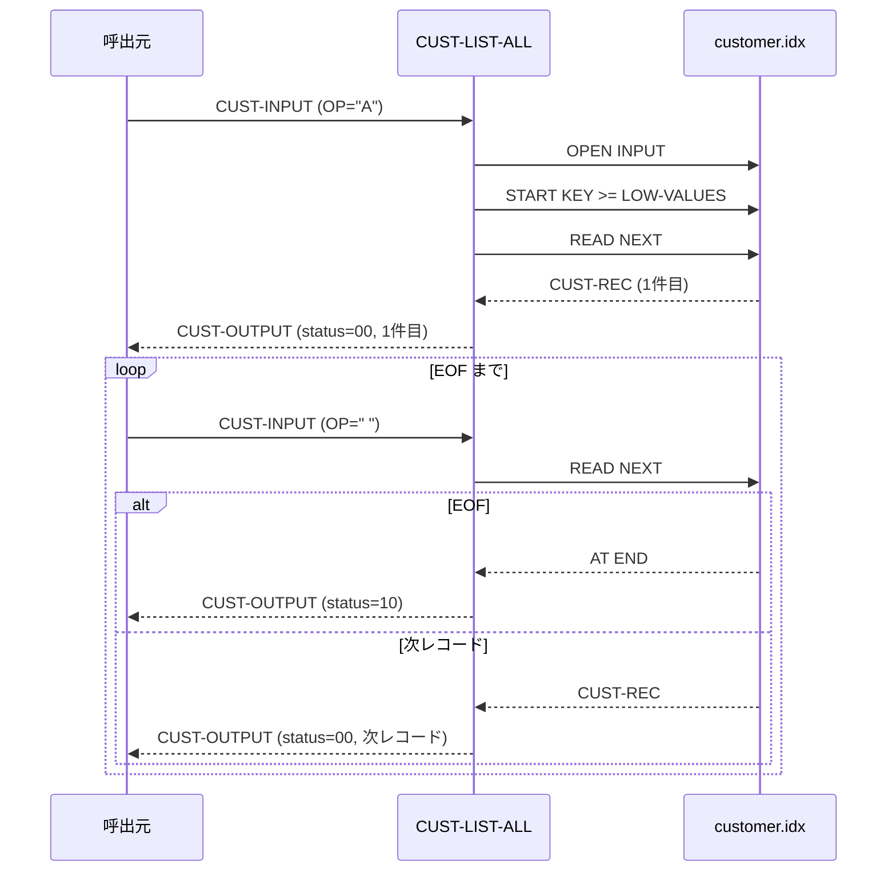

# 基本設計書 — CUST-LIST-ALL

> **サブシステム:** 03-customer
> **プログラム ID:** `CUST-LIST-ALL`
> **種別:** オンライン
> **更新日:** 2026-07-06

---

## 1. プログラム概要

| 項目 | 値 |
|------|-----|
| プログラム ID | `CUST-LIST-ALL` |
| ソースファイル | `src/cust-list-all.cob` |
| 所属サブシステム | 03-customer |
| 種別 | オンライン |
| 概要 | ISAM ファイル `customer.idx` の全レコードを主キー順にスキャンし、呼出元へ 1 件ずつ順次返却するカーソル型検索。初回呼出で全レコード先頭へ位置付け、以降は次レコードを返却し、EOF 到達時にステータス 10 を返してスキャンを終了する。 |

---

## 2. 機能概要

### 2.1 このプログラムが「すること」
顧客マスタの全件スキャンを行い、1 回の呼出で 1 件の顧客情報を返却する。
- 初回（`CUST-IN-OP = "A"`）：ファイル先頭へ位置付け（START KEY >= LOW-VALUES）し、先頭レコードを返却する。
- 2 回目以降（`CUST-IN-OP = " "`）：次レコードを READ NEXT で返却する。
- EOF 到達時：ステータス 10 (EOF) を返却する。

### 2.2 呼出元と呼出し先
- **呼出元:** オンライントランザクション、またはテストドライバ `CUSTTEST`。
- **呼出先:** なし（外部プログラム呼出なし）。ISAM ファイルに直接アクセスする。

### 2.3 シーケンス図



---

## 3. 処理フロー

### 3.1 全体フロー（flowchart）

```mermaid
flowchart TD
    START([開始]) --> INIT[CUST-OUTPUT 初期化 (status=0)]
    INIT --> OPEN_CHK{OPEN 済?}
    OPEN_CHK -->|No| OPEN[OPEN INPUT customer.idx]
    OPEN --> OPEN_RES{FS = 00?}
    OPEN_RES -->|No| ERR_FATAL[status = 16 で GOBACK]
    OPEN_RES -->|Yes| OP_CHK
    OPEN_CHK -->|Yes| OP_CHK{CUST-IN-OP?}

    OP_CHK -->|A 先頭設定| START[START KEY >= LOW-VALUES]
    START --> START_RES{INVALID KEY?}
    START_RES -->|Yes| ERR_EOF[status = 10 で GOBACK]
    START_RES -->|No| READ[READ NEXT]

    OP_CHK -->|その他| READ
    READ --> EOF_CHK{AT END?}
    EOF_CHK -->|Yes| RET_EOF[status = 10 で GOBACK]
    EOF_CHK -->|No| COPY[レコード → CUST-OUTPUT]
    COPY --> OK[status = 00]
    OK --> END([GOBACK])
    RET_EOF --> END
    ERR_FATAL --> END
    ERR_EOF --> END
```

---

## 4. 入出力仕様

### 4.1 入力

| 項目 | 型 | 必須 | 説明 |
|------|-----|:----:|------|
| CUST-IN-OP | PIC X(1) | ✅ | 操作コード。"A"=先頭位置付け、" "=次レコード読取 |

※ 入力エリア `CUST-INPUT` は `cust-api.cpy` で定義されるが、本プログラムは `CUST-IN-OP` のみ使用する。

### 4.2 出力

| 項目 | 型 | 説明 |
|------|-----|------|
| CUST-OUT-STATUS | PIC 9(2) | 処理結果コード（下記返却コード参照） |
| CUST-OUT-ID | PIC 9(10) | 顧客 ID |
| CUST-OUT-KANA | PIC X(50) | 顧客カナ名 |
| CUST-OUT-KANJI | PIC X(60) | 顧客漢字名 |
| CUST-OUT-PHONE | PIC X(15) | 電話番号 |
| CUST-OUT-ADDRESS | PIC X(200) | 住所 |
| CUST-OUT-STATUS-CODE | PIC X(1) | 顧客ステータス |

### 4.3 返却コード（概要）

| コード | 意味 |
|--------|------|
| 00 | 正常（1 レコード返却） |
| 10 | EOF（スキャン終了） |
| 16 | FATAL（ファイルオープン失敗） |

---

## 5. 正常系テストケース

| # | テスト名 | 入力 | 期待出力 | 確認ポイント |
|---|---------|------|---------|------------|
| 1 | 全件スキャン | OP="A" で開始し、OP=" " で順次スキャン | 全 101 件（システム 1 + 顧客 100）を順次取得し、最後に status=10 | テストドライバでは list-all=101 件が期待通り返ること |
| 2 | 中間位置からの継続読取 | OP="A" で 1 件取得後、OP=" " で継続 | 1 件目の次のレコード（主キー順）が返ること | レコードが主キー順で重複・欠落なく返ること |

---

## 6. 異常系テストケース

| # | テスト名 | 入力 | 期待される異常 | 確認ポイント |
|---|---------|------|--------------|------------|
| 1 | ファイル未配置 | customer.idx を削除 or リネーム | status = 16 | OPEN INPUT 失敗時に FATAL が返ること |
| 2 | 空ファイルスキャン | レコード 0 件の customer.idx に対して OP="A" | status = 10（START INVALID KEY） | 即座に EOF となり GOBACK すること |

---

## 参考
- ソース: [cust-list-all.cob](../src/cust-list-all.cob)
- 公開 IF: [cust-api.cpy](../copy/api/cust-api.cpy)
- ファイル定義: [fd-customer.cpy](../copy/private/fd-customer.cpy)
- テスト: [cust-test.cob](../tests/unit/cust-test.cob)
- ビルド/実行定義: [Makefile](../Makefile)
