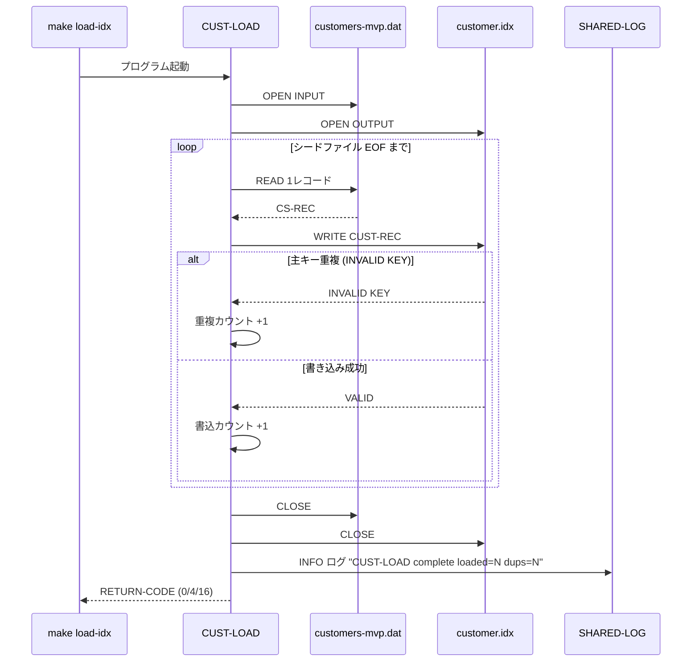
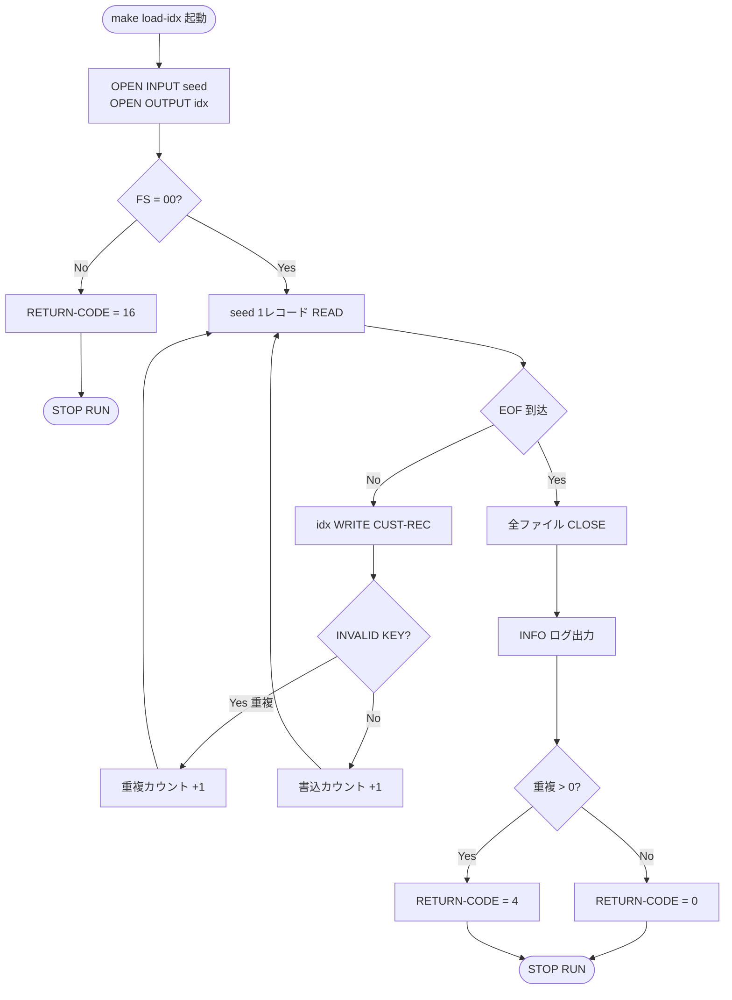

# 基本設計書 — CUST-LOAD

> **サブシステム:** 03-customer
> **プログラム ID:** `CUST-LOAD`
> **種別:** LOAD（初回データロード）
> **更新日:** 2026-07-06

---

## 1. プログラム概要

| 項目 | 値 |
|------|-----|
| プログラム ID | `CUST-LOAD` |
| ソースファイル | `src/cust-load.cob` |
| 所属サブシステム | 03-customer |
| 種別 | LOAD（初回データロード） |
| 概要 | 顧客マスタのシードファイル（`customers-mvp.dat`：LINE SEQUENTIAL）から 1 レコードずつ顧客データを読み取り、ISAM インデックスファイル（`customer.idx`：INDEXED, RANDOM, 主キー＝顧客 ID）へ書き込む一回限定のデータロード処理。主キー重複時は当該レコードをスキップし、完了後に読込件数・重複件数を集計して RETURN-CODE で結果を返す。 |

---

## 2. 機能概要

### 2.1 このプログラムが「すること」
シードファイルから顧客レコードを順次読み取り、ISAM ファイルへ書き込む。主キー重複時は重複カウントをインクリメントしてスキップし、正常書き込み時は書込カウントをインクリメントする。処理完了後は SHARED-LOG で完了ログを出力し、重複の有無に応じた RETURN-CODE で終了する。

### 2.2 呼出元と呼出し先
- **呼出元:** `make load-idx` ターゲット。同ターゲットは `bin/cust-load` を実行する。
- **呼出先:** `CALL "SHARED-LOG"`（サブシステム横断の共有ログユーティリティ）。処理完了時の INFO ログを出力する。

### 2.3 シーケンス図

---

## 3. 処理フロー

### 3.1 全体フロー（flowchart）

---

## 4. 入出力仕様

### 4.1 入力

| 項目 | 型 | 必須 | 説明 |
|------|-----|:----:|------|
| CS-ID | PIC 9(10) | ✅ | 顧客 ID（ISAM ファイルの主キー） |
| CS-KANA | PIC X(50) | ✅ | 顧客カナ名 |
| CS-KANJI | PIC X(60) | ✅ | 顧客漢字名 |
| CS-PHONE | PIC X(15) | ✅ | 電話番号 |
| CS-ADDRESS | PIC X(200) | ✅ | 住所 |
| CS-OPENED-DATE | PIC 9(8) | ✅ | 開設日 |
| CS-STATUS | PIC X(1) | ✅ | 顧客ステータス |
| CS-CREATED-TS | PIC 9(14) | | 作成タイムスタンプ |
| CS-UPDATED-TS | PIC 9(14) | | 更新タイムスタンプ |
| CS-TIER | PIC X(1) | | 顧客ティア |
| CS-FILLER | PIC X(19) | | 予備領域 |

ファイル仕様：`data/customers-mvp.dat`（LINE SEQUENTIAL）。

### 4.2 出力

| 項目 | 型 | 説明 |
|------|-----|------|
| CR-ID | PIC 9(10) | 顧客 ID（ISAM 主キー） |
| CR-KANA | PIC X(50) | 顧客カナ名 |
| CR-KANJI | PIC X(60) | 顧客漢字名 |
| CR-PHONE | PIC X(15) | 電話番号 |
| CR-ADDRESS | PIC X(200) | 住所 |
| CR-OPENED-DATE | PIC 9(8) | 開設日 |
| CR-STATUS | PIC X(1) | 顧客ステータス |
| CR-CREATED-TS | PIC 9(14) | 作成タイムスタンプ |
| CR-UPDATED-TS | PIC 9(14) | 更新タイムスタンプ |
| CR-TIER | PIC X(1) | 顧客ティア |
| CR-FILLER | PIC X(19) | 予備領域 |

ファイル仕様：`data/customer.idx`（INDEXED, RANDOM, 主キー = CR-ID）。

### 4.3 返却コード（概要）

補足：CUST-LOOKUP / CUST-LIST-ALL / CUST-SEARCH-BY-KANA / CUST-SEARCH-BY-PHONE が公開する `CUST-OUT-STATUS` とは別に、本バッチプログラムはプロセス終了を示す **RETURN-CODE** で結果を伝達する。

| コード | 意味 |
|--------|------|
| 0 | 正常（EOF 到達、重複 0 件） |
| 4 | 正常（一部重複検知、重複レコードはスキップ） |
| 16 | 異常（ファイルオープン失敗） |

---

## 5. 正常系テストケース

| # | テスト名 | 入力 | 期待出力 | 確認ポイント |
|---|---------|------|---------|------------|
| 1 | シード全レコード書込成功 | `data/customers-mvp.dat` に N 件（重複なし）の有効レコードが存在 | ISAM ファイル `data/customer.idx` に N レコード生成。SHARED-LOG へ `CUST-LOAD complete loaded=N dups=0` 出力。**RETURN-CODE = 0** | ISAM 件数がシード件数と一致。ログが "dups=0" を含む |
| 2 | シード内に重複 ID あり（許容完了） | シード内に同一顧客 ID が 2 回登場 | ISAM ファイルに (N - 重複数) レコード生成。**RETURN-CODE = 4** | 重複レコードは ISAM に存在しない（先勝ち） |

---

## 6. 異常系テストケース

| # | テスト名 | 入力 | 期待される異常 | 確認ポイント |
|---|---------|------|--------------|------------|
| 1 | シードファイルが存在しない | `data/customers-mvp.dat` を削除 or リネームしてから起動 | INPUT オープン失敗。**RETURN-CODE = 16**（処理中断） | ISAM ファイルに異常データの中途書き込みが行われない |
| 2 | 出力先ディレクトリが存在しない | ISAM ファイル出力先ディレクトリ権限なし or マウント外 | OUTPUT オープン失敗。**RETURN-CODE = 16** | 即時終了する |

---

## 参考
- ソース: [cust-load.cob](../src/cust-load.cob)
- ファイル定義（入力）: [fd-cust-seed.cpy](../copy/private/fd-cust-seed.cpy)
- ファイル定義（出力）: [fd-customer.cpy](../copy/private/fd-customer.cpy)
- 共有ログ IF: [shared-log-api.cpy](/workspace/shared/copy/shared-log-api.cpy)
- ビルド/実行定義: [Makefile](../Makefile)
