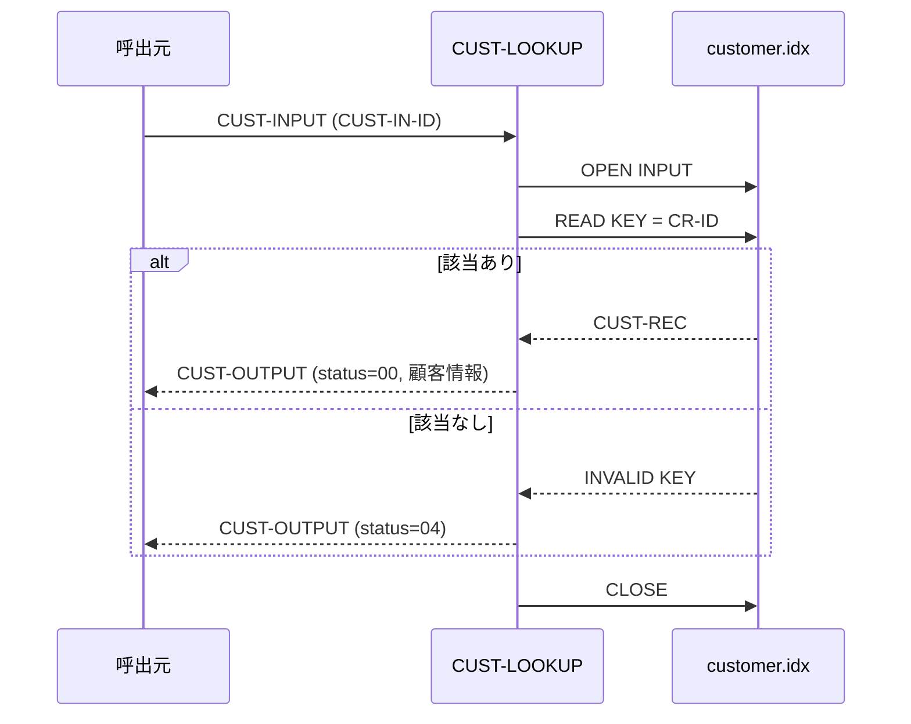

# 基本設計書 — CUST-LOOKUP

> **サブシステム:** 03-customer
> **プログラム ID:** `CUST-LOOKUP`
> **種別:** オンライン
> **更新日:** 2026-07-06

---

## 1. プログラム概要

| 項目 | 値 |
|------|-----|
| プログラム ID | `CUST-LOOKUP` |
| ソースファイル | `src/cust-lookup.cob` |
| 所属サブシステム | 03-customer |
| 種別 | オンライン |
| 概要 | 顧客 ID をキーに ISAM ファイルから顧客 1 件をランダム検索し、顧客基本情報（カナ・漢字・電話・住所・開設日・ステータス）を返却する。該当しない場合は NOT-FOUND を返す。 |

---

## 2. 機能概要

### 2.1 このプログラムが「すること」
呼出元から受け取った顧客 ID を主キーに `customer.idx` を RANDOM READ し、該当レコードの顧客基本情報を `CUST-OUTPUT` に設定して返却する。
ファイルオープン失敗時は FATAL(16)、該当レコードなし時は NOT-FOUND(04) を返却する。

### 2.2 呼出元と呼出し先
- **呼出元:** オンライントランザクション、またはテストドライバ `CUSTTEST`。
- **呼出先:** なし（外部プログラム呼出なし）。ISAM ファイルに直接アクセスする。

### 2.3 シーケンス図



---

## 3. 処理フロー

### 3.1 全体フロー（flowchart）

```mermaid
flowchart TD
    START([開始]) --> INIT[CUST-OUTPUT 初期化 (status=0)]
    INIT --> OPEN[OPEN INPUT customer.idx]
    OPEN --> OPEN_CHK{FS = 00?}
    OPEN_CHK -->|No| ERR_FATAL[status = 16 で GOBACK]
    OPEN_CHK -->|Yes| MOVE_ID[CUST-IN-ID → CR-ID]
    MOVE_ID --> READ[READ CUSTOMER-FILE]
    READ --> KEY_CHK{INVALID KEY?}
    KEY_CHK -->|Yes| ERR_NF[status = 04]
    KEY_CHK -->|No| COPY[レコード → CUST-OUTPUT]
    COPY --> OK[status = 00]
    OK --> CLOSE[CLOSE]
    ERR_NF --> CLOSE
    CLOSE --> END([GOBACK])
    ERR_FATAL --> END
```

---

## 4. 入出力仕様

### 4.1 入力

| 項目 | 型 | 必須 | 説明 |
|------|-----|:----:|------|
| CUST-IN-ID | PIC 9(10) | ✅ | 検索対象の顧客 ID（主キー） |

※ 入力エリア `CUST-INPUT` は `cust-api.cpy` で定義されるが、本プログラムは `CUST-IN-ID` のみ使用する。

### 4.2 出力

| 項目 | 型 | 説明 |
|------|-----|------|
| CUST-OUT-STATUS | PIC 9(2) | 処理結果コード（下記返却コード参照） |
| CUST-OUT-ID | PIC 9(10) | 顧客 ID |
| CUST-OUT-KANA | PIC X(50) | 顧客カナ名 |
| CUST-OUT-KANJI | PIC X(60) | 顧客漢字名 |
| CUST-OUT-PHONE | PIC X(15) | 電話番号 |
| CUST-OUT-ADDRESS | PIC X(200) | 住所 |
| CUST-OUT-OPENED | PIC 9(8) | 開設日（YYYYMMDD） |
| CUST-OUT-STATUS-CODE | PIC X(1) | 顧客ステータス |

### 4.3 返却コード（概要）

| コード | 意味 |
|--------|------|
| 00 | 正常（該当レコード返却） |
| 04 | NOT-FOUND（該当顧客なし） |
| 16 | FATAL（ファイルオープン失敗） |

---

## 5. 正常系テストケース

| # | テスト名 | 入力 | 期待出力 | 確認ポイント |
|---|---------|------|---------|------------|
| 1 | 先頭 ID 検索 | CUST-IN-ID = 1 | status=00, CUST-OUT-ID=1 | 先頭レコードが正しく返ること |
| 2 | 中間 ID 検索 | CUST-IN-ID = 5 | status=00, CUST-OUT-ID=5 | 中間レコードが正しく返ること |
| 3 | 顧客情報の完全性 | CUST-IN-ID = 1 | status=00, 全項目がスペース以外 | ID 以外の項目（カナ・漢字・電話等）が欠損なく返ること |

---

## 6. 異常系テストケース

| # | テスト名 | 入力 | 期待される異常 | 確認ポイント |
|---|---------|------|--------------|------------|
| 1 | 存在しない ID | CUST-IN-ID = 9999999999 | status = 04 | INVALID KEY が正しく検知され NOT-FOUND で返ること |
| 2 | ファイル未配置 | customer.idx を削除 or リネームして起動 | status = 16 | OPEN INPUT のファイルステータスにより FATAL が返ること |

---

## 参考
- ソース: [cust-lookup.cob](../src/cust-lookup.cob)
- 公開 IF: [cust-api.cpy](../copy/api/cust-api.cpy)
- ファイル定義: [fd-customer.cpy](../copy/private/fd-customer.cpy)
- テスト: [cust-test.cob](../tests/unit/cust-test.cob)
- ビルド/実行定義: [Makefile](../Makefile)
