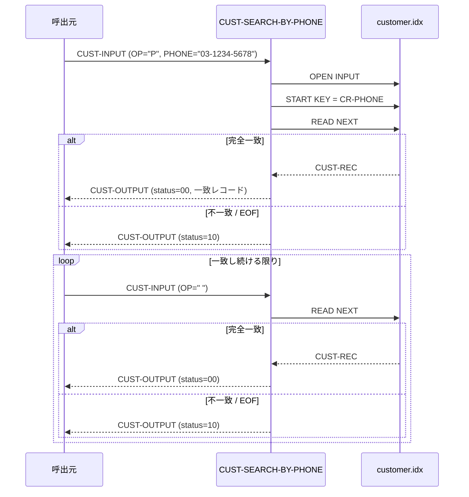

# 基本設計書 — CUST-SEARCH-BY-PHONE

> **サブシステム:** 03-customer
> **プログラム ID:** `CUST-SEARCH-BY-PHONE`
> **種別:** オンライン
> **更新日:** 2026-07-06

---

## 1. プログラム概要

| 項目 | 値 |
|------|-----|
| プログラム ID | `CUST-SEARCH-BY-PHONE` |
| ソースファイル | `src/cust-search-by-phone.cob` |
| 所属サブシステム | 03-customer |
| 種別 | オンライン |
| 概要 | 電話番号を完全一致キーとして `customer.idx` 代替キー（CR-PHONE）をスキャンし、該当顧客を 1 件ずつ順次返却するカーソル型検索。電話番号変更の際にも同一電話番号を持つ複数顧客が紐付けられている可能性を考慮した WITH DUPLICATES スキャンに対応する。 |

---

## 2. 機能概要

### 2.1 このプログラムが「すること」
電話番号の完全一致検索を行い、1 回の呼出で 1 件の顧客情報を返却する。
- 初回（`CUST-IN-OP = "P"`）：検索キー（電話番号）を代替キーに設定し START KEY = で先頭位置を特定、先頭レコードを返却する。
- 2 回目以降（`CUST-IN-OP = " "`）：次レコードを READ NEXT で返却する。
- 電話番号不一致 / EOF 到達時：ステータス 10 (EOF) を返却する。

### 2.2 呼出元と呼出し先
- **呼出元:** オンライントランザクション、またはテストドライバ `CUSTTEST`。
- **呼出先:** なし（外部プログラム呼出なし）。ISAM ファイルに直接アクセスする。

### 2.3 シーケンス図



---

## 3. 処理フロー

### 3.1 全体フロー（flowchart）

```mermaid
flowchart TD
    START([開始]) --> INIT[CUST-OUTPUT 初期化 (status=0)]
    INIT --> OPEN_CHK{OPEN 済?}
    OPEN_CHK -->|No| OPEN[OPEN INPUT customer.idx]
    OPEN --> OPEN_RES{FS = 00?}
    OPEN_RES -->|No| ERR_FATAL[status = 16 で GOBACK]
    OPEN_RES -->|Yes| OP_CHK
    OPEN_CHK -->|Yes| OP_CHK{CUST-IN-OP?}

    OP_CHK -->|P 先頭設定| START[START KEY = CR-PHONE]
    START --> START_RES{INVALID KEY?}
    START_RES -->|Yes| ERR_EOF[status = 10 で GOBACK]
    START_RES -->|No| READ[READ NEXT]

    OP_CHK -->|その他| READ
    READ --> EOF_CHK{AT END?}
    EOF_CHK -->|Yes| RET_EOF[status = 10 で GOBACK]
    EOF_CHK -->|No| PHONE_CHK{PHONE 一致?}
    PHONE_CHK -->|Yes| COPY[レコード → CUST-OUTPUT]
    COPY --> OK[status = 00]
    PHONE_CHK -->|No| RET_EOF2[status = 10 で GOBACK]
    OK --> END([GOBACK])
    RET_EOF --> END
    RET_EOF2 --> END
    ERR_FATAL --> END
    ERR_EOF --> END
```

---

## 4. 入出力仕様

### 4.1 入力

| 項目 | 型 | 必須 | 説明 |
|------|-----|:----:|------|
| CUST-IN-PHONE | PIC X(15) | ✅ (OP="P" 時) | 検索する電話番号（完全一致） |
| CUST-IN-OP | PIC X(1) | ✅ | 操作コード。"P"=先頭位置付け、" "=次レコード読取 |

※ 入力エリア `CUST-INPUT` は `cust-api.cpy` で定義される。

### 4.2 出力

| 項目 | 型 | 説明 |
|------|-----|------|
| CUST-OUT-STATUS | PIC 9(2) | 処理結果コード（下記返却コード参照） |
| CUST-OUT-ID | PIC 9(10) | 顧客 ID |
| CUST-OUT-KANA | PIC X(50) | 顧客カナ名 |
| CUST-OUT-KANJI | PIC X(60) | 顧客漢字名 |
| CUST-OUT-PHONE | PIC X(15) | 電話番号 |
| CUST-OUT-ADDRESS | PIC X(200) | 住所 |
| CUST-OUT-STATUS-CODE | PIC X(1) | 顧客ステータス |

### 4.3 返却コード（概要）

| コード | 意味 |
|--------|------|
| 00 | 正常（完全一致レコード返却） |
| 10 | EOF（スキャン終了 — CASE-EOF・不一致のいずれか） |
| 16 | FATAL（ファイルオープン失敗） |

---

## 5. 正常系テストケース

| # | テスト名 | 入力 | 期待出力 | 確認ポイント |
|---|---------|------|---------|------------|
| 1 | 電話番号完全一致 | OP="P", PHONE="03-1234-5678" | 1 件以上の一致レコード（status=00） | 該当顧客が順次返ること |
| 2 | 次レコードの継続読取（DUPLICATES） | OP=" " で順次スキャン | 同一電話番号を持つ顧客がすべて返り、次不一致で status=10 | WITH DUPLICATES による複数件取得が正しく機能すること |

---

## 6. 異常系テストケース

| # | テスト名 | 入力 | 期待される異常 | 確認ポイント |
|---|---------|------|--------------|------------|
| 1 | 電話番号不一致 | OP="P", PHONE="00-0000-0000" | status = 10 | START 直後に一致せず EOF が返ること |
| 2 | ファイル未配置 | customer.idx を削除 or リネーム | status = 16 | OPEN INPUT 失敗時に FATAL が返ること |

---

## 参考
- ソース: [cust-search-by-phone.cob](../src/cust-search-by-phone.cob)
- 公開 IF: [cust-api.cpy](../copy/api/cust-api.cpy)
- ファイル定義: [fd-customer.cpy](../copy/private/fd-customer.cpy)
- ビルド/実行定義: [Makefile](../Makefile)
