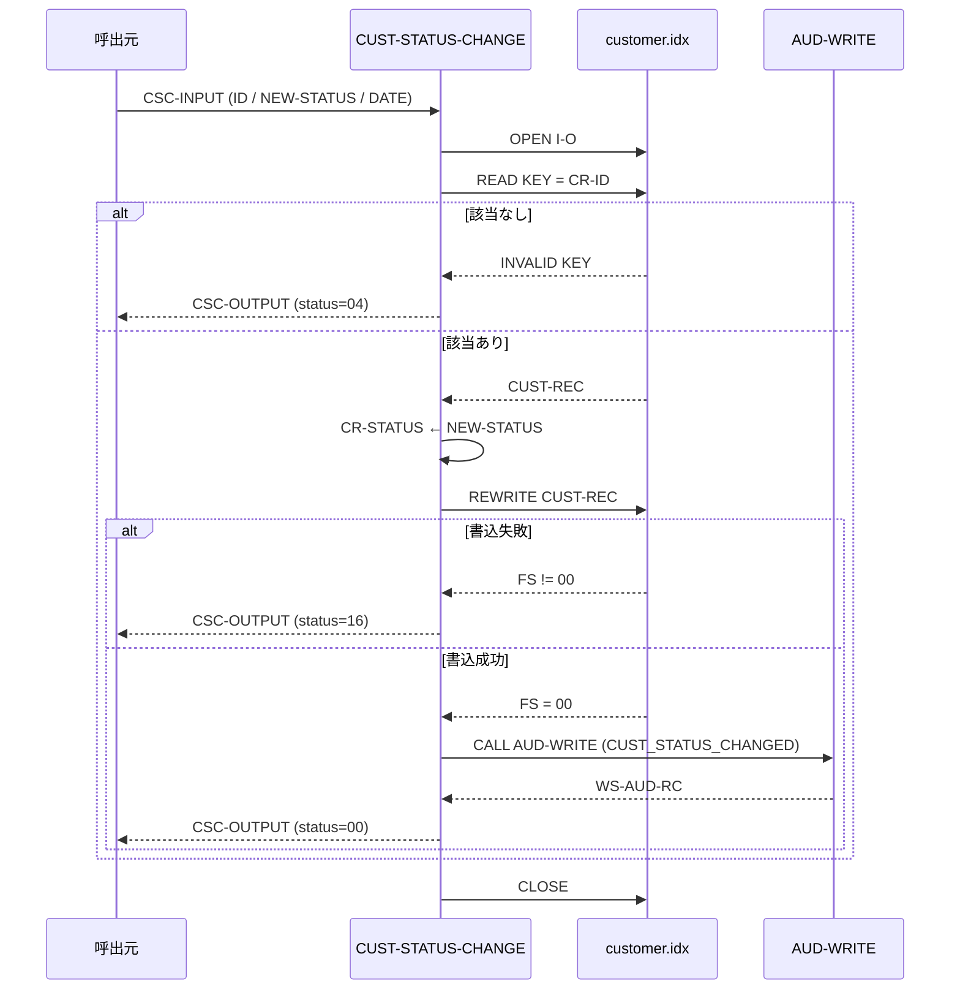

# 基本設計書 — CUST-STATUS-CHANGE

> **サブシステム:** 03-customer
> **プログラム ID:** `CUST-STATUS-CHANGE`
> **種別:** オンライン
> **更新日:** 2026-07-06

---

## 1. プログラム概要

| 項目 | 値 |
|------|-----|
| プログラム ID | `CUST-STATUS-CHANGE` |
| ソースファイル | `src/cust-status-change.cob` |
| 所属サブシステム | 03-customer |
| 種別 | オンライン |
| 概要 | 顧客 ID をキーに ISAM から該当レコードをランダム検索し、顧客ステータスを新しい値に更新するトランザクション更新処理。正常更新後は監査証拠（AUD-WRITE）を記録し、ファイルオープン/読取/書込エラー時は FATAL/NOT-FOUND を返却する。 |

---

## 2. 機能概要

### 2.1 このプログラムが「すること」
呼出元から受け取った顧客 ID を主キーに `customer.idx` を RANDOM READ し、取得レコードの `CR-STATUS` を新たなステータスに更新（REWRITE）する。更新が成功した後、サブシステム横断の監査モジュール `AUD-WRITE` を呼び出してステータス変更イベントを JSON 形式で記録する。

### 2.2 呼出元と呼出し先
- **呼出元:** オンライントランザクション、またはテストドライバ `CUSTTEST`。
- **呼出先:** `CALL "AUD-WRITE"`（サブシステム横断の監査証拠書き込みユーティリティ）。ステータス変更イベントを監査証拠として残す。

### 2.3 シーケンス図



---

## 3. 処理フロー

### 3.1 全体フロー（flowchart）

```mermaid
flowchart TD
    START([開始]) --> INIT[CSC-OUTPUT 初期化 (status=0)]
    INIT --> OPEN[OPEN I-O customer.idx]
    OPEN --> OPEN_CHK{FS = 00?}
    OPEN_CHK -->|No| ERR_FATAL[status = 16 で GOBACK]
    OPEN_CHK -->|Yes| MOVE_ID[CSC-ID → CR-ID]
    MOVE_ID --> READ[READ CUSTOMER-FILE]
    READ --> KEY_CHK{INVALID KEY?}
    KEY_CHK -->|Yes| ERR_NF[status = 04]
    KEY_CHK -->|No| UPDATE[CR-STATUS ← NEW-STATUS]
    UPDATE --> REWRITE[REWRITE CUST-REC]
    REWRITE --> WRITE_CHK{FS = 00?}
    WRITE_CHK -->|No| ERR_WRITE[status = 16, CLOSE]
    WRITE_CHK -->|Yes| AUDIT[CALL AUD-WRITE]
    AUDIT --> OK[status = 00]
    OK --> CLOSE[CLOSE]
    ERR_NF --> CLOSE
    WRITE_CHK -->|Yes| AUDIT
    CLOSE --> END([GOBACK])
    ERR_FATAL --> END
    ERR_WRITE --> END
```

---

## 4. 入出力仕様

### 4.1 入力

`CUST-STATUS-CHANGE` は `cust-api.cpy` の共通リンクではなく、専用の `CSC-INPUT` を使用する。

| 項目 | 型 | 必須 | 説明 |
|------|-----|:----:|------|
| CSC-ID | PIC 9(10) | ✅ | ステータス変更対象の顧客 ID |
| CSC-NEW-STATUS | PIC X(1) | ✅ | 新しい顧客ステータス |
| CSC-BUSINESS-DATE | PIC 9(8) | ✅ | 業務日付（YYYYMMDD）。監査証拠に記録される。 |

### 4.2 出力

| 項目 | 型 | 説明 |
|------|-----|------|
| CSC-OUT-STATUS | PIC 9(2) | 処理結果コード（下記返却コード参照） |

### 4.3 返却コード（概要）

| コード | 意味 |
|--------|------|
| 00 | 正常（ステータス更新・監査証拠出力済） |
| 04 | NOT-FOUND（該当顧客なし） |
| 16 | FATAL（ファイルオープン失敗 or 書込失敗） |

---

## 5. 正常系テストケース

| # | テスト名 | 入力 | 期待出力 | 確認ポイント |
|---|---------|------|---------|------------|
| 1 | ステータス更新 | CSC-ID=2, NEW-STATUS="S", DATE=20260611 | status=00 | 更新後、[CUST-LOOKUP](cust-lookup.md) で確認しステータスが "S" になっていること |
| 2 | 監査証拠の記録 | CSC-ID=2, NEW-STATUS="S" | AUD-WRITE が "CUST_STATUS_CHANGED" で呼出されること | ペイロード JSON に ID と new_status が含まれること |

---

## 6. 異常系テストケース

| # | テスト名 | 入力 | 期待される異常 | 確認ポイント |
|---|---------|------|--------------|------------|
| 1 | 存在しない ID | CSC-ID=9999999999 | status = 04 | INVALID KEY が検知され NOT-FOUND で返ること |
| 2 | ファイル未配置 | customer.idx を削除 or リネーム | status = 16 | OPEN I-O 失敗時に FATAL が返ること |
| 3 | 書込エラー（ロック等） | ファイルが他プロセスで排他ロック中 | status = 16 | REWRITE 失敗時に FATAL が返り CLOSE されること |

---

## 参考
- ソース: [cust-status-change.cob](../src/cust-status-change.cob)
- ファイル定義: [fd-customer.cpy](../copy/private/fd-customer.cpy)
- 監査 IF: [aud-write-api.cpy](/workspace/shared/copy/aud-write-api.cpy)
- テスト: [cust-test.cob](../tests/unit/cust-test.cob)
- ビルド/実行定義: [Makefile](../Makefile)
