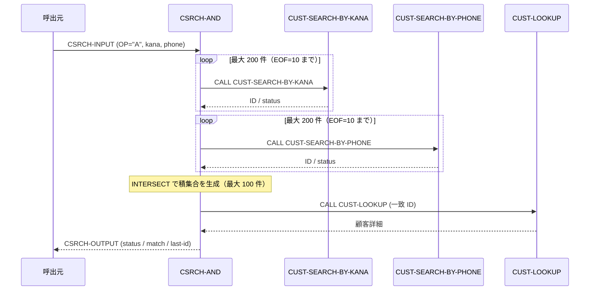

# 基本設計書 — CSRCH-AND

> **サブシステム:** 04-customersearch
> **プログラム ID:** `CSRCH-AND`
> **種別:** オンライン
> **更新日:** 2026-07-06

---

## 1. プログラム概要

| 項目 | 値 |
|------|-----|
| プログラム ID | `CSRCH-AND` |
| ソースファイル | `src/csrch-and.cob` |
| 所属サブシステム | 04-customersearch |
| 種別 | オンライン |
| 概要 | カナ検索と電話検索のそれぞれで取得した顧客 ID リストの積集合（AND）を求め、一致した顧客 1 件を CUST-LOOKUP で詳細取得して返却する。最大 200 件 × 200 件の検索結果を最大 100 件まで交差できる。 |

---

## 2. 機能概要

### 2.1 このプログラムが「すること」
CSRCH-INPUT に設定されたカナプレフィックスと電話プレフィックスをそれぞれ CUST-SEARCH-BY-KANA / CUST-SEARCH-BY-PHONE に渡して ID リストを取得し、両者の積集合を生成する。
積集合の先頭から 1 件ずつ CUST-LOOKUP を呼出して顧客詳細を CSRCH-OUTPUT に設定し、カーソルを進めて次の一致候補に備える。

### 2.2 呼出元と呼出し先
- **呼出元:** オンライントランザクション（CSRCH-OP = "A" で呼出し）。
- **呼出先:** `CUST-SEARCH-BY-KANA`、`CUST-SEARCH-BY-PHONE`（ID リスト取得）、`CUST-LOOKUP`（一致 1 件の詳細取得）。

### 2.3 シーケンス図



---

## 3. 処理フロー

### 3.1 全体フロー（flowchart）

```mermaid
flowchart TD
    START([開始]) --> INIT[CSRCH-STATUS = 0]
    INIT --> CHECK_OP{CSRCH-OP = "A" ?}
    CHECK_OP -->|No| ERR_OP[status = 10 で終了]
    CHECK_OP -->|Yes| POP_KANA[POPULATE-KANA 呼出]
    POP_KANA --> POP_PHONE[POPULATE-PHONE 呼出]
    POP_PHONE --> INTERSECT[INTERSECT 呼出]
    INTERSECT --> SET_FLAG[WS-LOADED-FLAG = 'Y']
    SET_FLAG --> CURSOR_NEXT[WS-MATCH-CURSOR +1]
    CURSOR_NEXT --> CHECK_CUR{カーソル > 一致件数 ?}
    CHECK_CUR -->|Yes| ERR_EOF[status = 10 で終了]
    CHECK_CUR -->|No| CALL_LOOKUP[CALL CUST-LOOKUP]
    CALL_LOOKUP --> EVAL_LOOKUP{CUST-OUT-STATUS}
    EVAL_LOOKUP -->|0| OK[status = 0, match 設定, 終了]
    EVAL_LOOKUP -->|OTHER| ERR_FATAL[status = 16 で終了]
    OK --> END([終了])
    ERR_EOF --> END
    ERR_FATAL --> END
    ERR_OP --> END
```

---

## 4. 入出力仕様

### 4.1 入力

| 項目 | 型 | 必須 | 説明 |
|------|-----|:----:|------|
| CSRCH-KANA-PREFIX | PIC X(50) | ✅ | カナ検索のプレフィックス |
| CSRCH-PHONE-PREFIX | PIC X(15) | ✅ | 電話検索のプレフィックス |
| CSRCH-OP | PIC X(1) | ✅ | "A" で AND 検索を起動 |

### 4.2 出力

| 項目 | 型 | 説明 |
|------|-----|------|
| CSRCH-STATUS | PIC 9(2) | 処理結果コード（下記返却コード参照） |
| CSRCH-MATCH-ID | PIC 9(10) | 一致した顧客 ID |
| CSRCH-MATCH-KANA | PIC X(50) | カナ氏名 |
| CSRCH-MATCH-KANJI | PIC X(60) | 漢字氏名 |
| CSRCH-MATCH-PHONE | PIC X(15) | 電話番号 |
| CSRCH-MATCH-ADDR | PIC X(200) | 住所 |

### 4.3 返却コード（概要）

| コード | 意味 |
|--------|------|
| 00 | 正常（一致 1 件を取得） |
| 10 | EOF（OP 不一致 or 一致件数超過） |
| 16 | FATAL（CUST-LOOKUP 異常） |

---

## 5. 正常系テストケース

| # | テスト名 | 入力 | 期待出力 | 確認ポイント |
|---|---------|------|---------|------------|
| 1 | AND 検索で 1 件一致 | kana="タナカ", phone="03" | status=00, match-id 設定 | カナと電話の積集合が 1 件返ること |
| 2 | 複数一致の 2 件目取得 | 前回 CSRCH-OP=" " で 2 件目取得 | status=00, 2 件目の match-id | カーソルが進み 2 件目が返ること |
| 3 | 上限内（100 件）の積集合生成 | 各 200 件の検索結果が 100 件以下で交差 | status=00 | 100 件上限に収まること |

---

## 6. 異常系テストケース

| # | テスト名 | 入力 | 期待される異常 | 確認ポイント |
|---|---------|------|--------------|------------|
| 1 | OP が "A" 以外 | CSRCH-OP = " " | status = 10 | 起動条件不一致で即時終了すること |
| 2 | 積集合が空 | kana と phone の結果に共通 ID なし | status = 10 | カーソル超過で EOF が返ること |
| 3 | CUST-LOOKUP 異常 | 一致 ID の詳細取得で CUST-OUT-STATUS ≠ 0 | status = 16 | 外部呼出エラーが伝播すること |

---

## 参考
- ソース: [csrch-and.cob](../src/csrch-and.cob)
- 公開 IF: [csrch-api.cpy](../copy/api/csrch-api.cpy)
- その他: [Makefile](../Makefile)
