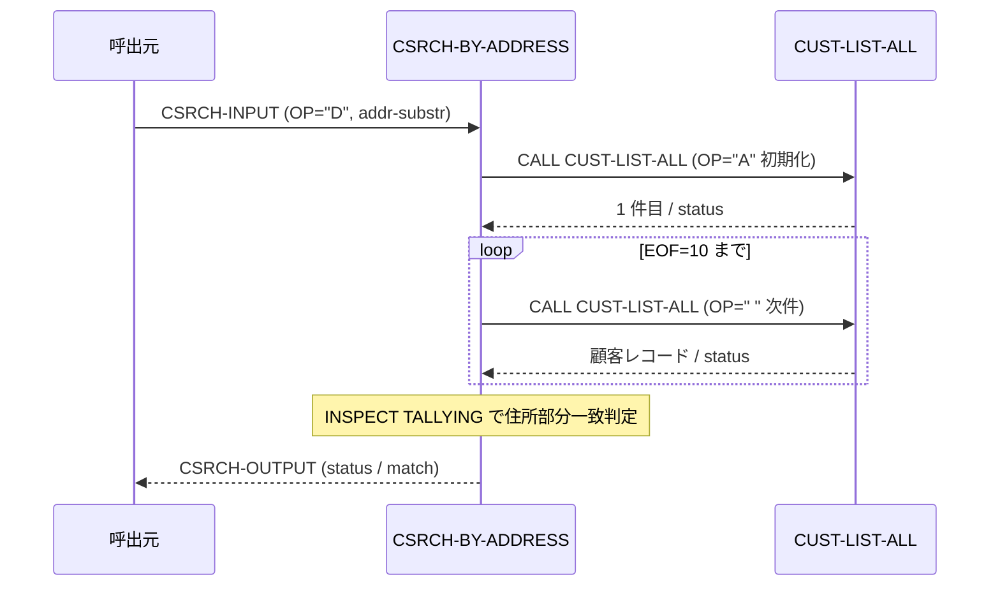

# 基本設計書 — CSRCH-BY-ADDRESS

> **サブシステム:** 04-customersearch
> **プログラム ID:** `CSRCH-BY-ADDRESS`
> **種別:** オンライン
> **更新日:** 2026-07-06

---

## 1. プログラム概要

| 項目 | 値 |
|------|-----|
| プログラム ID | `CSRCH-BY-ADDRESS` |
| ソースファイル | `src/csrch-by-address.cob` |
| 所属サブシステム | 04-customersearch |
| 種別 | オンライン |
| 概要 | 顧客全件リスト（CUST-LIST-ALL）を先頭から走査し、住所フィールドに部分文字列（CSRCH-ADDR-SUBSTR）を含む最初の 1 件を返却する。見つからない場合は EOF（status=10）を返す。 |

---

## 2. 機能概要

### 2.1 このプログラムが「すること」
CUST-LIST-ALL を OP="A" で初期化したのち、EOF（status=10）まで 1 件ずつ取得する。
取得したレコードの CUST-OUT-ADDRESS に対して INSPECT TALLYING で部分一致を評価し、一致した 1 件目で CSRCH-OUTPUT に顧客詳細を設定して終了する。

### 2.2 呼出元と呼出し先
- **呼出元:** オンライントランザクション（CSRCH-OP = "D" で呼出し）。
- **呼出先:** `CUST-LIST-ALL`（全件リストの逐次取得）。

### 2.3 シーケンス図



---

## 3. 処理フロー

### 3.1 全体フロー（flowchart）

```mermaid
flowchart TD
    START([開始]) --> INIT[CSRCH-STATUS = 0]
    INIT --> CHECK_OP{CSRCH-OP = "D" ?}
    CHECK_OP -->|No| ERR_OP[status = 10 で終了]
    CHECK_OP -->|Yes| INIT_LIST[CUST-IN-OP = "A", WS-INITIATED = 'Y']
    INIT_LIST --> LOOP{EOF=10 ?}
    LOOP -->|No| CALL_NEXT[CALL CUST-LIST-ALL]
    CALL_NEXT --> MATCH{住所部分一致 ?}
    MATCH -->|Yes| EMIT[match 設定, status=0, 終了]
    MATCH -->|No| ADVANCE[CUST-IN-OP = " "]
    ADVANCE --> LOOP
    LOOP -->|Yes| EOF_END[status = 10, 終了]
    EMIT --> END([終了])
    EOF_END --> END
    ERR_OP --> END
```

---

## 4. 入出力仕様

### 4.1 入力

| 項目 | 型 | 必須 | 説明 |
|------|-----|:----:|------|
| CSRCH-ADDR-SUBSTR | PIC X(50) | ✅ | 住所部分文字列 |
| CSRCH-OP | PIC X(1) | ✅ | "D" で検索を起動 |

### 4.2 出力

| 項目 | 型 | 説明 |
|------|-----|------|
| CSRCH-STATUS | PIC 9(2) | 処理結果コード（下記返却コード参照） |
| CSRCH-MATCH-ID | PIC 9(10) | 一致した顧客 ID |
| CSRCH-MATCH-KANA | PIC X(50) | カナ氏名 |
| CSRCH-MATCH-KANJI | PIC X(60) | 漢字氏名 |
| CSRCH-MATCH-PHONE | PIC X(15) | 電話番号 |
| CSRCH-MATCH-ADDR | PIC X(200) | 住所 |

### 4.3 返却コード（概要）

| コード | 意味 |
|--------|------|
| 00 | 正常（住所部分一致の 1 件を取得） |
| 10 | EOF（OP 不一致 or 部分一致なし） |

---

## 5. 正常系テストケース

| # | テスト名 | 入力 | 期待出力 | 確認ポイント |
|---|---------|------|---------|------------|
| 1 | 東京住所の検索 | addr-substr="東京都" | status=00, match-id 設定 | 部分一致で 1 件目が返ること |
| 2 | 部分一致（市区町村レベル） | addr-substr="渋谷区" | status=00 | 部分文字列の住所がヒットすること |
| 3 | 先頭レコードが一致 | addr-substr が 1 件目に一致 | status=00 | 初期化直後の 1 件目で終了すること |

---

## 6. 異常系テストケース

| # | テスト名 | 入力 | 期待される異常 | 確認ポイント |
|---|---------|------|--------------|------------|
| 1 | OP が "D" 以外 | CSRCH-OP = " " | status = 10 | 起動条件不一致で即時終了すること |
| 2 | 部分一致なし | addr-substr = "存在しない地名" | status = 10 | 全件走査後に EOF が返ること |
| 3 | CUST-LIST-ALL 初期化異常 | CUST-OUT-STATUS ≠ 0 | status = 10 | 初期化失敗が伝播すること |

---

## 参考
- ソース: [csrch-by-address.cob](../src/csrch-by-address.cob)
- 公開 IF: [csrch-api.cpy](../copy/api/csrch-api.cpy)
- その他: [Makefile](../Makefile)
