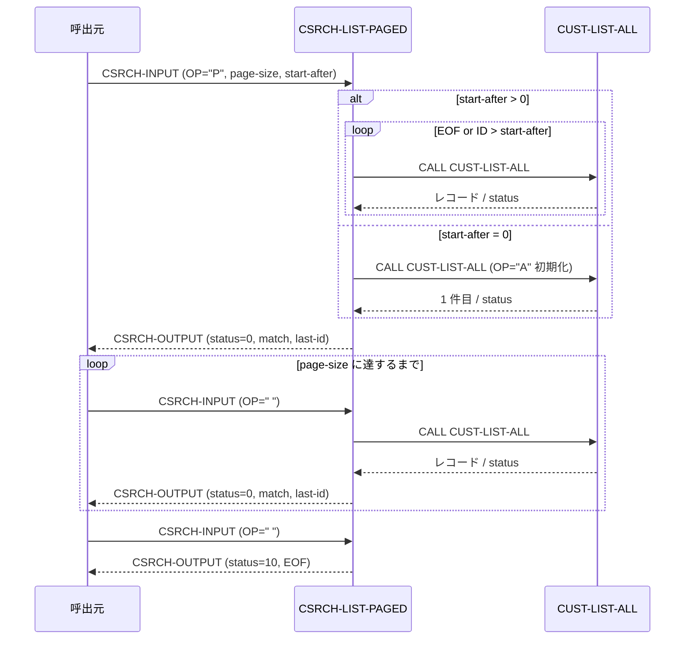

# 基本設計書 — CSRCH-LIST-PAGED

> **サブシステム:** 04-customersearch
> **プログラム ID:** `CSRCH-LIST-PAGED`
> **種別:** オンライン
> **更新日:** 2026-07-06

---

## 1. プログラム概要

| 項目 | 値 |
|------|-----|
| プログラム ID | `CSRCH-LIST-PAGED` |
| ソースファイル | `src/csrch-list-paged.cob` |
| 所属サブシステム | 04-customersearch |
| 種別 | オンライン |
| 概要 | 顧客全件リスト（CUST-LIST-ALL）をページング取得し、1 回の呼出につき 1 件を返却する。CSRCH-PAGE-SIZE 件の返却で自動的に EOF（status=10）となり、CSRCH-LAST-ID を次回カーソルとして再利用できる。 |

---

## 2. 機能概要

### 2.1 このプログラムが「すること」
CSRCH-OP = "P" で 1 ページ分の取得を開始する。CSRCH-START-AFTER > 0 の場合は SKIP-TO-CFURSOR で該当 ID まで CUST-LIST-ALL をスキップし、1 件取得して CSRCH-LAST-ID に ID を記録する。
以降は CSRCH-OP = " " で 1 件ずつ取得し、WS-RETURNED が CSRCH-PAGE-SIZE に達したら status=10 を返してページを終了する。

### 2.2 呼出元と呼出し先
- **呼出元:** オンライントランザクション（CSRCH-OP = "P" / " " で呼出し）。
- **呼出先:** `CUST-LIST-ALL`（全件リストの逐次取得）。

### 2.3 シーケンス図



---

## 3. 処理フロー

### 3.1 全体フロー（flowchart）

```mermaid
flowchart TD
    START([開始]) --> INIT[CSRCH-STATUS = 0]
    INIT --> CHECK_OP{CSRCH-OP = "P" ?}
    CHECK_OP -->|No| CHECK_INIT{WS-INITIATED = 'Y' ?}
    CHECK_INIT -->|No| ERR_OP[status = 10 で終了]
    CHECK_INIT -->|Yes| CHECK_PAGE{返却数 >= page-size ?}
    CHECK_PAGE -->|Yes| EOF_PAGE[status = 10 で終了]
    CHECK_PAGE -->|No| NEXT_ROW[CALL CUST-LIST-ALL]
    CHECK_OP -->|Yes| INIT_PAGE[WS-INITIATED = 'Y', WS-RETURNED = 0]
    INIT_PAGE --> CHECK_CUR{start-after > 0 ?}
    CHECK_CUR -->|Yes| SKIP[SKIP-TO-CURSOR 呼出]
    CHECK_CUR -->|No| FIRST[CALL CUST-LIST-ALL 初期化]
    SKIP --> EMIT[EMIT-ROW 呼出]
    FIRST --> EMIT
    EMIT --> END([終了])
    NEXT_ROW --> EOF_ROW{CUST-OUT-STATUS = 10 ?}
    EOF_ROW -->|Yes| EOF_INIT[status=10, WS-INITIATED='N', 終了]
    EOF_ROW -->|No| EMIT2[EMIT-ROW 呼出]
    EMIT2 --> END
    EOF_INIT --> END
    EOF_PAGE --> END
    ERR_OP --> END
```

---

## 4. 入出力仕様

### 4.1 入力

| 項目 | 型 | 必須 | 説明 |
|------|-----|:----:|------|
| CSRCH-PAGE-SIZE | PIC 9(3) | ✅ | 1 ページの最大返却件数 |
| CSRCH-START-AFTER | PIC 9(10) | ✅ | カーソル開始位置（0 は先頭から） |
| CSRCH-OP | PIC X(1) | ✅ | "P" でページ開始、" " で次行取得 |

### 4.2 出力

| 項目 | 型 | 説明 |
|------|-----|------|
| CSRCH-STATUS | PIC 9(2) | 処理結果コード（下記返却コード参照） |
| CSRCH-MATCH-ID | PIC 9(10) | 取得した顧客 ID |
| CSRCH-LAST-ID | PIC 9(10) | 今回取得した ID（次回カーソルに利用） |
| CSRCH-MATCH-KANA | PIC X(50) | カナ氏名 |
| CSRCH-MATCH-KANJI | PIC X(60) | 漢字氏名 |
| CSRCH-MATCH-PHONE | PIC X(15) | 電話番号 |
| CSRCH-MATCH-ADDR | PIC X(200) | 住所 |

### 4.3 返却コード（概要）

| コード | 意味 |
|--------|------|
| 00 | 正常（1 件を取得） |
| 10 | EOF（OP 不一致 / ページ上限到達 / CUST-LIST-ALL 終了） |

---

## 5. 正常系テストケース

| # | テスト名 | 入力 | 期待出力 | 確認ポイント |
|---|---------|------|---------|------------|
| 1 | 先頭ページ取得（page-size=5, start=0） | OP="P", page-size=5, start=0 | status=00 × 5 回、6 回目 status=10 | 5 件取得後、6 回目で EOF が返ること |
| 2 | カーソル指定のページ開始 | OP="P", start-after=100 | status=00, match-id > 100 | ID > 100 から開始されること |
| 3 | 次ページの取得 | 前回 last-id を start-after に設定 | status=00 | 同一 ID の重複返却がないこと |

---

## 6. 異常系テストケース

| # | テスト名 | 入力 | 期待される異常 | 確認ポイント |
|---|---------|------|--------------|------------|
| 1 | OP が "P" でも " " でもない | CSRCH-OP = "X" | status = 10 | 起動条件不一致で即時終了すること |
| 2 | 未初期化で OP=" " | OP="P" 呼出さずに OP=" " | status = 10 | WS-INITIATED 未設定で終了すること |
| 3 | CUST-LIST-ALL 初期化異常 | CUST-OUT-STATUS ≠ 0 | status = 10 | 外部呼出エラーが伝播すること |

---

## 参考
- ソース: [csrch-list-paged.cob](../src/csrch-list-paged.cob)
- 公開 IF: [csrch-api.cpy](../copy/api/csrch-api.cpy)
- その他: [Makefile](../Makefile)
