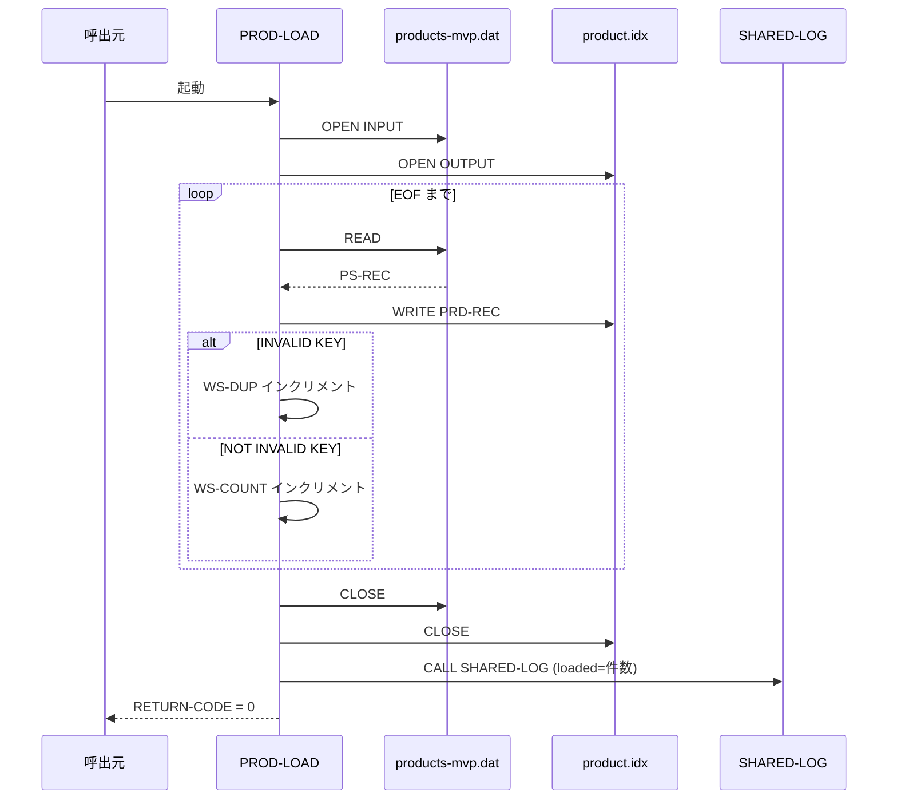
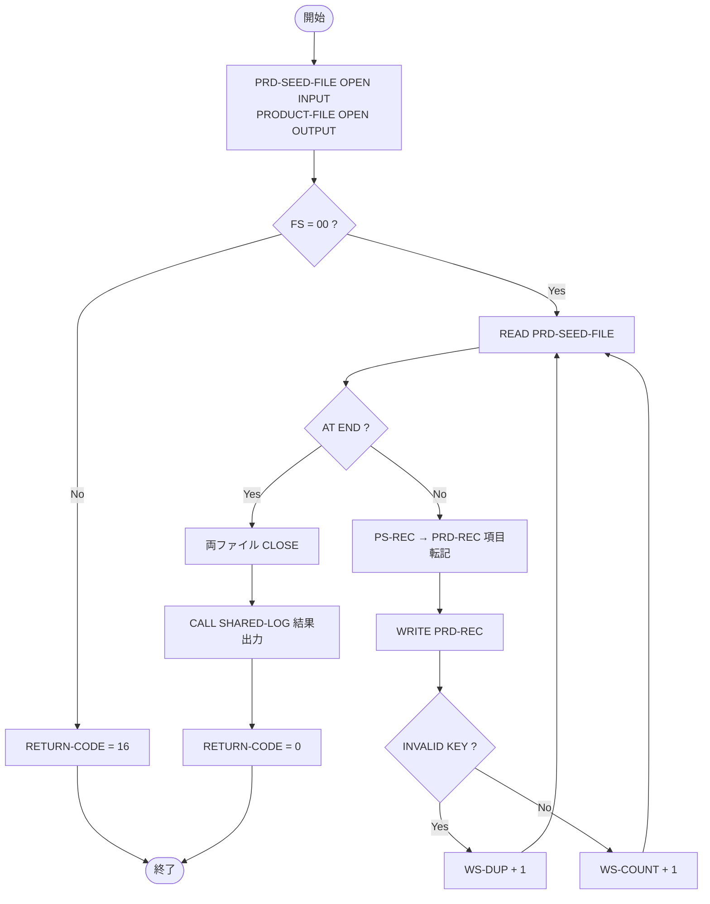

# 基本設計書 — PROD-LOAD

> **サブシステム:** 05-product
> **プログラム ID:** `PROD-LOAD`
> **種別:** LOAD
> **更新日:** 2026-07-06

---

## 1. プログラム概要

| 項目 | 値 |
|------|-----|
| プログラム ID | `PROD-LOAD` |
| ソースファイル | `src/prod-load.cob` |
| 所属サブシステム | 05-product |
| 種別 | LOAD |
| 概要 | 製品シードデータ（products-mvp.dat）を読み取り、PROD-LOOKUP が利用する索引ファイル（product.idx）を生成する初回ロード専用バッチ。重複コードを検知して件数を集計し、SHARED-LOG で結果を出力する。 |

---

## 2. 機能概要

### 2.1 このプログラムが「すること」
シーケンシャルな製品シードファイルをレコードごとに読み取り、各レコードを製品コード（PRD-REC-CODE）をキーとする索引ファイルへ書き出す。
重複キーが出現した場合は件数のみカウントし、正常書き込み件数と重複件数をログに出力して正常終了（RETURN-CODE = 0）する。

### 2.2 呼出元と呼出し先
- **呼出元:** `Makefile` の `load-idx` タスク。他バッチ／セットアップ手順からの直接実行を想定。
- **呼出先:** `SHARED-LOG`（共有ログユーティリティ .so）。処理完了メッセージの出力を委譲する。

### 2.3 シーケンス図

---

## 3. 処理フロー

### 3.1 全体フロー（flowchart）

---

## 4. 入出力仕様

### 4.1 入力

| 項目 | 型 | 必須 | 説明 |
|------|-----|:----:|------|
| PS-CODE | PIC X(3) | ✅ | 製品コード。索引ファイルのレコードキー |
| PS-NAME-KANJI | PIC X(40) |  | 製品名（漢字） |
| PS-NAME-KANA | PIC X(40) |  | 製品名（カナ） |
| PS-TYPE | PIC X(1) |  | 製品種別（S=普通預金 / C=当座預金 / T=定期預金） |
| PS-INTEREST | PIC X(1) |  | 金利タイプ |
| PS-OVD | PIC X(1) |  | オーバードラフト許容フラグ |
| PS-MIN-BAL | PIC S9(15) COMP-3 |  | 最低残高 |
| PS-TERM-DAYS | PIC 9(4) |  | 預入期間（日）。定期預金等で使用 |
| PS-EFF-FROM | PIC 9(8) |  | 有効開始日（YYYYMMDD） |
| PS-EFF-TO | PIC 9(8) |  | 有効終了日（YYYYMMDD） |
| PS-FILLER | PIC X(16) |  | 予備領域 |

### 4.2 出力

| 項目 | 型 | 説明 |
|------|-----|------|
| PRD-REC | レコード全体 | product.idx（キー: PRD-REC-CODE）へ書き出される索引レコード |
| WS-LOG-MESSAGE | 可変長 | SHARED-LOG へ渡すメッセージ（"PROD-LOAD complete loaded=nnn"） |

### 4.3 返却コード（概要）

| コード | 意味 |
|--------|------|
| 0 | 正常（ロード完了。重複があった場合も正常扱い） |
| 16 | FATAL（seed / index ファイルのオープン失敗） |

---

## 5. 正常系テストケース

| # | テスト名 | 入力 | 期待出力 | 確認ポイント |
|---|---------|------|---------|------------|
| 1 | シード 3 件正常ロード | products-mvp.dat（001/002/003） | product.idx 生成、loaded=3 | 3 件の索引レコードが常に存在し READ 可能 |
| 2 | 重複コードが混在するシード | 同一コード 2 レコードを含む seed | WS-DUP >= 1、loaded=ユニーク件数 | INVALID KEY で破棄され索引は上書きされない |
| 3 | 空シードファイル | 0 バイトの seed | loaded=0 | 即刻 EOF となり正常終了すること |

---

## 6. 異常系テストケース

| # | テスト名 | 入力 | 期待される異常 | 確認ポイント |
|---|---------|------|--------------|------------|
| 1 | seed ファイル不在 | products-mvp.dat 未配置 | RETURN-CODE = 16 | WS-SEED-FS != "00" で早期終了 |
| 2 | index ファイル書き込み不可 | product.idx がリードオンリー | RETURN-CODE = 16 | WS-IDX-FS != "00" で早期終了 |

---

## 参考
- ソース: [prod-load.cob](../src/prod-load.cob)
- 公開 IF: [prod-api.cpy](../copy/api/prod-api.cpy)
- シード FD: [fd-prd-seed.cpy](../copy/private/fd-prd-seed.cpy)
- 索引 FD: [fd-product.cpy](../copy/private/fd-product.cpy)
- その他: [Makefile](../Makefile)
