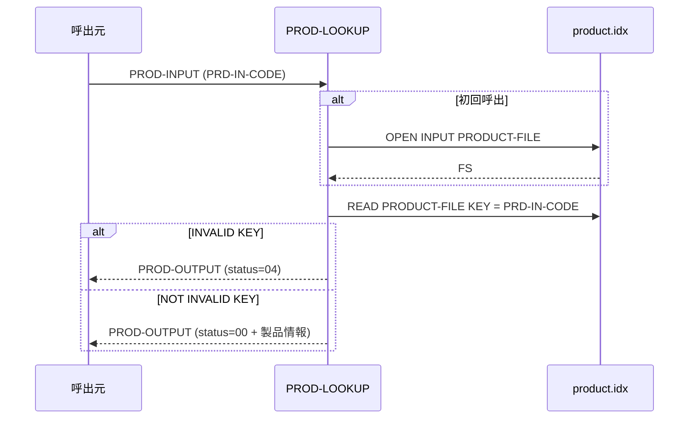
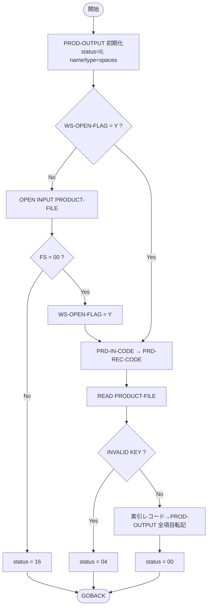

# 基本設計書 — PROD-LOOKUP

> **サブシステム:** 05-product
> **プログラム ID:** `PROD-LOOKUP`
> **種別:** オンライン
> **更新日:** 2026-07-06

---

## 1. プログラム概要

| 項目 | 値 |
|------|-----|
| プログラム ID | `PROD-LOOKUP` |
| ソースファイル | `src/prod-lookup.cob` |
| 所属サブシステム | 05-product |
| 種別 | オンライン |
| 概要 | 製品コード（3 文字）をキーに索引ファイル（product.idx）をランダム検索し、製品情報（名称・種別・金利・期間等）を呼出元に返却する .so モジュール。初回呼出時にのみ索引ファイルを OPEN し、以降は同一インスタンスで READ を繰り返す。 |

---

## 2. 機能概要

### 2.1 このプログラムが「すること」
呼出元から PROD-INPUT（PRD-IN-CODE）を受け取り、索引ファイルを key で READ する。
見つかった場合は PROD-OUTPUT に製品情報を全項目転記し status=00 を返し、見つからない場合は status=04 を返す。
索引ファイルのオープンに失敗した場合は status=16 を返す。

### 2.2 呼出元と呼出し先
- **呼出元:** テストドライバ `PRDTEST`。オンライントランザクションや他バッチからの `CALL "PROD-LOOKUP" USING PROD-INPUT PROD-OUTPUT` を想定。
- **呼出先:** 直接的な呼出先なし（索引ファイル I/O のみ）。

### 2.3 シーケンス図

---

## 3. 処理フロー

### 3.1 全体フロー（flowchart）

---

## 4. 入出力仕様

### 4.1 入力

| 項目 | 型 | 必須 | 説明 |
|------|-----|:----:|------|
| PRD-IN-CODE | PIC X(3) | ✅ | 検索する製品コード。索引ファイルのレコードキー |

### 4.2 出力

| 項目 | 型 | 説明 |
|------|-----|------|
| PRD-OUT-STATUS | PIC 9(2) | 処理結果コード（下記返却コード参照） |
| PRD-OUT-CODE | PIC X(3) | 製品コード。未見つ時はスペース |
| PRD-OUT-NAME | PIC X(40) | 製品名（漢字）。未見つ時はスペース |
| PRD-OUT-TYPE | PIC X(1) | 製品種別: S=普通預金 / C=当座預金 / T=定期預金 |
| PRD-OUT-INTEREST-TYPE | PIC X(1) | 金利タイプ |
| PRD-OUT-ALLOW-OVD | PIC X(1) | オーバードラフト許容フラグ |
| PRD-OUT-TERM-DAYS | PIC 9(4) | 預入期間（日）。未見つ時は 0 |
| PRD-OUT-EFF-FROM | PIC 9(8) | 有効開始日（YYYYMMDD）。未見つ時は 0 |
| PRD-OUT-EFF-TO | PIC 9(8) | 有効終了日（YYYYMMDD）。未見つ時は 0 |

### 4.3 返却コード（概要）

| コード | 意味 |
|--------|------|
| 00 | 正常（該当製品を返却） |
| 04 | NOT-FUND（該当キーのレコードが存在しない） |
| 16 | FATAL（PRODUCT-FILE のオープン失敗） |

---

## 5. 正常系テストケース

| # | テスト名 | 入力 | 期待出力 | 確認ポイント |
|---|---------|------|---------|------------|
| 1 | 普通預金コード "001" 検索 | PRD-IN-CODE = "001" | status=00, type="S", name="普通預金" | 種別 S（PRD-TYPE-SAVINGS）が返ること |
| 2 | 定期預金コード "002" 検索 | PRD-IN-CODE = "002" | status=00, type="T", term-days=365 | 種別 T と期間 365 日が同時に返ること |
| 3 | 当座預金コード "003" 検索 | PRD-IN-CODE = "003" | status=00, type="C" | 種別 C（PRD-TYPE-CHECKING）が返ること |
| 4 | 同一インスタンスで複数回呼出し | 2 回目以降も OPEN せず READ | status=00 | WS-OPEN_FLAG により再オープンしない |

---

## 6. 異常系テストケース

| # | テスト名 | 入力 | 期待される異常 | 確認ポイント |
|---|---------|------|--------------|------------|
| 1 | 存在しないコード検索 | PRD-IN-CODE = "999" | status = 04 | INVALID KEY で NOT-FUND が返り name/type はスペースであること |
| 2 | 索引ファイル未生成 | product.idx 不存在で初回呼出 | status = 16 | OPEN 失敗で FATAL が返ること |

---

## 参考
- ソース: [prod-lookup.cob](../src/prod-lookup.cob)
- 公開 IF: [prod-api.cpy](../copy/api/prod-api.cpy)
- 索引 FD: [fd-product.cpy](../copy/private/fd-product.cpy)
- その他: [Makefile](../Makefile)
