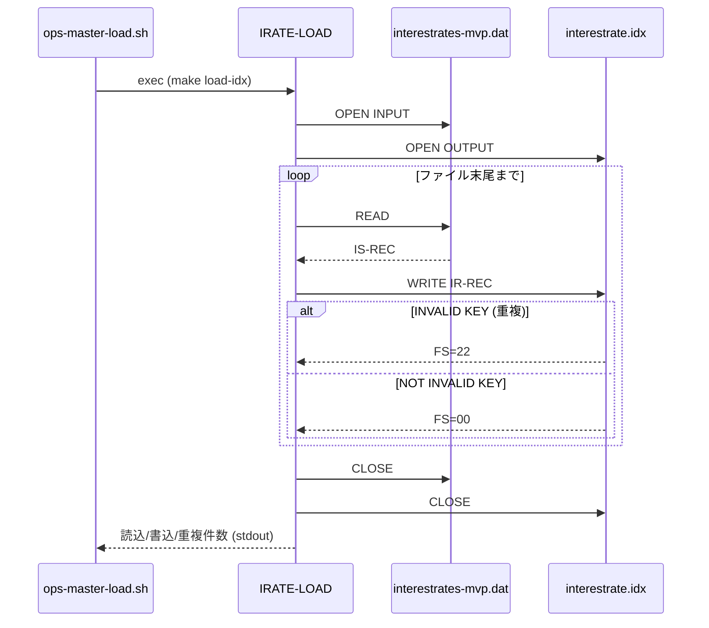
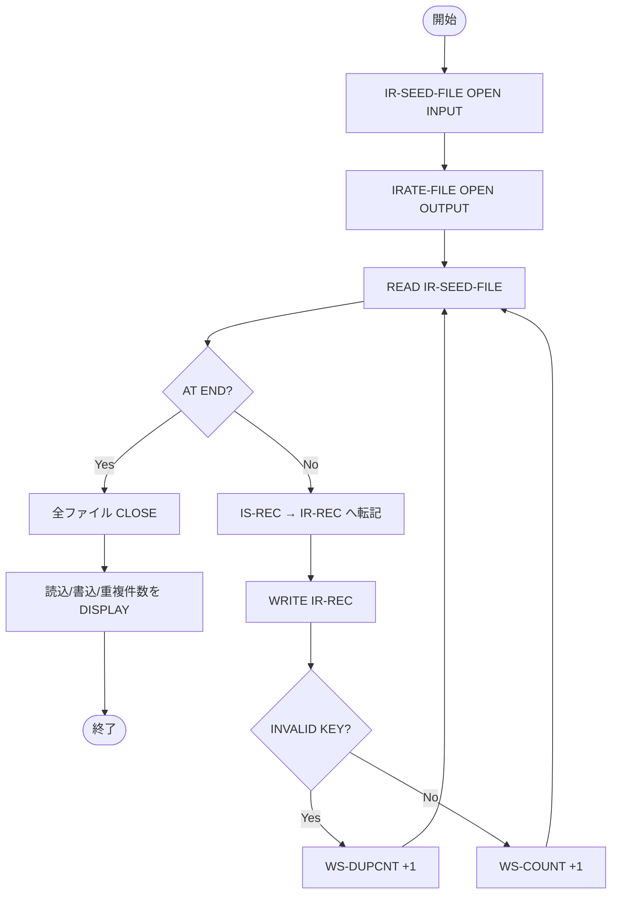

# 基本設計書 — IRATE-LOAD

> **サブシステム:** 06-interestrate
> **プログラム ID:** `IRATE-LOAD`
> **種別:** LOAD
> **更新日:** 2026-07-06

---

## 1. プログラム概要

| 項目 | 値 |
|------|-----|
| プログラム ID | `IRATE-LOAD` |
| ソースファイル | `src/irate-load.cob` |
| 所属サブシステム | 06-interestrate |
| 種別 | LOAD |
| 概要 | 金利マスタのシーケンシャルシードファイル（`interestrates-mvp.dat`）を読み込み、IRATE-LOOKUP が利用するインデックスファイル（`interestrate.idx`）を生成する。同一キーが既存の場合はスキップし、読込 / 書込 / 重複件数を標準出力に報告する。 |

---

## 2. 機能概要

### 2.1 このプログラムが「すること」
金利マスタのシーケンシャルシードファイルを 1 レコードずつ読み込み、商品コード + ティア + 適用開始日をレコードキーとするインデックスファイルへ書き出す。
キー重複時は当該レコードをスキップし、処理終了後に読込数 / 書込数 / 重複数を標準出力へ出力する。

### 2.2 呼出元と呼出し先
- **呼出元:** 運用マスターロードスクリプト `ops-master-load.sh`（22-operations）。`make load-idx` 経由で起動される。
- **呼出先:** なし（ファイル I/O のみ）。

### 2.3 シーケンス図

---

## 3. 処理フロー

### 3.1 全体フロー（flowchart）

---

## 4. 入出力仕様

### 4.1 入力

| 項目 | 型 | 必須 | 説明 |
|------|-----|:----:|------|
| IS-PRODUCT | PIC X(3) | ✅ | 商品コード |
| IS-TIER | PIC 9(2) | ✅ | ティア番号 |
| IS-EFF-FROM | PIC 9(8) | ✅ | 適用開始日（YYYYMMDD） |
| IS-TIER-MIN | PIC S9(15) COMP-3 | ✅ | ティア下限額 |
| IS-TIER-MAX | PIC S9(15) COMP-3 | ✅ | ティア上限額 |
| IS-RATE | PIC S9(3)V9(4) COMP-3 | ✅ | 適用金利 |
| IS-EFF-TO | PIC 9(8) | ✅ | 適用終了日（YYYYMMDD） |
| IS-FILLER | PIC X(8) | — | 予備領域 |

### 4.2 出力

| 項目 | 型 | 説明 |
|------|-----|------|
| IR-REC-PRODUCT | PIC X(3) | 商品コード（IR-REC-KEY の一部） |
| IR-REC-TIER | PIC 9(2) | ティア番号（IR-REC-KEY の一部） |
| IR-REC-EFF-FROM | PIC 9(8) | 適用開始日（IR-REC-KEY の一部） |
| IR-REC-TIER-MIN | PIC S9(15) COMP-3 | ティア下限額 |
| IR-REC-TIER-MAX | PIC S9(15) COMP-3 | ティア上限額 |
| IR-REC-RATE | PIC S9(3)V9(4) COMP-3 | 適用金利 |
| IR-REC-EFF-TO | PIC 9(8) | 適用終了日 |
| IR-REC-FILLER | PIC X(8) | 予備領域 |

### 4.3 返却コード（概要）

| コード | 意味 |
|--------|------|
| 00 | 正常（ファイルステータス WS-SEED-FS = "00"） |
| 22 | キー重複（INVALID KEY で検知しスキップ、件数として集計） |
| その他 | ファイル I/O 異常（標準エラー等で運用検知） |

---

## 5. 正常系テストケース

| # | テスト名 | 入力 | 期待出力 | 確認ポイント |
|---|---------|------|---------|------------|
| 1 | シード全レコードの正常読込 | `interestrates-mvp.dat`（本番相当） | 書込件数 = シード件数、重複 = 0 | 全レコードがインデックスファイルへ書込まれること |
| 2 | 同一キーの重複レコード | 同一キーが 2 レコード目以降に存在するシード | 重複件数 >= 1、書込件数はユニーク件数と同値 | INVALID KEY でスキップし、後勝ちではなく先勝ちで確定すること |
| 3 | 空シードファイル | 0 バイトのシード | 読込 = 0、書込 = 0、重複 = 0 | ループを回さず正常終了すること |

---

## 6. 異常系テストケース

| # | テスト名 | 入力 | 期待される異常 | 確認ポイント |
|---|---------|------|--------------|------------|
| 1 | シードファイル不在 | `interestrates-mvp.dat` が存在しない | OPEN INPUT で FILE STATUS 異常 | エラー終了し、ops-master-load.sh が rc != 0 として検知できること |
| 2 | インデックスファイル書込不可 | `data/` ディレクトリが書き込み不可 | OPEN OUTPUT で FILE STATUS 異常 | エラー終了し、ops-master-load.sh が rc != 0 として検知できること |
| 3 | レコード破損（半端な長さ） | 49 バイト未満のレコードが含まれる | READ で FILE STATUS 異常 | 途中で処理が止まるか、レコード長不整合として検知されること |

---

## 参考
- ソース: [irate-load.cob](../src/irate-load.cob)
- ファイル記述（公開）: [fd-irate.cpy](../copy/private/fd-irate.cpy)
- ファイル記述（シード）: [fd-ir-seed.cpy](../copy/private/fd-ir-seed.cpy)
- その他: [Makefile](../Makefile)
- 運用オーケストレーション: [ops-master-load.sh](../../22-operations/src/ops-master-load.sh)
