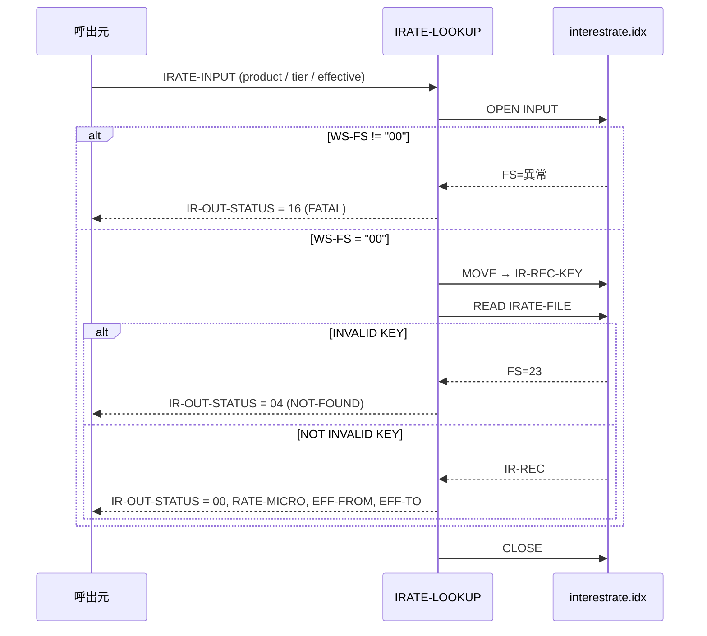

# 基本設計書 — IRATE-LOOKUP

> **サブシステム:** 06-interestrate
> **プログラム ID:** `IRATE-LOOKUP`
> **種別:** オンライン
> **更新日:** 2026-07-06

---

## 1. プログラム概要

| 項目 | 値 |
|------|-----|
| プログラム ID | `IRATE-LOOKUP` |
| ソースファイル | `src/irate-lookup.cob` |
| 所属サブシステム | 06-interestrate |
| 種別 | オンライン |
| 概要 | 商品コード + ティア + 適用日のキーで金利マスタ（`interestrate.idx`）を検索し、適用金利（マイクロ単位）・適用期間を返却する。ロードは IRATE-LOOKUP が生成したインデックスファイルに依存する。 |

---

## 2. 機能概要

### 2.1 このプログラムが「すること」
呼出元から受け取った商品コード / ティア / 適用日をキーに金利マスタをランダム検索し、該当レコードの金利をマイクロ単位（×1,000,000）に換算して返却する。
該当レコードが存在しない場合は NOT-FATAL（04）を、ファイルオープンに失敗した場合は FATAL（16）を返却する。

### 2.2 呼出元と呼出し先
- **呼出元:** 金利計算バッチ `IACR-RUN-DAILY`（13-interestaccrual）、単体テストドライバ `IRATETEST`、その他金利参照を行うオンライン / バッチプログラム。
- **呼出先:** なし（ファイル I/O のみ）。

### 2.3 シーケンス図



---

## 3. 処理フロー

### 3.1 全体フロー（flowchart）

```mermaid
flowchart TD
    START([開始]) --> INIT[IR-OUT-STATUS = 0 初期化]
    INIT --> OPEN[IRATE-FILE OPEN INPUT]
    OPEN --> FS_CHK{WS-FS = "00"?}
    FS_CHK -->|No| FATAL[IR-OUT-STATUS = 16]
    FATAL --> CLOSE1[CLOSE] --> END([終了])
    FS_CHK -->|Yes| MOVE[IR-IN-* → IR-REC-KEY へ転記]
    MOVE --> READ[READ IRATE-FILE]
    READ --> HIT{INVALID KEY?}
    HIT -->|Yes| NOT_FOUND[IR-OUT-STATUS = 04]
    HIT -->|No| CALC[IR-OUT-RATE-MICRO = IR-REC-RATE * 1000000]
    CALC --> SET[IR-OUT-EFF-FROM/TO 設定, STATUS = 00]
    SET --> CLOSE2[CLOSE] --> END
    NOT_FOUND --> CLOSE3[CLOSE] --> END
```

---

## 4. 入出力仕様

### 4.1 入力

| 項目 | 型 | 必須 | 説明 |
|------|-----|:----:|------|
| IR-IN-PRODUCT | PIC X(3) | ✅ | 商品コード |
| IR-IN-TIER | PIC 9(2) | ✅ | ティア番号 |
| IR-IN-EFFECTIVE | PIC 9(8) | ✅ | 適用日（YYYYMMDD） |

### 4.2 出力

| 項目 | 型 | 説明 |
|------|-----|------|
| IR-OUT-STATUS | PIC 9(2) | 処理結果コード（下記返却コード参照） |
| IR-OUT-RATE-MICRO | PIC 9(7) | 適用金利のマイクロ単位（金利 × 1,000,000）。異常時は 0 |
| IR-OUT-EFF-FROM | PIC 9(8) | 適用開始日（YYYYMMDD）。異常時は 0 |
| IR-OUT-EFF-TO | PIC 9(8) | 適用終了日（YYYYMMDD）。異常時は 0 |

### 4.3 返却コード（概要）

| コード | 意味 |
|--------|------|
| 00 | 正常（金利を取得） |
| 04 | NOT-FOUND（該当キーが存在しない） |
| 16 | FATAL（インデックスファイルのオープンに失敗） |

---

## 5. 正常系テストケース

| # | テスト名 | 入力 | 期待出力 | 確認ポイント |
|---|---------|------|---------|------------|
| 1 | 標準ヒット（product=001, tier=1, 20260101） | 001 / 1 / 20260101 | status=00, rate-micro=1000 | シード先頭レコードがヒットし、rate × 1,000,000 が返ること |
| 2 | 別商品のヒット（product=002, tier=1, 20270101） | 002 / 1 / 20270101 | status=00, rate-micro=55000 | 商品 002 の 2027 年レコードがヒットし、金利が返ること |
| 3 | ゼロ金利のヒット（product=003, tier=1, 20260101） | 003 / 1 / 20260101 | status=00, rate-micro=0 | 金利 0 のレコードがヒットし、0 が返ること |

---

## 6. 異常系テストケース

| # | テスト名 | 入力 | 期待される異常 | 確認ポイント |
|---|---------|------|--------------|------------|
| 1 | 存在しない商品コード | 999 / 1 / 20260101 | status=04 | INVALID KEY となり NOT-FOUND が返ること |
| 2 | インデックスファイル未生成 | （`interestrate.idx` 未配置状態で呼出） | status=16 | OPEN INPUT の FILE STATUS 異常を検知し FATAL が返ること |
| 3 | キー部分一致だが完全不一致 | 001 / 99 / 20260101 | status=04 | TIER が異なれば別キーとして NOT-FOUND が返ること |

---

## 参考
- ソース: [irate-lookup.cob](../src/irate-lookup.cob)
- 公開 IF: [irate-api.cpy](../copy/api/irate-api.cpy)
- ファイル記述: [fd-irate.cpy](../copy/private/fd-irate.cpy)
- その他: [Makefile](../Makefile)
- 参照元（金利計算）: [iacr-run-daily.sqb](../../13-interestaccrual/src/iacr-run-daily.sqb)
- 関連 LOAD: [irate-load.md](irate-load.md)
