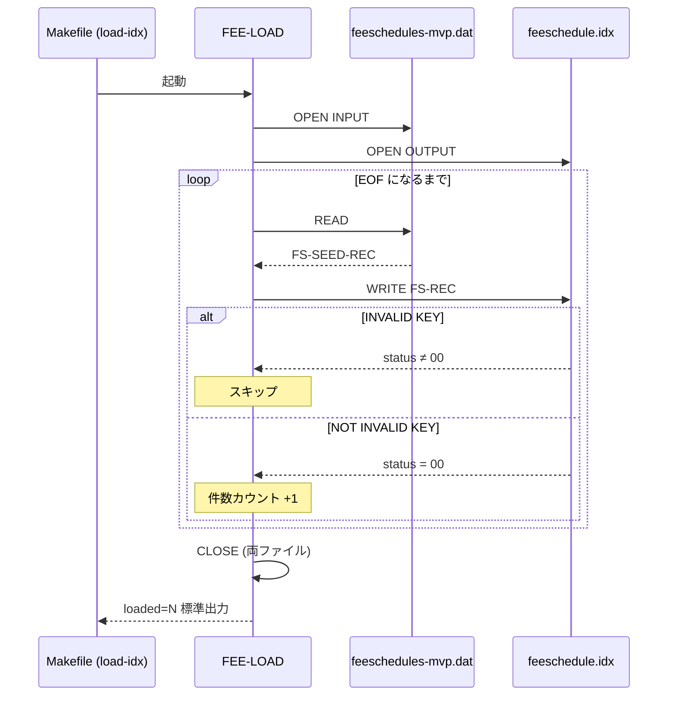
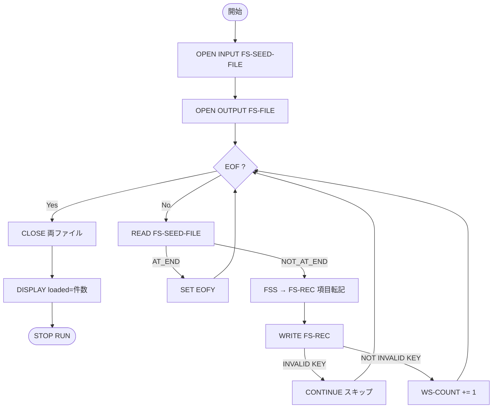

# 基本設計書 — FEE-LOAD

> **サブシステム:** 07-feeschedule
> **プログラム ID:** `FEE-LOAD`
> **種別:** LOAD
> **更新日:** 2026-07-06

---

## 1. プログラム概要

| 項目 | 値 |
|------|-----|
| プログラム ID | `FEE-LOAD` |
| ソースファイル | `src/fee-load.cob` |
| 所属サブシステム | 07-feeschedule |
| 種別 | LOAD |
| 概要 | 手入力を保持するシーケンシャルファイル（`feeschedules-mvp.dat`）からレコードを逐次読み取り、Indexed File（`feeschedule.idx`）へキー（カテゴリ + ティヤ + 有効開始日）で書込むロードプログラム。レコード衝突（INVALID KEY）はスキップし、読み込み件数を標準出力へ表示する。 |

---

## 2. 機能概要

### 2.1 このプログラムが「すること」
FEE-LOAD は手入力のシードファイルを読み、Indexed File を生成する。ファイルオープンに失敗した場合は即座に異常終了する。レコード書き込み時にキー衝突があれば当該レコードを維持して処理を継続し、処理完了後にロード総件数を出力する。

### 2.2 呼出元と呼出し先
- **呼出元:** `Makefile` ターゲット `load-idx`（`./bin/fee-load` として直接起動）。テスト実行コンテキスト `test-unit` でも前提処理として走る。
- **呼出先:** 外部プログラム呼出は行わず、ファイル I/O のみを実施する。後続フェーズを担う `FEE-LOOKUP-BY-TIER` が生成ファイルを読むため、事実上のデータ供給元となる。

### 2.3 シーケンス図

---

## 3. 処理フロー

### 3.1 全体フロー（flowchart）

---

## 4. 入出力仕様

### 4.1 入力

| 項目 | 型 | 必須 | 説明 |
|------|-----|:----:|------|
| FS-SEED-FILE（`feeschedules-mvp.dat` シーケンシャル） | ファイル | ✅ | 手入力のシードファイル。固定長 41 バイトの物理レコード。 |

### 4.2 出力

| 項目 | 型 | 説明 |
|------|-----|------|
| FS-FILE（`feeschedule.idx` Indexed File） | ファイル | 主キー（カテゴリ+ティヤ+有効開始日）でランダムアクセス可能な課金マスタ。 |
| 標準出力 | テキスト | `FEE-LOAD loaded=N`（N は書き込み成功件数） |

### 4.3 返却コード（概要）

| コード | 意味 |
|--------|------|
| 00 | 正常（ファイル読書き完了） |
| 04 | WRITE キー衝突（INVALID KEY）。当該レコードをスキップし、処理継続。 |
| 16 | Indexed File オープン失敗（上位から明示的な終了コードは返さず、EXEC 時例外で止まる） |

---

## 5. 正常系テストケース

| # | テスト名 | 入力 | 期待出力 | 確認ポイント |
|---|---------|------|---------|------------|
| 1 | 通常ロード | 既存 `feeschedules-mvp.dat` | `loaded=N`（N ≥ 0）、`feeschedule.idx` 生成 | 全てのレコードが Indexed File へ書込まれること |
| 2 | 既存キー衝突（再投入耐性） | 同一キーを含むシード | 重複レコードはスキップ、件数は増加しない | INVALID KEY で `CONTINUE` しエラーで止まらないこと |
| 3 | 空ファイル | 0 行のシード | `loaded=0`、Indexed File が生成される | 読み込み 0 件でも終了ステータス異常なく完了すること |

---

## 6. 異常系テストケース

| # | テスト名 | 入力 | 期待される異常 | 確認ポイント |
|---|---------|------|--------------|------------|
| 1 | シードファイル不在 | `feeschedules-mvp.dat` 削除 | FILE STATUS != 00 で起動異常 | オープン異常時に上位へ伝播（`Makefile` `load-idx` 失敗） |
| 2 | Indexed File 書込不可 | 出力先パーミッション 000 | OPEN OUTPUT 失敗 | 環境起因エラーを検知し、再実行前に復旧が必要であることを明示 |
| 3 | レコード長不一致 | 41 バイト以外のレコード | READ/WRITE 実行時不定動作 | シード入力設計上は発生しない前提。入力検証はシードファイル生成側の責務 |

---

## 参考
- ソース: [fee-load.cob](../src/fee-load.cob)
- 公開 IF: [fs-api.cpy](../copy/api/fs-api.cpy)
- プライベート IF: [fd-fs.cpy](../copy/private/fd-fs.cpy)
- プライベート IF (seed): [fd-fs-seed.cpy](../copy/private/fd-fs-seed.cpy)
- その他: [Makefile](../Makefile)
