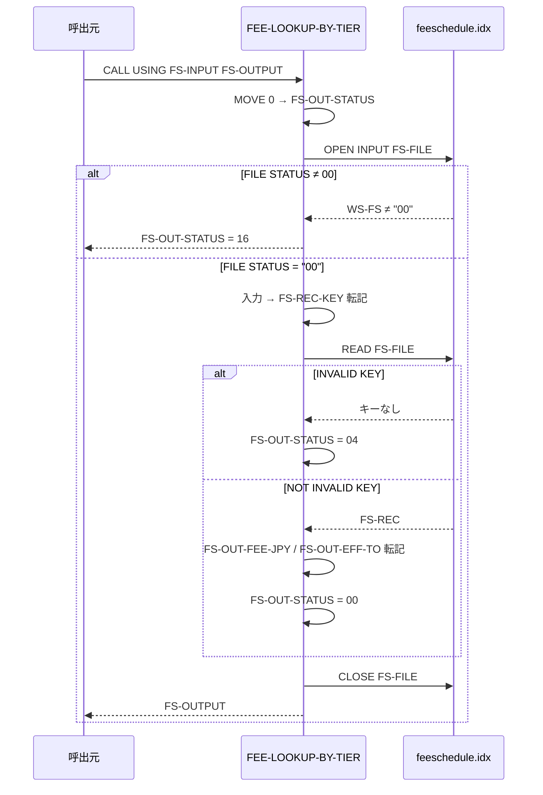

# 基本設計書 — FEE-LOOKUP-BY-TIER

> **サブシステム:** 07-feeschedule
> **プログラム ID:** `FEE-LOOKUP-BY-TIER`
> **種別:** オンライン
> **更新日:** 2026-07-06

---

## 1. プログラム概要

| 項目 | 値 |
|------|-----|
| プログラム ID | `FEE-LOOKUP-BY-TIER` |
| ソースファイル | `src/fee-lookup-by-tier.cob` |
| 所属サブシステム | 07-feeschedule |
| 種別 | オンライン |
| 概要 | カテゴリ・ティヤ・有効開始日の 3 項をキーとして Indexed File（`feeschedule.idx`）をランダム検索し、当該ティヤの手数料（JPY）と有効終了日を返却する `.so` モジュール。手数料計算においてターゲットシステムから `CALL` される前提の汎用Lookup とする。 |

---

## 2. 機能概要

### 2.1 このプログラムが「すること」
入力された `(カテゴリ, ティヤ, 有効開始日)` レコードキーで Indexed File を READ し、該当レコードの手数料（金額）と有効終了日を出力構造体へ設定する。キー不一致時は `NOT-FOUND (04)` を返却し、起動時ファイルオープン異常時は `FATAL (16)` を返却する。処理の成否は `FS-OUT-STATUS` で一元管理する。

### 2.2 呼出元と呼出し先
- **呼出元:** テストドライバ `FEETEST`。他オンライン/バッチ処理からの `CALL "FEE-LOOKUP-BY-TIER" USING FS-INPUT FS-OUTPUT` を想定。将来的には [01-calendar](../01-calendar/) 等の日付判定処理と組み合わせてフェ利用料の課金日連動に拡張可能。
- **呼出先:** 外部プログラム呼出は行わず、Indexed File の READ のみを実施する。

### 2.3 シーケンス図



---

## 3. 処理フロー

### 3.1 全体フロー（flowchart）

```mermaid
flowchart TD
    START([CALL ENTRY]) --> INIT[FS-OUT-STATUS = 0]
    INIT --> O_FILE[OPEN INPUT FS-FILE]
    O_FILE --> CHK_OPEN{WS-FS = "00" ?}
    CHK_OPEN -->|No| RET_FATAL[FS-OUT-STATUS = 16]
    RET_FATAL --> GBK1[GOBACK]
    CHK_OPEN -->|Yes| KEY[MOVE FS-INPUT → FS-REC-KEY]
    KEY --> READ[READ FS-FILE]
    READ -->|INVALID KEY| RET_NF[FS-OUT-STATUS = 04]
    READ -->|NOT INVALID KEY| FILL[FS-REC-AMOUNT/T → FS-OUT へ転記]
    FILL --> SOK[FS-OUT-STATUS = 00]
    SOK --> CLOSE[CLOSE FS-FILE]
    RET_NF --> CLOSE
    CLOSE --> GBK2[GOBACK]
    GBK2 --> END([戻り])
    GBK1 --> END
```

---

## 4. 入出力仕様

### 4.1 入力

| 項目 | 型 | 必須 | 説明 |
|------|-----|:----:|------|
| FS-IN-CATEGORY | PIC 9(2) | ✅ | 手数料カテゴリコード (10=入金, 20=出金, 30=振込, 40=海外送金) ※ 88 定数で意味付け |
| FS-IN-TIER | PIC 9(2) | ✅ | ティヤ（顧客層ランク）。1, 2, 3 等を想定 |
| FS-IN-EFFECTIVE | PIC 9(8) | ✅ | 適用開始日 (YYYYMMDD)。レコードキーの一部 |

### 4.2 出力

| 項目 | 型 | 説明 |
|------|-----|------|
| FS-OUT-STATUS | PIC 9(2) | 処理結果コード（下記返却コード参照） |
| FS-OUT-FEE-JPY | PIC S9(9) | 手数料（日本円, 銭未満）。NOT-FOUND 時は変更なし |
| FS-OUT-EFF-TO | PIC 9(8) | 当該料金の適用終了日 (YYYYMMDD)。NOT-FOUND 時は変更なし |

### 4.3 返却コード（概要）

| コード | 意味 |
|--------|------|
| 00 | 正常（該当レコードあり） |
| 04 | NOT-FOUND（キー不一致。当該カテゴリ/ティヤ/日付に該当なし） |
| 16 | FATAL（Indexed File オープン失敗） |

---

## 5. 正常系テストケース

| # | テスト名 | 入力 | 期待出力 | 確認ポイント |
|---|---------|------|---------|------------|
| 1 | カテゴリ 40 ティヤ 1 通常検索 | cat=40, tier=1, eff=20260101 | status=00, fee=0 | wire tier1 が 0 円で返ること（非課金ティヤ）。種子データ `fee=0` を確認 |
| 2 | カテゴリ 40 ティヤ 3 手数料あり | cat=40, tier=3, eff=20260101 | status=00, fee=880 | wire tier3 が 880 円で返ること。日付帯 2026 年度の適用 |
| 3 | カテゴリ 40 ティヤ 3 次年度料金 | cat=40, tier=3, eff=20270101 | status=00, fee=968 | 年度跨ぎで金額変動 (880 → 968) が反映されること。有効開始日パターン別の料金レコード系 |

---

## 6. 異常系テストケース

| # | テスト名 | 入力 | 期待される異常 | 確認ポイント |
|---|---------|------|--------------|------------|
| 1 | 未定義カテゴリ検索 | cat=99, tier=1, eff=20260101 | status=04 (NOT-FOUND) | 88 定数に存在しないカテゴリを指定しても読出し失敗で 04 を返すこと。上位呼出元が NOT-FOUND としてハンドリング可能 |
| 2 | ファイル未生成 | fee-schedule.idx 削除後 CALL | status=16 (FATAL) | `feeschedule.idx` 未生成時、OPEN INPUT で異常検知し GOBACK。FEE-LOAD と実行順序の保証が上位の責務 |
| 3 | キー不一致（ティヤ不整合） | cat=40, tier=99 (存在しない), eff=20260101 | status=04 (NOT-FOUND) | カテゴリは存在してもティヤ階層の不一致で NOT-FOUND となること。タプル検索がカテゴリ単位でないことを確認 |

---

## 参考
- ソース: [fee-lookup-by-tier.cob](../src/fee-lookup-by-tier.cob)
- 公開 IF: [fs-api.cpy](../copy/api/fs-api.cpy)
- プライベート IF: [fd-fs.cpy](../copy/private/fd-fs.cpy)
- データロード元: [fee-load.md](fee-load.md)
- その他: [Makefile](../Makefile)
