# 基本設計書 — ACCT-EXISTS

> **サブシステム:** 08-account
> **プログラム ID:** `ACCT-EXISTS`
> **種別:** オンライン（共有ライブラリ・モジュール）
> **更新日:** 2026-07-06

---

## 1. プログラム概要

| 項目 | 値 |
|------|-----|
| プログラム ID | `ACCT-EXISTS` |
| ソースファイル | `src/acct-exists.cob` |
| 所属サブシステム | 08-account |
| 種別 | オンライン |
| 概要 | 番号を指定して口座が存在するかを判定し、存在時は口座ステータス・商品コード・アクティブフラグを返却する。入力が 0 または KEY が存在しない場合は NOT-FIND を、OPEN 失敗時は IO-FAIL を返す。 |

---

## 2. 機能概要

### 2.1 このプログラムが「すること」
外部（他バッチ／オンライン）から口座番号を受け、ISAM INDEXED ファイル `account.idx` を RANDOM で READ し、存在有無を判断する。
存在時はレコードからステータス・商品コードを起算し、ステータスが "A" の場合にのみアクティブフラグを "Y" に立てる。全ての結果は API 出力構造体と status で返す。

### 2.2 呼出元と呼出し先
- **呼出元:** オンラインバッチ／業務プログラムから `CALL "ACCT-EXISTS"`。
- **呼出先:** ファイル I/O のみ（外部モジュール呼び出しなし）。ISAM ファイル OPEN/READ/CLOSE を自前で行う。

### 2.3 シーケンス図

```mermaid
sequenceDiagram
    participant caller as 呼出元
    participant self as ACCT-EXISTS
    participant file as account.idx

    caller->>self: ACCT-EXISTS-INPUT (NUMBER)
    self->>file: OPEN INPUT
    file-->>self: WS-FS
    alt WS-FS != "00"
        self-->>caller: status=12 (IO-FAIL)
    else WS-FS = "00"
        self->>file: READ KEY = NUMBER
        alt INVALID KEY
            self-->>caller: status=04, FOUND="N"
        else NOT INVALID KEY
            self-->>caller: status=00, FOUND="N" or "Y"<br/>status-code / product-code / active-flag
        end
    end
    self->>file: CLOSE
```



---

## 3. 処理フロー

### 3.1 全体フロー（flowchart）

```mermaid
flowchart TD
    START([開始]) --> INIT[出力初期化: FOUND="N", status="00"]
    INIT --> OPEN[OPEN INPUT account.idx]
    OPEN --> CHK_FS{WS-FS = "00" ?}
    CHK_FS -->|No| ERR_IO[status=12, GOBACK]
    CHK_FS -->|Yes| READ[READ ACCT-REC KEY = NUMBER]
    READ --> CHK_KEY{INVALID KEY ?}
    CHK_KEY -->|Yes| RET_NF[FOUND="N", status=04, CLOSE/GOBACK]
    CHK_KEY -->|No| POPULATE[出力フィールドに ACCT-REC 値をムーブ]
    POPULATE --> CHK_STATUS{ACCT-REC-STATUS = "A" ?}
    CHK_STATUS -->|Yes| SET_ACTIVE[ACTIVE-FLAG="Y"]
    CHK_STATUS -->|No| SET_NOT_ACTIVE[ACTIVE-FLAG="N"]
    SET_ACTIVE --> RET_OK[status=00, CLOSE/GOBACK]
    SET_NOT_ACTIVE --> RET_OK
    ERR_IO --> END([終了])
    RET_NF --> END
    RET_OK --> END
```

---

## 4. 入出力仕様

### 4.1 入力

| 項目 | 型 | 必須 | 説明 |
|------|-----|:----:|------|
| ACCT-EXISTS-NUMBER | PIC 9(13) | ✅ | 検索する口座番号。0 または存在しない場合は NOT-FOUND (status=04)。 |

### 4.2 出力

| 項目 | 型 | 説明 |
|------|-----|------|
| ACCT-EXISTS-FOUND | PIC X(1) | "Y"= 口座存在、"N"= 口座不在 |
| ACCT-EXISTS-STATUS-CODE | PIC X(1) | レコードの口座ステータス。"P"/"A"/"D"/"S"/"C"/"R" |
| ACCT-EXISTS-PRODUCT-CODE | PIC 9(3) | レコードの商品コード |
| ACCT-EXISTS-ACTIVE-FLAG | PIC X(1) | "A" ステータスの場合のみ "Y"、それ以外は "N" |
| ACCT-EXISTS-FILLER | PIC X(2) | 予約 |
| ACCT-EXISTS-API-STATUS | PIC X(2) | API 結果ステータスコード |

### 4.3 返却コード（概要）

| コード | 意味 |
|--------|------|
| 00 | 正常（口座情報を取得。FOUND="Y" or "N" で区別） |
| 04 | NOT-FOUND（INPUT が 0 か FILE READ の INVALID KEY） |
| 08 | INVALID-INPUT（未使用。将来拡張用。88 値は定義済） |
| 12 | IO-FAIL（OPEN 失敗時 WS-FS != "00"） |
| 16 | FATAL（未使用。88 値定義のみ） |

---

## 5. 正常系テストケース

| # | テスト名 | 入力 | 期待出力 | 確認ポイント |
|---|---------|------|---------|------------|
| 1 | 存在する口座（No.1） | ACCT-EXISTS-NUMBER = 0010030000001 | FOUND="Y", status=00, ACTIVE-FLAG="Y", STATUS-CODE="A", PRODUCT-CODE>0 | 一連のレコードフィールドが正しくコピーされること |
| 2 | 商品コードが 0 でない | ACCT-EXISTS-NUMBER = 0010030000001 | PRODUCT-CODE > 0 | レコード内容が反映されること |
| 3 | ステータス = "A" でアクティブ | ACCT-EXISTS-NUMBER = 0010030000001 | ACCT-EXISTS-ACTIVE-FLAG="Y" | ACTIVE-FLAG 判定が機能すること |
| 4 | 同一番号の再呼び出し | 同上 2 回連続 | 2 回目も同一結果 | 再入可能／副作用なし |

---

## 6. 異常系テストケース

| # | テスト名 | 入力 | 期待される異常 | 確認ポイント |
|---|---------|------|--------------|------------|
| 1 | 口座番号 0 | ACCT-EXISTS-NUMBER = 0 | FOUND="N", status=04 | 「番号なし」を NOT-FOUND と扱う |
| 2 | 存在しない口座番号 | 9999999999999 | FOUND="N", status=04 | INVALID KEY が起算されること |
| 3 | 存在しない口座番号 1000000000000 | 1000000000000 | FOUND="N", status=04 | レコード存在しない場合の分岐 |
| 4 | 存在しない口座番号（下駄） | 9999999999998 | FOUND="N", status=04 | エッジキーでも同動作 |
| 5 | ファイル OPEN 失敗 | （account.idx 不在／権限なし時） | status=12 | WS-FS != "00" の場合に即 GOBACK |

---

## 参考
- ソース: [acct-exists.cob](../src/acct-exists.cob)
- 公開 IF: [acct-api.cpy](../copy/api/acct-api.cpy)
- ファイル定義: [fd-account.cpy](../copy/private/fd-account.cpy)
- その他: [Makefile](../Makefile)
- テスト: [acct-test.cob](../tests/unit/acct-test.cob)
