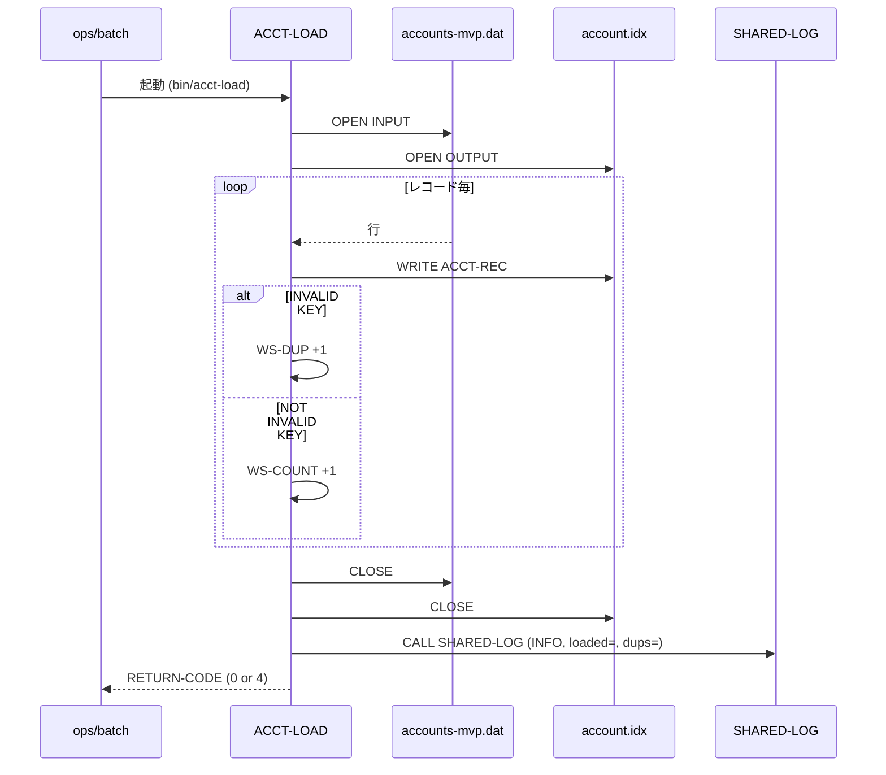

# 基本設計書 — ACCT-LOAD

> **サブシステム:** 08-account
> **プログラム ID:** `ACCT-LOAD`
> **種別:** LOAD（バッチ・ISAM インデックス作成プログラム）
> **更新日:** 2026-07-06

---

## 1. プログラム概要

| 項目 | 値 |
|------|-----|
| プログラム ID | `ACCT-LOAD` |
| ソースファイル | `src/acct-load.cob` |
| 所属サブシステム | 08-account |
| 種別 | LOAD |
| 概要 | シーケンシャルな口座シードデータファイル `accounts-mvp.dat` を読み込み、キー順の ISAM INDEXED ファイル `account.idx` として一行ずつ WRITE する。OPEN OUTPUT により構築し直す。全件読み込み後、共有ログ `SHARED-LOAD` で集計を記録し、RETRUN-CODE で WARNING(4) / SUCCESS(0) を返す。 |

---

## 2. 機能概要

### 2.1 このプログラムが「すること」
バッチ起動でシーケンシャルシードファイルを全件スキャンし、各レコードを FD 定義 `ACCT-REC` に変換して ISAM INDEXED ファイルに `WRITE` する。レコード番号と顧客番号の 2  Alternate index が走る。
WRITE の invalid KEY（キー重複）は WS-DUP に集計し、READ が AT END した段階でファイルを CLOSE する。最後に SHARED-LOG で件数をログ出力し、重複がなければ 0、あれば 4 を RETURN-CODE とする。

### 2.2 呼出元と呼出し先
- **呼出元:** `make load-idx`、あるいは保守バッチから直接実行（`CALL "ACCT-LOAD"` ではなく単独実行想定）。同一 Makefile から `22-operations/ops-seed-system-isam` を後続実行するパイプライン参照。
- **呼出先:** `CALL "SHARED-LOG"`（`/workspace/shared/util/shared-log/bin` 配下）。ロード完了後の集計ログを INFO レベルで送出する。

### 2.3 シーケンス図



---

## 3. 処理フロー

### 3.1 全体フロー（flowchart）

```mermaid
flowchart TD
    START([開始]) --> OPEN_IN[OPEN INPUT seed]
    OPEN_IN --> OPEN_OUT[OPEN OUTPUT account.idx]
    OPEN_OUT --> CHK_OPEN{両方 WS-FS="00" ?}
    CHK_OPEN -->|No| FAIL_12[RETURN-CODE=12, STOP RUN]
    CHK_OPEN -->|Yes| READ[READ seed]
    READ --> AT_END{AT END ?}
    AT_END -->|Yes| CLOSE_ALL[双方 CLOSE]
    CLOSE_ALL --> LOG[CALL SHARED-LOG 記録]
    LOG --> CHK_DUP{WS-DUP > 0 ?}
    CHK_DUP -->|Yes| RC4[RETURN-CODE=4, STOP RUN]
    CHK_DUP -->|No| RC0[RETURN-CODE=0, STOP RUN]
    AT_END -->|No| COPY[COPY-FIELDS で ACCT-REC にフィールドムーブ]
    COPY --> WRITE[WRITE ACCT-REC]
    WRITE --> DUP{INVALID KEY ?}
    DUP -->|Yes| INC_DUP[WS-DUP +1]
    DUP -->|No| INC_COUNT[WS-COUNT +1]
    INC_DUP --> READ
    INC_COUNT --> READ
    FAIL_12 --> END([終了])
    RC4 --> END
    RC0 --> END
```

---

## 4. 入出力仕様

### 4.1 入力

| 項目 | 型 | 必須 | 説明 |
|------|-----|:----:|------|
| accounts-mvp.dat 各項目（AS-NUMBER） | PIC 9(13) | ✅ | 口座番号（プライマリキー）。重複時は INVALID KEY となる |
| accounts-mvp.dat 各項目（AS-CUST-ID） | PIC 9(10) | ✅ | 顧客番号（ALTERNATE KEY、WITH DUPLICATES） |
| AS-PRODUCT-CODE | PIC 9(3) | ✅ | 商品コード |
| AS-BRANCH-CODE | PIC 9(3) | ✅ | 支店コード |
| AS-OPENED-DATE | PIC 9(8) | ✅ | 開設日 |
| AS-CLOSED-DATE | PIC 9(8) | ✅ | 解約日 |
| AS-STATUS | PIC X(1) | ✅ | 口座ステータス |
| AS-OVERDRAFT | PIC S9(15) COMP-3 | ✅ | 当枠 |
| AS-TERM-DAYS | PIC 9(4) | ✅ | 期間日数 |
| AS-DORMANCY-DATE | PIC 9(8) | ✅ | 休眠日 |
| AS-CREATED-TS / AS-UPDATED-TS | PIC 9(14) | ✅ | タイムスタンプ |
| AS-FILLER | PIC X(16) | — | 予約 |

### 4.2 出力

| 項目 | 型 | 説明 |
|------|-----|------|
| account.idx | ISAM INDEXED | 作成される ISAM ファイル。レコード番号＋顧客番号の 2 系統キーを持つ |
| RETURN-CODE | 整数 | 0=成功、4=重複あり、12=ファイル OPEN 失敗 |
| WS-LOG-MSG → INFO | 共有ログ | `ACCT-LOAD complete loaded=<count> dups=<dup>` |

### 4.3 返却コード（概要）

| コード | 意味 |
|--------|------|
| 0 | ロード成功（重複なし） |
| 4 | ロード成功だが重複レコードあり |
| 12 | ファイル OPEN 失敗 |

---

## 5. 正常系テストケース

| # | テスト名 | 入力 | 期待出力 | 確認ポイント |
|---|---------|------|---------|------------|
| 1 | 初回ロード | accounts-mvp.dat（システム口座含む） | account.idx 作成、loaded>0、dups=0 | ファイル種別/キー構成が要件どおり |
| 2 | SHARED-LOG への投入 | 正常ロード完了後 | 1 レコードの INFO ログ | 件数・重複数がメッセージに含まれること |
| 3 | 戻りコード確認 | 重複なしケース | RETURN-CODE=0 | make load-idx が 0 で抜けること |
| 4 | 操作画面未反映 | account.idx 実体 | 人数と件数の整合 | BUILD のバイトサイズが想定内 |

---

## 6. 異常系テストケース

| # | テスト名 | 入力 | 期待される異常 | 確認ポイント |
|---|---------|------|--------------|------------|
| 1 | ファイル不在 | accounts-mvp.dat 不在 | RETURN-CODE=12 | 早期 STOP RUN。ログは未出力 |
| 2 | キー重複レード | 同一番号が 2 行以上 | dups>0, RETURN-CODE=4 | WRITE の INVALID KEY が WS-DUP を加算 |
| 3 | 空のシードファイル | 0 バイト .dat | account.idx が空の ISAM | EOF までループで脱出。loaded=0, rc=0 |

---

## 参考
- ソース: [acct-load.cob](../src/acct-load.cob)
- 公開 IF: [acct-api.cpy](../copy/api/acct-api.cpy)
- ファイル定義: [fd-account.cpy](../copy/private/fd-account.cpy) / [fd-acct-seed.cpy](../copy/private/fd-acct-seed.cpy)
- ログ共有 IF: [shared-log-api.cpy](../../../../../shared/copy/shared-log-api.cpy) → [shared-log.md](../../shared/util/shared-log/design/shared-log.md)
- その他: [Makefile](../Makefile)
