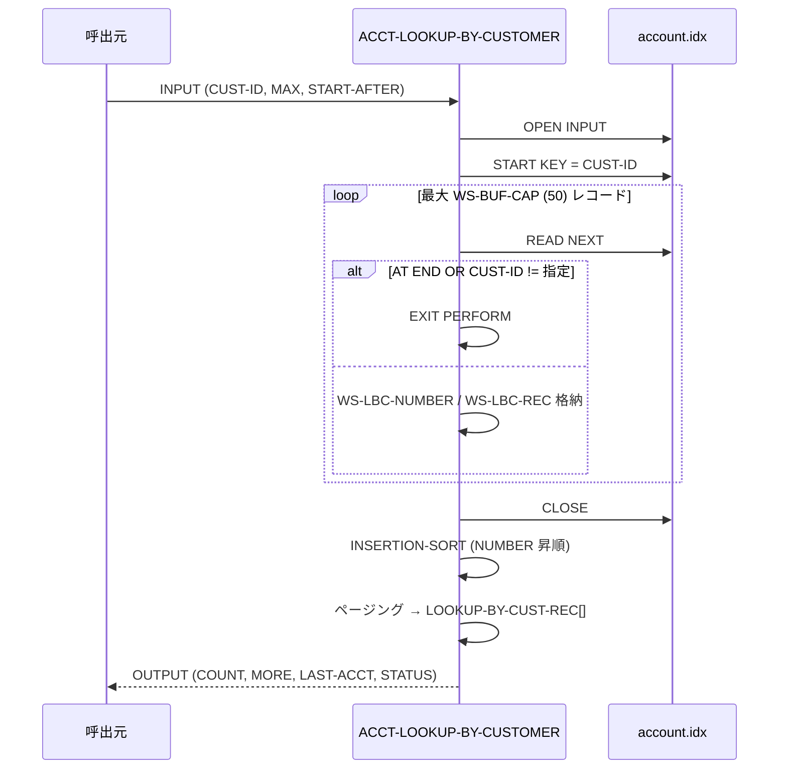

# 基本設計書 — ACCT-LOOKUP-BY-CUSTOMER

> **サブシステム:** 08-account
> **プログラム ID:** `ACCT-LOOKUP-BY-CUSTOMER`
> **種別:** オンライン（共有ライブラリ・モジュール）
> **更新日:** 2026-07-06

---

## 1. プログラム概要

| 項目 | 値 |
|------|-----|
| プログラム ID | `ACCT-LOOKUP-BY-CUSTOMER` |
| ソースファイル | `src/acct-lookup-by-customer.cob` |
| 所属サブシステム | 08-account |
| 種別 | オンライン |
| 概要 | 顧客番号をキーに同一顧客の口座をスキャンし、バッファ（最大 50 件）に読み込む。読み込んだ口座を INSERTION-SORT で NUMBER 昇順で並べ替え、呼出側指定の開始番号・上限件数でページング送出する。上限超過時は MORE="Y" を返却し、カーソル継続を促す。 |

---

## 2. 機能概要

### 2.1 このプログラムが「すること」
顧客番号（LOOKUP-BY-CUST-CUST-ID）を受け、ISAM の ALTERNATE KEY（WITH DUPLICATES）で START ～ READ NEXT の範囲スキャンを行い、同一顧客のレコードをメモリ（`WS-LBC-SCAN-BUFFER`）にため込む。バッファへため終えた後、INSERTION-SORT で口座番号昇順に並べ替え、`LOOKUP-BY-CUST-START-AFTER` より大きいレコードから最大 `LOOKUP-BY-CUST-MAX` 件まで出力バッファへコピーする。
バッファをFilledまで読んだ場合は DUP-WARN（status=02）を返し、カットされたレコードを示唆する。

### 2.2 呼出元と呼出し先
- **呼出元:** オンライン（例: 取引入力・顧客照会画面）から `CALL "ACCT-LOOKUP-BY-CUSTOMER"` で呼び出される。
- **呼出先:** ファイル I/O のみ。ソートはプログラム内の PERFORM で自前実装（外部ソート不使用）。

### 2.3 シーケンス図



---

## 3. 処理フロー

### 3.1 全体フロー（flowchart）

```mermaid
flowchart TD
    START([開始]) --> CHECK_MAX{MAX in 1..20 ?}
    CHECK_MAX -->|No| ERR_INV[status=08, GOBACK]
    CHECK_MAX -->|Yes| OPEN[OPEN INPUT account.idx]
    OPEN --> CHK_FS{WS-FS = "00" ?}
    CHK_FS -->|No| ERR_IO[status=12, GOBACK]
    CHK_FS -->|Yes| START[START KEY = CUST-ID]
    START --> CHK_START{INVALID KEY ?}
    CHK_START -->|Yes| RET_NF[status=04, CLOSE/GOBACK]
    CHK_START -->|No| LOOP_SCAN[バッファ読み出しループ]
    LOOP_SCAN --> CHK_EOF{CUST-ID != OR AT END OR COUNT>=50}
    CHK_EOF -->|No| LOAD_BUF[バッファ追加 → LOOP_SCAN]
    CHK_EOF -->|Yes| CLOSE[close idx]
    CLOSE --> CHK_COUNT{WS-SCAN-COUNT = 0 ?}
    CHK_COUNT -->|Yes| RET_NF2[status=04, GOBACK]
    CHK_COUNT -->|No| SORT[INSERTION-SORT]
    SORT --> FILTER[START-AFTER/MAXでフィルタ出力]
    FILTER --> SET_MORE{MORE 調整}
    SET_MORE --> CHK_CAP{READ 上限まで読んだ ?}
    CHK_CAP -->|Yes| RET_WARN[status=02, GOBACK]
    CHK_CAP -->|No| RET_OK[status=00, GOBACK]
    ERR_INV --> END([終了])
    ERR_IO --> END
    RET_NF --> END
    RET_NF2 --> END
    RET_WARN --> END
    RET_OK --> END
```

---

## 4. 入出力仕様

### 4.1 入力

| 項目 | 型 | 必須 | 説明 |
|------|-----|:----:|------|
| LOOKUP-BY-CUST-CUST-ID | PIC 9(10) | ✅ | 照会対象顧客番号 |
| LOOKUP-BY-CUST-MAX | PIC 9(2) COMP-3 | ✅ | 返却上限件数（1..20）。範囲外で status=08 |
| LOOKUP-BY-CUST-START-AFTER | PIC 9(13) | ✅ | この番号より大きい口座から返却（カーソル） |

### 4.2 出力

| 項目 | 型 | 説明 |
|------|-----|------|
| LOOKUP-BY-CUST-COUNT | PIC 9(2) COMP-3 | 返却件数（MAX 以下） |
| LOOKUP-BY-CUST-MORE | PIC X(1) | "Y"= 残りあり、"N"= 最終ページ |
| LOOKUP-BY-CUST-LAST-ACCT | PIC 9(13) | 最後に返却した口座番号（次回 START 用カーソル） |
| LOOKUP-BY-CUST-RECORDS (1..20) | PIC X(100) | レコード本体（1 レコード 100 バイト） |
| ACCT-LOOKUP-BY-CUST-STATUS | PIC X(2) | API 結果コード |

### 4.3 返却コード（概要）

| コード | 意味 |
|--------|------|
| 00 | 正常（最終ページ） |
| 02 | DUP-WARN（上限超過だが返却可能） |
| 04 | NOT-FOUND |
| 08 | INVALID-INPUT（MAX 範囲外） |
| 12 | IO-FAIL |
| 16 | FATAL（予約） |

---

## 5. 正常系テストケース

| # | テスト名 | 入力 | 期待出力 | 確認ポイント |
|---|---------|------|---------|------------|
| 1 | 顧客番号（2）で取得 | CUST-ID=2, MAX=10, START-AFTER=0 | COUNT 1..5, status=00, MORE="N" | 件数上限内で返却 |
| 2 | ソート順検証 | CUST-ID=2, MAX=10 | 返却レコード列が NUMBER 昇順 | INSERTION-SORT 実装の正当性 |
| 3 | LAST-ACCT カーソル | CUST-ID=2 | LAST-ACCT > 0 | 次回検索で利用可能 |
| 4 | MAX=1 のページング | CUST-ID=2, MAX=1 | COUNT=1, LAST-ACCT が最小番号 | 1 ページ目のみ返却 |

---

## 6. 異常系テストケース

| # | テスト名 | 入力 | 期待される異常 | 確認ポイント |
|---|---------|------|--------------|------------|
| 1 | 存在しない顧客番号 | CUST-ID=9999999999 | status=04 | START の INVALID KEY が status=04 へ |
| 2 | MAX 範囲外 | CUST-ID=2, MAX=0 | status=08 | 事前条件を満たさず GOBACK |
| 3 | MAX 超過で MORE=Y | CUST-ID=..., MAX=1 かつ多数口座 | MORE=Y, status=00 | 次回呼出の入力を案内 |
| 4 | バッファ上限超過 | CUST-ID=...(>=50 口座) | status=02 | WS-LBC-SCAN-BUFFER=50 で打ち切り、status=02 |

---

## 参考
- ソース: [acct-lookup-by-customer.cob](../src/acct-lookup-by-customer.cob)
- 公開 IF: [acct-api.cpy](../copy/api/acct-api.cpy)
- ファイル定義: [fd-account.cpy](../copy/private/fd-account.cpy)
- その他: [Makefile](../Makefile)
- テスト: [acct-test.cob](../tests/unit/acct-test.cob)
