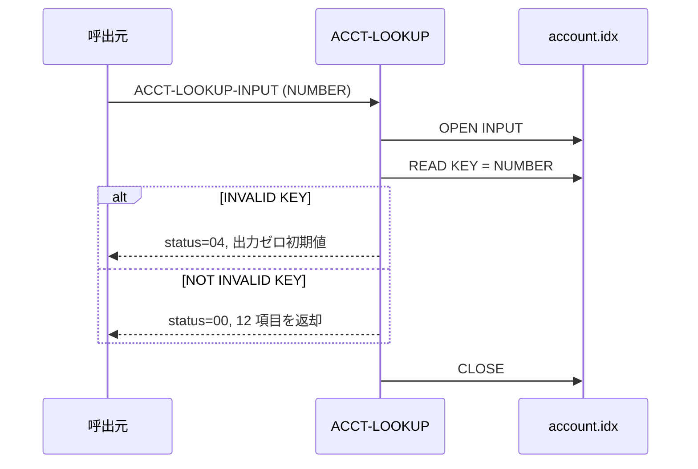

# 基本設計書 — ACCT-LOOKUP

> **サブシステム:** 08-account
> **プログラム ID:** `ACCT-LOOKUP`
> **種別:** オンライン（共有ライブラリ・モジュール）
> **更新日:** 2026-07-06

---

## 1. プログラム概要

| 項目 | 値 |
|------|-----|
| プログラム ID | `ACCT-LOOKUP` |
| ソースファイル | `src/acct-lookup.cob` |
| 所属サブシステム | 08-account |
| 種別 | オンライン |
| 概要 | 口座番号を指定し、ISAM ファイルから該当レコードを取得。ACCT-LOOKUP-OUTPUT に 12 項目の口座属性を展開し、正常時 status=00、不在時 status=04 を返す。OPEN 失敗時は 12 を返却。 |

---

## 2. 機能概要

### 2.1 このプログラムが「すること」
口座番号（ACCT-LOOKUP-NUMBER）をキーに `account.idx` を RANDOM READ し、取得レコードを出力構造体にフィールド単位で展開する。
未取得時は出力をゼロ／スペースで埋めたまま status=04 のみ返す。

### 2.2 呼出元と呼出し先
- **呼出元:** 業務オンライン／バッチ（`CALL "ACCT-LOOKUP"`）。`acct-exists` を代替する、より詳細な口座参照。
- **呼出先:** ファイル I/O のみ（外部モジュール呼び出しなし）。

### 2.3 シーケンス図



---

## 3. 処理フロー

### 3.1 全体フロー（flowchart）

```mermaid
flowchart TD
    START([開始]) --> INIT[ACCT-LOOKUP-OUTPUT 全項目初期化]
    INIT --> OPEN[OPEN INPUT account.idx]
    OPEN --> CHK_FS{WS-FS = "00" ?}
    CHK_FS -->|No| ERR_IO[status=12, GOBACK]
    CHK_FS -->|Yes| READ[READ KEY = ACCT-LOOKUP-NUMBER]
    READ --> CHK_KEY{INVALID KEY ?}
    CHK_KEY -->|Yes| RET_NF[status=04, CLOSE/GOBACK]
    CHK_KEY -->|No| COPY[12 項目を ACCT-REC → ACCT-LO-* にムーブ]
    COPY --> RET_OK[status=00, CLOSE/GOBACK]
    ERR_IO --> END([終了])
    RET_NF --> END
    RET_OK --> END
```

---

## 4. 入出力仕様

### 4.1 入力

| 項目 | 型 | 必須 | 説明 |
|------|-----|:----:|------|
| ACCT-LOOKUP-NUMBER | PIC 9(13) | ✅ | 検索する口座番号 |

### 4.2 出力

| 項目 | 型 | 説明 |
|------|-----|------|
| ACCT-LO-NUMBER | PIC 9(13) | 口座番号 |
| ACCT-LO-CUST-ID | PIC 9(10) | 顧客番号 |
| ACCT-LO-PRODUCT-CODE | PIC 9(3) | 商品コード |
| ACCT-LO-BRANCH-CODE | PIC 9(3) | 支店コード |
| ACCT-LO-OPENED-DATE | PIC 9(8) | 開設日 |
| ACCT-LO-CLOSED-DATE | PIC 9(8) | 解約日 |
| ACCT-LO-STATUS | PIC X(1) | 口座ステータス（P/A/D/S/C/R） |
| ACCT-LO-OVERDRAFT-LIMIT | PIC S9(15) COMP-3 | 当枠上限 |
| ACCT-LO-TERM-DAYS | PIC 9(4) | 期間日数 |
| ACCT-LO-DORMANCY-DATE | PIC 9(8) | 休眠日 |
| ACCT-LO-CREATED-TS | PIC 9(14) | 作成タイムスタンプ |
| ACCT-LO-UPDATED-TS | PIC 9(14) | 更新タイムスタンプ |
| ACCT-LO-FILLER | PIC X(6) | 予約 |
| ACCT-LOOKUP-STATUS | PIC X(2) | API 結果コード |

### 4.3 返却コード（概要）

| コード | 意味 |
|--------|------|
| 00 | 正常（レコード返却） |
| 04 | NOT-FOUND（番号なし） |
| 12 | IO-FAIL（OPEN 失敗） |
| 08 / 16 | 予約定義（未使用） |

---

## 5. 正常系テストケース

| # | テスト名 | 入力 | 期待出力 | 確認ポイント |
|---|---------|------|---------|------------|
| 1 | 口座番号 1 取得 | NUMBER=0010030000001 | status=00, STATUS="A", CUST-ID=2, OPENED=20260101, OVERDRAFT>0 | 主キー取得の代表 |
| 2 | ステータス "A" | NUMBER=0010030000001 | ACCT-LO-STATUS="A" | 88 値が立つこと |
| 3 | 開戸日 20260101 | NUMBER=0010030000001 | OPENED-DATE=20260101 | 日付項目の内容が正しいこと |
| 4 | 当枠が 0 でない | NUMBER=0010030000001 | OVERDRAFT-LIMIT>0 | COMP-3 展開が期待通り |
| 5 | 初期値と休眠日が同一 | NUMBER=0010030000001 | DORMANCY-DATE=OPENED-DATE | シード値整合 |

---

## 6. 異常系テストケース

| # | テスト名 | 入力 | 期待される異常 | 確認ポイント |
|---|---------|------|--------------|------------|
| 1 | 口座番号不在 | NUMBER=9999999999999 | status=04, 全項目初期値 | INVALID KEY の分岐 |
| 2 | OPEN 失敗 | account.idx 不在等 | status=12 | 即 GOBACK |
| 3 | 口座番号 0 | NUMBER=0 | status=04 or 12 | NOT-FOUND or IO-FAIL のいずれか |

---

## 参考
- ソース: [acct-lookup.cob](../src/acct-lookup.cob)
- 公開 IF: [acct-api.cpy](../copy/api/acct-api.cpy)
- ファイル定義: [fd-account.cpy](../copy/private/fd-account.cpy)
- その他: [Makefile](../Makefile)
- テスト: [acct-test.cob](../tests/unit/acct-test.cob)
