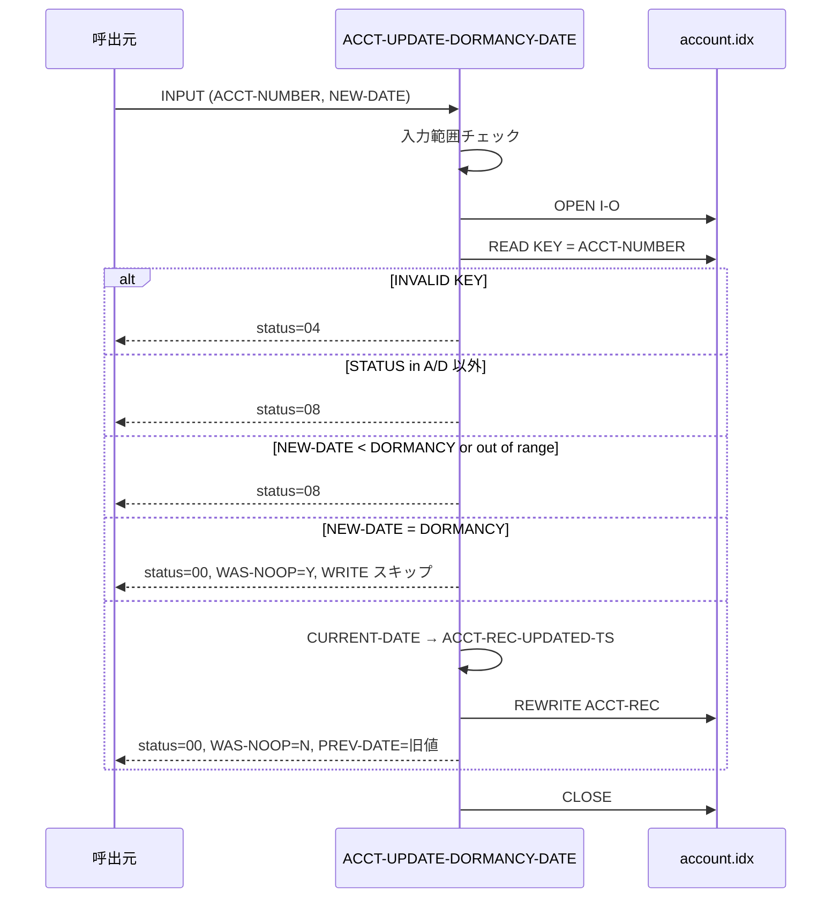

# 基本設計書 — ACCT-UPDATE-DORMANCY-DATE

> **サブシステム:** 08-account
> **プログラム ID:** `ACCT-UPDATE-DORMANCY-DATE`
> **種別:** オンライン（共有ライブラリ・モジュール）
> **更新日:** 2026-07-06

---

## 1. プログラム概要

| 項目 | 値 |
|------|-----|
| プログラム ID | `ACCT-UPDATE-DORMANCY-DATE` |
| ソースファイル | `src/acct-update-dormancy-date.cob` |
| 所属サブシステム | 08-account |
| 種別 | オンライン |
| 概要 | 口座番号と新しい休眠日を受け取り、`account.idx` を RANDOM I/O で更新する。ステータスが "A" または "D" の場合のみ更新可。前回日付との等価時は更新しない（NOOP）。前回日付の巻戻しまたは範囲外日付は拒否。更新成功時には `ACCT-REC-UPDATED-TS` に現在日時（YYYYMMDDhhmmss）を書き込む。 |

---

## 2. 機能概要

### 2.1 このプログラムが「すること」
口座番号をキーに ISAM ファイルを READ し、取得レコードのステータスが "A" または "D" であることを確認する。新規休眠日（`UPDATE-DORMANCY-NEW-DATE`）が 19000101..99991231 の範囲内かつ現在日付以降、かつ既存の休眠日以降であることを確認してから更新（`REWRITE ACCT-REC`）を行う。更新成功時にはタイムスタンプを記録し、前回日付は出力フィールドに返す。
同値の場合は何も書かず `WAS-NOOP="Y"` を返す。

### 2.2 呼出元と呼出し先
- **呼出元:** 業務バッチ（休眠日一括更新）またはオンライン取引入力からの `CALL "ACCT-UPDATE-DORMANCY-DATE"`。
- **呼出先:** ファイル I/O のみ（外部モジュール呼出なし）。日付文字列は `FUNCTION CURRENT-DATE` で取得のち、フィールド分割してタイムスタンプへ変換する。

### 2.3 シーケンス図



---

## 3. 処理フロー

### 3.1 全体フロー（flowchart）

```mermaid
flowchart TD
    START([開始]) --> INIT[PREV-DATE=0, WAS-NOOP=N, status=00]
    INIT --> CHK_RANGE{NEW-DATE in 19000101..99991231 ?}
    CHK_RANGE -->|No| ERR_INV[status=08, GOBACK]
    CHK_RANGE -->|Yes| OPEN[OPEN I-O account.idx]
    OPEN --> CHK_FS{WS-FS = "00" ?}
    CHK_FS -->|No| ERR_IO[status=12, GOBACK]
    CHK_FS -->|Yes| READ[READ KEY = ACCT-NUMBER]
    READ --> CHK_KEY{INVALID KEY ?}
    CHK_KEY -->|Yes| NF[status=04, CLOSE, GOBACK]
    CHK_KEY -->|No| CHK_STATUS{STATUS in A/D ?}
    CHK_STATUS -->|No| INV_STATUS[status=08, CLOSE, GOBACK]
    CHK_STATUS -->|Yes| SET_PREV[PREV-DATE = 既存 DORMANCY-DATE]
    SET_PREV --> CHK_BACK{NEW-DATE < 既存 DORMANCY ?}
    CHK_BACK -->|Yes| INV_BACK[status=08, CLOSE, GOBACK]
    CHK_BACK -->|No| CHK_EQ{NEW-DATE = 既存 DORMANCY ?}
    CHK_EQ -->|Yes| NOOP[WAS-NOOP=Y, status=00, CLOSE, GOBACK]
    CHK_EQ -->|No| CURDATE[FUNCTION CURRENT-DATE → UPDATED-TS]
    CURDATE --> REWRITE[REWRITE ACCT-REC]
    REWRITE --> CHK_RW{WS-FS = "00" ?}
    CHK_RW -->|No| ERR_IO2[status=12, CLOSE, GOBACK]
    CHK_RW -->|Yes| UPDATED[WAS-NOOP=N, status=00, CLOSE, GOBACK]
    ERR_INV --> END([終了])
    ERR_IO --> END
    NF --> END
    INV_STATUS --> END
    INV_BACK --> END
    NOOP --> END
    ERR_IO2 --> END
    UPDATED --> END
```

---

## 4. 入出力仕様

### 4.1 入力

| 項目 | 型 | 必須 | 説明 |
|------|-----|:----:|------|
| UPDATE-DORMANCY-ACCT-NUMBER | PIC 9(13) | ✅ | 更新対象の口座番号 |
| UPDATE-DORMANCY-NEW-DATE | PIC 9(8) | ✅ | 新しい休眠日（YYYYMMDD）。範囲 19000101..99991231 |

### 4.2 出力

| 項目 | 型 | 説明 |
|------|-----|------|
| UPDATE-DORMANCY-PREV-DATE | PIC 9(8) | 更新前の休眠日。NOOP 時も同値を返却 |
| UPDATE-DORMANCY-WAS-NOOP | PIC X(1) | "Y"= 同値更新スキップ、"N"= 書込発生 |
| UPDATE-DORMANCY-FILLER | PIC X(1) | 予約 |
| ACCT-UPDATE-DORMANCY-STATUS | PIC X(2) | API 結果コード |

### 4.3 返却コード（概要）

| コード | 意味 |
|--------|------|
| 00 | 正常。`WAS-NOOP="Y"` の場合は書込なし、`"N"` の場合は REWRITE 成功 |
| 04 | NOT-FOUND（READ INVALID KEY） |
| 08 | INVALID。範囲外、前回日付巻戻し、またはステータス対象外 |
| 12 | IO-OPEN / IO-REWRITE 失敗 |
| 16 | FATAL（予約） |

---

## 5. 正常系テストケース

| # | テスト名 | 入力 | 期待出力 | 確認ポイント |
|---|---------|------|---------|------------|
| 1 | 休眠日を 20260101 → 20260601 に更新 | ACCT=0010030000001, NEW=20260601 | status=00, PREV=20260101, WAS-NOOP=N | 初回更新の代表 |
| 2 | 更に 20260601 → 20260801 に更新 | ACCT=0010030000001, NEW=20260801 | status=00, PREV=20260601, WAS-NOOP=N | 2 回目の更新で前回値が更新後値を踏むこと |
| 3 | 同値投入で NOOP | ACCT=0010030000001, NEW=20260601 | status=00, WAS-NOOP=Y, ファイル更新なし | 冪等性の担保 |
| 4 | DORMANT ステータス口座も更新可 | STATUS=D の口座 | status=00 | A 以外に D も更新可であること |

---

## 6. 異常系テストケース

| # | テスト名 | 入力 | 期待される異常 | 確認ポイント |
|---|---------|------|--------------|------------|
| 1 | 日付範囲外（最下限） | NEW=00000101 (19000101 未満イメージ) | status=08 | 入力チェックでリジェクト |
| 2 | 日付範囲外（最上限） | NEW=99991332 | status=08 | 99991231 超過リジェクト |
| 3 | 前回日付巻戻し | NEW=20260301, 既存 DORMANCY=20260601 | status=08 | 時系列逆転を許さない |
| 4 | 口座番号不在 | ACCT=9999999999999 | status=04 | READ INVALID KEY 経由 |
| 5 | ステータス A/D 以外 | STATUS が P/S/C/R の口座 | status=08 | ステータス対象外リジェクト |
| 6 | OPEN/REWRITE 失敗 | I-O 失敗（ロック等） | status=12 | 上位でリトライ想定 |

---

## 参考
- ソース: [acct-update-dormancy-date.cob](../src/acct-update-dormancy-date.cob)
- 公開 IF: [acct-api.cpy](../copy/api/acct-api.cpy)
- ファイル定義: [fd-account.cpy](../copy/private/fd-account.cpy)
- その他: [Makefile](../Makefile)
- テスト: [acct-test.cob](../tests/unit/acct-test.cob)
