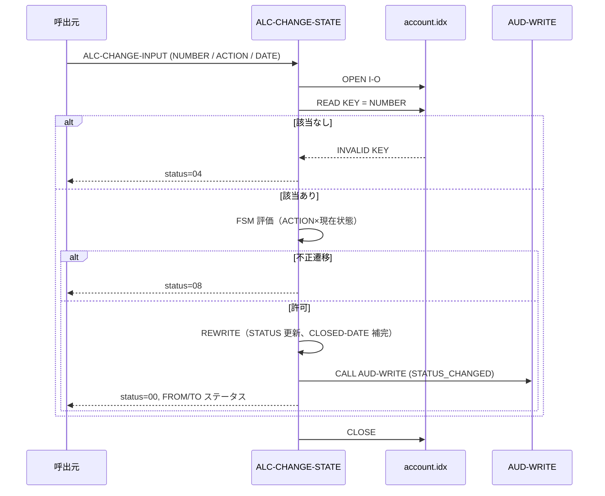

# 基本設計書 — ALC-CHANGE-STATE

> **サブシステム:** 09-accountlifecycle
> **プログラム ID:** `ALC-CHANGE-STATE`
> **種別:** オンライン（FSM ステートトランジション）
> **更新日:** 2026-07-06

---

## 1. プログラム概要

| 項目 | 値 |
|------|-----|
| プログラム ID | `ALC-CHANGE-STATE` |
| ソースファイル | `src/alc-change-state.cob` |
| 所属サブシステム | 09-accountlifecycle |
| 種別 | オンライン |
| 概要 | 口座番号をキーに既存レコードを取得し、アクションコードと現在ステータスから次ステータスを FSM 評価する。遷移許可時は UPDATE し、"CL"/"FC" 時は解約日を補完。監査証拠を残す。 |

---

## 2. 機能概要

### 2.1 このプログラムが「すること」
口座番号で RANDOM READ し、現在の `ACCT-REC-STATUS` と `ALC-CHANGE-ACTION-CODE` に基づき次ステータスを EVALUATE で決定する。遷移がフェーズ的に不正（または ACTION-CODE が未知）なら 08 を返却し、許可時は REWRITE して from/to ステータスを出力に返す。Close 系遷移（CL/FC）時は `ACCT-REC-CLOSED-DATE` に業務日付を書き込む。監査には `STATUS_CHANGED` イベントを JSON で残す。

### 2.2 呼出元と呼出し先
- **呼出元:** 業務オンライン・トランザクション、またはテストドライバ `ALCTEST`。
- **呼出先:** `CALL "AUD-WRITE"`（共有監査ユーティリティ）。ステート変更イベントを記録する。

### 2.3 シーケンス図



---

## 3. 処理フロー

### 3.1 全体フロー（flowchart）

```mermaid
flowchart TD
    START([開始]) --> INIT[ALC-CHANGE-OUTPUT・STATUS 初期化]
    INIT --> EVAL_ACT{ACTION-CODE 妥当性<br/>AC/CN/SU/LS/CL/FC ?}
    EVAL_ACT -->|OTHER| ERR_INV_A[status=08 で GOBACK]
    EVAL_ACT -->|OK| OPEN[OPEN I-O account.idx]
    OPEN --> O_CHK{WS-FS = "00" ?}
    O_CHK -->|No| ERR_IO[status=12 で GOBACK]
    O_CHK -->|Yes| READ[READ KEY = NUMBER]
    READ --> INV{INVALID KEY ?}
    INV -->|Yes| RET_NF[status=04 で GOBACK]
    INV -->|No| FSM[EVALUATE TRUE → 遷移可否判定]
    FSM --> GUARD{ALLOWED ?}
    GUARD -->|No| ERR_INV_B[status=08 で GOBACK]
    GUARD -->|Yes| SU_REASON{SU/FC で reason 空白 ?}
    SU_REASON -->|Yes| ERR_GUARD[status=08 で GOBACK]
    SU_REASON -->|No| APPLY[次ステータスを RESULT に反映]
    APPLY --> CL_CHECK{ターゲット = "C" ?}
    CL_CHECK -->|Yes| SET_CL_DATE[CLOSED-DATE に business-date を設定]
    CL_CHECK -->|No| REWRITE[REWRITE ACCT-REC]
    SET_CL_DATE --> REWRITE
    REWRITE --> W_CHK{WS-FS = "00" ?}
    W_CHK -->|No| ERR_W[status=12 で GOBACK]
    W_CHK -->|Yes| AUDIT[CALL AUD-WRITE]
    AUDIT --> RET_OK[status=00, FROM/TO 返却]
    ERR_INV_A --> END([終了])
    ERR_IO --> END
    RET_NF --> END
    ERR_INV_B --> END
    ERR_GUARD --> END
    ERR_W --> END
    RET_OK --> END
```

### 3.2 FSM 次ステート表（概要）

| ACTION | 現在状態 | 次状態 | バリデーション |
|--------|----------|--------|----------------|
| AC  | P        | A      | — |
| CN  | P        | C      | — |
| SU  | A / D    | S      | reason 必須 |
| LS  | S        | A      | — |
| CL  | A / D    | C      | — |
| FC  | not C    | C      | reason 必須 |

---

## 4. 入出力仕様

### 4.1 入力

| 項目 | 型 | 必須 | 説明 |
|------|-----|:----:|------|
| ALC-CHANGE-ACCT-NUMBER | PIC 9(13) | ✅ | 更新対象の口座番号 |
| ALC-CHANGE-ACTION-CODE | PIC X(2) | ✅ | 遷移指示（AC/CN/SU/LS/CL/FC） |
| ALC-CHANGE-REASON-TEXT | PIC X(80) | — | SU / FC 時のみ必須（バリデーション） |
| ALC-CHANGE-BUSINESS-DATE | PIC 9(8) | ✅ | 業務日付（YYYYMMDD）。Close 時に CLOSED-DATE へ転写、監査にも記録 |

### 4.2 出力

| 項目 | 型 | 説明 |
|------|-----|------|
| ALC-CHANGE-FROM-STATUS | PIC X(1) | 変更前の口座ステータス |
| ALC-CHANGE-TARGET-STATUS | PIC X(1) | 変更後の口座ステータス |

### 4.3 返却コード（概要）

| コード | 意味 |
|--------|------|
| 00 | 正常（ステータス更新・監査証拠出力済） |
| 04 | NOT-FOUND（該当口座なし） |
| 08 | INVALID（ACTION 不正 / 遷移禁止 / reason 不足） |
| 12 | IO-FAIL（OPEN / REWRITE 失敗） |
| 16 | 予約（未使用） |

---

## 5. 正常系テストケース

| # | テスト名 | 入力 | 期待出力 | 確認ポイント |
|---|---------|------|---------|------------|
| 1 | Pending → Active | NUMBER（P）, ACTION=AC, DATE=20260601 | status=00, FROM=P, TO=A | 基本Activate の代表 |
| 2 | Active → Suspend | ACTION=SU, reason="fraud investigation" | FROM=A, TO=S | reason 付きの suspend |
| 3 | Suspend → Active | ACTION=LS | FROM=S, TO=A | 解除で A に戻ること |
| 4 | Active → Close | ACTION=CL | FROM=A, TO=C | CLOSED-DATE が business-date に設定されること |
| 5 | Force Close | STATUS=S(?) or other not C, ACTION=FC, reason="operator forced" | TO=C | どんな状態からでも C へ（reject=C 以外） |
| 6 | 監査証拠（status changed） | 任意の正常系 | AUD-WRITE 呼出 payload に from/to が含まれること | JSON の from/to/action 構造 |

---

## 6. 異常系テストケース

| # | テスト名 | 入力 | 期待される異常 | 確認ポイント |
|---|---------|------|--------------|------------|
| 1 | 未知 ACTION | ACTION="ZZ" | status=08 | WHEN OTHER で即 GOBACK |
| 2 | P からの SU（禁止遷移） | STATUS=P, ACTION=SU | status=08 | フェーズ不正のバリデーション |
| 3 | reason 不足（SU/F C） | ACTION=SU, reason=SPACES | status=08 | ガードによる拒否 |
| 4 | 口座不在 | NUMBER=9999999999999 | status=04 | INVALID KEY の伝播 |
| 5 | OPEN 失敗 | account.idx 不在 | status=12 | 即 GOBACK |
| 6 | 書込失敗 | 他プロセスでロック中 | status=12 | REWRITE FS 判定のパス |
| 7 | 型違い：NUMBER 省略 | NUMBER=ZERO | status=04 | FS=INVALID 相当で 04 に分類 |

---

## 参考
- ソース: [alc-change-state.cob](../src/alc-change-state.cob)
- 公開 IF: [alc-api.cpy](../copy/api/alc-api.cpy)
- ファイル定義: [fd-account.cpy](../copy/private/fd-account.cpy)
- サブシステム横断 IF: [acct-lookup.md](../../08-account/design/acct-lookup.md)
- テスト: [alc-test.cob](../tests/unit/alc-test.cob)
- ビルド/実行定義: [Makefile](../Makefile)
