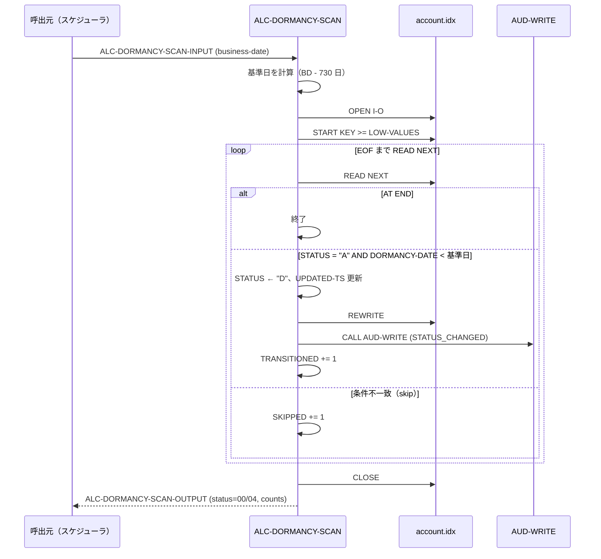

# 基本設計書 — ALC-DORMANCY-SCAN

> **サブシステム:** 09-accountlifecycle
> **プログラム ID:** `ALC-DORMANCY-SCAN`
> **種別:** バッチ
> **更新日:** 2026-07-06

---

## 1. プログラム概要

| 項目 | 値 |
|------|-----|
| プログラム ID | `ALC-DORMANCY-SCAN` |
| ソースファイル | `src/alc-dormancy-scan.cob` |
| 所属サブシステム | 09-accountlifecycle |
| 種別 | バッチ |
| 概要 | 取引実績のないアクティブ口座（status="A"）を夜間バッチで総ざらいし、休眠基準日（business-date から 730 日前）を超過した口座を 1 件ずつステータス "D" へ移行する。各遷移監査を残す。処理後は遷移・スキップ件数を出力コードで返す。 |

---

## 2. 機能概要

### 2.1 このプログラムが「すること」
batch 入力（business-date）をもとに「2 年前の日付（YYYYMMDD）」を算出し、ISAM ファイルを先頭から `READ NEXT` で順次走査する。`status="A"` かつ `DORMANCY-DATE < 基準日` のレコードを 1 件ずつ "D" に変更し、更新タイムスタンプと監査証拠を記録する。全件走査後にトランジション数・スキップ数いずれも 0 なら 04（候補なし）、それ以外は 00 を返す。

### 2.2 呼出元と呼出し先
- **呼出元:** 夜間統合バッチ or ジョブスケジュール、およびテストドライバ `ALCTEST`。
- **呼出先:** `CALL "AUD-WRITE"`（共有監査ユーティリティ）。D 遷移イベントを 1 件ずつ記録する。

### 2.3 シーケンス図



---

## 3. 処理フロー

### 3.1 全体フロー（flowchart）

```mermaid
flowchart TD
    START([開始]) --> INIT[STATUS 初期化 (00), counter=0]
    INIT --> CALC[基準日 = business-date - 730 日]
    CALC --> OPEN[OPEN I-O account.idx]
    OPEN --> O_CHK{WS-FS = "00" ?}
    O_CHK -->|No| ERR_IO[status=12 で GOBACK]
    O_CHK -->|Yes| START[START KEY >= LOW-VALUES]
    START --> LOOP[READ NEXT ループ]
    LOOP --> EOF{AT END ?}
    EOF -->|Yes| CLOSE[CLOSE]
    EOF -->|No| CHK_A{STATUS = "A" ?}
    CHK_A -->|No| SKIP[SKIPPED += 1]
    CHK_A -->|Yes| CHK_D{DORMANCY-DATE < 基準日 ?}
    CHK_D -->|No| SKIP
    CHK_D -->|Yes| TRANS[STATUS ← "D", UPDATED-TS 更新]
    TRANS --> REWRITE[REWRITE ACCT-REC]
    REWRITE --> AUDIT[CALL AUD-WRITE]
    AUDIT --> INC_T[TRANSITIONED += 1]
    INC_T --> LOOP
    SKIP --> LOOP
    CLOSE --> ZERO{TRANSITIONED = 0<br/>AND SKIPPED = 0 ?}
    ZERO -->|Yes| RET_NC[status=04 で GOBACK]
    ZERO -->|No| RET_OK[status=00 で GOBACK]
    ERR_IO --> END([終了])
    RET_NC --> END
    RET_OK --> END
```

---

## 4. 入出力仕様

### 4.1 入力

| 項目 | 型 | 必須 | 説明 |
|------|-----|:----:|------|
| ALC-DORMANCY-BUSINESS-DATE | PIC 9(8) | ✅ | バッチ業務日付（YYYYMMDD）。基準日算出の基準 |

### 4.2 出力

| 項目 | 型 | 説明 |
|------|-----|------|
| ALC-DORMANCY-TRANSITIONED | PIC 9(6) | "D" へ移行した件数 |
| ALC-DORMANCY-SKIPPED | PIC 9(6) | 条件不一致でスキップした件数 |

### 4.3 返却コード（概要）

| コード | 意味 |
|--------|------|
| 00 | 正常（1 件以上処理した） |
| 04 | NO-CANDS（対象・スキップともに 0 件＝ファイル空または全移行済） |
| 12 | IO-FAIL（OPEN 失敗） |
| 16 | 予約（未使用） |

---

## 5. 正常系テストケース

| # | テスト名 | 入力 | 期待出力 | 確認ポイント |
|---|---------|------|---------|------------|
| 1 | 基準日超過の A 口座を移行 | BD=20290601, 20260601 以前の DORMANCY-DATE を持つ A 口座あり | status=00, TRANSITIONED>0 | 730 日超えの A 口座が "D" に変わること |
| 2 | スキップのみ（A だが基準日内） | BD=20260601, 直近 DORMANCY の A 口座のみ | status=00, TRANSITIONED=0, SKIPPED>0 | 04 ではなく 00 が返ること |
| 3 | 監査証拠（1 件ずつ） | 移行 1 件以上 | AUD-WRITE が 1 件ずつ "STATUS_CHANGED" で呼出 | JSON に from=A, to=D, reason=dormancy_24mo が含まれること |

---

## 6. 異常系テストケース

| # | テスト名 | 入力 | 期待される異常 | 確認ポイント |
|---|---------|------|--------------|------------|
| 1 | ファイル空（0 件） | BD=20260601, レコードなし | status=04 | TRANSITIONED=0 AND SKIPPED=0 の分岐 |
| 2 | OPEN 失敗 | account.idx 不在 | status=12 | 即 GOBACK |
| 3 | START 失敗 | ファイル破損等 | status=04 | INVALID KEY の伝播 |
| 4 | REWRITE 失敗 | 他プロセスでロック中 | 当該レコードの TRANSITIONED 加算なし | FS 判定で加算をスキップする設計の確認 |

---

## 参考
- ソース: [alc-dormancy-scan.cob](../src/alc-dormancy-scan.cob)
- 公開 IF: [alc-api.cpy](../copy/api/alc-api.cpy)
- ファイル定義: [fd-account.cpy](../copy/private/fd-account.cpy)
- サブシステム横断 IF: [acct-lookup.md](../../08-account/design/acct-lookup.md)
- テスト: [alc-test.cob](../tests/unit/alc-test.cob)
- ビルド/実行定義: [Makefile](../Makefile)
