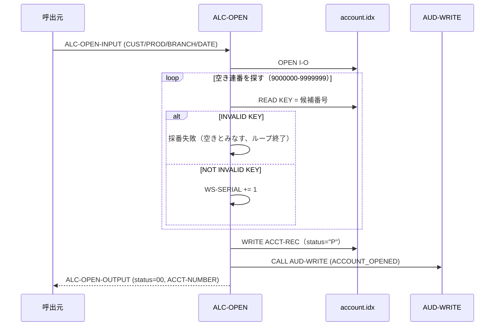

# 基本設計書 — ALC-OPEN

> **サブシステム:** 09-accountlifecycle
> **プログラム ID:** `ALC-OPEN`
> **種別:** オンライン（共有ライブラリ・モジュール）
> **更新日:** 2026-07-06

---

## 1. プログラム概要

| 項目 | 値 |
|------|-----|
| プログラム ID | `ALC-OPEN` |
| ソースファイル | `src/alc-open.cob` |
| 所属サブシステム | 09-accountlifecycle |
| 種別 | オンライン |
| 概要 | 新規口座を開設し、branch + product -pane に連番を採番して一意な 13 桁口座番号を生成。ISAM ファイルにステータス "P" で INSERT し、採番した口座番号を出力する。 |

---

## 2. 機能概要

### 2.1 このプログラムが「すること」
呼び出し元から受け取った支店コード・商品コードに基づき、9000000 から 9999999 の範囲で未使用の連番を `ACCOUNT-FILE` の READ で探索する。空き番号が決まったら初期属性（顧客 ID、開設日、当枠、ステータス "P" 等）を書き込み、採番結果を `ALC-OPEN-ACCT-NUMBERS` として返却する。書き込み完了後は監査証拠（AUD-Write）を残す。

### 2.2 呼出元と呼出し先
- **呼出元:** 業務オンライン・トランザクション、またはテストドライバ `ALCTEST`。
- **呼出先:** `CALL "AUD-WRITE"`（共有監査ユーティリティ）。開設イベントを監査証拠として記録する。

### 2.3 シーケンス図



---

## 3. 処理フロー

### 3.1 全体フロー（flowchart）

```mermaid
flowchart TD
    START([開始]) --> INIT[ALC-OPEN-STATUS 初期化（status=00）]
    INIT --> CHK_IN{CUST-ID=0 OR<br/>PRODUCT-CODE=0 OR<br/>BRANCH-CODE=0 ?}
    CHK_IN -->|Yes| ERR_INV[status=08 で GOBACK]
    CHK_IN -->|No| OPEN[OPEN I-O account.idx]
    OPEN --> OPEN_CHK{WS-FS = "00" ?}
    OPEN_CHK -->|No| ERR_IO[status=12 で GOBACK]
    OPEN_CHK -->|Yes| GEN_LOOP[採番ループ（9000000-9999999）]
    GEN_LOOP --> CAND[候補番号を組み立て<br/>branch+product+serial]
    CAND --> READ_CAND[READ KEY = 候補番号]
    READ_CAND --> INV{INVALID KEY ?}
    INV -->|Yes| BREAK[採番終了（この番号で決定）]
    INV -->|No| NEXT_SER[WS-SERIAL += 1]
    NEXT_SER --> OVR{WS-SERIAL > 9999999 ?}
    OVR -->|Yes| ERR_OVF[status=08 で GOBACK]
    OVR -->|No| GEN_LOOP
    BREAK --> WRITE[WRITE ACCT-REC（status="P" 等）]
    WRITE --> W_CHK{WS-FS = "00" ?}
    W_CHK -->|No| ERR_W[status=12 で GOBACK]
    W_CHK -->|Yes| AUDIT[CALL AUD-WRITE]
    AUDIT --> RET_OK[status=00, ACCT-NUMBER 返却]
    ERR_INV --> END([終了])
    ERR_IO --> END
    ERR_OVF --> END
    ERR_W --> END
    RET_OK --> END
```

---

## 4. 入出力仕様

### 4.1 入力

| 項目 | 型 | 必須 | 説明 |
|------|-----|:----:|------|
| ALC-OPEN-CUST-ID | PIC 9(10) | ✅ | 顧客番号。0 を許容しない。 |
| ALC-OPEN-PRODUCT-CODE | PIC 9(3) | ✅ | 商品コード。0 を許容しない。 |
| ALC-OPEN-BRANCH-CODE | PIC 9(3) | ✅ | 支店コード。0 を許容しない。 |
| ALC-OPEN-OPENED-DATE | PIC 9(8) | ✅ | 口座開設日（YYYYMMDD） |
| ALC-OPEN-OVERDRAFT-LIMIT | PIC S9(15) COMP-3 | — | 当枠上限 |
| ALC-OPEN-TERM-DAYS | PIC 9(4) | — | 契約日数 |

### 4.2 出力

| 項目 | 型 | 説明 |
|------|-----|------|
| ALC-OPEN-ACCT-NUMBER | PIC 9(13) | 採番された口座番号（失敗時 = ZERO） |

### 4.3 返却コード（概要）

| コード | 意味 |
|--------|------|
| 00 | 正常（口座開設・番号返却済） |
| 08 | INVALID（入力必須項目ゼロ、または連番上限超過） |
| 12 | IO-FAIL（ファイル OPEN 失敗、または WRITE 失敗） |

---

## 5. 正常系テストケース

| # | テスト名 | 入力 | 期待出力 | 確認ポイント |
|---|---------|------|---------|------------|
| 1 | 基本開設（branch=001, product=001） | CUST=0000000099, PROD=001, BRANCH=001, DATE=20260601, OVERDRAFT=0, TERM=0 | status=00, ACCT>0 | 初回は 0010019000000 系の番号が採番されること |
| 2 | 2 回目開設で番号が進む | CUST=0000000099, PROD=002, BRANCH=001, TERM=365 | status=00, ACCT>0 | 採番スキームが branch + product + serial であること |
| 3 | 監査証拠（AUD-WRITE）記録 | 基本開設と同条件 | AUD-WRITE が "ACCOUNT_OPENED" で呼出されること | JSON ペイロードに cust/prod/branch が含まれること |

---

## 6. 異常系テストケース

| # | テスト名 | 入力 | 期待される異常 | 確認ポイント |
|---|---------|------|--------------|------------|
| 1 | CUST-ID = 0 | CUST=0 | status=08 | 入力バリデーションで即 GOBACK すること |
| 2 | BRANCH-CODE = 0 | BRANCH=0 | status=08 | NG 返却の代表（PRODUCT=0 も同様） |
| 3 | 連番上限超過（9999999） | （WS-SERIAL が上限に達する環境） | status=08 | 空き番号が見つからない場合の分岐 |
| 4 | ファイル未配置 | account.idx 不在 | status=12 | OPEN I/O 失敗時の paths |
| 5 | WRITE 失敗（重複キー等） | 既存番号へ上書き試行 | status=12 | REWRITE ではなく WRITE だが同 FS 判定 |

---

## 参考
- ソース: [alc-open.cob](../src/alc-open.cob)
- 公開 IF: [alc-api.cpy](../copy/api/alc-api.cpy)
- ファイル定義: [fd-account.cpy](../copy/private/fd-account.cpy)
- サブシステム横断 IF: [acct-lookup.md](../../08-account/design/acct-lookup.md)
- テスト: [alc-test.cob](../tests/unit/alc-test.cob)
- ビルド/実行定義: [Makefile](../Makefile)
