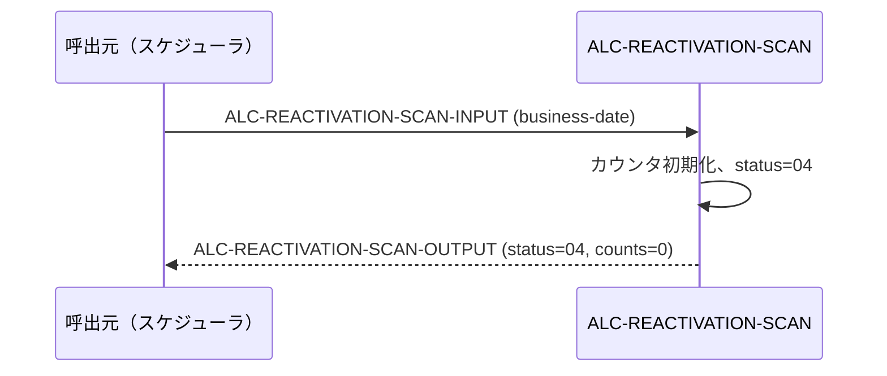
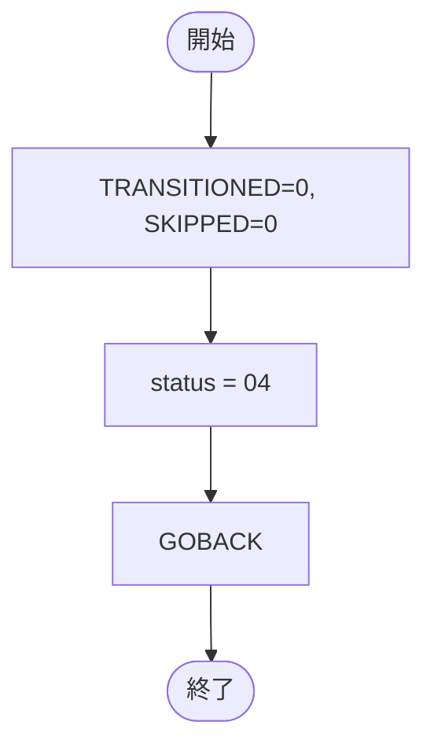

# 基本設計書 — ALC-REACTIVATION-SCAN

> **サブシステム:** 09-accountlifecycle
> **プログラム ID:** `ALC-REACTIVATION-SCAN`
> **種別:** バッチ（MVP スタブ）
> **更新日:** 2026-07-06

---

## 1. プログラム概要

| 項目 | 値 |
|------|-----|
| プログラム ID | `ALC-REACTIVATION-SCAN` |
| ソースファイル | `src/alc-reactivation-scan.cob` |
| 所属サブシステム | 09-accountlifecycle |
| 種別 | バッチ |
| 概要 | 休眠状態（status="D"）の口座を再活性化（"A"）へ戻すバッチの MVP スタブ。現状は入力を未使用で 04（NO-CANDS）を返却するプレースホルダー。 |

---

## 2. 機能概要

### 2.1 このプログラムが「すること」
本プログラムは将来実装される「休眠口座の再活性化」バッチのスタブ。現状は `ALC-REACT-TRANSITIONED` と `ALC-REACT-SKIPPED` を 0 で初期化し、`ALC-REACTIVATION-SCAN-STATUS` に "04" を設定して GOBACK するのみ。

### 2.2 呼出元と呼出し先
- **呼出元:** 将来の夜間統合バッチ or ジョブスケジュール、およびテストドライバ `ALCTEST`。
- **呼出先:** なし（現状は `AUD-WRITE` も呼出さない）。

### 2.3 シーケンス図

---

## 3. 処理フロー

### 3.1 全体フロー（flowchart）

---

## 4. 入出力仕様

### 4.1 入力

| 項目 | 型 | 必須 | 説明 |
|------|-----|:----:|------|
| ALC-REACT-BUSINESS-DATE | PIC 9(8) | ✅ | バッチ業務日付（YYYYMMDD）。将来の再活性化判定に使用 |

### 4.2 出力

| 項目 | 型 | 説明 |
|------|-----|------|
| ALC-REACT-TRANSITIONED | PIC 9(6) | 再活性化した件数（現状 = 0） |
| ALC-REACT-SKIPPED | PIC 9(6) | スキップ件数（現状 = 0） |

### 4.3 返却コード（概要）

| コード | 意味 |
|--------|------|
| 00 | 正常（将来：1 件以上再活性化した） |
| 04 | NO-CANDS（現状：常に返却） |
| 12 | IO-FAIL（将来：OPEN 失敗） |
| 16 | FATAL（将来：想定外エラー） |

---

## 5. 正常系テストケース

| # | テスト名 | 入力 | 期待出力 | 確認ポイント |
|---|---------|------|---------|------------|
| 1 | MVP スタブのデフォルト戻り | BD=20260601 | status=04, TRANSITIONED=0, SKIPPED=0 | スタブとして 04 を返すこと |

---

## 6. 異常系テストケース

| # | テスト名 | 入力 | 期待される異常 | 確認ポイント |
|---|---------|------|--------------|------------|
| 1 | 将来：OPEN 失敗 | account.idx 不在 | status=12 | 未実装だが将来設計の想定 |
| 2 | 将来：全件 0 件 | BD=20260601, D 口座なし | status=04 | 04 の意味合いが変わる（現状と将来で注意） |

---

## 参考
- ソース: [alc-reactivation-scan.cob](../src/alc-reactivation-scan.cob)
- 公開 IF: [alc-api.cpy](../copy/api/alc-api.cpy)
- ファイル定義: [fd-account.cpy](../copy/private/fd-account.cpy)
- サブシステム横断 IF: [acct-lookup.md](../../08-account/design/acct-lookup.md)
- テスト: [alc-test.cob](../tests/unit/alc-test.cob)
- ビルド/実行定義: [Makefile](../Makefile)
