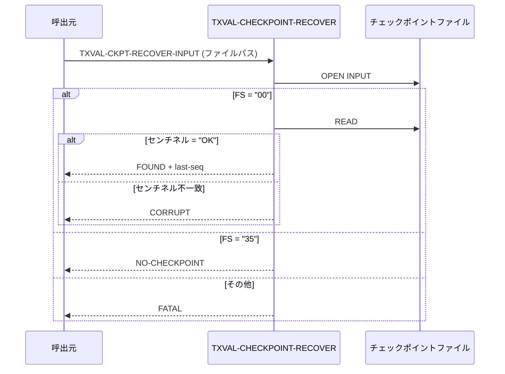
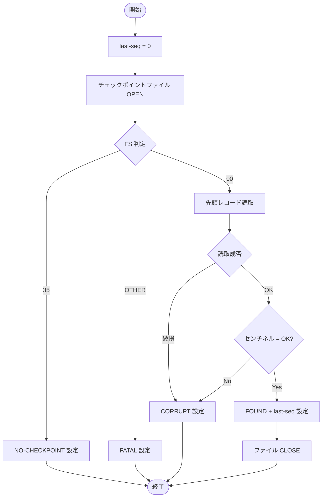

# 基本設計書 — TXVAL-CHECKPOINT-RECOVER

> **サブシステム:** 10-txnvalidate
> **プログラム ID:** `TXVAL-CHECKPOINT-RECOVER`
> **種別:** バッチ
> **更新日:** 2026-07-06

---

## 1. プログラム概要

| 項目 | 値 |
|------|-----|
| プログラム ID | `TXVAL-CHECKPOINT-RECOVER` |
| ソースファイル | `src/txval-checkpoint-recover.cob` |
| 所属サブシステム | 10-txnvalidate |
| 種別 | バッチ |
| 概要 | チェックポイントファイルを読み込み、前回処理した最終シーケンス番号を復元する。ファイル不在・破損時はそれぞれ専用ステータスを返却する。 |

---

## 2. 機能概要

### 2.1 このプログラムが「すること」
指定パスのチェックポイントファイルをオープンし、先頭レコードのセンチネル値を検証する。
センチネル "OK" が確認できた場合は最終シーケンス番号を出力し、ファイル不在の場合は「チェックポイントなし」を返却する。

### 2.2 呼出元と呼出し先
- **呼出元:** `TXVAL-VALIDATE-BATCH`（再開処理時）。バッチスケジューラからの直接呼出しも想定。
- **呼出先:** なし（外部プログラム呼出しなし）

### 2.3 シーケンス図

---

## 3. 処理フロー

### 3.1 全体フロー（flowchart）

---

## 4. 入出力仕様

### 4.1 入力

| 項目 | 型 | 必須 | 説明 |
|------|-----|:----:|------|
| TXVAL-CR-IN-FILENAME | PIC X(80) | ✅ | チェックポイントファイルパス |

### 4.2 出力

| 項目 | 型 | 説明 |
|------|-----|------|
| TXVAL-CR-STATUS | PIC X(2) | 処理結果コード（下記返却コード参照） |
| TXVAL-CR-OUT-LAST-SEQ | PIC 9(10) | 前回最終シーケンス番号。異常時は 0 |

### 4.3 返却コード（概要）

| コード | 意味 |
|--------|------|
| 00 | FOUND（チェックポイント正常読取） |
| 04 | NO-CHECKPOINT（ファイル不在、初回起動相当） |
| 12 | CORRUPT（センチネル不一致／読取失敗） |
| 16 | FATAL（ファイルオープンで想定外の障害） |

---

## 5. 正常系テストケース

| # | テスト名 | 入力 | 期待出力 | 確認ポイント |
|---|---------|------|---------|------------|
| 1 | 正常なチェックポイント読取 | センチネル "OK", last-seq=12345 | status=00, last-seq=12345 | レコードが正しく読取られ last-seq が返ること |
| 2 | ファイル不在 | パスが存在しない | status=04, last-seq=0 | 初回起動相当として NO-CHECKPOINT が返ること |

---

## 6. 異常系テストケース

| # | テスト名 | 入力 | 期待される異常 | 確認ポイント |
|---|---------|------|--------------|------------|
| 1 | センチネル破損 | センチネル "XX" | status=12 | レコード読取は成功するがセンチネル不一致で CORRUPT |
| 2 | 空ファイル | レコードなし | status=12 | AT END で読取失敗 → CORRUPT |
| 3 | オープン障害 | FS = "34" 等 | status=16 | ファイル致命的エラーで FATAL |

---

## 参考
- ソース: [txval-checkpoint-recover.cob](../src/txval-checkpoint-recover.cob)
- 公開 IF: [tx-val-api.cpy](../copy/api/tx-val-api.cpy)
- その他: [Makefile](../Makefile)
