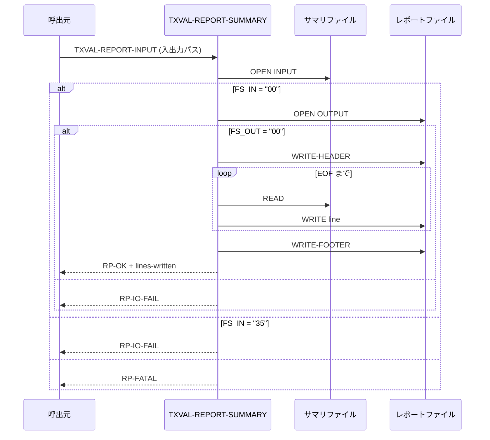

# 基本設計書 — TXVAL-REPORT-SUMMARY

> **サブシステム:** 10-txnvalidate
> **プログラム ID:** `TXVAL-REPORT-SUMMARY`
> **種別:** バッチ
> **更新日:** 2026-07-06

---

## 1. プログラム概要

| 項目 | 値 |
|------|-----|
| プログラム ID | `TXVAL-REPORT-SUMMARY` |
| ソースファイル | `src/txval-report-summary.cob` |
| 所属サブシステム | 10-txnvalidate |
| 種別 | バッチ |
| 概要 | サマリファイル（行単位）を読み込み、ヘッダ・フッタを付けてレポートファイルを生成する。入力行が規定未満の場合は EMPTY を返却する。 |

---

## 2. 機能概要

### 2.1 このプログラムが「すること」
入力サマリファイルをラインシーケンシャルに読み込み、各行をそのまま出力ファイルへ書き出す。
処理の先頭にバッチ ID 等を含むヘッダ部を付加し、末尾にフッタ部を付加する。
出力行数がヘッダ行の想定に満たない場合は EMPTY ステータスを返却する。

### 2.2 呼出元と呼出し先
- **呼出元:** バッチスケジューラ。`TXVAL-VALIDATE-BATCH` の後続処理として呼出しを想定。
- **呼出先:** なし（外部プログラム呼出しなし）

### 2.3 シーケンス図



---

## 3. 処理フロー

### 3.1 全体フロー（flowchart）

```mermaid
flowchart TD
    START([開始]) --> INIT[出力初期化]
    INIT --> OPEN_IN[入力ファイル OPEN]
    OPEN_IN --> EVAL_IN{FS_IN 判定}
    EVAL_IN -->|35| IO_FAIL1[IO-FAIL 設定]
    IO_FAIL1 --> END([終了])
    EVAL_IN -->|OTHER-{00}| FATAL1[FATAL 設定]
    FATAL1 --> END
    EVAL_IN -->|00| OPEN_OUT[出力ファイル OPEN]
    OPEN_OUT --> EVAL_OUT{FS_OUT 判定}
    EVAL_OUT -->|NG| CLOSE_IN[CLOSE INPUT]
    CLOSE_IN --> IO_FAIL2[IO-FAIL 設定]
    IO_FAIL2 --> END
    EVAL_OUT -->|00| HDR[WRITE-HEADER]
    HDR --> LOOP{EOF?}
    LOOP -->|No| READ[READ 入力行]
    READ --> WRITE[WRITE 出力行]
    WRITE --> LOOP
    LOOP -->|Yes| FTR[WRITE-FOOTER]
    FTR --> CLOSE[全ファイル CLOSE]
    CLOSE --> COUNT[ラインレポート]
    COUNT --> EMPTY{空レポート判定}
    EMPTY -->|Yes| EMPTY_ST[EMPTY 設定]
    EMPTY -->|No| OK[OK 設定]
    OK --> END
    EMPTY_ST --> END
```

---

## 4. 入出力仕様

### 4.1 入力

| 項目 | 型 | 必須 | 説明 |
|------|-----|:----:|------|
| TXVAL-RP-IN-BATCH-ID | PIC X(14) | ✅ | レポートヘッダに記載するバッチ識別子 |
| TXVAL-RP-IN-SUMMARY-FILENAME | PIC X(80) | ✅ | 入力サマリファイルパス |
| TXVAL-RP-IN-REPORT-FILENAME | PIC X(80) | ✅ | 出力レポートファイルパス |

### 4.2 出力

| 項目 | 型 | 説明 |
|------|-----|------|
| TXVAL-RP-STATUS | PIC X(2) | 処理結果コード（下記返却コード参照） |
| TXVAL-RP-OUT-LINES-WRITTEN | PIC 9(5) | 出力ファイルに行数 |

### 4.3 返却コード（概要）

| コード | 意味 |
|--------|------|
| 00 | OK（レポート正常出力） |
| 04 | EMPTY（入力行不足で空レポート） |
| 12 | IO-FAIL（ファイル入出力障害） |
| 16 | FATAL（想定外のファイル障害） |

---

## 5. 正常系テストケース

| # | テスト名 | 入力 | 期待出力 | 確認ポイント |
|---|---------|------|---------|------------|
| 1 | 通常のサマリ → レポート変換 | サマリ数行, batch-id あり | status=00, lines-written ≥ 5 | ヘッダ/フッタが付き、行数が返ること |
| 2 | ヘッダのみの出力 | 入力行 0 | status=04, lines-written < 5 | 空レポートとして EMPTY が返ること |

---

## 6. 異常系テストケース

| # | テスト名 | 入力 | 期待される異常 | 確認ポイント |
|---|---------|------|--------------|------------|
| 1 | 入力ファイル不在 | パスが存在しない | status=12 | 入力オープン FS=35 で IO-FAIL |
| 2 | 入力ファイル致命的障害 | FS = "34" 等 | status=16 | 想定外 FS で FATAL |
| 3 | 出力ファイルオープン障害 | FS_OUT ≠ "00" | status=12 | 入力クローズ後 IO-FAIL |

---

## 参考
- ソース: [txval-report-summary.cob](../src/txval-report-summary.cob)
- 公開 IF: [tx-val-api.cpy](../copy/api/tx-val-api.cpy)
- その他: [Makefile](../Makefile)
