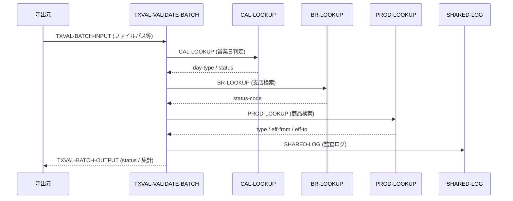
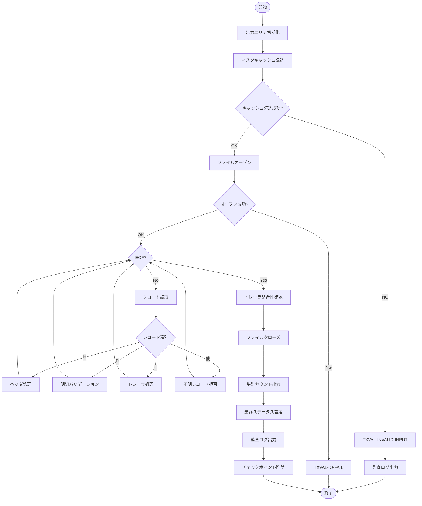

# 基本設計書 — TXVAL-VALIDATE-BATCH

> **サブシステム:** 10-txnvalidate
> **プログラム ID:** `TXVAL-VALIDATE-BATCH`
> **種別:** バッチ
> **更新日:** 2026-07-06

---

## 1. プログラム概要

| 項目 | 値 |
|------|-----|
| プログラム ID | `TXVAL-VALIDATE-BATCH` |
| ソースファイル | `src/txval-validate-batch.cob` |
| 所属サブシステム | 10-txnvalidate |
| 種別 | バッチ |
| 概要 | トランザクション明細ファイル（H/D/T 構成）を読み込み、マスタ整合性・金額・日付・自己送金等のリールールを適用して valid / error を振り分け、バッチステータスと集計カウントを出力する。 |

---

## 2. 機能概要

### 2.1 このプログラムが「すること」
デコード済みトランザクションファイル（ヘッダ／明細／トレーラ）をシーケンシャルに読み取り、
各明細レコードに対してカテゴリ、口座番号、金額、通貨、営業日、支店、商品コード等のバリデーションを実施する。
バリデーションを通過したレコードは valid ファイルへ、拒否レコードは error ファイルへ書き出す。
処理終了時にバッチステータスと集計カウントを出力する。

### 2.2 呼出元と呼出し先
- **呼出元:** バッチスケジューラ / テストドライバ `TXVAL-TEST`
- **呼出先:**
  - `CAL-LOOKUP`（[01-calendar](../../01-calendar/design/cal-next-bd.md) サブシステムの .so モジュール）— 営業日判定
  - `BR-LOOKUP` — 支店マスタ検索
  - `PROD-LOOKUP` — 商品マスタ検索
  - `SHARED-LOG` — 監査ログ出力

### 2.3 シーケンス図

---

## 3. 処理フロー

### 3.1 全体フロー（flowchart）

---

## 4. 入出力仕様

### 4.1 入力

| 項目 | 型 | 必須 | 説明 |
|------|-----|:----:|------|
| TXVAL-IN-BATCH-ID | PIC X(14) | ✅ | バッチ識別子。ヘッダレコードのバッチ ID と一致必須 |
| TXVAL-IN-BUSINESS-DATE | PIC 9(8) | ✅ | 営業日（YYYYMMDD）。ヘッダと一致必須 |
| TXVAL-IN-INPUT-FILENAME | PIC X(80) | ✅ | デコード済みトランザクションファイルパス |
| TXVAL-IN-VALID-FILENAME | PIC X(80) | ✅ | バリデーション合格出力先パス |
| TXVAL-IN-ERROR-FILENAME | PIC X(80) | ✅ | 拒否レコード出力先パス |
| TXVAL-IN-CHECKPOINT-FILENAME | PIC X(80) | ✅ | チェックポイントファイルパス |

### 4.2 出力

| 項目 | 型 | 説明 |
|------|-----|------|
| TXVAL-BATCH-STATUS | PIC X(2) | 処理結果コード（下記返却コード参照） |
| TXVAL-OUT-PROCESSED | PIC 9(7) | 処理済みレコード件数 |
| TXVAL-OUT-VALIDATED | PIC 9(7) | バリデーション合格件数 |
| TXVAL-OUT-REJECTED | PIC 9(7) | 拒否件数 |
| TXVAL-OUT-PRI-E001..E099 | PIC 9(7) | 拒否理由コード別プライマリ件数 |
| TXVAL-OUT-OCC-E001..E099 | PIC 9(7) | 拒否理由コード別オカレンス件数 |

### 4.3 返却コード（概要）

| コード | 意味 |
|--------|------|
| 00 | 正常（全レコード合格） |
| 04 | PARTIAL-REJECT（一部拒否あり） |
| 08 | INVALID-INPUT（ヘッダ不整合・日付不正等） |
| 12 | IO-FAIL（ファイル入出力障害） |
| 16 | FATAL（致命的エラー） |

---

## 5. 正常系テストケース

| # | テスト名 | 入力 | 期待出力 | 確認ポイント |
|---|---------|------|---------|------------|
| 1 | 預金明細 1 件正常 | カテゴリ 10, 金額 1000, JPY, 支店 001, 商品 001 | status=00, validated=1, rejected=0 | 全バリデーションを通過し valid 出力されること |
| 2 | 払出明細 1 件正常 | カテゴリ 20, 金額 1000 | status=00, validated=1 | カテゴリ 20 の正常パターン |
| 3 | 振替明細 1 件正常 | カテゴリ 30, あて先口座あり | status=00, validated=1 | カテゴリ 30 はあて先口座必須 |
| 4 | 電送明細 1 件正常 | カテゴリ 40, あて先口座あり | status=00, validated=1 | カテゴリ 40 の正常パターン |
| 5 | 空バッチ（H/T のみ） | 明細 0 件 | status=00, validated=0, rejected=0 | ヘッダ＋トレーラのみの正常終了 |
| 6 | 3 件バッチ全合格 | 預金/払出/振替各 1 件 | status=00, validated=3, processed=3 | 複数カテゴリ混在の正常処理 |
| 7 | 金額上限境界（99,999,999） | 金額 = 99,999,999 | validated=1, rejected=0 | E010 閾値未満として合格 |
| 8 | 一部拒否（2 合格 1 拒否） | 1 件金額 0 混在 | status=04, validated=2, rejected=1 | PARTIAL-REJECT ステータス |

---

## 6. 異常系テストケース

| # | テスト名 | 入力 | 期待される異常 | 確認ポイント |
|---|---------|------|--------------|------------|
| 1 | レコード種別不正 | 先頭文字 "X" | PRI-E001 >= 1 | 不明レコードが E001 として拒否されること |
| 2 | カテゴリ不正 | カテゴリ "99" | PRI-E002 = 1 | 未定義カテゴリが E002 として拒否 |
| 3 | 口座番号非数値 | 送金人口座 "ABC..." | PRI-E003 = 1 | 13 桁非数値が E003 拒否 |
| 4 | あて先口座なし（振替） | カテゴリ 30, あて先ブランク | PRI-E007 = 1 | カテゴリ 30 はあて先必須 |
| 5 | 自己送金 | 送金人＝あて先同一 | PRI-E008 = 1 | 同一口座間送金を検知 |
| 6 | 金額ゼロ | 金額 0 | PRI-E009 = 1 | ゼロ金額を拒否 |
| 7 | 金額超過 | 金額 200,000,000 | PRI-E010 = 1 | 1 億超過を E010 拒否 |
| 8 | 非営業日（土曜） | 営業日＝土曜 | PRI-E012 = 1 | CAL-LOOKUP が非 "B" を返し拒否 |
| 9 | 通貨不正 | 通貨 "USD" | PRI-E013 = 1 | JPY 以外を拒否 |
| 10 | 支店未知 | 支店 999 | PRI-E014 = 1 | BR-LOOKUP ミスを拒否 |
| 11 | 商品未知 | 商品 099 | PRI-E015 = 1 | PROD-LOOKUP ミスを拒否 |
| 12 | あて先あり（預金） | カテゴリ 10, あて先あり | PRI-E018 = 1 | 預金カテゴリにあり不要 |
| 13 | TD 払出 | カテゴリ 20, 商品 002 (T 型) | PRI-E019 = 1 | TD 商品の払出を拒否 |
| 14 | トレーラ件数不一致 | トレーラ件数 ≠ 明細件数 | status=08 | ヘッダ検証で INVALID-INPUT |
| 15 | トレーラ金額不一致 | トレーラ金額 ≠ 明細合計 | status=08 | 同上 |
| 16 | バッチ ID 不一致 | ヘッダ ≠ 入力 | status=08 | ヘッダバッチ ID 検証 |
| 17 | 営業日不一致 | ヘッダ ≠ 入力 | status=08 | ヘッダ営業日検証 |
| 18 | 複数エラー同時検出 | 金額 0 かつ USD | OCC-E009=1, OCC-E013=1 | オカレンスカウントが独立加算 |
| 19 | ファイルオープン失敗 | 入力ファイル不在 | status=12 | IO-FAIL が返ること |

---

## 参考
- ソース: [txval-validate-batch.cob](../src/txval-validate-batch.cob)
- 公開 IF: [tx-val-api.cpy](../copy/api/tx-val-api.cpy)
- その他: [Makefile](../Makefile)
