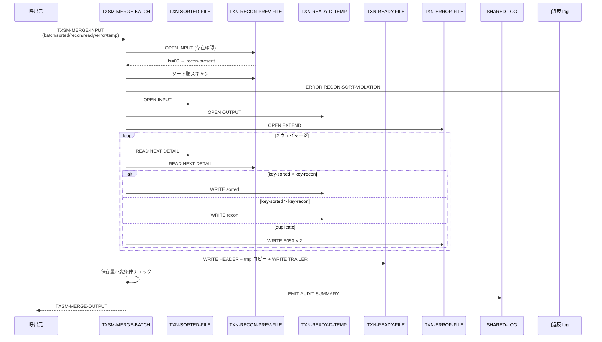
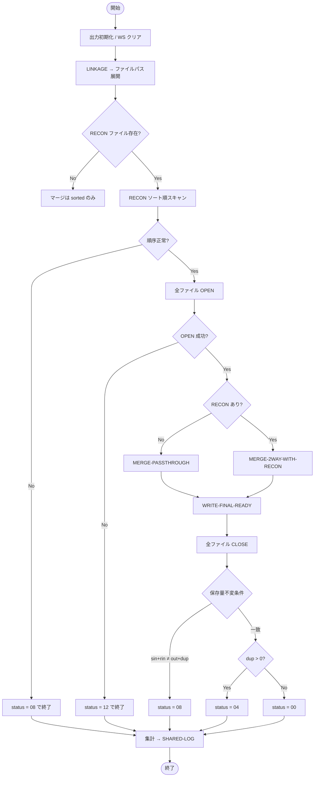

# 基本設計書 — TXSM-MERGE-BATCH

> **サブシステム:** 11-txnsortmerge
> **プログラム ID:** `TXSM-MERGE-BATCH`
> **種別:** バッチ
> **更新日:** 2026-07-06

---

## 1. プログラム概要

| 項目 | 値 |
|------|-----|
| プログラム ID | `TXSM-MERGE-BATCH` |
| ソースファイル | `src/txsm-merge-batch.cob` |
| 所属サブシステム | 11-txnsortmerge |
| 種別 | バッチ |
| 概要 | ソート済みファイル（TXN-SORTED-FILE）と前日取引ファイル（TXN-RECON-PREV-FILE）を payer-acct → seq の昇順で 2 ウェイマージし、TXN-READY-FILE を生成する。重複は TXN-ERROR-FILE に E050 として退避し、保存量不変条件（件数・金額）を検証する。 |

---

## 2. 機能概要

### 2.1 このプログラムが「すること」
2 つのソート済み入力ストリームを比較しながら 1 つの READY ファイルへマージ出力する。
同一キーが両ストリームに存在する場合は重複とみなしてエラーファイルに退避し、件数・金額の保存量不変条件（sorted-in + recon-in = merged-out + duplicate-records）を満たすことを検証する。
RECON が存在しない場合はソート済みのみをパススルーし、RECON のソート順が壊れている場合は即座に INVALID で終了する。

### 2.2 呼出元と呼出し先
- **呼出元:** テストドライバ `TXSM-TEST`、または上位バッチスケジューラからの `CALL "TXSM-MERGE-BATCH"`。
- **呼出先:** `SHARED-LOG`（`shared-log-api.cpy` 経由）。`SYSTEM` 呼出で一時ファイルを削除する。

### 2.3 シーケンス図

---

## 3. 処理フロー

### 3.1 全体フロー（flowchart）

---

## 4. 入出力仕様

### 4.1 入力

| 項目 | 型 | 必須 | 説明 |
|------|-----|:----:|------|
| TXSM-MI-BATCH-ID | PIC X(14) | ✅ | バッチ識別子 |
| TXSM-MI-BUSINESS-DATE | PIC 9(8) | ✅ | 営業日 (YYYYMMDD) |
| TXSM-MI-SORTED-FILENAME | PIC X(80) | ✅ | ソート済みファイルパス（TXSM-SORT-BATCH の出力） |
| TXSM-MI-RECON-PREV-FILENAME | PIC X(80) | ✅ | 前日取引ファイルパス。存在しない場合はファイルステータス 35 となりパススルー |
| TXSM-MI-READY-FILENAME | PIC X(80) | ✅ | マージ結果出力先 |
| TXSM-MI-ERROR-FILENAME | PIC X(80) | ✅ | 重複エラー退避先 |
| TXSM-MI-CHECKPOINT-FILENAME | PIC X(80) | ✅ | チェックポイント用パス（予約） |
| TXSM-MI-TEMP-FILENAME | PIC X(80) | ✅ | 一時ファイルパス |

### 4.2 出力

| 項目 | 型 | 説明 |
|------|-----|------|
| TXSM-MO-STATUS | PIC X(2) | 処理結果コード |
| TXSM-MO-RECORDS-SORTED-IN | PIC 9(7) | ソート済み入力件数 |
| TXSM-MO-RECORDS-RECON-IN | PIC 9(7) | RECON 入力件数 |
| TXSM-MO-RECORDS-MERGED-OUT | PIC 9(7) | マージ出力件数 |
| TXSM-MO-DUPLICATE-RECORDS | PIC 9(5) | 重複レコード件数（ペア × 2） |
| TXSM-MO-DUPLICATE-PAIRS | PIC 9(5) | 重複ペア件数 |
| TXSM-MO-SORT-VIOLATIONS | PIC 9(5) | RECON ソート順違反件数 |
| TXSM-MO-RECON-PRESENT-FLAG | PIC X(1) | "Y"=RECON あり / "N"=なし |
| TXSM-MO-AMOUNT-SUM | PIC 9(20) | マージ出力の金額合計 |

### 4.3 返却コード（概要）

| コード | 意味 |
|--------|------|
| 00 | 正常（保存量不変条件・件数一致・重複なし） |
| 04 | PARTIAL（保存量不変条件は成立。重複レコードあり） |
| 08 | INVALID（RECON ソート順違反、または保存量不変条件を満たさない） |
| 12 | IO-FAIL（ファイル OPEN 失敗） |
| 16 | FATAL（予約。現状未使用） |

---

## 5. 正常系テストケース

| # | テスト名 | 入力 | 期待出力 | 確認ポイント |
|---|---------|------|---------|------------|
| 1 | RECON なしパススルー | sorted=3, recon=なし | status=00, sin=3, rin=0, out=3, recon-flag=N | RECON 不存在時は sorted のみを READY へコピー |
| 2 | 交差マージ | sorted=3, recon=2 (disjoint) | status=00, out=5, dup=0 | 2 つのソート済みを 1 つの昇順にマージ |
| 3 | インターリーブ | sorted=1,3,5 / recon=2,4 | out=5, payer=1,2,3,4,5 | キーが交互に現れる場合でも昇順維持 |
| 4 | 保存量不変条件 | sorted=3, recon=1 (disjoint) | sin+rin = out+dup | 件数保存則が成立 |

---

## 6. 異常系テストケース

| # | テスト名 | 入力 | 期待される異常 | 確認ポイント |
|---|---------|------|--------------|------------|
| 1 | 重複キー検出 | sorted と recon に同一キー | status=04, dup-records=2, pairs=1 | 重複レコードが E050 でエラーファイルへ退避 |
| 2 | RECON ソート順違反 | recon が payer 降順 | status=08, sort-violations ≥ 1 | マージ前に検知し INVALID で終了 |
| 3 | 保存量不変条件違反 | sin+rin ≠ out+dup | status=08 | 件数・金額の保存則が崩れたことを検知 |

---

## 参考
- ソース: [txsm-merge-batch.cob](../src/txsm-merge-batch.cob)
- 公開 IF: [tx-sm-api.cpy](../copy/api/tx-sm-api.cpy)
- 状態: [ws-merge-state.cpy](../copy/private/ws-merge-state.cpy)
- その他: [Makefile](../Makefile)
- 関連: [tx-sm-test.cob](../tests/unit/txsm-test.cob) (TC09–TC18)
