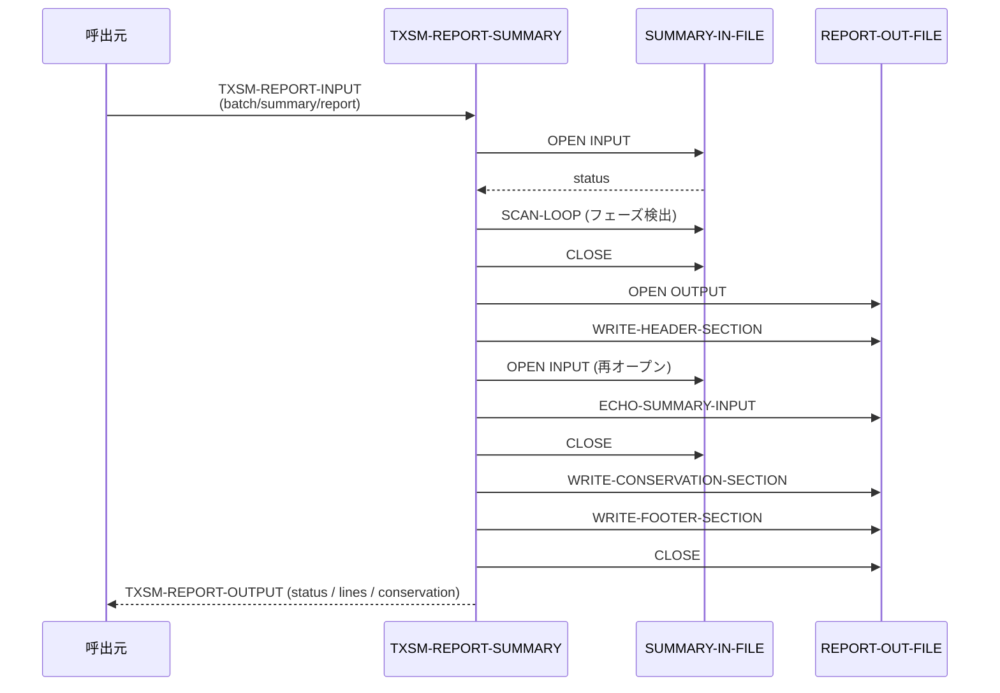

# 基本設計書 — TXSM-REPORT-SUMMARY

> **サブシステム:** 11-txnsortmerge
> **プログラム ID:** `TXSM-REPORT-SUMMARY`
> **種別:** バッチ
> **更新日:** 2026-07-06

---

## 1. プログラム概要

| 項目 | 値 |
|------|-----|
| プログラム ID | `TXSM-REPORT-SUMMARY` |
| ソースファイル | `src/txsm-report-summary.cob` |
| 所属サブシステム | 11-txnsortmerge |
| 種別 | バッチ |
| 概要 | 前段の SORT-BATCH と MERGE-BATCH が出力したサマリーファイルを読み込み、ヘッダ・生サマリ・保存量不変条件・フッタをまとめた可読レポートを生成する。 |

---

## 2. 機能概要

### 2.1 このプログラムが「すること」
サマリーファイル（SORT-PHASE / MERGE-PHASE の 2 行）を 1 パスでスキャンし、どちらのフェーズが存在するかを判定する。
次に再度ファイルを開き、元の内容をそのままレポートへエコーしつつ、保存量不変条件の検証結果（"VERIFIED" / "MERGE phase data missing" / "summary empty"）をセクションとして差し込む。
出力は LINE SEQUENTIAL のテキストレポートで、行数と検証結果を出力コードに設定する。

### 2.2 呼出元と呼出し先
- **呼出元:** 上位バッチスケジューラ、またはテストドライバ `TXSM-TEST` からの `CALL "TXSM-REPORT-SUMMARY"`。
- **呼出先:** なし。ファイル I/O のみで、外部モジュール呼出は行わない。

### 2.3 シーケンス図



---

## 3. 処理フロー

### 3.1 全体フロー（flowchart）

```mermaid
flowchart TD
    START([開始]) --> INIT[出力初期化 / WS クリア]
    INIT --> COPY_PATH[LINKAGE → パス展開]
    OPEN_SUM[OPEN INPUT SUMMARY-IN-FILE]
    COPY_PATH --> OPEN_SUM
    OPEN_SUM --> FS_IN{fs = 00?}
    FS_IN -->|35| E_IOFAIL[status = 12 で終了]
    FS_IN -->|other| E_FATAL[status = 16 で終了]
    FS_IN -->|00| SCAN[SCAN-LOOP でフェーズ検出]
    SCAN --> CLOSE1[CLOSE SUMMARY]
    CLOSE1 --> OPEN_RPT[OPEN OUTPUT REPORT-OUT-FILE]
    OPEN_RPT --> FS_OUT{fs = 00?}
    FS_OUT -->|No| E_IOFAIL2[status = 12 で終了]
    FS_OUT -->|Yes| W_HDR[WRITE-HEADER-SECTION]
    W_HDR --> ECHO_PREP[OPEN INPUT SUMMARY (再読込)]
    ECHO_PREP --> ECHO[ECHO-LOOP で 1 行ずつコピー]
    ECHO --> CLOSE2[CLOSE SUMMARY]
    CLOSE2 --> CONSERVE{フェーズ判定}
    CONSERGE -->|sort+merge あり| W_VER[## Conservation invariant: VERIFIED]
    CONSERGE -->|sort のみ| W_MISS[## NOTE: MERGE phase data missing]
    CONSERGE -->|空| W_EMPTY[## NOTE: summary empty]
    W_VER --> W_FTR[WRITE-FOOTER-SECTION]
    W_MISS --> W_FTR
    W_EMPTY --> W_FTR
    W_FTR --> SET_STATUS{最終判定}
    SET_STATUS -->|sort+merge| OK[status = 00]
    SET_STATUS -->|それ以外| PART[status = 04]
    OK --> END([終了])
    PART --> END
    E_IOFAIL --> END
    E_FATAL --> END
    E_IOFAIL2 --> END
```

---

## 4. 入出力仕様

### 4.1 入力

| 項目 | 型 | 必須 | 説明 |
|------|-----|:----:|------|
| TXSM-RP-BATCH-ID | PIC X(14) | ✅ | バッチ識別子。レポートヘッダに出力される |
| TXSM-RP-SUMMARY-FILENAME | PIC X(80) | ✅ | サマリーファイルパス（SORT/MERGE バッチの監査ログ集約） |
| TXSM-RP-REPORT-FILENAME | PIC X(80) | ✅ | レポート出力先パス |

物理入力: LINE SEQUENTIAL の可変長テキスト。"SORT-PHASE " と "MERGE-PHASE " のプレフィクス行を検出する。

### 4.2 出力

| 項目 | 型 | 説明 |
|------|-----|------|
| TXSM-RP-STATUS | PIC X(2) | 処理結果コード |
| TXSM-RP-LINES-WRITTEN | PIC 9(5) | レポート出力行数 |
| TXSM-RP-CONSERVATION-OK | PIC X(1) | "Y"=保存量不変条件検証済 / "?"=判定不能 |

物理出力: LINE SEQUENTIAL テキストレポート。

### 4.3 返却コード（概要）

| コード | 意味 |
|--------|------|
| 00 | 正常（SORT-PHASE と MERGE-PHASE の両方が存在し保存量不変条件を検証） |
| 04 | PARTIAL（いずれかのフェーズ欠落、またはサマリが空） |
| 12 | IO-FAIL（ファイル OPEN 失敗。fs=35 もこちらに含む） |
| 16 | FATAL（OPEN が fs=00/35 以外の予期せぬステータス） |

---

## 5. 正常系テストケース

| # | テスト名 | 入力 | 期待出力 | 確認ポイント |
|---|---------|------|---------|------------|
| 1 | 両フェーズ存在 | SORT-PHASE + MERGE-PHASE 行 | status=00, conservation=Y, lines > 5 | 保存量不変条件が "VERIFIED" と出力されること |
| 2 | 保存量不変条件検証（dup 含） | MERGE-PHASE に dup=2 を含む | status=00, conservation=Y | dup が 0 でなくても両フェーズあれば検証扱い |

---

## 6. 異常系テストケース

| # | テスト名 | 入力 | 期待される異常 | 確認ポイント |
|---|---------|------|--------------|------------|
| 1 | SORT のみ（MERGE 欠落） | SORT-PHASE 行のみ | status=04, conservation=? | MERGE 欠落が明示されること |
| 2 | 空サマリ | 0 バイトファイル | status=04, conservation=? | 空ファイルでもレポートは生成される |
| 3 | 入力ファイル不在 | ファイルが存在しない | status = 12 | fs=35 が IO-FAIL として上位へ返ること |

---

## 参考
- ソース: [txsm-report-summary.cob](../src/txsm-report-summary.cob)
- 公開 IF: [tx-sm-api.cpy](../copy/api/tx-sm-api.cpy)
- その他: [Makefile](../Makefile)
- 関連: [tx-sm-test.cob](../tests/unit/txsm-test.cob) (TC19–TC22)
- 上流: [txsm-sort-batch-bd.md](txsm-sort-batch-bd.md)、[txsm-merge-batch-bd.md](txsm-merge-batch-bd.md)
