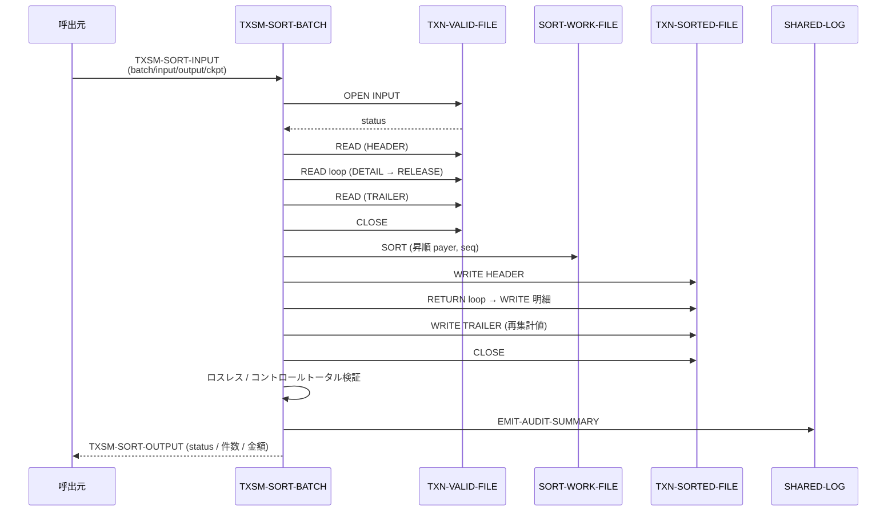

# 基本設計書 — TXSM-SORT-BATCH

> **サブシステム:** 11-txnsortmerge
> **プログラム ID:** `TXSM-SORT-BATCH`
> **種別:** バッチ
> **更新日:** 2026-07-06

---

## 1. プログラム概要

| 項目 | 値 |
|------|-----|
| プログラム ID | `TXSM-SORT-BATCH` |
| ソースファイル | `src/txsm-sort-batch.cob` |
| 所属サブシステム | 11-txnsortmerge |
| 種別 | バッチ |
| 概要 | 前工程で妥当性検証済みの取引ファイル（TXN-VALID-FILE）を受け取り、payer-acct → seq の昇順でソートした TXN-SORTED-FILE を出力する。ソートのロスレス（入出力件数一致）とコントロールトータルを検証し、集計値を出力する。 |

---

## 2. 機能概要

### 2.1 このプログラムが「すること」
入力ファイルを OPEN し、ヘッダ／明細／トレーラを振り分けながら COBOL ソート（SORT ... INPUT PROCEDURE）に明細を渡す。
ソート済み明細は OUTPUT PROCEDURE で TXN-SORTED-FILE に書き出され、前後に保存済みヘッダ／トレーラが再構成される。
最後にロスレス不変条件とコントロールトータル一致を検証し、サマリを SHARED-LOG に出力する。

### 2.2 呼出元と呼出し先
- **呼出元:** テストドライバ `TXSM-TEST`、または上位バッチスケジューラからの `CALL "TXSM-SORT-BATCH"`。
- **呼出先:** `SHARED-LOG`（`shared-log-api.cpy` 経由）。ソート処理自体は COBOL ランタイムのSORT 文に委譲し、外部の CALL 先はログ出力のみである。

### 2.3 シーケンス図



---

## 3. 処理フロー

### 3.1 全体フロー（flowchart）

```mermaid
flowchart TD
    START([開始]) --> INIT[出力初期化 / WS クリア]
    INIT --> COPY_PATH[LINKAGE → ファイルパス展開]
    COPY_PATH --> SORT_EXEC[SORT 実行]
    SORT_EXEC --> INPUT_PROC{INPUT PROCEDURE}
    INPUT_PROC -->|HEADER 読込| SAVE_H[ヘッダ保存 · TDH-EXPECTED 退避]
    INPUT_PROC -->|DETAIL 書出| REL[SR に RELEASE · 入力件数 ++]
    INPUT_PROC -->|TRAILER 書出| SAVE_T[トレーラ保存 · TDT 値退避]
    INPUT_PROC -->|EOF| SORT_CORE[ソート (payer, seq ASC)]
    SORT_CORE --> OUTPUT_PROC{OUTPUT PROCEDURE}
    OUTPUT_PROC --> OPEN_OUT[TXN-SORTED-FILE OPEN OUTPUT]
    OPEN_OUT --> W_H[WRITE ヘッダ]
    W_H --> W_D[RETURN → WRITE 明細 · 金額累计]
    W_D --> W_T[WRITE トレーラ (再計算値反映)]
    W_T --> EOF_OUT[CLOSE]
    EOF_OUT --> VERIFY{ロスレス検証}
    VERIFY -->|in ≠ out| INV[disabled]
    VERIFY -->|in = out| CTRL{コントロールトータル}
    CTRL -->|不一致| PART[partial]
    CTRL -->|一致| OK[ok]
    OK --> EMIT[集計 → SHARED-LOG]
    INV --> EMIT
    PART --> EMIT
    SAVE_H --> SORT_CORE
    SAVE_T --> SORT_CORE
    EMIT --> END([終了])
```

---

## 4. 入出力仕様

### 4.1 入力

| 項目 | 型 | 必須 | 説明 |
|------|-----|:----:|------|
| TXSM-SI-BATCH-ID | PIC X(14) | ✅ | バッチ識別子。監査ログに載る |
| TXSM-SI-BUSINESS-DATE | PIC 9(8) | ✅ | 営業日 (YYYYMMDD) |
| TXSM-SI-INPUT-FILENAME | PIC X(80) | ✅ | 妥当性検証済み入力ファイルパス |
| TXSM-SI-OUTPUT-FILENAME | PIC X(80) | ✅ | ソート済み出力ファイルパス |
| TXSM-SI-CHECKPOINT-FILENAME | PIC X(80) | ✅ | チェックポイント用パス。現状未使用予約 |

物理ファイル: [fd-txn-valid-in.cpy](../copy/private/fd-txn-valid-in.cpy) 定義の H/D/T 混在 600 バイトレコード。

### 4.2 出力

| 項目 | 型 | 説明 |
|------|-----|------|
| TXSM-SO-STATUS | PIC X(2) | 処理結果コード |
| TXSM-SO-RECORDS-PROCESSED | PIC 9(7) | ソート前の明細件数 |
| TXSM-SO-RECORDS-SORTED | PIC 9(7) | ソート後の明細件数 |
| TXSM-SO-CTRL-TOTAL-MATCH | PIC X(1) | "Y"=ヘッダ／トレーラ一致 / "N"=不一致 |
| TXSM-SO-AMOUNT-SUM | PIC 9(20) | ソート後明細の金額合計（再計算値） |

物理出力: [fd-txn-sorted.cpy](../copy/private/fd-txn-sorted.cpy)。

### 4.3 返却コード（概要）

| コード | 意味 |
|--------|------|
| 00 | 正常（ロスレス・コントロールトータル一致） |
| 04 | PARTIAL（件数は保存されているがヘッダ／トレーラカウントや金額が不一致） |
| 08 | INVALID（ロスレス条件 in ≠ out に違反） |
| 12 | IO-FAIL（ファイル OPEN 失敗） |
| 16 | FATAL（現状予約。未使用） |

---

## 5. 正常系テストケース

| # | テスト名 | 入力 | 期待出力 | 確認ポイント |
|---|---------|------|---------|------------|
| 1 | 単一明細のソート | H + D×1 + T | status=00, in=1, out=1, ctrl=Y | 1 件ではソート順は変わらずパススルー |
| 2 | 3 件降順 → 昇順再配置 | H + D(3,2,1) + T | status=00, out=3, payer 昇順 | COBOL SORT が payer → seq で昇順に並べ替えること |
| 3 | 空明細（H/T のみ） | H + D×0 + T | status=00, in=0, out=0 | ゼロ件でもロスレス成立 |
| 4 | 金額保存確認 | D に amount=12345 | out.amount=12345 | ソートでペイロードが変化しないこと |
| 5 | コントロールトータル一致 | H.expected=2, T.count=2, T.sum=300 | ctrl=Y, amount-sum=300 | ヘッダ／トレーラの再計算値が一致すること |

---

## 6. 異常系テストケース

| # | テスト名 | 入力 | 期待される異常 | 確認ポイント |
|---|---------|------|--------------|------------|
| 1 | 入力ファイル不在 | INPUT-FILENAME が存在しない | status = 12 | OPEN 失敗が IO-FAIL として上位へ返ること |
| 2 | ヘッダ／トレーラカウント不一致 | H.expected=5 に対し D=1 | status = 04, ctrl=N | 不一致時に PARTIAL となり監査ログ(level=WARN)が出ること |
| 3 | ロスレス違反（内部条件） | in ≠ out を模擬 | status = 08 | ソント前後で明細が減ったことを検知（通常は起きない防御的チェック） |

---

## 参考
- ソース: [txsm-sort-batch.cob](../src/txsm-sort-batch.cob)
- 公開 IF: [tx-sm-api.cpy](../copy/api/tx-sm-api.cpy)
- ソート定義: [sd-txn-sort.cpy](../copy/private/sd-txn-sort.cpy)
- その他: [Makefile](../Makefile)
- 関連: [tx-sm-test.cob](../tests/unit/txsm-test.cob) (TC01–TC08)
