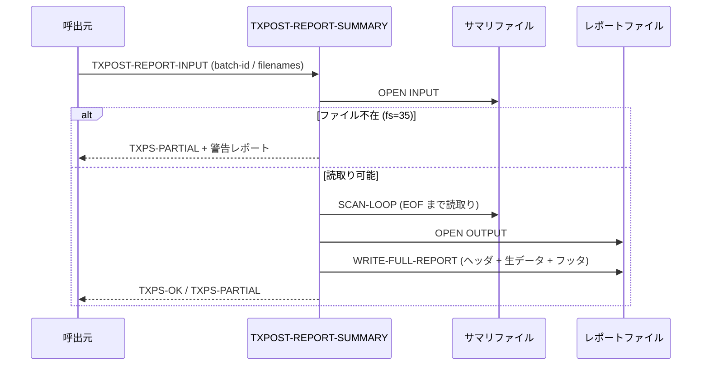
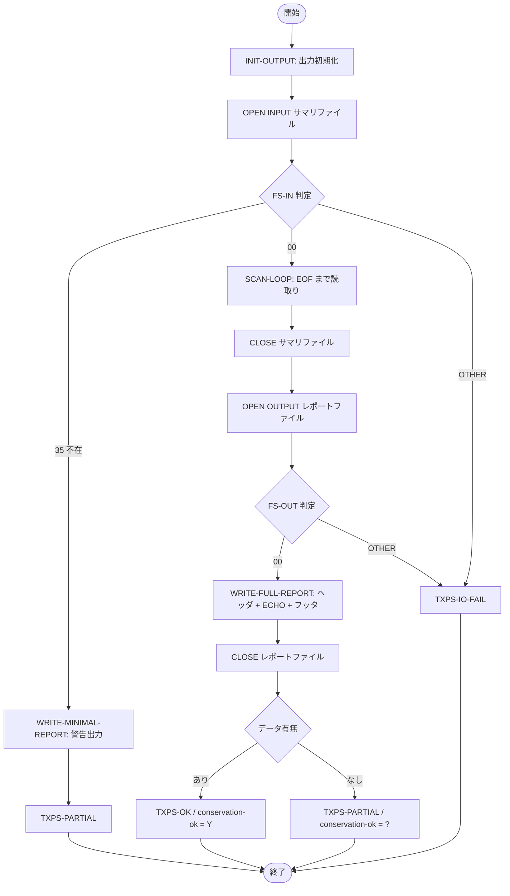

# 基本設計書 — TXPOST-REPORT-SUMMARY

> **サブシステム:** 12-txnpost
> **プログラム ID:** `TXPOST-REPORT-SUMMARY`
> **種別:** バッチ
> **更新日:** 2026-07-06

---

## 1. プログラム概要

| 項目 | 値 |
|------|-----|
| プログラム ID | `TXPOST-REPORT-SUMMARY` |
| ソースファイル | `src/txpost-report-summary.cob` |
| 所属サブシステム | 12-txnpost |
| 種別 | バッチ |
| 概要 | TXPOST-RUN-BATCH が出力したサマリファイルを読み取り、人間可読なレポートファイルを生成する。サマリファイルが存在しない場合は PARTIAL として最小限のレポートを出力する。 |

---

## 2. 機能概要

### 2.1 このプログラムが「すること」
バッチ処理の結果を格納したサマリファイルを入力として受け付け、ヘッダ・生サマリデータ・保存性不変量検証結果・フッタを 1 ファイルにまとめたレポートを出力する。
サマリファイル不在時は PARTIAL ステータスで警告レポートを出力し、ファイル I/O 異常時は IO-FAIL を返す。

### 2.2 呼出元と呼出し先
- **呼出元:** バッチスケジューラまたは TXPOST-RUN-BATCH の後続処理。
- **呼出先:** なし（外部プログラム呼出しは行わない）。

### 2.3 シーケンス図

---

## 3. 処理フロー

### 3.1 全体フロー（flowchart）

---

## 4. 入出力仕様

### 4.1 入力

| 項目 | 型 | 必須 | 説明 |
|------|-----|:----:|------|
| TXPS-BATCH-ID | PIC X(14) | ✅ | バッチ ID。レポートヘッダに出力される |
| TXPS-SUMMARY-FILENAME | PIC X(80) | ✅ | 入力サマリファイルパス |
| TXPS-REPORT-FILENAME | PIC X(80) | ✅ | 出力レポートファイルパス |

### 4.2 出力

| 項目 | 型 | 説明 |
|------|-----|------|
| TXPS-STATUS | PIC X(2) | 処理結果コード（下記返却コード参照） |
| TXPS-LINES-WRITTEN | PIC 9(5) | レポートに書き込んだ行数 |
| TXPS-CONSERVATION-OK | PIC X(1) | 保存性不変量フラグ（"Y" / "N" / "?"） |

### 4.3 返却コード（概要）

| コード | 意味 |
|--------|------|
| 00 | 正常（レポート生成完了） |
| 04 | PARTIAL（サマリファイル不在、またはデータなし） |
| 12 | IO-FAIL（ファイル OPEN 失敗） |
| 16 | FATAL（予期しない致命的エラー） |

---

## 5. 正常系テストケース

| # | テスト名 | 入力 | 期待出力 | 確認ポイント |
|---|---------|------|---------|------------|
| 1 | サマリファイル存在・データあり | batch-id / 有効なサマリパス / レポートパス | status=00, conservation-ok=Y, lines>0 | ヘッダ・生データ・不変量検証・フッタがすべて出力されること |
| 2 | サマリファイル存在・データ空 | batch-id / 空サマリパス / レポートパス | status=04, conservation-ok=? | データ不在でもレポートは生成され、"?" が返ること |
| 3 | サマリファイル不在 | batch-id / 存在しないパス / レポートパス | status=04, conservation-ok=? | fs=35 で検知し、警告レポートを出力すること |

---

## 6. 異常系テストケース

| # | テスト名 | 入力 | 期待される異常 | 確認ポイント |
|---|---------|------|--------------|------------|
| 1 | サマリファイル OPEN 失敗（権限等） | 読取不可パス | status=12 | fs が 00/35 以外の時に IO-FAIL が返ること |
| 2 | レポートファイル OPEN 失敗 | 書込不可パス | status=12 | 出力ファイルの fs 異常時に IO-FAIL が返ること |

---

## 参考
- ソース: [txpost-report-summary.cob](../src/txpost-report-summary.cob)
- 公開 IF: [tx-post-api.cpy](../copy/api/tx-post-api.cpy)
- その他: [Makefile](../Makefile)
