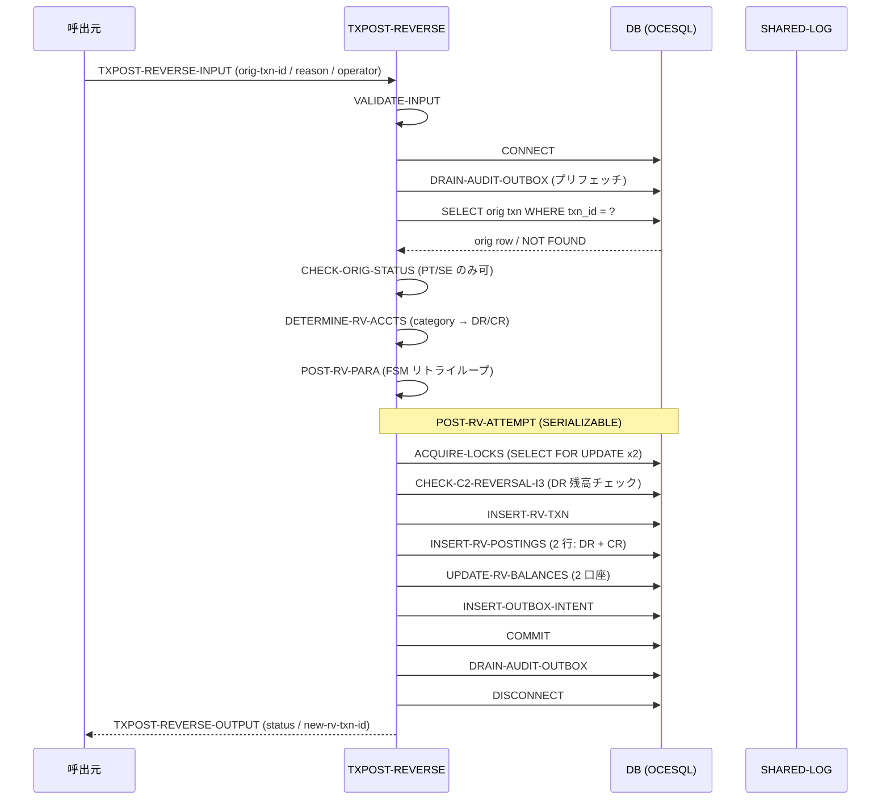
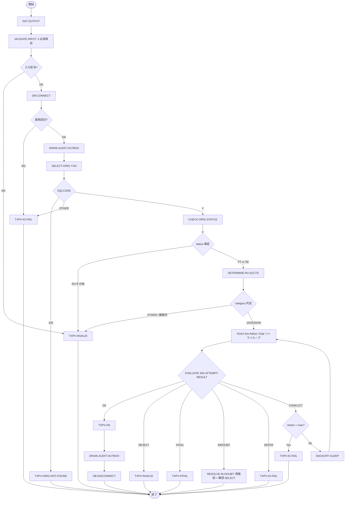

# 基本設計書 — TXPOST-REVERSE

> **サブシステム:** 12-txnpost
> **プログラム ID:** `TXPOST-REVERSE`
> **種別:** バッチ（オンライン逆伝票取扱い）
> **更新日:** 2026-07-06

---

## 1. プログラム概要

| 項目 | 値 |
|------|-----|
| プログラム ID | `TXPOST-REVERSE` |
| ソースファイル | `src/txpost-reverse.sqb`（OCESQL プリプロセス経由） |
| 所属サブシステム | 12-txnpost |
| 種別 | バッチ |
| 概要 | 元取引 (transactions) を指定し、ステータスが PT/SE の伝票に対して逆伝票 (category 別 DR/CR 逆転) を生成する。悲観ロック (SELECT FOR UPDATE) と SERIALIZABLE トランザクションで整合性を保ち、ロック衝突時は指数バックオフでリトライする。 |

---

## 2. 機能概要

### 2.1 このプログラムが「すること」
元取引 ID で transactions 表を引き、ステータスと category を検証したうえで逆伝票用の新採番を行う。システム口座 (cash / clearing) 判定を経て対象 2 口座のロックを取得し、transactions / postings / balances / audit_outbox を更新したのち COMMIT する。
リトライ上限超過・RV 採番枯渇・IN-DOUBT 事象をハンドリングし、各段階でステータスを返す。

### 2.2 呼出元と呼出し先
- **呼出元:** オンライン取消画面、または管理バッチ。`CALL "TXPOST-REVERSE"` による呼出しを想定。
- **呼出先:** `SHARED-LOG` / `AUD-WRITE`（間接的に OCESQL の audit_outbox 経由で書き込み）。`saud-drain-procs.cpy` に定義された DRAIN-AUDIT-OUTBOX を呼出して Outbox をフラッシュする。

### 2.3 シーケンス図

---

## 3. 処理フロー

### 3.1 全体フロー（flowchart）— SQL cursor/loop 主体

---

## 4. 入出力仕様

### 4.1 入力

| 項目 | 型 | 必須 | 説明 |
|------|-----|:----:|------|
| TXPV-ORIG-TXN-ID | PIC X(18) | ✅ | 元取引 ID（transactions.txn_id） |
| TXPV-REVERSAL-REASON | PIC X(80) | ✅ | 取消事由（自由文） |
| TXPV-OPERATOR-ID | PIC X(20) | ✅ | 操作者 ID |

### 4.2 出力

| 項目 | 型 | 説明 |
|------|-----|------|
| TXPV-STATUS | PIC X(2) | 処理結果コード |
| TXPV-NEW-RV-TXN-ID | PIC X(18) | 生成した逆伝票の txn_id。失敗時は SPACES |
| TXPV-IN-DOUBT-RESOLVED | PIC X(1) | IN-DOUBT 解決フラグ（"Y" / "N"） |

### 4.3 返却コード（概要）

| コード | 意味 |
|--------|------|
| 00 | 正常（逆伝票生成完了） |
| 04 | ORIG-NOT-FOUND（該当元取引なし） |
| 08 | INVALID（入力不正 / ステータス不正 / 二重取消） |
| 12 | IO-FAIL（DB 接続不可 / リトライ上限超過 / 採番枯渇） |
| 16 | FATAL（更新行数異常等、致命的整合性違反） |

---

## 5. 正常系テストケース

| # | テスト名 | 入力 | 期待出力 | 確認ポイント |
|---|---------|------|---------|------------|
| 1 | 通常取消（category=10 / PT） | orig-txn-id=有効 PT 件, reason=正常, operator=OP | status=00, new-rv-txn-id 設定, in-doubt=N | 逆伝票が生成され、postings が DR/CR 逆転で 2 行、balances がそれぞれ -/+ 更新されること |
| 2 | SE ステータスの取消 | orig=SE 状態の txn | status=00 | PT と同様に逆伝票が生成されること |
| 3 | リトライ復旧（競合 1 回→成功） | orig=PT, fault-inject ON | status=00, retry >= 1 | BACKOFF-SLEEP を経て再試行されること |

---

## 6. 異常系テストケース

| # | テスト名 | 入力 | 期待される異常 | 確認ポイント |
|---|---------|------|--------------|------------|
| 1 | 必須入力なし | orig-txn-id=SPACES | status=08 | VALIDATE-INPUT で即座に検知すること |
| 2 | 取引不在 | orig-txn-id=存在しない ID | status=04 | SELECT SQLCODE=100 で伝播すること |
| 3 | 二重取消 | 既に RV が存在 | status=08 | CHECK-ALREADY-REVERSED が検知し REJECT すること |
| 4 | RV 番号枯渇 | MAX(serial) >= 9999999999 | status=12 | "DEFER" で IO-FAIL が返ること |
| 5 | リトライ上限超過 | 連続競合 > max-retries | status=12 | FSM が上限超過で "EXHAUST" し IO-FAIL |
| 6 | IN-DOUBT 検出 | コミット異常イベント | status=00 かつ in-doubt=Y | 再接続し SELECT で確認できた場合の解決動作 |

---

## 参考
- ソース: [txpost-reverse.sqb](../src/txpost-reverse.sqb)
- 公開 IF: [tx-post-api.cpy](../copy/api/tx-post-api.cpy)
- その他: [Makefile](../Makefile)
- 呼び出す共有モジュール: [shared-log-api.cpy](../../shared/copy/shared-log-api.cpy)
