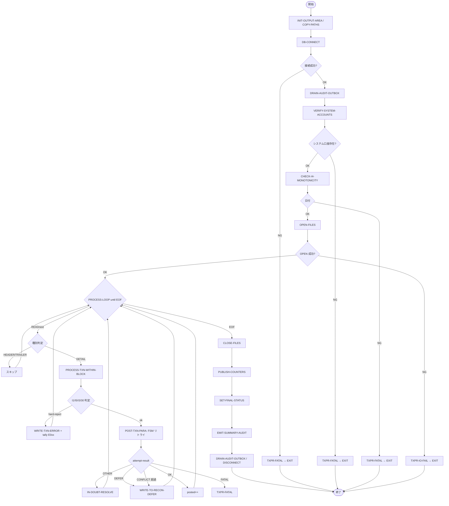

# 基本設計書 — TXPOST-RUN-BATCH

> **サブシステム:** 12-txnpost
> **プログラム ID:** `TXPOST-RUN-BATCH`
> **種別:** バッチ
> **更新日:** 2026-07-06

---

## 1. プログラム概要

| 項目 | 値 |
|------|-----|
| プログラム ID | `TXPOST-RUN-BATCH` |
| ソースファイル | `src/txpost-run-batch.sqb`（OCESQL プリプロセス経由） |
| 所属サブシステム | 12-txnpost |
| 種別 | バッチ |
| 概要 | 準備ファイル (txn-ready) に格納された取引レコードを 1 件ずつ読み取り、DB (transactions / postings / balances) に対して dual-entry で記帳する。各取引は SERIZALIZABLE トランザクション内で行われ、悲観ロックと不変量チェック (I1-I5) を経てからコミッ卜される。処理結果はエラーファイル / 再調整遅延ファイル / 休眠復旧ファイルに分流される。 |

---

## 2. 機能概要

### 2.1 このプログラムが「すること」
入力されたバッチ ID に対する取引ファイルを順次読取り、ヘッダ / 明細 / トレーラをパースして各明細を記帳単位として処理する。
取引ごとに idempotent ステータス確認 (I1) や禁止操作チェック (I5)、残高チェック (I3)、カテゴリ 30 ペイイチェックを行い、問題なければ postings を 2 行挿入し balances を更新する。
バッチ終了時にカウンタを出力に集約し、audit_outbox へ監査イベントを書き込む。

### 2.2 呼出元と呼出し先
- **呼出元:** バッチスケジューラ。入力ファイルはファイルシステム上の固定パスで授受。
- **呼出先:** `ACCT-EXISTS` / `ACCT-LOOKUP` / `ACCT-UPDATE-DORMANCY-DATE`（08-account サブシステム）、`AUD-WRITE`、`SHARED-LOG`（共通ユーティリティ）、OCESQL による DB (PostgreSQL) 操作。

### 2.3 シーケンス図

```mermaid
sequenceDiagram
    participant caller as 呼出元 (バッチスケジューラ)
    participant self as TXPOST-RUN-BATCH
    participant db as DB (OCESQL)
    participant acct as 08-account (ACCT-EXISTS / LOOKUP)
    participant aud as AUD-WRITE
    participant ready as txn-ready ファイル
    participant err as txn-error ファイル
    participant defer as txn-recon-defer ファイル

    caller->>self: TXPOST-RUN-INPUT
    self->>db: CONNECT / DRAIN-AUDIT-OUTBOX
    self->>db: VERIFY-SYSTEM-ACCOUNTS / CHECK-I4-MONOTONICITY
    self->>ready: OPEN INPUT
    loop PROCESS-LOOP until EOF
        self->>ready: READ 1 レコード
        alt DETAIL
            self->>acct: ACCT-EXISTS / LOOKUP
            self->>self: I1/I5/I3/30 チェック
            self->>db: POST-TXN-PARA (SERIALIZABLE + 悲観ロック + INSERT + UPDATE + COMMIT)
            alt hard-reject → err 書込 / recoverable → defer 書込
        end
    end
    self->>ready/err/defer: CLOSE-FILES
    self->>self: PUBLISH-COUNTERS / SET-FINAL-STATUS
    self->>aud: EMIT-SUMMARY-AUDIT
    self->>db: DRAIN-AUDIT-OUTBOX / DISCONNECT
    self-->>caller: TXPOST-RUN-OUTPUT
```

---

## 3. 処理フロー

### 3.1 全体フロー（flowchart）— DB loop 主体



---

## 4. 入出力仕様

### 4.1 入力

| 項目 | 型 | 必須 | 説明 |
|------|-----|:----:|------|
| TXPR-IN-BATCH-ID | PIC X(14) | ✅ | バッチ ID |
| TXPR-IN-BUSINESS-DATE | PIC 9(8) | ✅ | 営業日 (YYYYMMDD) |
| TXPR-IN-READY-FILENAME | PIC X(80) | ✅ | 入力取引ファイルパス |
| TXPR-IN-ERROR-FILENAME | PIC X(80) | ✅ | エラーファイルパス |
| TXPR-IN-RECON-DEFER-FILENAME | PIC X(80) | ✅ | 再調整遅延ファイルパス |
| TXPR-IN-CHECKPOINT-FILENAME | PIC X(80) | ✅ | チェックポイントファイルパス |
| TXPR-IN-DORMANCY-FILENAME | PIC X(80) | ✅ | 休眠復旧ファイルパス |

### 4.2 出力

| 項目 | 型 | 説明 |
|------|-----|------|
| TXPR-STATUS | PIC X(2) | 処理結果コード |
| TXPR-RECORDS-READ / ATTEMPTED / POSTED | PIC 9(7) | 読取 / 試行 / 成功件数 |
| TXPR-ALREADY-POSTED-SKIPPED | PIC 9(7) | 冪等スキップ件数 |
| TXPR-HARD-REJECTED | PIC 9(7) | ハードリジェクト件数 |
| TXPR-RECON-DEFERRED | PIC 9(7) | 再調整遅延件数 |
| TXPR-IN-DOUBT-RESOLVED | PIC 9(7) | IN-DOUBT 解決件数 |
| TXPR-DORMANCY-DEFERRED | PIC 9(7) | 休眠遅延件数 |
| TXPR-REASON-E004 / E005 / E006 / E020-E025 | PIC 9(7) | リジェ別事由件数 |
| TXPR-DURATION-SEC | PIC 9(5) | 処理時間（秒） |

### 4.3 返却コード（概要）

| コード | 意味 |
|--------|------|
| 00 | 正常（全件記帳成功） |
| 04 | PARTIAL-RECON（再調整遅延あり） |
| 08 | INVALID (入力不正) |
| 12 | IO-FAIL (ファイル OPEN 失敗等) |
| 16 | FATAL (DB 不整合・上限超過等致命的) |

---

## 5. 正常系テストケース

| # | テスト名 | 入力 | 期待出力 | 確認ポイント |
|---|---------|------|---------|------------|
| 1 | 単一明細：入金 (category 10) | 1 明細, amt=1000, payer=アクティブ口座 | status=00 / posted=1 | postings が DR=現金 / CR=顧客 の dual-entry で残高が +1000 されること |
| 2 | 単一明細：出金 (category 20) | 1 明細, amt=1000 | status=00 / posted=1 | 残高が -1000 され、I3 残高チェックをパスすること |
| 3 | 単一明細：転送 (category 30) | 1 明細, payer/Payee 指定 | status=00 / posted=1 | postings が顧客間で 1 組記帳されること |
| 4 | 単一明細：電払 (category 40) | 1 明計, amt=5000 | status=00 / posted=1 | DR=顧客 / CR=整治口として処理されること |
| 5 | 口座ブロック集約 | 同一口座連続 10 明細 | posted=10 | 口座ブロック OPEN/CLOSE が 1 回ずつ呼ばれること |
| 6 | 冪等再実行 | 同一バッチを 2 回投入 | skipped > 0 | I1 で検知し 2 回目をスキップすること |

---

## 6. 異常系テストケース

| # | テスト名 | 入力 | 期待される異常 | 確認ポイント |
|---|---------|------|--------------|------------|
| 1 | 取引ファイル不在 | ready ファイルパスが存在しない | status=12 | OPEN で fs!=00 を検知し、IO-FAIL で終了すること |
| 2 | システム口座不在 | 現金・整治口が未登録 | status=16 | VERIFY-SYSTEM-ACCOUNTS で FATAL |
| 3 | 単調性違反 (I4) | business_date <= max-closed | status=16 | CHECK-I4-MONOTONICITY が弾く |
| 4 | カテゴリ未対応 | category=99 | recon-defer 行 > 0 / status=04 | DETERMINE-POSTING-ACCTS で "DEFER" 扱い |
| 5 | I3 残高不足 (E021) | amt > 残高 | hard-reject / E021>0 | 残高 - amt < 0 でリジェネレート |
| 6 | I5 禁止操作 (E005) | dormant + 出金 | hard-reject / E005>0 | ACCT-EXISTS 判定でリジェクト |
| 7 | CAT-30 payee なし (E004) | cat=30, payee=SPACES | hard-reject / E004>0 | CHECK-CAT-30-PAYEE が検知 |
| 8 | 空バッチ | HEADER + TRAILER のみ | status=00 / read=0 | FATAL せず正常終了 |
| 9 | ロック競合超過 | fault-inject 連続 CONFLICT | recon-defer 行が生成 | FSM 超過 → DEFER 分流 |

---

## 参考
- ソース: [txpost-run-batch.sqb](../src/txpost-run-batch.sqb)
- 公開 IF: [tx-post-api.cpy](../copy/api/tx-post-api.cpy)
- 口座マスタ IF: [ws-account-cache-block.cpy](../copy/private/ws-account-cache-block.cpy)
- 不変量状態: [ws-invariant-check.cpy](../copy/private/ws-invariant-check.cpy)
- その他: [Makefile](../Makefile)
- 呼び出す 08-account サブシステム: [ACCT-EXISTS / LOOKUP](../../08-account/design/)
